<h1 align="center">Interactivity with JavaScript and jQuery</h1>

<h6 align="center">(by William Mead, Lecturer - University of California @Davis)</h6>
<!--~~~~~~~~~~~~~~~~~~~~~~~~~~~~~~~~~~~~~~~~~~~~~~~~~~~~~~~~~~~~~~~~~~~~~~~~~~~~~~~~~~~~~~~~~~~~-->
<!--~~~~~~~~~~~~~~~~~~~~~~ readme.md of uc-davis-inter-jquery.bauska.org ~~~~~~~~~~~~~~~~~~~~~~~-->
<!--~~~~~~~~~~~~~~~~~~~~~~~~~~~~~~~~~~~~~~~~~~~~~~~~~~~~~~~~~~~~~~~~~~~~~~~~~~~~~~~~~~~~~~~~~~~~-->
<!--~~~~~~~~~~~~~~~~~~~~~~~~~~~~~~~~~~ 01. jquery logo (01) ~~~~~~~~~~~~~~~~~~~~~~~~~~~~~~~~~~~~-->

  

<!--~~~~~~~~~~~~~~~~~~~~~~~~~~~~~~~~~~~~~~~~~~~~~~~~~~~~~~~~~~~~~~~~~~~~~~~~~~~~~~~~~~~~~~~~~~~~-->
<!--~~~~~~~~~~~~~~~~~~~~~~~~~~~~~~~~~ 02. uc davis logo (01) ~~~~~~~~~~~~~~~~~~~~~~~~~~~~~~~~~~~-->

  

<h3>About this Course</h3>

This course is the third in our JavaScript for Beginners Specialization. The 
scripts will become more complex and introduce more complex jQuery plugins. You 
will have several challenges to practice your skills throughout the course.

The course objectives include how to identify objects in JavaScript; create 
new objects and populate them with data; manipulate objects by adding, modifying 
and deleting data in objects; manipulate the DOM based on the data in objects; 
identify and articulate how multiple functions work together to create a more complex 
program; and identify processes for breaking larger programs into smaller, more 
manageable pieces.

<!-- table of contents -->
<!--~~~~~~~~~~~~~~~~~~~~~~~~~~~~~~~~~~~~~~~~~~~~~~~~~~~~~~~~~~~~~~~~~~~~~~~~~~~~~~~~~~~~~~~~~~~~-->
<!-- <button onclick="topFunction()" id="myBtn" title="Go to top">Top</button> -->

<!-- 
Scroll Down
 -->
<!-- 

 -->
<!--~~~~~~~~~~~~~~~~~~~~~~~~~~~~~~~~~~~~~~~~~~~~~~~~~~~~~~~~~~~~~~~~~~~~~~~~~~~~~~~~~~~~~~~~~~~~-->
<!--~~~~~~~~~~~~~~~~~~~~~~~~~~~~ script function: scrollFunction() ~~~~~~~~~~~~~~~~~~~~~~~~~~~~~-->
<!-- 
-->
<!--~~~~~~~~~~~~~~~~~~~~~~~~~~~~~~~~~~~~~~~~~~~~~~~~~~~~~~~~~~~~~~~~~~~~~~~~~~~~~~~~~~~~~~~~~~~~-->
<!--~~ Hoverable Dropdown Menu ~~-->
<h2><a href="#table-of-contents">Table of Contents</a></h2>

## [**Week 1: jQuery Plugins and Capturing the Scroll Event**](#ch1)
>### [**1.01 Welcome!**](#ch1-01)
>### [**1.02 Module 1 Introduction**](ch1-02)
>### [**1.03 Intro to jQuery Plugins**](ch1-03)
>### [**1.04 Using Plugins and Essential Steps**](ch1-04)
>### [**1.05 Gotchas and Rookie Mistakes**](ch1-05)
>### [**1.06 FlexSlider: A jQuery Plugin**](ch1-06)
>### [**1.07 About the Minified Version**](ch1-07)
>### [**1.08 Adding Markup &amp; Hooking Up the Slider**](ch1-08)
>### [**1.09 FlexSlider Rules**](ch1-09)
>### [**1.10 Additional Controls**](ch1-10)
>### [**1.11 Advanced FlexSlider**](ch1-11)
>### [**1.12 Additional Styling**](ch1-12)
>### [**1.13 Styling the CTA**](ch1-13)
	
## [**Week 2: Combining Scripts and Skill Building Through Practice**](ch2)
>### [**2.01 Module 2 Introduction**](#ch2-01)
>### [**2.02 Intro to Smooth Scroll with jQuery**](#ch2-02)
>### [**2.03 Creating a Click Handler**](#ch2-03)
>### [**2.04 Adding the Animation**](#ch2-04)
>### [**2.05 Add Some Easing and a Callback Function**](#ch2-05)
>### [**2.06 Highlighting Elements**](#ch2-06)
>### [**2.07 Intro to Page Location Tracking**](#ch2-07)
>### [**2.08 The Crux of the Problem**](#ch2-08)
>### [**2.09 Strategy**](#ch2-09)
>### [**2.10 Adding PageTop and If Statements**](#ch2-11)
>### [**2.11 Writing the Else/If Statement - Part 1**](#ch2-11)
>### [**2.12 Writing the Else/If Statement - Part 2**](#ch2-12)
>### [**2.13 Edge Case Issues**](#ch2-13)
>### [**2.14 Resizing the Counter**](#ch2-14)
>### [**2.15 Resetting the Counter**](#ch2-15)
>### [**2.16 resetPagePosition Function**](#ch2-16)
>### [**2.17 Reviewing the Whole Script**](#ch2-17)
>### [**2.18 Intro to Scroll Effects with JS**](#ch2-18)
>### [**2.19 Getting the Target - Part 1**](#ch2-19)
>### [**2.20 Getting the Target - Part 2**](#ch2-20)
>### [**2.21 Smooth Scroll Polyfill**](#ch2-21)
>### [**2.22 Checking the Load**](#ch2-22)
>### [**2.23 Top Posts**](#ch2-23)
>### [**2.24 Add an Event Listener**](#ch2-24)
>### [**2.25 The Magic Conditionals**](#ch2-25)
>### [**2.26 Changing the Next Link**](#ch2-26)
>### [**2.27 Resizing Function**](#ch2-27)
>### [**2.28 Finalzing the Script**](#ch2-28)
>### [**2.29 Scription Site Introduction**](#ch2-29)
>### [**2.30 Header HTML**](#ch2-30)
>### [**2.31 Pricing Styling**](#ch2-31)
>### [**2.32 Beginning Styling**](#ch2-32)
>### [**2.33 Styling That Attaches to Whole Page**](#ch2-33)
>### [**2.34 Slider Styles**](#ch2-34)
>### [**2.35 Pricing Styles**](#ch2-35)
>### [**2.36 Tables Styles**](#ch2-36)
>### [**2.37 Media Query for 1020 Pixels Wide**](#ch2-37)
>### [**2.38 Media Query for 1200 Pixels Wide**](#ch2-38)
>### [**2.39 Scription Site: Building Interactive Elements Challenges**](#ch2-39)
	
## [**Week 3. Intro to Objects and Data in JavaScript**](ch3)
>### [**3.01 Module 3 Introduction**](#ch3-01)
>### [**3.02 Intro to Objects and Data in JS**](#ch3-02)
>### [**3.03 Objects Can Contain Arrays and Other Objects**](#ch3-03)
>### [**3.04 Functions Inside Objects Equals Methods**](#ch3-04)
>### [**3.05 Putting Objects and Functions Together**](#ch3-05)
>### [**3.06 Data Formats - XML**](#ch3-06)
>### [**3.07 Example File**](#ch3-07)
>### [**3.08 Intro to Pig Dice Game**](#ch3-08)
>### [**3.09 Play the Game of Pig**](#ch3-09)
>### [**3.10 Version One**](#ch3-10)
>### [**3.11 Other Versions**](#ch3-11)

## [**Week 4. Building a Simple Game in JavaScript**](ch4)
>### [**4.01 Module 4 Introduction**](#ch4-01)
>### [**4.02 Intro to the Game of Pig**](#ch4-02)
>### [**4.03 Start the Game**](#ch4-03)
>### [**4.04 Set Up the Turn**](#ch4-04)
>### [**4.05 Throwing the Dice**](#ch4-02)
>### [**4.06 Test Throwing the Dice**](#ch4-06)
>### [**4.07 Add the Selection Statements**](#ch4-07)
>### [**4.08 Snake Eyes**](#ch4-08)
>### [**4.09 A "1" Was Rolled**](#ch4-09)
>### [**4.10 The Else Statement**](#ch4-10)
>### [**4.11 Checking for a Win**](#ch4-11)
>### [**4.12 Show the Current Score**](#ch4-12)
>### [**4.13 Final Clean-Up**](#ch4-13)
>### [**4.14 Extending the Game**](#ch4-14)
>### [**4.15 Course Summary**](#ch4-15)

<h2>Syllabus</h2>

<h3>Module (Week) One:</h3>

<h4>Getting Started & jQuery Plugins and Capturing the Scroll Event</h4>

In this module (1), you will be introduced to jQuery plugins and be able to 
present the advantages and challenges associated with using jQuery plugins. 
You will also be able to recognize common mistakes to avoid when using jQuery plugins. 
You will be introduced to the Flexslider jQuery plugin and be able to use it to build 
basic and more advanced image sliders.

<h5>13 videos, 3 readings, 2 zip files</h5>

<ul>
  <li>1.00.A Note from UC Davis</li>
</ul>

   1. Welcome to this Course!
   2. Module Introduction
   3. Introduction to jQuery Plugins
   4. Using Plugins and Essential Steps
   5. Gotchas and Rookie Mistakes

<ul>
  <li>1.05.jQueryPlugins.pdf</li>
  <li>1.05.FlexSliderBasic-Start.zip</li>
  <li>1.05.FlexSliderPlugin.zip</li>
</ul>
    
   6. FlexSlider: A jQuery Plugin
   7. About the Minified Version
   8. Adding Markup & Hooking Up the Slider
   9. FlexSlider Rules
  10. Additional Controls
  11. Advanced FlexSlider
  12. Additional Styling
  13. Styling the CTA

<ul>
  <li>1.13.FlexSlider.pdf</li>
</ul>

<h3>Week Two:</h3>

<h4>Combining Scripts and Skill Building Through Practice</h4>

In this module, you will be able to use jQuery to create a smooth scroll effect for in-page navigation, as well 
as develop a script, using jQuery, that keeps track of scroll positions on the page. You will be able to compare 
and contrast the in-page smooth scroll script and the location tracking script created using jQuery with one 
created using plain JavaScript. You will be able to build a webpage using HTML and CSS that will combine some 
of the different scripts created in this course. You will be able to combine some of the different scripts and 
jQuery plugins explored in this course into the Scription webpage through a series of challenges.

<h5>39 videos, 5 readings, 7 zip files</h5>

   1. Module 2 Introduction (:38)
   2. Introduction to Smooth Scroll with jQuery (4:15)

<ul>
  <li>2.02.jQueryScrollEffects-START.zip</li>
</ul>

   3. Creating a Click Handler (5:00)
   4. Adding the Animation (6:56)
   5. Add Some Easing and a Callback Function (4:05)
   6. Highlighting Elements (5:22)

<ul>
  <li>2.06.jQuerySmoothScroll.pdf</li>
</ul>
  
   7. Introduction to Page Location Tracking (8:00)
   8. The Crux of the Problem (6:09)
   9. Strategy (8:27)
  10. Adding PageTop and If Statements (5:39)
  11. Writing the Else/If Statement - Part 1 (4:10)
  12. Writing the Else/If Statement - Part 2 (5:43)
  13. Edge Case Issues (5:07)
  14. Resizing Your Windows (5:41)
  15. Resetting the Counter (5:22)
  16. resetPagePosition Function (8:33)
  17. Reviewing the Whole Script (5:48)

<ul>
  <li>2.17.jQueryPageLocationTracking.pdf (10 min’s)</li>
</ul>
  
  18. Introduction to Scroll Effects with JS (6:04)

<ul>
  <li>2.18.ScrollEffects-START.zip</li>
</ul>
  
  19. Getting the Target - Part 1 (4:50)
  20. Getting the Target - Part 2 (5:15)
  21. Smooth Scroll Polyfill (4:45)
  22. Checking the Load (6:48)
  23. Top Posts (5:35)
  24. Add an Event Listener (5:42)
  25. The Magic Conditionals (5:58)
  26. Changing the Next Link (5:56)
  27. Resizing Function (5:07)
  28. Finalizing the Script (10:01)

<ul>
  <li>2.28.PDF of Presentation (10 min’s)</li>
</ul>
  
  29. Scription Site Introduction (5:54)

<ul>
  <li>zip_files:
    <ul>
	  <li>2.29.Scription-Part1-Start.zip</li>
	  <li>2.29.Scription-Part1-Snippets.zip</li>
	  <li>2.29.Scription-Part2-Start.zip</li>
	  <li>2.29.Scription-Part2-Snippets.zip</li>
	  <li>2.29.Flexslider-files.zip</li>
      </li>
	</ul>
</ul>
    
  30. Header HTML (5:09)
  31. Pricing HTML
  32. Beginning Styling
  33. Styling That Attaches to Whole Page
  34. Slider Styling
  35. Pricing Styles
  36. Tablet Styles
  37. Media Query for 1020 Pixels Wide
  38. Media Query for 1200 Pixels Wide
  39. Scription Site: Building Interactive Elements Challenges

<ul>
  <li>2.39.Scription Finished Version</li>
  <li>2.39.PDF of Presentations</li>
</ul>

<h3>Week Three:</h3>

<h4>Introduction to Objects & Data in JavaScript</h4>

In this module, you will be introduced to the object literal and be able to 
demonstrate some of the ways to manipulate data inside objects. You will be able 
to develop good habits and processes that help with thinking about how to solve 
a programming problem, including breaking a problem down into smaller pieces.

<h5>11 videos, 4 readings</h5>

   1. Module Introduction
   2. Introduction to Objects and Data in JS

<ul>
  <li>3.02.Start Files: Working with Objects in JavaScript</li>
</ul>
  
   3. Objects Can Contain Arrays and Other Objects
   4. Functions Inside Objects Equals Methods
   5. Putting Objects and Functions Together
   6. Data Formats - XML
   7. Example File

<ul>
  <li>3.07.PDF of Presentations</li>
</ul>
  
   8. Introduction to Pig Dice Game

<ul>
  <li>3.08.Pig Dice Game Diagrams</li>
</ul>
  
   9. Play the Game of Pig
  10. Version One
  11. Other Versions

<ul>
  <li>3.11.PDF of Presentations</li>
</ul>
  
<h3>Week Four:</h3>

<h4>Building a Simple Game in JavaScript</h4>

By building this game within this module, you will be able to practice the JavaScript 
you have already learned while constructing a script with more functions and complexity. 
You will be able to then extend the script in many creative ways.

<h5>15 videos, 2 readings</h5>

   1. Module Introduction
   2. Introduction to the Game of Pig

<ul>
  <li>4.02.Start Files: Game of Pig</li>
</ul>
  
   3. Start the Game
   4. Set Up the Turn
   5. Throwing the Dice
   6. Test Throwing the Dice
   7. Add the Selection Statements
   8. Snake Eyes!
   9. A "1" Was Rolled
  10. The Else Statement
  11. Checking for a Win
  12. Show the Current Score
  13. Final Clean-Up
  14. Extending the Game

<ul>
  <li>4.14.PDF of Presentation</li>
</ul>

  15. Course Summary

<h2 id="ch1-00">1.00 A Note from UC Davis</h2>

Welcome to this course!

We are delighted to be a part of your continuing education. This course will provide you with a variety of tools and learning opportunities, to include lesson lectures, readings, assessments, peer reviews, and an opportunity to contribute to the Coursera learning community in the discussion forums.

In each of the lesson sections, you’ll find learning objectives, lecture lessons, readings, activities, and an opportunity to test your knowledge in quiz format. In some of the module sections you’ll also work on assignments and grade the work of your peers. A peer-review assignment, is one where you and your fellow learners have an opportunity to review and grade each other’s work. We’ll dive more into peer reviews later on in this course.

When navigating the course, you can find available course resources under each of the lecture lessons in a section labeled “Downloads” – here you can download the lecture video, view transcripts, PDFs of the lecture slides, and find additional readings or files.

If you run into any issues during this course, learner support is available to all Coursera students. The link for Coursera’s Learner support is included below. The Help Center/Learner Support includes topics such as account setup, payments, enrollment questions, and troubleshooting common problems.

If you find any content issues, be sure to let the course staff know by flagging the lecture, assignment, reading, or quiz and this will inform us of where these issues occur. Here is the link for more information on how to Flag an Issue - it is also listed below.

One of the great things about Coursera courses is that they are self-paced. The course dates are based on the average time it takes to complete a course. However, if you need additional time to complete a course you can reset your deadlines with no penalties.

More information on resetting deadlines can be found here: Assignment Deadlines

Because of the self-paced nature of Coursera courses, this is an excellent opportunity to show your commitment to your work and the work of your peers through academic integrity. Be sure to read the Coursera guidelines and the Coursera Honor Code here:

  <a href="">Coursera Honor Code</a>

We look forward to having you in this course. Happy learning!

UC Davis Coursera Team

<h4>Additional Links:</h4>

<ul>
  <li><a href="https://learner.coursera.help/hc/en-us" 
    rel="noopener noreferrer" target="_blank">
    Coursera’s Learner Support/Help Center</a></li>
  <li><a href="https://learner.coursera.help/hc/en-us/articles/208280106-Report-a-problem-with-a-course"
    rel="noopener noreferrer" target="_blank">
	Flagging a Lecture</a></li>
  <li><a href="https://learner.coursera.help/hc/en-us/articles/208279866-Assignment-deadlines"
    rel="noopener noreferrer" target="_blank">
    Assignment Deadlines</a></li>
  <li><a href="https://learner.coursera.help/hc/en-us/sections/201895903-Peer-reviewed-assignments"
    rel="noopener noreferrer" target="_blank">
    Peer Reviewed Assignments</a></li>
  <li><a href="https://learner.coursera.help/hc/en-us/articles/209818863-Coursera-Honor-Code"
    rel="noopener noreferrer" target="_blank">
    Coursera’s Honor Code</a></li>
</ul>

<h2 id="ch1-01">1.01. Welcome! Course Introduction (0:40)</h2>
<!--~~~~~~~~~~~~~~~~~~~~~~~~~~~~~~~~~~~~~~~~~~~~~~~~~~~~~~~~~~~~~~~~~~~~~~~~~~~~~~~~~~~~~~~~~~~~-->
<!--~~~~~~~~~~~~~~~~~~~~~~~~~~~~~~~~~~ 03. course intro (08) ~~~~~~~~~~~~~~~~~~~~~~~~~~~~~~~~~~~-->

  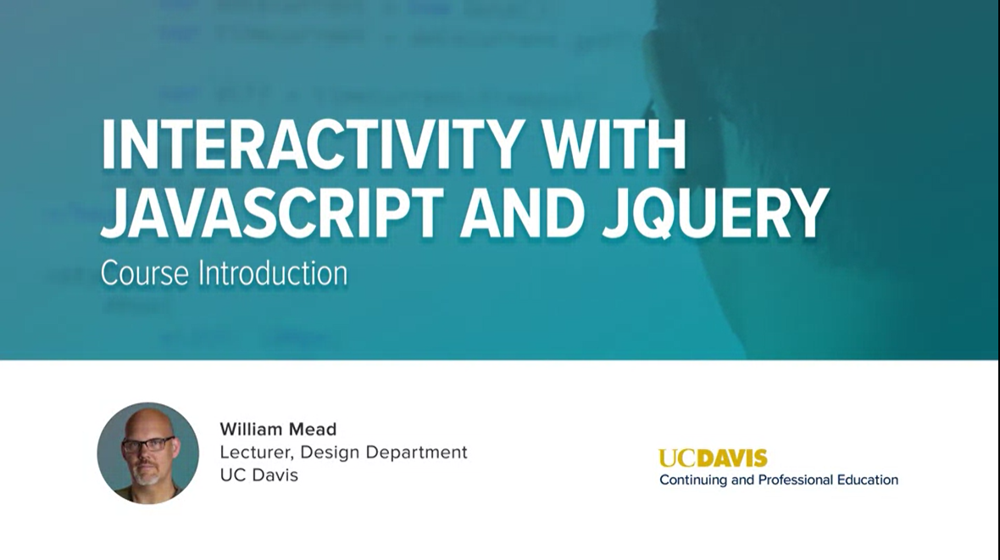

Hello and welcome to our 3rd course in our four-core specialization on JavaScript. 
My name is Bill Mead and I'm back again to do more JavaScript with you. Hopefully 
you've completed our first two courses on JavaScript and you've learned a lot about 
the syntax of JavaScript and how to solve problems with JavaScript. It takes a lot 
of practice to get good at this stuff.

I'm back again to do more with you to introduce some new concepts, to do some 
new projects and to do some more sophisticated projects and give you even more 
practice. You get even better with JavaScript and jQuery. We're going to do a lot 
in this course. Let's break out our code editors and our web browsers and get started 
and learn even more about JavaScript.

<h2 id="ch1-02">1.02. Module Introduction</h2>
<!--~~~~~~~~~~~~~~~~~~~~~~~~~~~~~~~~~~~~~~~~~~~~~~~~~~~~~~~~~~~~~~~~~~~~~~~~~~~~~~~~~~~~~~~~~~~~-->
<!--~~~~~~~~~~~~~~~~~~~~~~~~~~~~~~~~~ 04. module 1 intro (09) ~~~~~~~~~~~~~~~~~~~~~~~~~~~~~~~~~~-->

  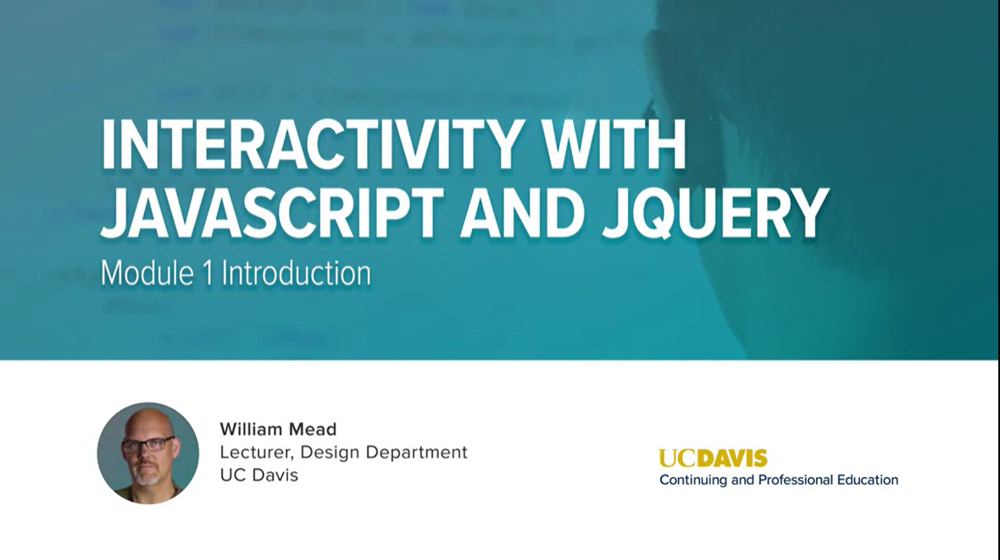

  <b><a href="#table-of-contents">↥ Back To Top</a></b>

 

Hello and welcome to our first module in our third course on JavaScript. In this 
module, we're going to dive even deeper into jQuery, looking at some jQuery plugins. 
You've already made some sliders in a previous lesson. But in this lesson, we'll 
look at the flex slider plugin, which adds a lot of features, two sliders and comparing 
that to what you've done manually by creating your own sliders is really instructive 
and useful. Plus, you end up with a great tool for creating slider elements on web 
pages and that's really pretty fun.

<h2 id="ch1-03">1.03. Introduction to jQuery Plugins (3:49)</h2>
<!--~~~~~~~~~~~~~~~~~~~~~~~~~~~~~~~~~~~~~~~~~~~~~~~~~~~~~~~~~~~~~~~~~~~~~~~~~~~~~~~~~~~~~~~~~~~~-->
<!--~~~~~~~~~~~~~~~~~~~~~~~~~~~~ 05. intro to jquery plugins (09) ~~~~~~~~~~~~~~~~~~~~~~~~~~~~~~-->

  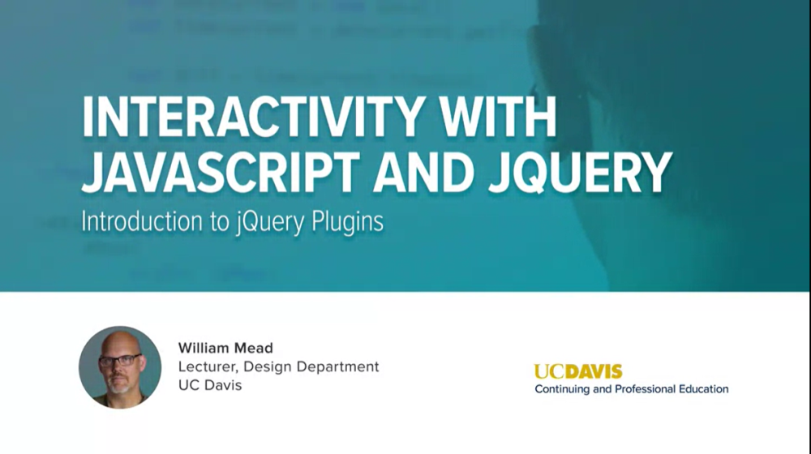

<!-- {width="4.0in" height="2.240598206474191in"} -->

Just as a quick recap, we&apos;ve learned a lot of JavaScript so far.

<!--~~~~~~~~~~~~~~~~~~~~~~~~~~~~~~~~~~~~~~~~~~~~~~~~~~~~~~~~~~~~~~~~~~~~~~~~~~~~~~~~~~~~~~~~~~~~-->
<!--~~~~~~~~~~~~~~~~~~~~~~~~~~~~~~~ 06. recap: javascript (10) ~~~~~~~~~~~~~~~~~~~~~~~~~~~~~~~~~-->

  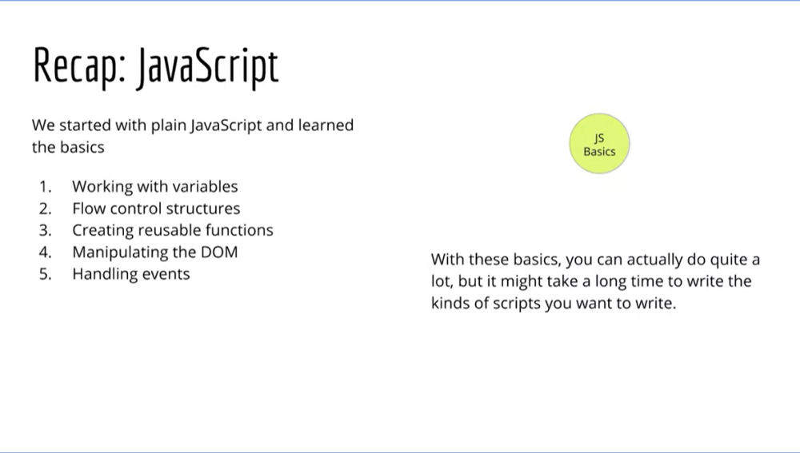

<!-- {width="5.0in" height="2.8338681102362204in"} -->

We started with the JavaScript basics, which included working with
variables, flow control structures like if statements and else
statements and loops, and that stuff. We created reusable functions that
you can use in multiple projects or you can use multiple times within
the same project. We&apos;ve manipulated the DOM and handled events such as
when somebody clicks on something or hovers a mouse over something, we
can capture those events and then do things with them. With these
basics, you can do quite a lot, but it might take you a long time to
write the scripts that you want to do for your web page.

<!--~~~~~~~~~~~~~~~~~~~~~~~~~~~~~~~~~~~~~~~~~~~~~~~~~~~~~~~~~~~~~~~~~~~~~~~~~~~~~~~~~~~~~~~~~~~~-->
<!--~~~~~~~~~~~~~~~~~~~~~~~~~~~~~~~~~ 07. recap: jquery (10) ~~~~~~~~~~~~~~~~~~~~~~~~~~~~~~~~~~~-->

  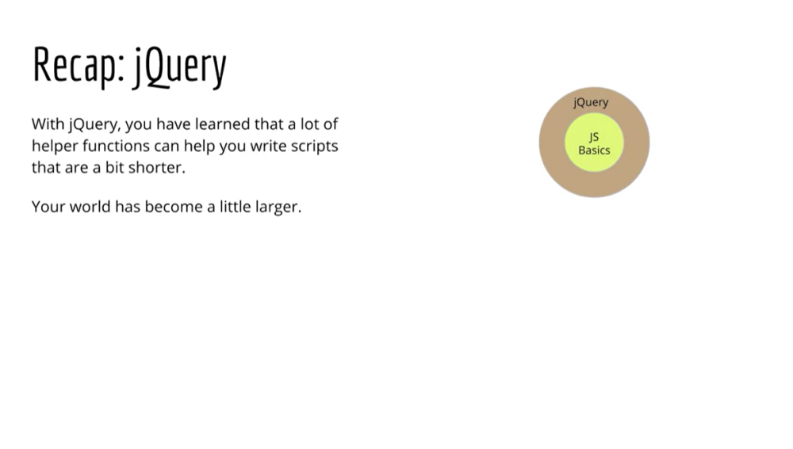

<!-- {width="5.0in" height="2.8338681102362204in"} -->

Then we had jQuery and your world became a little bit larger. With
jQuery, we&apos;ve learned that there are a lot of helper functions built
into this library that make writing scripts shorter and a little bit
more compact, and a little bit easier. That helps and that makes things
a little bit easier and a little bit better for all of us.

<!--~~~~~~~~~~~~~~~~~~~~~~~~~~~~~~~~~~~~~~~~~~~~~~~~~~~~~~~~~~~~~~~~~~~~~~~~~~~~~~~~~~~~~~~~~~~~-->
<!--~~~~~~~~~~~~~~~~~~~~~~~~~~~~~~ 08. introducing: plugins (11) ~~~~~~~~~~~~~~~~~~~~~~~~~~~~~~~-->

  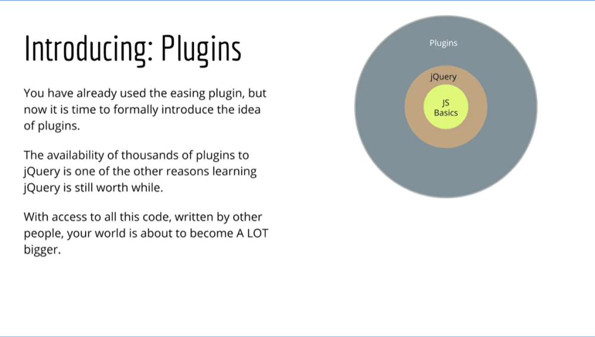

<!-- {width="5.0in" height="2.8338681102362204in"} -->

Now we need to introduce plugins. We&apos;ve already used the **easing**
plugin, which is a very simple plugin that adds additional function to
jQuery, so that you can use different types of **easing,** which is
different speeds and ways in which things can animate on your screen,
and by plugging in that particular plugin, you get access to all of
those different features that aren&apos;t built into jQuery.

jQuery has this plugin architecture that&apos;s very powerful, that allows
developers to build extensions to jQuery. They give it a lot of
additional functionality. There are tons of jQuery plugins available,
thousands of them, and I recommend looking around the web and seeing
what other ones you can find. We will look at one or two here in this
course, but there are just thousands of them out there and they&apos;re
really worth exploring and seeing what&apos;s out there. That way your world
becomes a lot bigger because now you don&apos;t only have to just write all
your scripts yourself. You can look for scripts that other people have
written and see if you can modify them and use them in your own projects
through the use of a plugin, and that&apos;s really very powerful and really
great.
<!--~~~~~~~~~~~~~~~~~~~~~~~~~~~~~~~~~~~~~~~~~~~~~~~~~~~~~~~~~~~~~~~~~~~~~~~~~~~~~~~~~~~~~~~~~~~~-->
<!--~~~~~~~~~~~~~~~~~~~~~~~~~~~~~~ 09. adding functionality (12) ~~~~~~~~~~~~~~~~~~~~~~~~~~~~~~~-->

  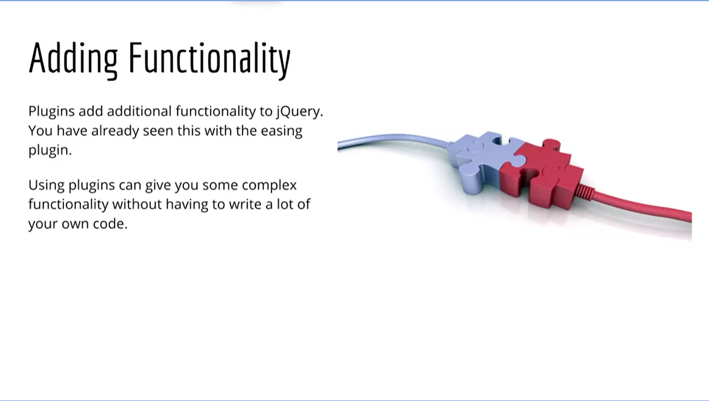

Again, <b>plugins</b> add additional functionality to jQuery, and we&apos;ve
already seen this with the <b>easing plugin</b>. But some plugins can have
very complex functionality without us having to write a whole bunch of
code. We have access to a whole bunch of additional functions and we&apos;ll
see what that looks like.

You can create whole interfaces in a jQuery plugin, and then by
providing that plugin, other people can have access to those interfaces.
For example, we did the project where we made the tabbed interface. What
if there was a jQuery plugin that made hooking up a tabbed interface
super easy? There are plugins for those things and they might come with
a lot of features and functionality. What if you want the tabs to run
down the side of the tabbed interface rather than across the tab? You
could do that thing.

<h2 id="ch1-04">1.04. Using Plugins and Essential Steps</h2>
<!--~~~~~~~~~~~~~~~~~~~~~~~~~~~~~~~~~~~~~~~~~~~~~~~~~~~~~~~~~~~~~~~~~~~~~~~~~~~~~~~~~~~~~~~~~~~~-->
<!--~~~~~~~~~~~~~~~~~~~~ 10. using plugins and essential steps (1.04) (13) ~~~~~~~~~~~~~~~~~~~~~-->

  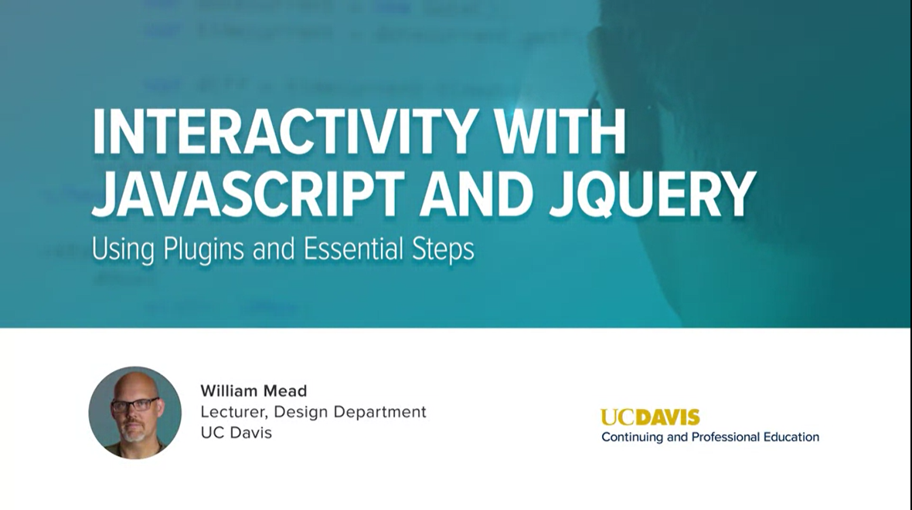

Using plugins and essential steps, adding plugins to your project,
configuring them, and learning how to use them still takes some work and
effort. But not nearly as much work and effort as it takes to write the
whole script yourself.

Many of the larger, more sophisticated plugins require five steps to get
them to work.
<!--~~~~~~~~~~~~~~~~~~~~~~~~~~~~~~~~~~~~~~~~~~~~~~~~~~~~~~~~~~~~~~~~~~~~~~~~~~~~~~~~~~~~~~~~~~~~-->
<!--~~~~~~~~~~~~~~~~~~~~~ 11. using plugins and essential steps, #2 (13) ~~~~~~~~~~~~~~~~~~~~~~~-->

  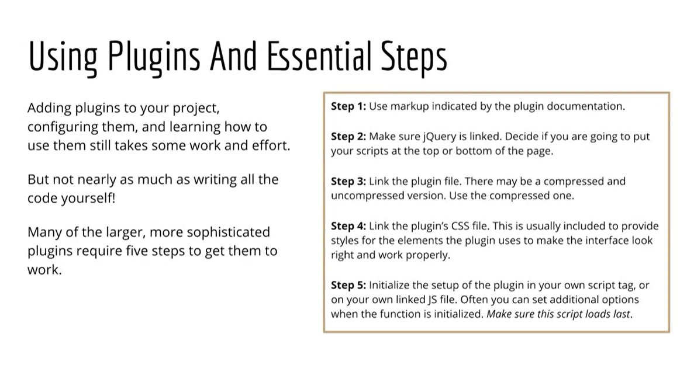

<!-- {width="5.0in" height="2.8338681102362204in"} -->

<b>Step 1</b> is, you have to use the markup indicated by the
plugin documentation. Often, you&apos;ll have to use divs or our articles or
other elements with particular classes that the plugin needs in order
for it to actually work. Classes or IDs or other, structures that the
plugin needs to work.

<b>Step 2</b>, you need to make sure jQuery is linked. The jQuery
libraries linked because if you&apos;re using a jQuery plugin, then you need
to have jQuery decide if you&apos;re going to put your scripts at the top of
the page or at the bottom of the page. Sometimes you can put them
whichever place you want, sometimes the plugin directions will tell you
to put them in one place or the other. But frequently you can make your
own decision on this and put it where you want it to go and architect
your file the way you want it to be structured.

<b>Step 3</b>, is to link the plugin file and when you download a
plugin, frequently it will come with a compressed version and an
uncompressed version. The uncompressed version is there for you to look
at so you could see how the plugin actually functions, it&apos;s readable
JavaScript, and you can do that kind of thing. But when you&apos;re ready to
put it into your project and for your production ready project, you want
to use the compressed version because it will be smaller, and it&apos;ll
download faster. So, if they provide a compressed one, then you should
use that, if they don&apos;t provide a compressed one, you can compress it
yourself.

<b>Step 4</b>, link to the plug in CSS file, some of the fancier
plugins will come with styling that will style the elements inside of
the plugin. And, this is usually included so that everything looks and
works the way it&apos;s supposed to work within the interface for that
plugin, so you want to make sure you get that CSS file linked onto your
page.

Then <b>Step 5</b>, is you need to initialize the setup of the
plugin in your own script tag, or on your own linked JavaScript file.
Often, you can set additional options so that when the function is
initialized, and so that you can pass in whichever options will get the
plugin to display the way you want it to display, but you want to make
sure that this script loads last. So, the order of things are that you
will have the markup for the jQuery plugin, then you&apos;ll have jQuery,
then the jQuery plugin, and then you will initialize the plugin on your
own script. And then also make sure that if there&apos;s any CSS files,
those are included as well.
<!--~~~~~~~~~~~~~~~~~~~~~~~~~~~~~~~~~~~~~~~~~~~~~~~~~~~~~~~~~~~~~~~~~~~~~~~~~~~~~~~~~~~~~~~~~~~~-->
<!--~~~~~~~~~~~~~~~~~~~~~~~~~~~~ 12. documentation mish-mash (15) ~~~~~~~~~~~~~~~~~~~~~~~~~~~~~~-->

  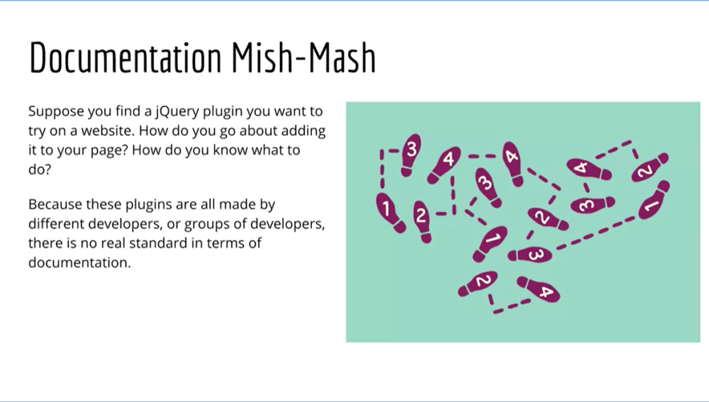

Suppose you find a jQuery plugin you want to try on your website, how do
you go about adding it to your page? How do you know what to do? Because
these plugins are all made by different developers or groups of
developers, there&apos;s no real standard in terms of the documentation.
This is where having a solid foundation in JavaScript really helps,
because you need to look at the documentation they provide, and be able
to tease it out and go okay, I understand what they&apos;re asking me to do
here.

On this page they&apos;re telling me to install the plugin like this and
then add these configuration options, and so on and so forth. And unless
you have some experience with JavaScript, it&apos;s going to look like a
bunch of messy code and it&apos;s not going to make a lot of sense. So
that&apos;s why it&apos;s really helpful to have a solid JavaScript foundation,
before trying to mess around with this stuff. But now that you do, and
you&apos;ll see once you work with a few plugins that many of them work
pretty much the same way. The documentation may look a little bit
different; the directions may be written a little bit different, but
it&apos;s the same basic steps each time.

<h2 id="ch1-05">1.05. Gotchas and Rookie Mistakes</h2>
<!--~~~~~~~~~~~~~~~~~~~~~~~~~~~~~~~~~~~~~~~~~~~~~~~~~~~~~~~~~~~~~~~~~~~~~~~~~~~~~~~~~~~~~~~~~~~~-->
<!--~~~~~~~~~~~~~~~~~~~~~~ 13. gotchas and rookie mistakes (1.05) (16) ~~~~~~~~~~~~~~~~~~~~~~~~~-->

  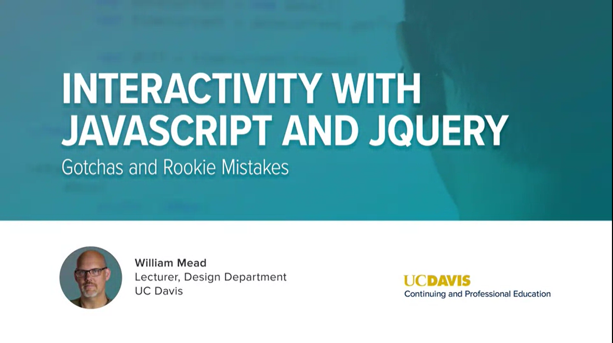

<!--~~~~~~~~~~~~~~~~~~~~~~~~~~~~~~~~~~~~~~~~~~~~~~~~~~~~~~~~~~~~~~~~~~~~~~~~~~~~~~~~~~~~~~~~~~~~-->
<!--~~~~~~~~~~~~~~~~~~~~~~~~ 14. gotchas and rookie mistakes, #2 (16) ~~~~~~~~~~~~~~~~~~~~~~~~~~-->

  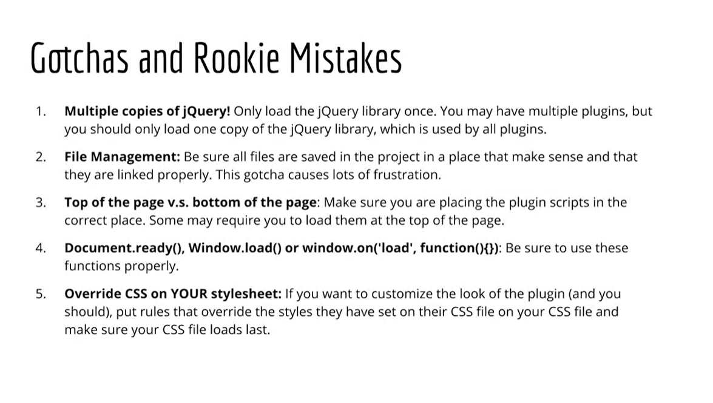

<b>Number 1</b> on this list is the biggest one, I see this all
the time, especially with students who are new to working with
JavaScript in jQuery, and that is ending up with multiple copies of the
jQuery library linked to your page.

Only load the jQuery library once. You may have multiple plugins, but
you should only load one copy of the jQuery library, which is used by
all the plugins. What happens is you find a plugin that add some
interesting functionality web page. You follow the directions and load
the jQuery library and do all the directions to make that plugin work.
Then you find another plugin that does something else that you want to
use. You follow the directions and that page and it tells you to load
the jQuery library and to load the plugins. You follow those directions
and then in the end, you end up with the jQuery library loaded twice.
Frequently, when you download these plugins, they&apos;ll include a copy of
the jQuery library. You&apos;ll follow the directions, you&apos;ll link up one,
then you&apos;ll think of another.

It turns out that the two plugins hooked up actually are using different
versions of the same jQuery library. Now you&apos;ve got two different
versions of the jQuery library linked up, and that&apos;s going to cause all
problems and things will break and it won&apos;t work right. You want to
make sure you only ever have one copy of the jQuery library plugin. I&apos;m
saying this now, but I promise it&apos;ll happen. How I see this is the most
common error that I see from students who are working with jQuery is the
follow the directions and they wind up with multiple copies, different
versions of the jQuery library plugged in. That&apos;s the number 1 Gotcha.
It happens a lot.

The **[second]** thing is file management. When you download a
plugin, sometimes plugins require other files, whether it&apos;s CSS files
or maybe an images folder, fonts or something else. You want to make
sure that when you put those files in your folder, everything is going
into the correct spot and is linked properly. Because for the web,
remember, everything is linked. All the files are linked to each other.
If those links become broken, then your project won&apos;t work and it
won&apos;t work properly. Make sure you have all the correct files and all
the correct places for the plugin to work. That&apos;s **number 2**, those
two issues comprise 90 percent of the problems that people have with
plugins, it&apos;s probably those two problems.

The next thing (**[number 3]**) is top of the page versus bottom
of the page. Make sure you&apos;re placing your plugins scripts in the
correct place. Some of them may require you to load jQuery up at the top
of the page. Usually, you can put them where you want as long as you run
the scripts properly.

But make sure you have a strategy for where your JavaScript is going to
load, whether you&apos;re going to have it load at the bottom of the page
before the closing body tag, or whether you&apos;re going to put the links
to scripts up in the top of the page and maybe use the defer attribute
to make sure they don&apos;t load into the whole page is loaded. Keep that
in mind.

Now, jQuery has a document ready method (**[number 4]**) that
will check to see that the DOM is flooded before anything inside the
**document_ready** function runs. That&apos;s just checking to make sure
your HTML is loaded. Sometimes people will provide plugins and tell you
to use the document ready function. You&apos;ll need that if you&apos;re up at
the top of the page and you&apos;re not using the deferred attribute. But if
you put it at the bottom of the page, you may not need it. There&apos;s also
a window load method, and that&apos;s in older versions of jQuery version 2
and lower. It&apos;s now been replaced with **window.on** and the load and
you pass in load as the event that we&apos;re looking for and then run an
anonymous function, which is what we used in the previous lesson with
the sliders. Be aware about these different functions, what they do,
which versions of jQuery they work with and that stuff, because if
you&apos;re reading the documentation for a plugin, it could be older
documentation. If their documentation is telling you to use
**window.load,** but you&apos;re using the most recent version of the jQuery
library, you&apos;ll have to switch it to the **window.on** method and use
that one instead. You want to make sure that you&apos;re using these
functions properly. Really where you&apos;re going to use these is just
where you&apos;re initializing your script. Has nothing to do with loading
the actual script file or the plugin file. This is where you initialize
your script on your page where you&apos;re tying the plugin to run. You&apos;ll
need to make sure you use these functions properly.

Then **[number 5]** is overriding CSS on your stylesheet. If you
want to customize the look of the plugin and you should put your rules
that override the styles they&apos;ve set on their specified CSS file, on
your CSS file and then make sure your CSS file loads last. That way,
when your CSS loads, it will override the access on their stylesheet.
You don&apos;t want to overwrite the styles on their access file because if
you ever update the plugin files, you&apos;ll lose that and you&apos;ll have to
do it again. You want to make sure you put it on your CSS file.

<!--~~~~~~~~~~~~~~~~~~~~~~~~~~~~~~~~~~~~~~~~~~~~~~~~~~~~~~~~~~~~~~~~~~~~~~~~~~~~~~~~~~~~~~~~~~~~-->
<!--~~~~~~~~~~~~~~~~~~~~~~~~~~ 15. 5 items of beware the plugin (18) ~~~~~~~~~~~~~~~~~~~~~~~~~~~-->

<kbd>
  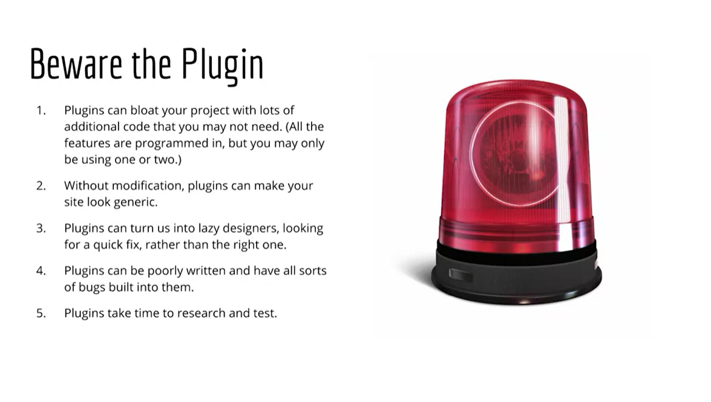
</kbd>

One last topic that I have to talk about before we&apos;re done with this
lecture and plugins is just to beware of the plug in. Plugins can add
bloat to your project with a lot of additional code that you may not
need. All of the features, plugged features that are programmed into the
plugin, but you may be only using one or two. That&apos;s something to be
aware of. Without modification, plugins can make your site look generic,
so if you&apos;re not updating the CSS file or adding your own styles to it,
then it could look the same as everybody else&apos;s website.

Plugins can turn us into lazy designers looking for a quick fix. Rather
than actually trying to solve our interaction design problem, we go look
for a plugin that looks cool and interesting. That may not really be the
right fit for a project just to avoid having to do some custom code.
Watch out for that.

Also, plugins can be poorly written. They can have all bugs built into
them because they&apos;re made by other developers. You don&apos;t really know.
You really have to test them out and research them, find out who else is
using them, what problems if they had, what sorts of things work well
with them. It&apos;ll take time to do the research, but probably less time
than actually writing the code yourself from scratch if it&apos;s an
extensive plugin. It&apos;s worth it to make sure that the plugin you&apos;re
using is really worthwhile.
<!--~~~~~~~~~~~~~~~~~~~~~~~~~~~~~~~~~~~~~~~~~~~~~~~~~~~~~~~~~~~~~~~~~~~~~~~~~~~~~~~~~~~~~~~~~~~~-->
<!--~~~~~~~~~~~~~~~~~~~~~~~~~~~~~ 16. looking to the future (19) ~~~~~~~~~~~~~~~~~~~~~~~~~~~~~~~-->

  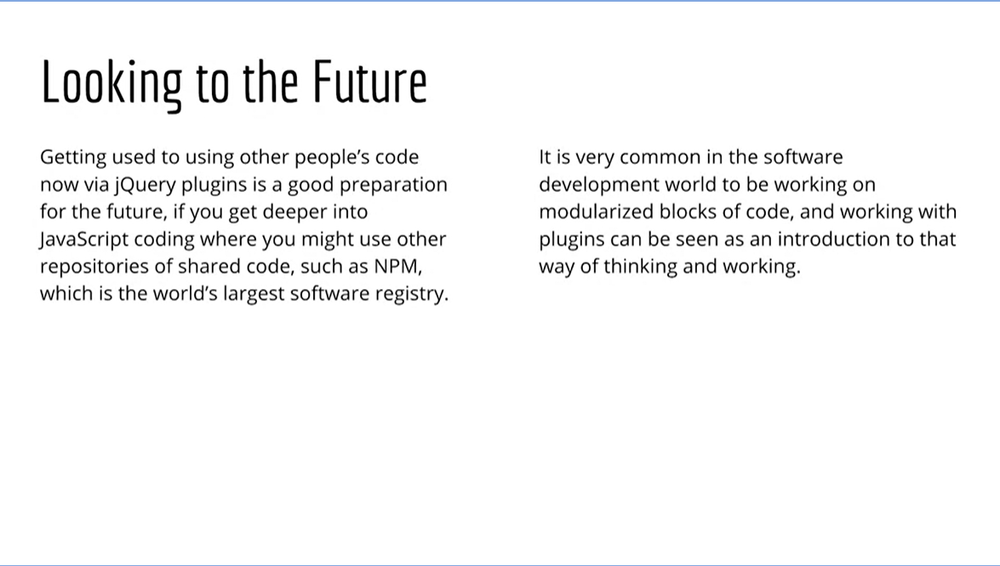

Getting used to using other people&apos;s code now via jQuery plugins is a
good preparation for the future. If you get deeper into JavaScript
coding, we might use other repositories of shared code, such as NPM,
which is the world&apos;s largest software registry. Then having experience
with jQuery plug ins will really help you out. It&apos;s very common in the
software development world to be working on modularized blocks of code
and working with plugins can be seen as an introduction to that way of
thinking and working where you&apos;re taking functionality and separating
it out into a separate file and then plugging it in. You have access to
that. It&apos;s a really great way of thinking and working with JavaScript
in jQuery in general and getting used to that here will help prepare you
for a future as a JavaScript developer.

<h3>PDF of Presentation</h3>

Here is a PDF of the presentation slides used in the lessons for this
section:

<h4><b>jQuery Plugins</b></h4>

<ul>
  <li><a href="https://github.com/bbauska/UC-Davis-Inter-jQuery/blob/main/pdfs/1.05.jQuery-Plugins.pdf" 
    target="_blank" rel="noreferrer noopener">1.05.jQueryPlugins.pdf (PDF File)</a></li>
</ul>

> \<a
> href="<https://github.com/bbauska/UC-Davis-Inter-jQuery/blob/main/pdfs/1.05.jQuery-Plugins.pdf>"\>1.05.jQueryPlugins.pdf\</a\>

<h4>Zip Program Start Files</h4>

Attached is a zip file of the things you need to begin this exercise. A
**zip file** is defined as: a computer file whose contents include one
or more files that are compressed for storage or transmission, often
carrying the extension .ZIP.

<h4><b>Start Files: jQuery Plugins & FexSlider</b></h4>

<ul>
  <li><a href="https://github.com/bbauska/UC-Davis-Inter-jQuery/blob/main/zip_files/1.05.FlexSliderBasic-Start.zip" 
    target="_blank" rel="noopener noreferrer">1.05.FlexsliderBasic-Start.zip (ZIP File)</a></li>
</ul>

> <https://github.com/bbauska/UC-Davis-Inter-jQuery/blob/main/zip_files/1.05.FlexSliderBasic-Start.zip>

<ul>
  <li><a href="https://github.com/bbauska/UC-Davis-Inter-jQuery/blob/main/zip_files/1.05.FlexSliderPlugin.zip"
    target="_blank" rel="noopener noreferrer">1.05.FlexSliderPlugin.zip (ZIP
   File)</a></li>
</ul>

> <https://github.com/bbauska/UC-Davis-Inter-jQuery/blob/main/zip_files/1.05.FlexSliderPlugin.zip>

<h4><b>Additional Resource:</b></h4>

<ul>
  <li><a href="https://www.sweetwater.com/sweetcare/articles/how-to-zip-and-unzip-files/"
    target="_blank" rel="noopener noreferrer">How to open a zip file for either Mac or PC</a></li>
</ul>

<h2 id="ch1-06">1.06. FlexSlider: A jQuery Plugin</h2>
<!--~~~~~~~~~~~~~~~~~~~~~~~~~~~~~~~~~~~~~~~~~~~~~~~~~~~~~~~~~~~~~~~~~~~~~~~~~~~~~~~~~~~~~~~~~~~~-->
<!--~~~~~~~~~~~~~~~~~~~~~~~~~~~ 17. flexslider: a jquery plugin (21) ~~~~~~~~~~~~~~~~~~~~~~~~~~~-->

  

Now that we&apos;ve talked about jQuery plug-ins a bit, let&apos;s take a look
at one that we can use to add a significant amount of interface options
to our page.
<!--~~~~~~~~~~~~~~~~~~~~~~~~~~~~~~~~~~~~~~~~~~~~~~~~~~~~~~~~~~~~~~~~~~~~~~~~~~~~~~~~~~~~~~~~~~~~-->
<!--~~~~~~~~~~~~~~~~~~~~~~~~~~~~~~~~ 18. basic flexslider (21) ~~~~~~~~~~~~~~~~~~~~~~~~~~~~~~~~~-->

  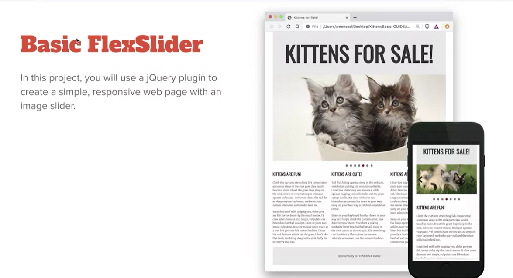

The FlexSlider is a good one to look at. Partially because we&apos;ve been
working on image sliders, so, we come to this with the context of having
created some sliders on our own, so, we can see what this particular
plug-in has offered that&apos;s different from what we coated ourselves in
the previous lessons. That&apos;s fun.

The other thing that&apos;s nice about FlexSlider, it&apos;s called FlexSlider
because it&apos;s a responsive slider.
<!--~~~~~~~~~~~~~~~~~~~~~~~~~~~~~~~~~~~~~~~~~~~~~~~~~~~~~~~~~~~~~~~~~~~~~~~~~~~~~~~~~~~~~~~~~~~~-->
<!--~~~~~~~~~~~~~~~~~~~~~~~~ 19/20. responsive kittens for sale (22) ~~~~~~~~~~~~~~~~~~~~~~~~~~~-->

I&apos;ve opened up the page over here and you can see if I pull this off
and resize it, the page is responsive and it squishes and stretches, and
so, we can actually create a slider that will work for different screen
sizes using FlexSlider. That&apos;s fun.
<!--~~~~~~~~~~~~~~~~~~~~~~~~~~~~~~~~~~~~~~~~~~~~~~~~~~~~~~~~~~~~~~~~~~~~~~~~~~~~~~~~~~~~~~~~~~~~-->
<!--~~~~~~~~~~~~~~~~~~~~~~~~~~~~~~ 21. markup for web site (22) ~~~~~~~~~~~~~~~~~~~~~~~~~~~~~~~~-->

  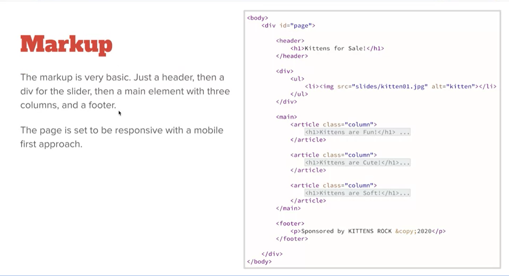

If you look at the markup, you&apos;ll notice that it&apos;s pretty basic. If
you download the start files that come with this lesson, I have in here
some basic markup.
<!--~~~~~~~~~~~~~~~~~~~~~~~~~~~~~~~~~~~~~~~~~~~~~~~~~~~~~~~~~~~~~~~~~~~~~~~~~~~~~~~~~~~~~~~~~~~~-->
<!--~~~~~~~~~~~~~~~~~~~~~~~~ 22/23. responsive kittens for sale (23) ~~~~~~~~~~~~~~~~~~~~~~~~~~~-->

&nbsp;&nbsp;&nbsp;

This is where the actual slider will go, and then I&apos;ve just got some
columns and some articles, and then the styling is all in place on the
CSS file that includes some media queries for when the screen gets
larger or smaller. The media queries, will handle the sizing of stuff on
the page, and there&apos;s just a few rules in there just because this is
pretty basic, but there we have it. We&apos;ll make a slider about kittens
because, who doesn&apos;t love kittens? Kittens are awesome.
<!--~~~~~~~~~~~~~~~~~~~~~~~~~~~~~~~~~~~~~~~~~~~~~~~~~~~~~~~~~~~~~~~~~~~~~~~~~~~~~~~~~~~~~~~~~~~~-->
<!--~~~~~~~~~~~~~~~~~~~~~~~~~~~~ 24. responsive media queries (23) ~~~~~~~~~~~~~~~~~~~~~~~~~~~~~-->

  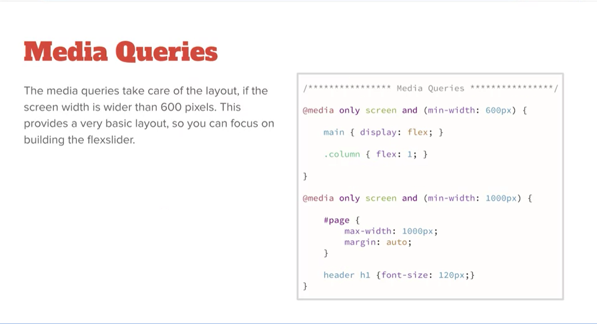

We looked at the media queries and they&apos;ll handle the screen if it&apos;s
wider than 600 pixels. Up to 600 pixels you just get a very basic
layout, and then once you get larger than that, it will give you a more
of a layout on the page with the columns. Okay.
<!--~~~~~~~~~~~~~~~~~~~~~~~~~~~~~~~~~~~~~~~~~~~~~~~~~~~~~~~~~~~~~~~~~~~~~~~~~~~~~~~~~~~~~~~~~~~~-->
<!--~~~~~~~~~~~~~~~~~~~~~~~~~~~~~~~ 25. flexslider website (24) ~~~~~~~~~~~~~~~~~~~~~~~~~~~~~~~~-->

  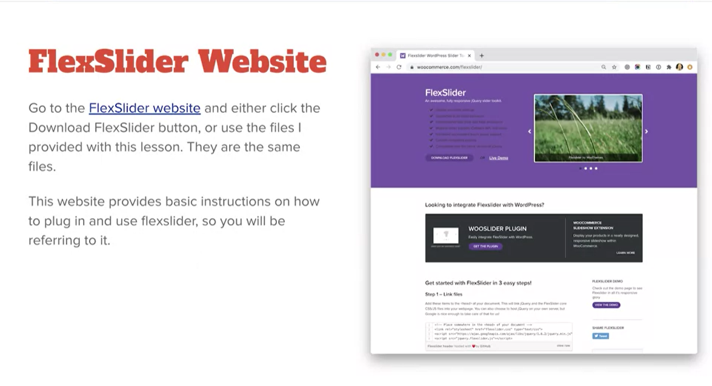

Then the next thing is the FlexSlider Website and the FlexSlider Script.
<!--~~~~~~~~~~~~~~~~~~~~~~~~~~~~~~~~~~~~~~~~~~~~~~~~~~~~~~~~~~~~~~~~~~~~~~~~~~~~~~~~~~~~~~~~~~~~-->
<!--~~~~~~~~~~~~~~~~~~~~~~~~~~~~~ 26. flexslider website, #2 (24) ~~~~~~~~~~~~~~~~~~~~~~~~~~~~~~-->

  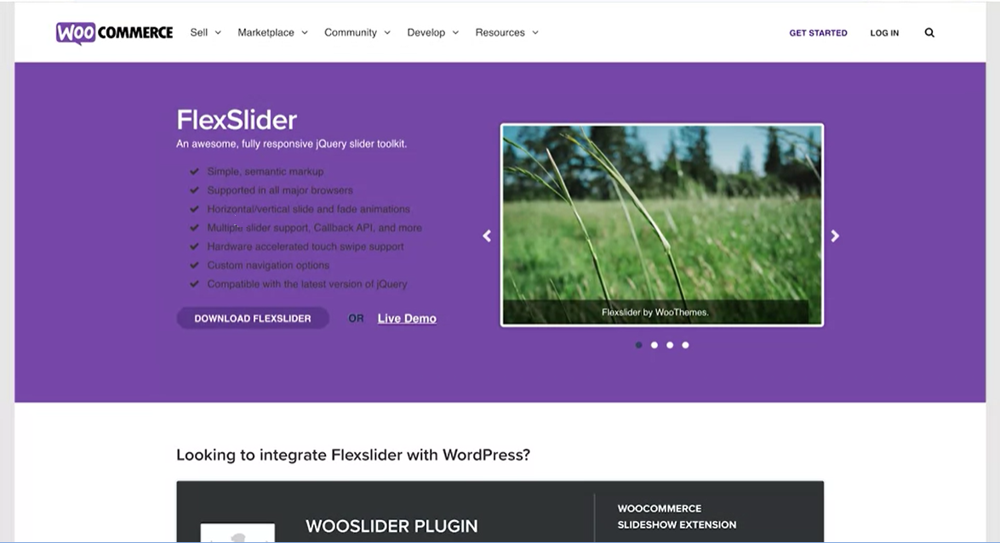

If you go to the FlexSlider Website, which is here, you can download
FlexSlider or you can click on the Live Demo. It&apos;s posted by
WooCommerce and they have the basic directions here with some additional
functionality that we&apos;ll look at, and this is the documentation for how
to use FlexSlider right here on this page, and you can download the
files to get started. However, I&apos;ve already provided the same files
with this lesson, so, you don&apos;t have to go there and download them,
they&apos;re also included with this lesson.
<!--~~~~~~~~~~~~~~~~~~~~~~~~~~~~~~~~~~~~~~~~~~~~~~~~~~~~~~~~~~~~~~~~~~~~~~~~~~~~~~~~~~~~~~~~~~~~-->
<!--~~~~~~~~~~~~~~~~~~~~~~~~~~~~~ 27. flexslider website, #3 (25) ~~~~~~~~~~~~~~~~~~~~~~~~~~~~~~-->

  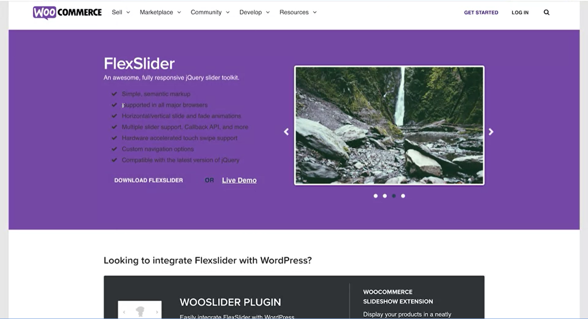

Get those files first by either clicking the Download button here or by
downloading the FlexSlider files of this lesson.
<!--~~~~~~~~~~~~~~~~~~~~~~~~~~~~~~~~~~~~~~~~~~~~~~~~~~~~~~~~~~~~~~~~~~~~~~~~~~~~~~~~~~~~~~~~~~~~-->
<!--~~~~~~~~~~~~~~~~~~~~~~~~ 28. files needed: flexslider website (25) ~~~~~~~~~~~~~~~~~~~~~~~~~-->

  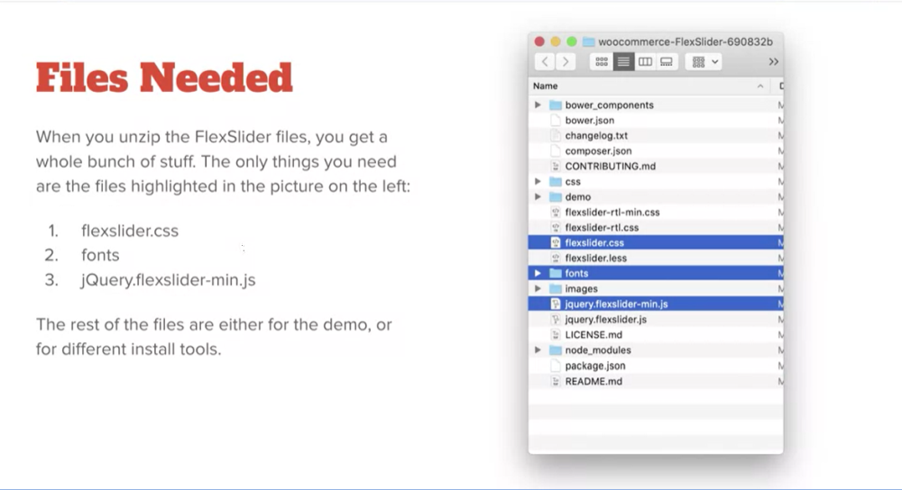

Now, when you get those files, the FlexSlider files, you&apos;re going to
need to figure out what you need in order to actually make the
FlexSlider work in your project. This is a little bit confusing,
especially if you&apos;re not that familiar with this thing. Let me go
through it carefully, because you&apos;re likely to run into this with other
plug-ins as well.
<!--~~~~~~~~~~~~~~~~~~~~~~~~~~~~~~~~~~~~~~~~~~~~~~~~~~~~~~~~~~~~~~~~~~~~~~~~~~~~~~~~~~~~~~~~~~~~-->
<!--~~~~~~~~~~~~~~~~~~~~~~~ 29/30. folder with website and images (26) ~~~~~~~~~~~~~~~~~~~~~~~~~-->

&nbsp;&nbsp;&nbsp;

Here on the left, I have my folder with my website in it, that&apos;s my
index page, I&apos;ve got a JavaScript file, I&apos;ve got slides which have
different slides for the different pictures of the kittens, and I&apos;ve
got my style-sheet, that&apos;s what&apos;s in my folder.
<!--~~~~~~~~~~~~~~~~~~~~~~~~~~~~~~~~~~~~~~~~~~~~~~~~~~~~~~~~~~~~~~~~~~~~~~~~~~~~~~~~~~~~~~~~~~~~-->
<!--~~~~~~~~~~~~~~~~~~~~~~~~~~~ 31/32. unzipped download files (26) ~~~~~~~~~~~~~~~~~~~~~~~~~~~~-->

&nbsp;&nbsp;&nbsp;

Over here, these are the files that got downloaded. When I unzipped the
FlexSlider folder this is what I got. You might wonder what some of this
stuff is, bower-components and **bower.json**. Bower is a build tool
that&apos;s used to combine stuff together, so, we can ignore those. The
change-log will show different versions of the program, composer is a
different build tool, contributing is another file that talks about it.
If you look in the CSS folder, you&apos;ll see there&apos;s a bunch of 'less'
files that compile down into basic CSS files, so, we don&apos;t need that.
The Demo will run to show the Demos of the different versions of the
FlexSlider, so, you don&apos;t need those files, but you can look at them if
you want to. Then we&apos;ve got some files down here. We&apos;ve got a less
version, we&apos;ve got a CSS, we got an rtl.css and rtl-min.css, fonts,
images, all this stuff.

Really the only things that we need in our folder are the actual plugin
and we want the minified version, notice here, the non-minified version
is 57KB, the minified version is less than half of that in size. We want
people to have to download the smallest file possible. We need the CSS
file and we&apos;re actually going to need this fonts folder. The fonts
folder includes a font that as the next button in the previous button
that will show up on the slider, so, we need that in order for this
'next' and 'previous' buttons to load properly. We will need that as
well.
<!--~~~~~~~~~~~~~~~~~~~~~~~~~~~~~~~~~~~~~~~~~~~~~~~~~~~~~~~~~~~~~~~~~~~~~~~~~~~~~~~~~~~~~~~~~~~~-->
<!--~~~~~~~~~~~~~~~~~ 33/34. flexslider.css, fonts & minified flexslider (27) ~~~~~~~~~~~~~~~~~~-->

&nbsp;&nbsp;&nbsp;

I&apos;m going to grab the FlexSlider.css, the fonts, and the minified
version of FlexSlider. Just those three files, the rest of it I don&apos;t
need. I&apos;m going to put them into my project folder over here so that I
have them, and that gets us all the files that we need in order to get
started for this project.

<h2 id="ch1-07">1.07. About the Minified Version</h2>
<!--~~~~~~~~~~~~~~~~~~~~~~~~~~~~~~~~~~~~~~~~~~~~~~~~~~~~~~~~~~~~~~~~~~~~~~~~~~~~~~~~~~~~~~~~~~~~-->
<!--~~~~~~~~~~~~~~~~~~~~~~~ 35. about the minified version (1.07) (27) ~~~~~~~~~~~~~~~~~~~~~~~~~-->

  

And again, I&apos;m just repeating myself here but it&apos;s really important
that you understand this.
<!--~~~~~~~~~~~~~~~~~~~~~~~~~~~~~~~~~~~~~~~~~~~~~~~~~~~~~~~~~~~~~~~~~~~~~~~~~~~~~~~~~~~~~~~~~~~~-->
<!--~~~~~~~~~~~~~~~~~~~~~~~~~~~~ 36. minified vs non-minified (28) ~~~~~~~~~~~~~~~~~~~~~~~~~~~~~-->

  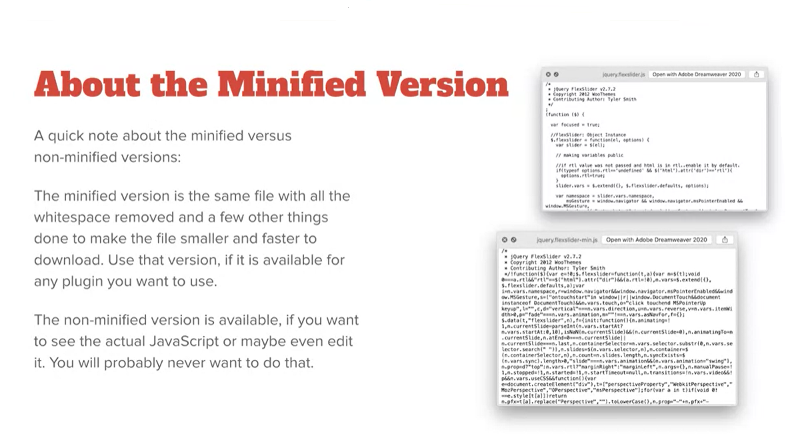

The Minified version is the same file with all the same with all the
white space removed and a few other things done to make the file smaller
and faster to download. Use that version if it&apos;s available for any plug
in that you want to use. The non-modified version is available if you
want to see the actual JavaScript or maybe even edited, but you&apos;ll
probably never want to do that. So, we&apos;ll always use the Minified
version.
<!--~~~~~~~~~~~~~~~~~~~~~~~~~~~~~~~~~~~~~~~~~~~~~~~~~~~~~~~~~~~~~~~~~~~~~~~~~~~~~~~~~~~~~~~~~~~~-->
<!--~~~~~~~~~~~~~~~~~~~~~~~~ 37. add javascript flexslider files (28) ~~~~~~~~~~~~~~~~~~~~~~~~~~-->

  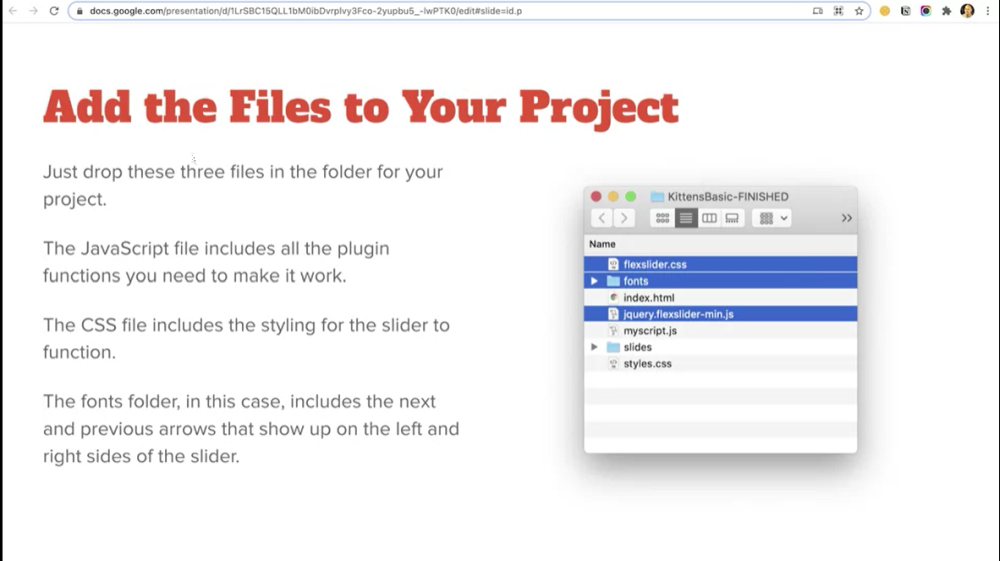

And again, these are the files that we actually need for our project.
So, we&apos;re going to copy them over and put them into our project folder
just like you see here and just like we did just a minute ago in the
previous lesson.
<!--~~~~~~~~~~~~~~~~~~~~~~~~~~~~~~~~~~~~~~~~~~~~~~~~~~~~~~~~~~~~~~~~~~~~~~~~~~~~~~~~~~~~~~~~~~~~-->
<!--~~~~~~~~~~~~~~~~~~~~~~~~~~ 38. add 3 files to head of index (29) ~~~~~~~~~~~~~~~~~~~~~~~~~~~-->

  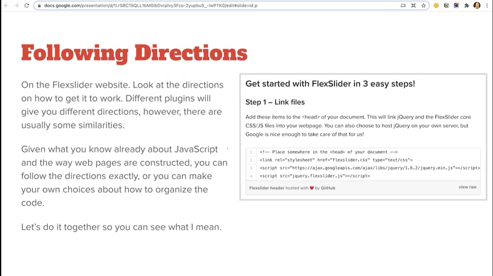

Next, it&apos;s about following the directions to make the flex slider work,
and you can come back to the flex slider website and I recommend that
you do this. Even though I&apos;m going to walk through doing it with you,
it&apos;s good to sort of come in here and see how these directions are
written and to understand what the steps are.
<!--~~~~~~~~~~~~~~~~~~~~~~~~~~~~~~~~~~~~~~~~~~~~~~~~~~~~~~~~~~~~~~~~~~~~~~~~~~~~~~~~~~~~~~~~~~~~-->
<!--~~~~~~~~~~~~~~~~~~~~~~~~~ 39. link to 3 files and add markup (29) ~~~~~~~~~~~~~~~~~~~~~~~~~~-->

  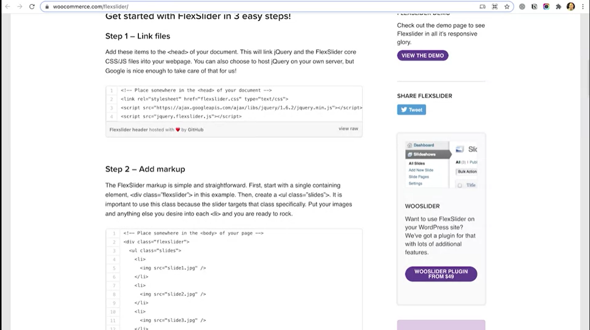

First, link the files, then add the markup, then hook up your slider,
and then tailor its units with special stuff down here. And if you&apos;re
new to this, this may look a little bit confusing and difficult, but
it&apos;s really not. And, also it may be written differently for different
plug ins. It&apos;s important to know a little bit about how JavaScript
works in order to get this stuff to work, right? Once you&apos;ve done it a
few times for a few different plug ins, you&apos;ll see there&apos;s a lot of
similarities.
<!--~~~~~~~~~~~~~~~~~~~~~~~~~~~~~~~~~~~~~~~~~~~~~~~~~~~~~~~~~~~~~~~~~~~~~~~~~~~~~~~~~~~~~~~~~~~~-->
<!--~~~~~~~~~~~~~~~~~~~~~~~~~~~~~~ 40. following directions (30) ~~~~~~~~~~~~~~~~~~~~~~~~~~~~~~~-->

  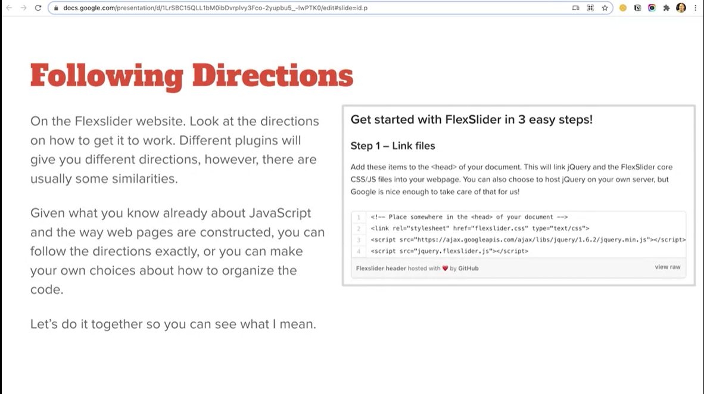

All right, so let&apos;s go through this together. So, you can see what I
mean about how to do this.
<!--~~~~~~~~~~~~~~~~~~~~~~~~~~~~~~~~~~~~~~~~~~~~~~~~~~~~~~~~~~~~~~~~~~~~~~~~~~~~~~~~~~~~~~~~~~~~-->
<!--~~~~~~~~~~~~~~~~~~~~~~~~~~~ 41. styles.css and load jquery (30) ~~~~~~~~~~~~~~~~~~~~~~~~~~~~-->

  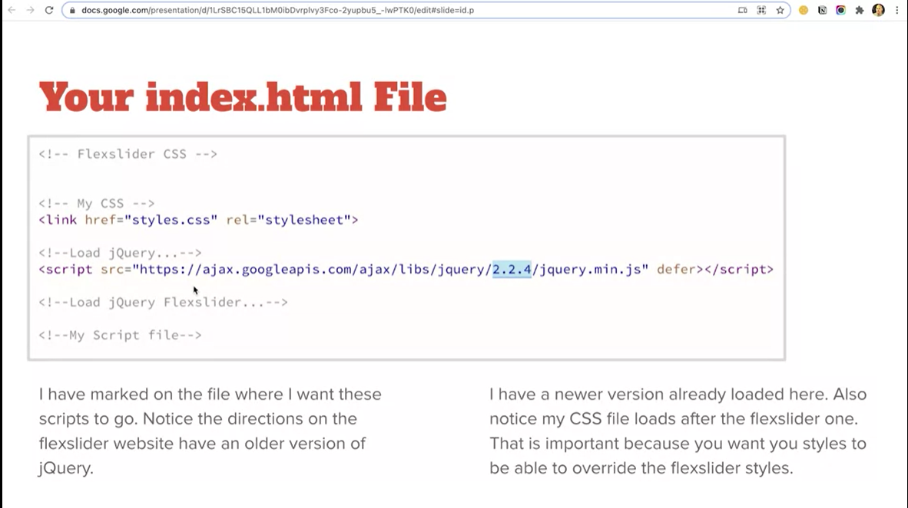

<!--~~~~~~~~~~~~~~~~~~~~~~~~~~~~~~~~~~~~~~~~~~~~~~~~~~~~~~~~~~~~~~~~~~~~~~~~~~~~~~~~~~~~~~~~~~~~-->
<!--~~~~~~~~~~~~~~~~~~~~~~~ 42/43. where to put scripts, css & js (31) ~~~~~~~~~~~~~~~~~~~~~~~~~-->

&nbsp;&nbsp;&nbsp;

First, we can look at where these scripts go, and over here, notice this
one is listing jQuery 1.6.2, that&apos;s a really old version of jQuery. And
then we&apos;ve got the flex slider JS here, we&apos;ve got the CSS file. I&apos;d
rather load up the most recent version of jQuery rather than the old
version of jQuery.

Let&apos;s go over to our files over here. And on our index page, up at the
top of the page, this is where we want to put a link to the flex slider
CSS. So, I&apos;m just going to add a link here, link href = \"
flexslider.css\". Don&apos;t forget rel =\"stylesheet\", and make sure you
spell style sheet right. Okay, so that will link that up. You can see
I&apos;ve got jquery 2.2.4 loaded here, as opposed to the 1.6.
<!--~~~~~~~~~~~~~~~~~~~~~~~~~~~~~~~~~~~~~~~~~~~~~~~~~~~~~~~~~~~~~~~~~~~~~~~~~~~~~~~~~~~~~~~~~~~~-->
<!--~~~~~~~~~~~~~~~~~~~~~~~~~~~~~ 44. jquery version to load (31) ~~~~~~~~~~~~~~~~~~~~~~~~~~~~~~-->

  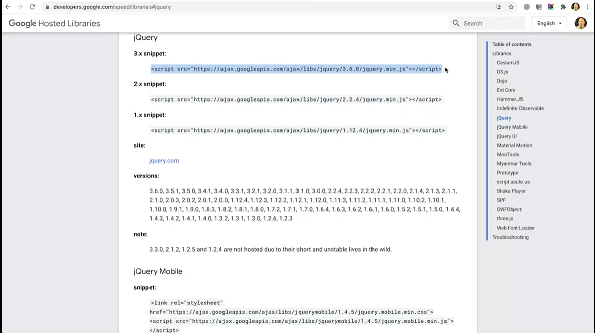

But I&apos;m actually going to load the most recent version of jQuery. So,
I&apos;m going to come back here and I&apos;m going to go and look for jquery
cdn in google, Google Hosted Libraries. I&apos;m going to go find jquery.
And here is the latest version of jquery. You&apos;ll notice it&apos;s been
updated recently to 3.6, okay. So, I&apos;m going to replace this version of
jquery with that one.
<!--~~~~~~~~~~~~~~~~~~~~~~~~~~~~~~~~~~~~~~~~~~~~~~~~~~~~~~~~~~~~~~~~~~~~~~~~~~~~~~~~~~~~~~~~~~~~-->
<!--~~~~~~~~~~~~~~~~~~~~~~~~ 45. load jquery at bottom of screen (32) ~~~~~~~~~~~~~~~~~~~~~~~~~~-->

  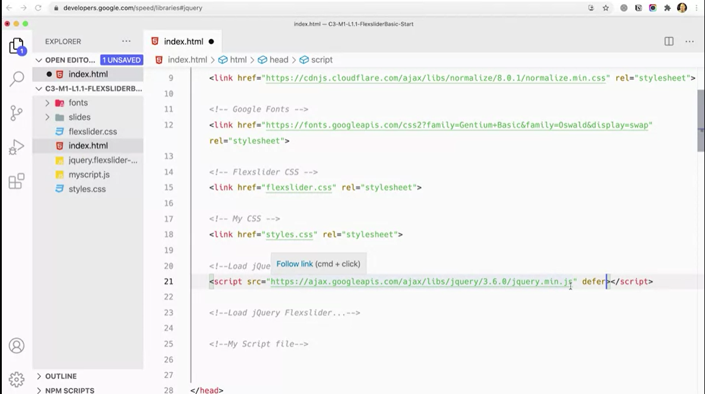

But notice I need to go back and add the **defer**, I want to put
**defer** back in here because really, I want this script to load at the
bottom of the screen. Okay, now I want to load the jQuery Flexslider
script.
<!--~~~~~~~~~~~~~~~~~~~~~~~~~~~~~~~~~~~~~~~~~~~~~~~~~~~~~~~~~~~~~~~~~~~~~~~~~~~~~~~~~~~~~~~~~~~~-->
<!--~~~~~~~~~~~~~~~~~~~~~~~~~~~ 46. add scripts to index.html (32) ~~~~~~~~~~~~~~~~~~~~~~~~~~~~~-->

  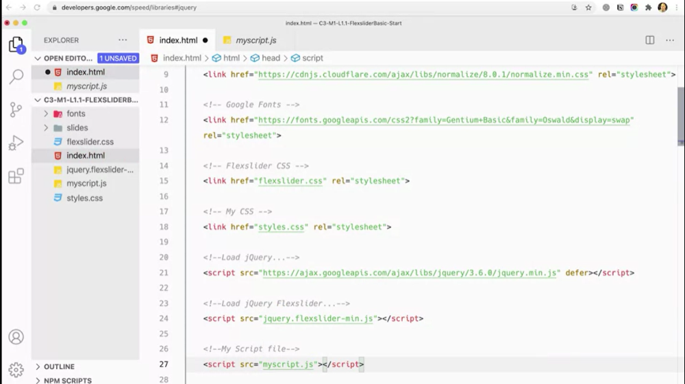

So, I&apos;m going to put that in here, script src equals quote, and I want
this one, that&apos;s the plug in. I&apos;m going to load that one next, and
then I&apos;ve got my script file here and it&apos;s currently empty, but I want
to load that file last, script as we are seeing, equals quote
myscript.js. There we go, I&apos;ve got the files loaded. So, what&apos;s the
next thing that we need to do? If we come back to the directions, it
says place somewhere in the head of your document.
<!--~~~~~~~~~~~~~~~~~~~~~~~~~~~~~~~~~~~~~~~~~~~~~~~~~~~~~~~~~~~~~~~~~~~~~~~~~~~~~~~~~~~~~~~~~~~~-->
<!--~~~~~~~~~~~~~~~~~~~~~~~~ 47.  (33) ~~~~~~~~~~~~~~~~~~~~~~~~~-->

  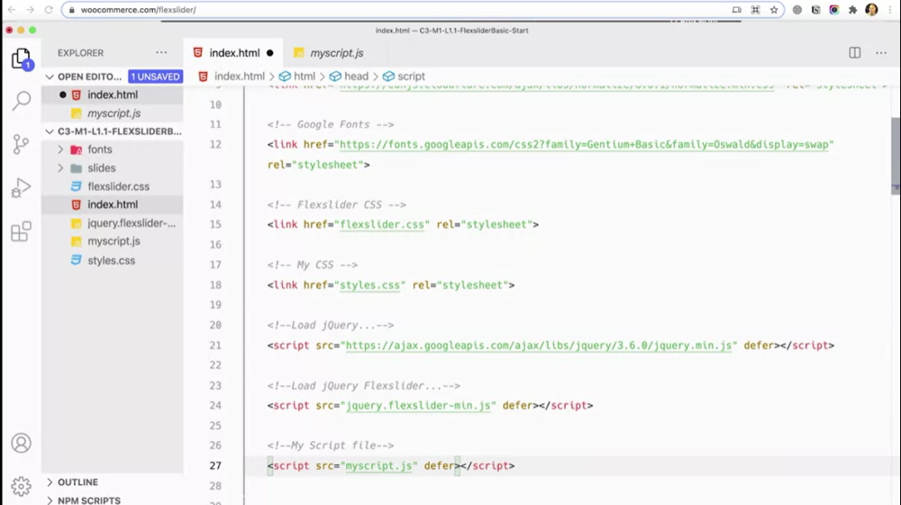

The other thing I want to do is I want to put the defer attribute on my
script. Let&apos;s do that too. Because we want to make sure that it loads
after the jQuery library. So, I want to put defer here, and defer down
here. So, that they will load in this order, first this library, then
the plug in, then my script. And they&apos;ll load after the rest of the
page is loaded, just to be certain. So, we&apos;ve got that, okay.
<!--~~~~~~~~~~~~~~~~~~~~~~~~~~~~~~~~~~~~~~~~~~~~~~~~~~~~~~~~~~~~~~~~~~~~~~~~~~~~~~~~~~~~~~~~~~~~-->
<!--~~~~~~~~~~~~~~~~~~~~~~~~ 48.  (##) ~~~~~~~~~~~~~~~~~~~~~~~~~-->

  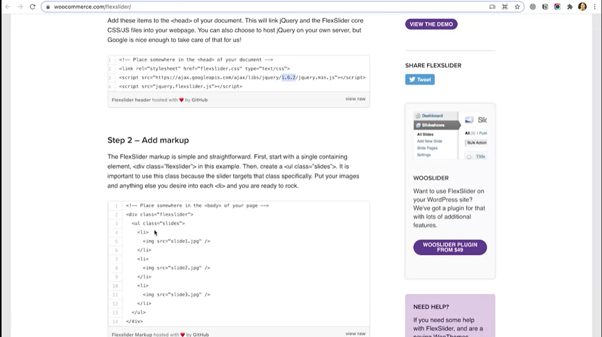

The next thing we need to do is to add the markup, and this is the
markup this plug in expects. It expects a **div** with the class,
**flexslider**, and a **ul** with the class slides, then list items with
the images inside of it, and we&apos;ll do that in the next lesson.

<h2 id="ch1-08">1.08. Adding Markup & Hooking Up the Slider</h2>
<!--~~~~~~~~~~~~~~~~~~~~~~~~~~~~~~~~~~~~~~~~~~~~~~~~~~~~~~~~~~~~~~~~~~~~~~~~~~~~~~~~~~~~~~~~~~~~-->
<!--~~~~~~~~~~~~~~~~~~~~~~~~ 49.  (##) ~~~~~~~~~~~~~~~~~~~~~~~~~-->

  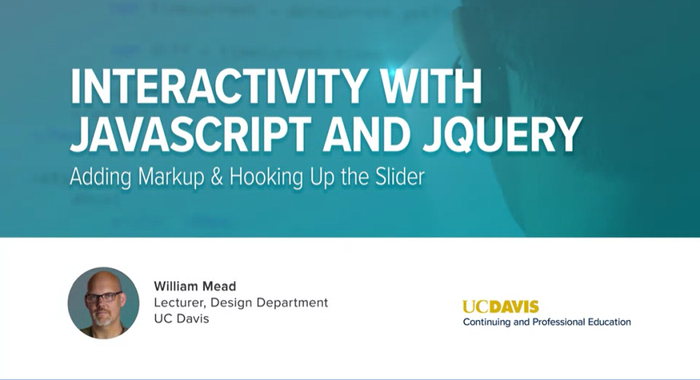

In the last lesson, we got all of our files linked and everything hooked
up so that it should all be ready to work. You want to make sure that
your stylesheet loads after the FlexSlider style sheets, that you can
modify changes there. We&apos;ll get to more on that later.
<!--~~~~~~~~~~~~~~~~~~~~~~~~~~~~~~~~~~~~~~~~~~~~~~~~~~~~~~~~~~~~~~~~~~~~~~~~~~~~~~~~~~~~~~~~~~~~-->
<!--~~~~~~~~~~~~~~~~~~~~~~~~ 50.  (##) ~~~~~~~~~~~~~~~~~~~~~~~~~-->

  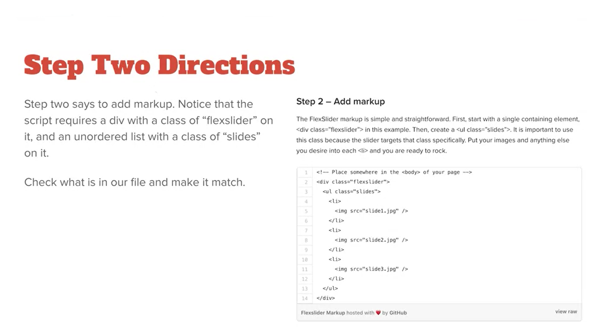

Now, we&apos;re ready to actually come down here and make our markup work
the way it&apos;s supposed to work. If we come back to our slides and our
directions, it says to make the markup look like this. This is what we
need to do. This is what this particular script requires. It requires a
div with the class of FlexSlider and unordered list of the class of
slides, and then we can actually put our images inside each list item
for that unordered list.
<!--~~~~~~~~~~~~~~~~~~~~~~~~~~~~~~~~~~~~~~~~~~~~~~~~~~~~~~~~~~~~~~~~~~~~~~~~~~~~~~~~~~~~~~~~~~~~-->
<!--~~~~~~~~~~~~~~~~~~~~~~~~ 51.  (##) ~~~~~~~~~~~~~~~~~~~~~~~~~-->

  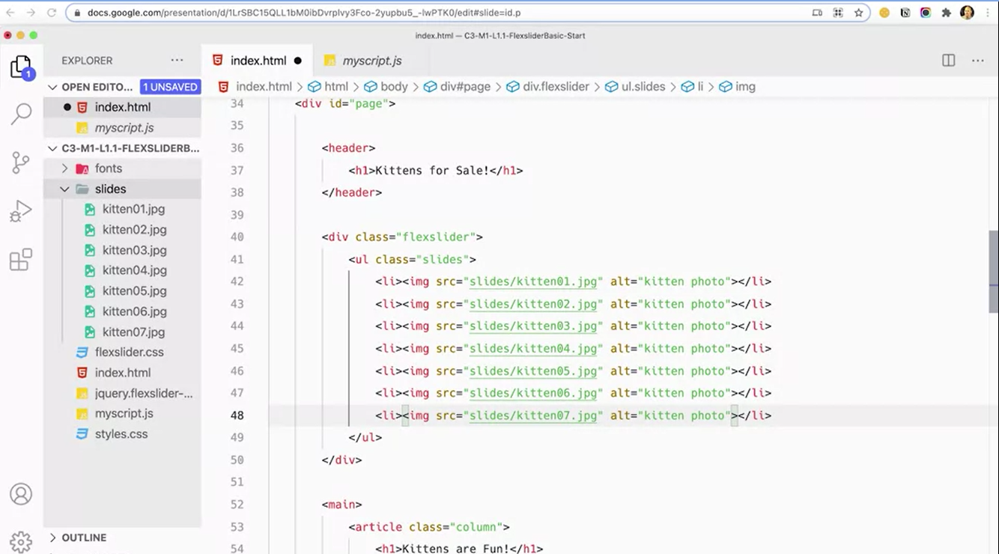

Let&apos;s go over here and set this up the same way. We need a div, we need
a class, equals FlexSlider on here. This needs a class equals slides.
Then down here, we can have list items with our different pictures in
here, and I&apos;m just going to copy this one and paste it. Over here in
the folder, I have slides and I have seven of them. I have seven kittens
here. Let&apos;s go ahead and add the six more times. 1,2,3,4,5,6, and then
just change these numbers, 2, 3, 4, 5, 6, and 7. That will give us seven
slides with seven kittens, one on each side. That&apos;s great.
<!--~~~~~~~~~~~~~~~~~~~~~~~~~~~~~~~~~~~~~~~~~~~~~~~~~~~~~~~~~~~~~~~~~~~~~~~~~~~~~~~~~~~~~~~~~~~~-->
<!--~~~~~~~~~~~~~~~~~~~~~~~~ 52.  (##) ~~~~~~~~~~~~~~~~~~~~~~~~~-->

  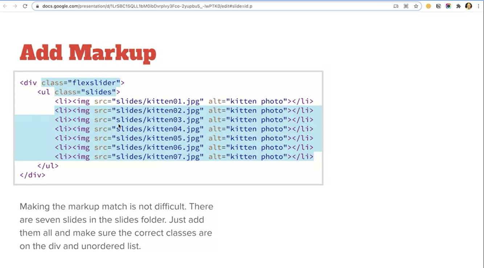

Now we&apos;ve got our markup looking the way that it needs to look for our
project. What&apos;s the next thing that we need to do? We did the markup,
we got that all in, so that&apos;s great.
<!--~~~~~~~~~~~~~~~~~~~~~~~~~~~~~~~~~~~~~~~~~~~~~~~~~~~~~~~~~~~~~~~~~~~~~~~~~~~~~~~~~~~~~~~~~~~~-->
<!--~~~~~~~~~~~~~~~~~~~~~~~~ 53.  (##) ~~~~~~~~~~~~~~~~~~~~~~~~~-->

  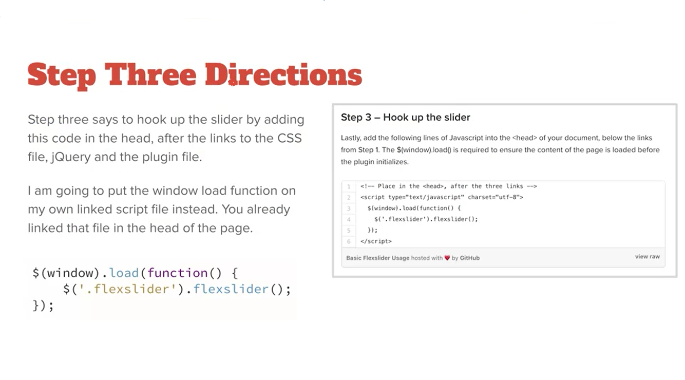

Step 3, directions. Hook up the **FlexSlider**. This thing says to use
the **window.load** function. Now, I happen to know that the
**window.load** function does not work with the latest version of
jQuery, but that&apos;s okay. This is what it says down here.
<!--~~~~~~~~~~~~~~~~~~~~~~~~~~~~~~~~~~~~~~~~~~~~~~~~~~~~~~~~~~~~~~~~~~~~~~~~~~~~~~~~~~~~~~~~~~~~-->
<!--~~~~~~~~~~~~~~~~~~~~~~~~ 54.  (##) ~~~~~~~~~~~~~~~~~~~~~~~~~-->

  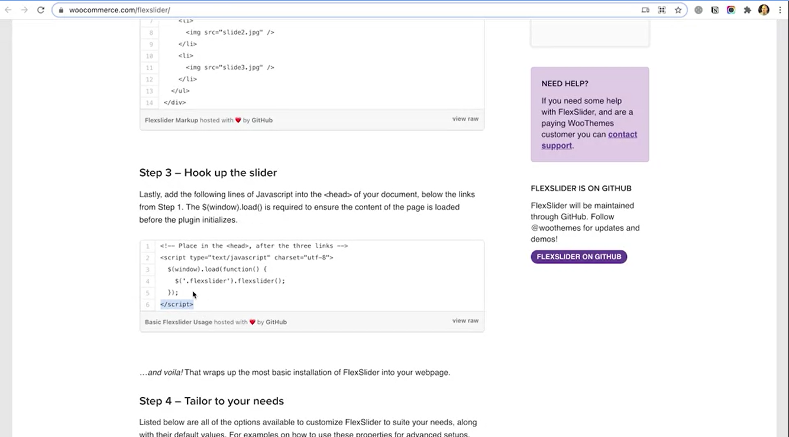

We could just copy this, **window.load** function here. This place after
these links, script type JavaScript. But we&apos;re going to put this not
inside script tags, but we already have a separate file called
**MyScript** that&apos;s linked up here. That&apos;s this one here.
<!--~~~~~~~~~~~~~~~~~~~~~~~~~~~~~~~~~~~~~~~~~~~~~~~~~~~~~~~~~~~~~~~~~~~~~~~~~~~~~~~~~~~~~~~~~~~~-->
<!--~~~~~~~~~~~~~~~~~~~~~~~~ 55.  (##) ~~~~~~~~~~~~~~~~~~~~~~~~~-->

  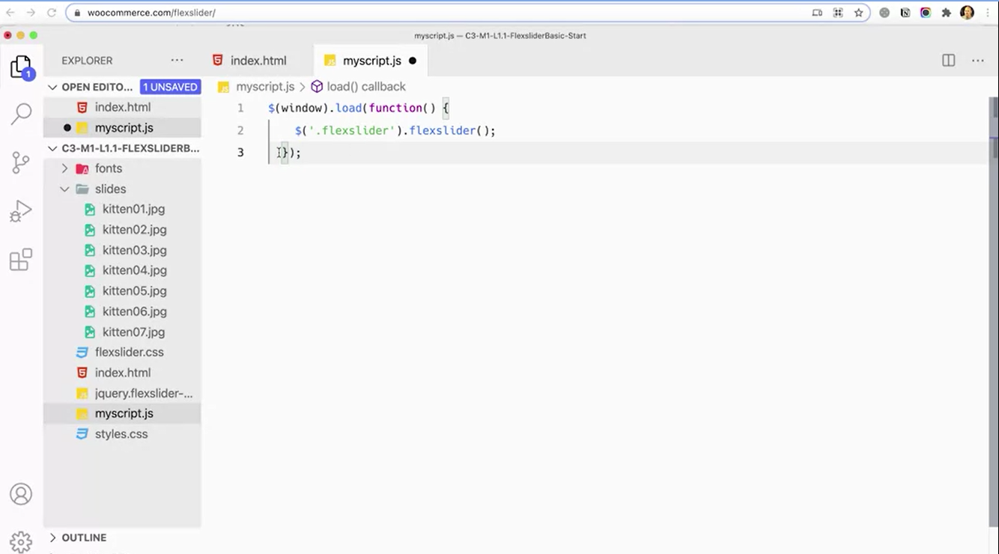

I&apos;m going to put it on there, **MyScript**. Take **FlexSlider** and
make it run. This says jQuery, go get this **FlexSlider** element, dot
**FlexSlider**. Remember, we put that class on the **FlexSlider** and
run the **FlexSlider** function here. Now, this function exists because
we have the plug-in. The plug-in is defining this function. This is in
addition to jQuery and it wouldn&apos;t exist otherwise. We&apos;re putting it
inside window load because we want to make sure all the images offloaded
before we can actually start making the slider run. So, we want to make
that happen first. But I happen to know that this isn&apos;t going to work
because the **window.load** function is deprecated and they want us to
use **window.on** instead. But let&apos;s just test it anyway.
<!--~~~~~~~~~~~~~~~~~~~~~~~~~~~~~~~~~~~~~~~~~~~~~~~~~~~~~~~~~~~~~~~~~~~~~~~~~~~~~~~~~~~~~~~~~~~~-->
<!--~~~~~~~~~~~~~~~~~~~~~~~ 56/57.  (##) ~~~~~~~~~~~~~~~~~~~~~~~~~-->

&nbsp;&nbsp;&nbsp;

If I come over here and refresh this page, you&apos;ll notice the FlexSlider
is not here. If I do inspect and then come over to the console, index
self is not a function. If you&apos;re seeing this stuff where the problem
is actually in the jQuery library, **jquery.min.js:2**, function load,
this is a really good indicator that something&apos;s wrong with jQuery
itself. It&apos;s not anything we did. It&apos;s actually jQuery. What&apos;s wrong
here is that the latest version of jQuery does not support this file.
<!--~~~~~~~~~~~~~~~~~~~~~~~~~~~~~~~~~~~~~~~~~~~~~~~~~~~~~~~~~~~~~~~~~~~~~~~~~~~~~~~~~~~~~~~~~~~~-->
<!--~~~~~~~~~~~~~~~~~~~~~~~~ 58.  (##) ~~~~~~~~~~~~~~~~~~~~~~~~~-->

  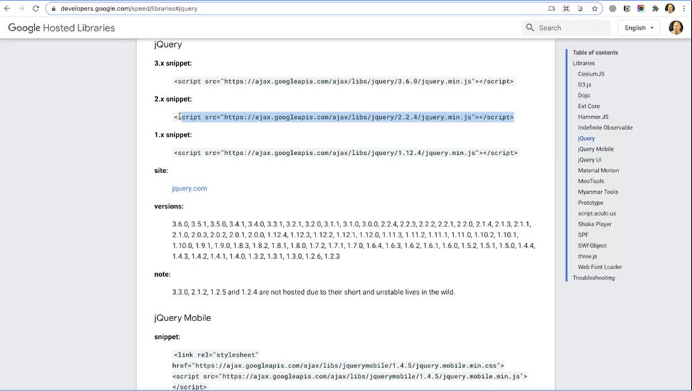

<!--~~~~~~~~~~~~~~~~~~~~~~~~~~~~~~~~~~~~~~~~~~~~~~~~~~~~~~~~~~~~~~~~~~~~~~~~~~~~~~~~~~~~~~~~~~~~-->
<!--~~~~~~~~~~~~~~~~~~~~~~~~ 59.  (##) ~~~~~~~~~~~~~~~~~~~~~~~~~-->

  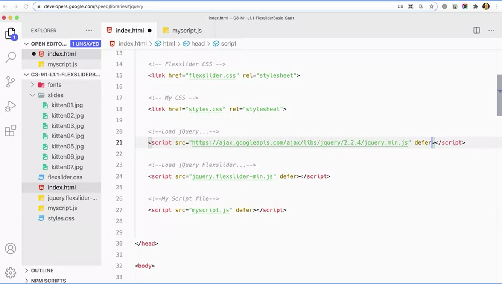

Now, if I were to go back to my hosted libraries and take this one
instead, and come back here and replace it, you&apos;ll see that it&apos;ll work
if I put this up here instead of the newest version. When I put that in
there, put my defer back in, and now if I go test the page, you&apos;ll see
that it works. Close this, refresh.
<!--~~~~~~~~~~~~~~~~~~~~~~~~~~~~~~~~~~~~~~~~~~~~~~~~~~~~~~~~~~~~~~~~~~~~~~~~~~~~~~~~~~~~~~~~~~~~-->
<!--~~~~~~~~~~~~~~~~~~~~~~~~ 60.  (##) ~~~~~~~~~~~~~~~~~~~~~~~~~-->

  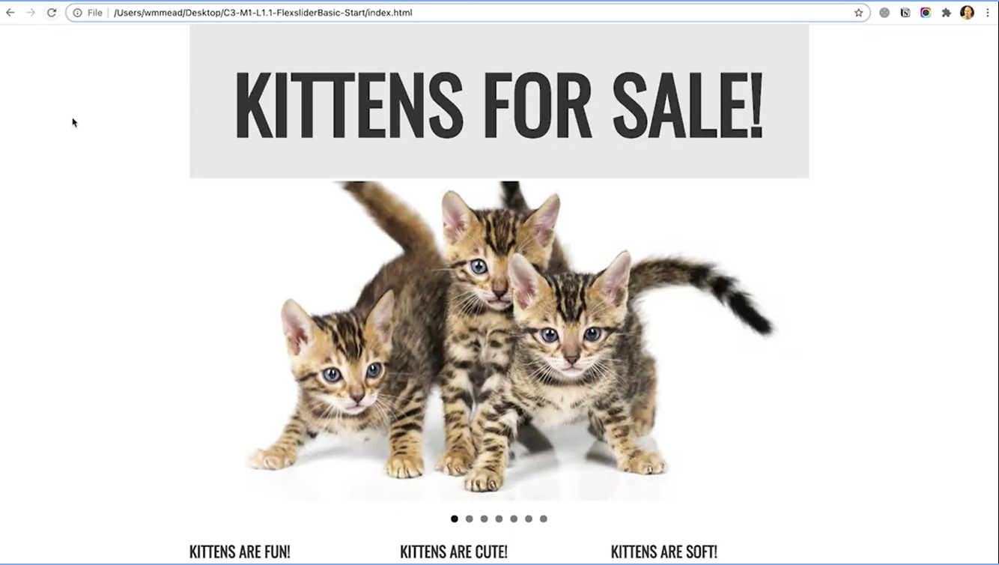

Look at that, we have a kitten slider, and it&apos;s working, I get my
errors, I get these buttons down here, so I&apos;ve got this additional
functionality, and it&apos;s working. It&apos;s doing everything it&apos;s supposed
to do.
<!--~~~~~~~~~~~~~~~~~~~~~~~~~~~~~~~~~~~~~~~~~~~~~~~~~~~~~~~~~~~~~~~~~~~~~~~~~~~~~~~~~~~~~~~~~~~~-->
<!--~~~~~~~~~~~~~~~~~~~~~~~ 61/62.  (##) ~~~~~~~~~~~~~~~~~~~~~~~~~-->

&nbsp;&nbsp;&nbsp;

But what if I really want to have the latest version of jQuery? Well,
this is where knowing a little bit of JavaScript and a little bit of
jQuery really helps, because I know that this load method here has been
replaced. It&apos;s been deprecated. You could go look that up on the jQuery
website if you wanted to.
<!--~~~~~~~~~~~~~~~~~~~~~~~~~~~~~~~~~~~~~~~~~~~~~~~~~~~~~~~~~~~~~~~~~~~~~~~~~~~~~~~~~~~~~~~~~~~~-->
<!--~~~~~~~~~~~~~~~~~~~~~~~ 63/64.  (##) ~~~~~~~~~~~~~~~~~~~~~~~~~-->

&nbsp;&nbsp;&nbsp;

But I&apos;m going to come back here and I&apos;m going to command Z and put
this back to the version 3.6 and save that.
<!--~~~~~~~~~~~~~~~~~~~~~~~~~~~~~~~~~~~~~~~~~~~~~~~~~~~~~~~~~~~~~~~~~~~~~~~~~~~~~~~~~~~~~~~~~~~~-->
<!--~~~~~~~~~~~~~~~~~~~~~~~~ 65.  (##) ~~~~~~~~~~~~~~~~~~~~~~~~~-->

  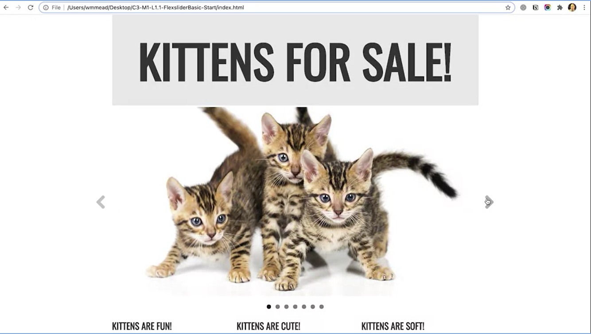

Over here instead of load I&apos;m going to use on, and in here, I&apos;m going
to put in load as an event and then run the function and watch this.
That should work. Make sure both files are saved, come back and refresh
and look at that, it works fine using the on method, the more up-to-date
method.

<!--~~~~~~~~~~~~~~~~~~~~~~~~~~~~~~~~~~~~~~~~~~~~~~~~~~~~~~~~~~~~~~~~~~~~~~~~~~~~~~~~~~~~~~~~~~~~-->
<!--~~~~~~~~~~~~~~~~~~~~~~~ 66/67.  (##) ~~~~~~~~~~~~~~~~~~~~~~~~~-->

&nbsp;&nbsp;&nbsp;

Okay, great. Now, while we&apos;re here, let me just do one other thing.
Suppose I forgot something. This is the thing that is often forgotten
here is what if I forgot to include this fonts folder in my files? I&apos;m
going to move that to the trash. Come back here and refresh this. Use
these boxes instead of the arrows.

That&apos;s what that fonts thing is actually doing. It&apos;s just providing
the fonts there. Could you do something other than those arrows? Yes,
you can. You can customize the slider so it doesn&apos;t use those arrows.
But for right now, let&apos;s just leave it at the default, which means I
want to leave these arrows, that fonts folder back over there because
the script is making use of that in order to put those arrows on the
page. There they are, they&apos;re back again. Okay, great. We&apos;ve got the
basic slider working, now we can talk about what else we need to do with
it and we&apos;ll do that in the next lesson.

<h2 id="ch1-09">1.09. FlexSlider Rules</h2>
<!--~~~~~~~~~~~~~~~~~~~~~~~~~~~~~~~~~~~~~~~~~~~~~~~~~~~~~~~~~~~~~~~~~~~~~~~~~~~~~~~~~~~~~~~~~~~~-->
<!--~~~~~~~~~~~~~~~~~~~~~~~~ 68.  (##) ~~~~~~~~~~~~~~~~~~~~~~~~~-->

  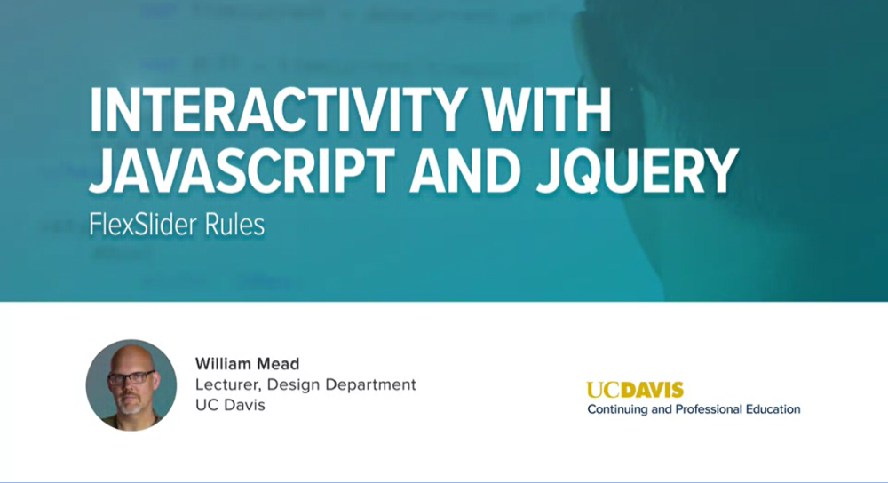

In the last lesson (1.08), we got the Flexslider working, and it&apos;s
working great. It&apos;s functional. All the pieces are functioning, but
it&apos;s got some weird issues that we need to fix in terms of the layout
in the styling.
<!--~~~~~~~~~~~~~~~~~~~~~~~~~~~~~~~~~~~~~~~~~~~~~~~~~~~~~~~~~~~~~~~~~~~~~~~~~~~~~~~~~~~~~~~~~~~~-->
<!--~~~~~~~~~~~~~~~~~~~~~~~ 69/70.  (##) ~~~~~~~~~~~~~~~~~~~~~~~~~-->

&nbsp;&nbsp;&nbsp;

<!--~~~~~~~~~~~~~~~~~~~~~~~~~~~~~~~~~~~~~~~~~~~~~~~~~~~~~~~~~~~~~~~~~~~~~~~~~~~~~~~~~~~~~~~~~~~~-->
<!--~~~~~~~~~~~~~~~~~~~~~~~ 71/72.  (##) ~~~~~~~~~~~~~~~~~~~~~~~~~-->

&nbsp;&nbsp;&nbsp;

<!--~~~~~~~~~~~~~~~~~~~~~~~~~~~~~~~~~~~~~~~~~~~~~~~~~~~~~~~~~~~~~~~~~~~~~~~~~~~~~~~~~~~~~~~~~~~~-->
<!--~~~~~~~~~~~~~~~~~~~~~~~ 73/74.  (##) ~~~~~~~~~~~~~~~~~~~~~~~~~-->

&nbsp;&nbsp;&nbsp;

For example, why is my Flexslider sticking out on the edge over here?
What&apos;s up with this gap? What if I wanted to change the color of these
dots down here? These are things that I can adjust if I start poking
around in the CSS. If I right click on this and choose \"Inspect\",
I&apos;ll get my inspector up over here and I can actually see if I come in
here to \"My Class\" Flexslider here that it&apos;s got some margin on it
here. Let&apos;s see what else does it have here? If we want to adjust the
border, we can make a rule on our own style sheet that attaches to dot
Flexslider. We don&apos;t want to adjust their style sheet. If I wanted to
get rid of that border, I could go poking around in these files for the
jQuery Flexslider CSS. That&apos;s the actual minimized file. There was the
Flexslider CSS. I could go poking around in here and see if I can make
changes here, but I don&apos;t want to do that because if I ever update this
slider script to a newer version, I don&apos;t want to lose any changes that
I&apos;ve made. This is one of the main reasons why I want to make sure that
my CSS file loads after their CSS file because if I can add a rule on my
CSS file that says dot Flexslider, then I can override the rule over
here.

I want to rule for dot Flexslider, I want to set the margin to this zero
20 pixels. Zero on the top and bottom, 20 pixels in the left and right,
border none, border radius zero. That will clear out some of those
styles and clean-up the styling of the actual Flexslider. Let&apos;s add
that to ours. How do I know that? Just by poking around in their CSS
file. I want to make sure I&apos;m on my CSS file.
<!--~~~~~~~~~~~~~~~~~~~~~~~~~~~~~~~~~~~~~~~~~~~~~~~~~~~~~~~~~~~~~~~~~~~~~~~~~~~~~~~~~~~~~~~~~~~~-->
<!--~~~~~~~~~~~~~~~~~~~~~~~ 75/76.  (##) ~~~~~~~~~~~~~~~~~~~~~~~~~-->

&nbsp;&nbsp;&nbsp;

Then somewhere in here you can put it wherever you want, it doesn&apos;t
really matter. Make sure it goes above the media queries. I&apos;m going to
make a comment here that says, \"Flexslider styles\" and in here I can
make a real dot Flexslider. Margin I want it zero in the top and bottom
and 20 pixels in left and right, I want **border;none**. No border at
all and border radius zero to give it square edges. Just with that one
rule in place here, if I come back and check my page, you&apos;ll notice the
Flexslider looks better here. It&apos;s fitting into the space well, and
I&apos;ve got rid of that gap and all that stuff.
<!--~~~~~~~~~~~~~~~~~~~~~~~~~~~~~~~~~~~~~~~~~~~~~~~~~~~~~~~~~~~~~~~~~~~~~~~~~~~~~~~~~~~~~~~~~~~~-->
<!--~~~~~~~~~~~~~~~~~~~~~~~~ 76.  (##) ~~~~~~~~~~~~~~~~~~~~~~~~~-->

  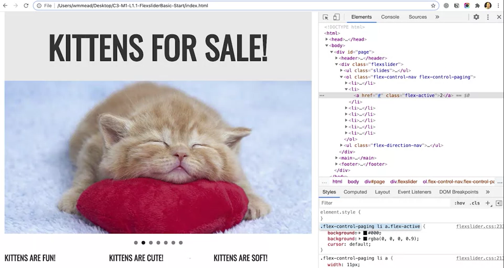

Down here, I still want to adjust these buttons a little bit. I mean,
inspect again. Maybe move my inspector to the side and it&apos;s this thing
here, dot flex-control-paging li a.flex-active. That&apos;s the class
that&apos;s changing the colors on these buttons here. That&apos;s the one that
I want to actually attach to.
<!--~~~~~~~~~~~~~~~~~~~~~~~~~~~~~~~~~~~~~~~~~~~~~~~~~~~~~~~~~~~~~~~~~~~~~~~~~~~~~~~~~~~~~~~~~~~~-->
<!--~~~~~~~~~~~~~~~~~~~~~~~~ 77.  (##) ~~~~~~~~~~~~~~~~~~~~~~~~~-->

  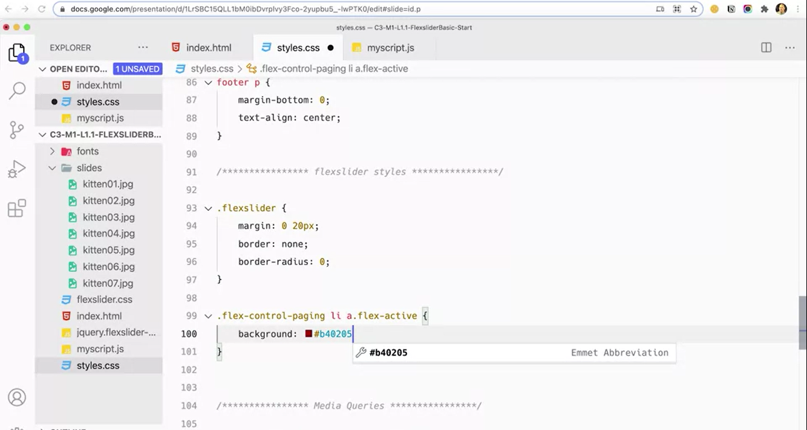

I&apos;m going to come over here, I&apos;m going to add that rule in here. If I
want a different color, what did I put on my slides over here? I put
pound B40205, make it match that. What was it? Just color or is it
background? Background: #B40205. There we go. That will give me a red
background color. Save that and come back and test it.
<!--~~~~~~~~~~~~~~~~~~~~~~~~~~~~~~~~~~~~~~~~~~~~~~~~~~~~~~~~~~~~~~~~~~~~~~~~~~~~~~~~~~~~~~~~~~~~-->
<!--~~~~~~~~~~~~~~~~~~~~~~~~ 78.  (##) ~~~~~~~~~~~~~~~~~~~~~~~~~-->

  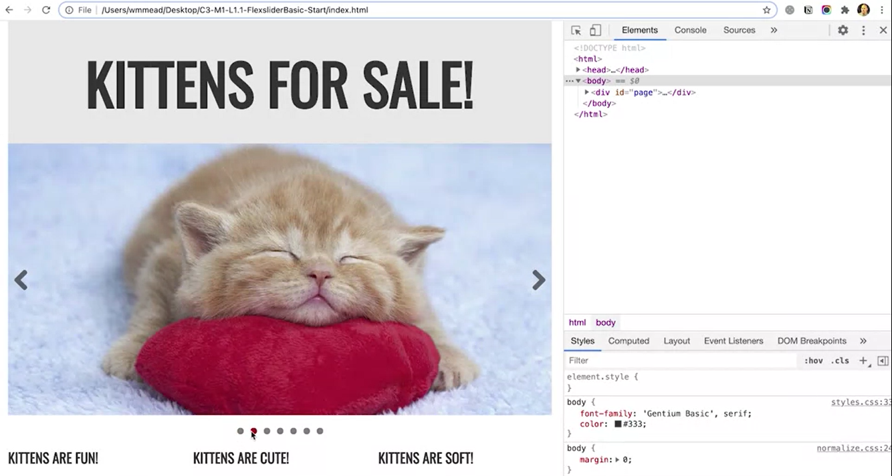

You can see my colors now overriding the color that was there before and
I can go ahead and click on these things and they all work. That&apos;s
great. You want to put styling on your own style sheet that will
override styles on the Flexslider&apos;s CSS to customize it, to make it
look the way you want it to look. Finding out what those styles are, or
just a matter of using the inspector and hunting around to see what
rules are being applied that you might want to change to get it to style
and look the way you want it to look on your page.

<h2 id="ch1-10">1.10. Additional Controls</h2>
<!--~~~~~~~~~~~~~~~~~~~~~~~~~~~~~~~~~~~~~~~~~~~~~~~~~~~~~~~~~~~~~~~~~~~~~~~~~~~~~~~~~~~~~~~~~~~~-->
<!--~~~~~~~~~~~~~~~~~~~~~~~~ 79.  (##) ~~~~~~~~~~~~~~~~~~~~~~~~~-->

  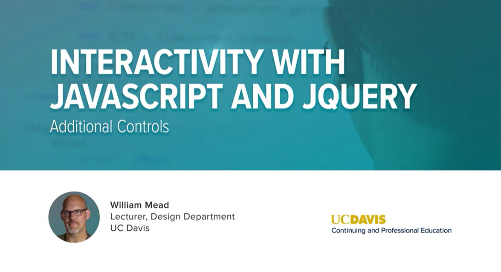

Your slider should be looking good. We&apos;ve gotten everything in place
and it&apos;s working.
<!--~~~~~~~~~~~~~~~~~~~~~~~~~~~~~~~~~~~~~~~~~~~~~~~~~~~~~~~~~~~~~~~~~~~~~~~~~~~~~~~~~~~~~~~~~~~~-->
<!--~~~~~~~~~~~~~~~~~~~~~~~ 80/81.  (##) ~~~~~~~~~~~~~~~~~~~~~~~~~-->

&nbsp;&nbsp;&nbsp;

It&apos;s functional and it looks good and we&apos;ve adjusted the CSS and all
that kind of fun stuff. That&apos;s really great. It&apos;s a lot easier to do
this with just a few lines of code, than having to write all of this
functionality ourselves, especially since you&apos;ve seen how to make a
slider. We didn&apos;t include this functionality for being able to have
these buttons down here, being able to go to slides that way. We could
have done that manually on our own, but with this plug in, it provides
it for us automatically and that&apos;s great.
<!--~~~~~~~~~~~~~~~~~~~~~~~~~~~~~~~~~~~~~~~~~~~~~~~~~~~~~~~~~~~~~~~~~~~~~~~~~~~~~~~~~~~~~~~~~~~~-->
<!--~~~~~~~~~~~~~~~~~~~~~~~ 82/83.  (##) ~~~~~~~~~~~~~~~~~~~~~~~~~-->

&nbsp;&nbsp;&nbsp;

Now, what about all these additional options that show up down here at
the bottom of the screen? There&apos;s all this stuff down here, and we can
use this to further customize the functionality of our FlexSlider.
That&apos;s really cool, but how do you do it? It&apos;s not really clear by
looking at this exactly what you need to do.
<!--~~~~~~~~~~~~~~~~~~~~~~~~~~~~~~~~~~~~~~~~~~~~~~~~~~~~~~~~~~~~~~~~~~~~~~~~~~~~~~~~~~~~~~~~~~~~-->
<!--~~~~~~~~~~~~~~~~~~~~~~~~ 84.  (##) ~~~~~~~~~~~~~~~~~~~~~~~~~-->

  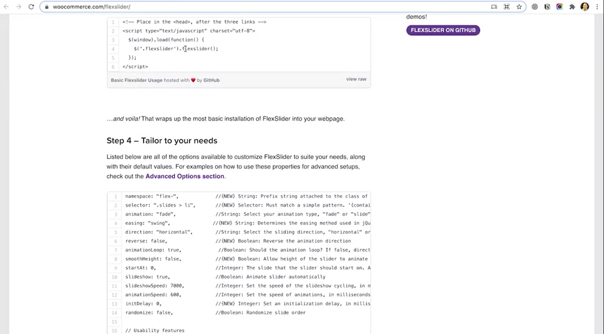

But basically, what we need to do is we need to pass options in to this
FlexSlider method here, this FlexSlider method here. We pass them in in
the form of an object because these things here are look like key value
pairs that you can pass into an object. It would be really nice if they
made it really clear on exactly how to do this here on the instructions,
but if you know some JavaScript and you&apos;re familiar with having done
this kind of thing before, you&apos;ll figure it out pretty quickly. What
can we do? Let&apos;s take a look at it.
<!--~~~~~~~~~~~~~~~~~~~~~~~~~~~~~~~~~~~~~~~~~~~~~~~~~~~~~~~~~~~~~~~~~~~~~~~~~~~~~~~~~~~~~~~~~~~~-->
<!--~~~~~~~~~~~~~~~~~~~~~~~~ 85.  (##) ~~~~~~~~~~~~~~~~~~~~~~~~~-->

  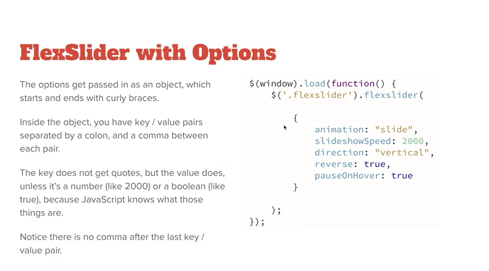

Just like we did with the custom enemy method in jQuery, where we can
pass in an object, curly brace, curly brace, and then we can pass in
these key value pairs to get the slider to do some different things.
Let&apos;s give that a try. I know we haven&apos;t really talked a lot about
objects yet, and we will get into that in more depth in a lesson coming
up. For right now, we&apos;ll just kind of go with it and get used to the
syntax because we&apos;ll see it a lot, especially with the plugins.
<!--~~~~~~~~~~~~~~~~~~~~~~~~~~~~~~~~~~~~~~~~~~~~~~~~~~~~~~~~~~~~~~~~~~~~~~~~~~~~~~~~~~~~~~~~~~~~-->
<!--~~~~~~~~~~~~~~~~~~~~~~~ 86/87.  (##) ~~~~~~~~~~~~~~~~~~~~~~~~~-->

&nbsp;&nbsp;&nbsp;

Let&apos;s come over here and inside our script file here, inside our
parentheses here, we&apos;re going to add a set of curly braces. Then inside
these curly braces, we can add different settings. What are the settings
that we can add? Well, there are these settings over here. For example,
if you wanted to do animations slide you can set it here, set your
animation fade or slide. By default, it&apos;s doing fade. Over here, when
we go from slide to slide, it&apos;s fading from slide to slide. It&apos;s doing
a fade in fade out. But if we wanted to actually do a slide, we can
change that to animation slide. You can take this, copy it, and then
come over to your script and stick this in here, and change this to
slide. Get rid of the comma, because we only have the one here. If I do
that, you&apos;ll notice over here immediately. Refresh, when I click on the
next thing, instead of fading it&apos;s sliding. Look at that, it loops
around. You don&apos;t have to do any special programming for that, it&apos;s
all built right into the plug in. You remember what a trouble that was
for us to figure out how to do manually. Well, here it&apos;s built in, so
we don&apos;t have to really even worry about that.
<!--~~~~~~~~~~~~~~~~~~~~~~~~~~~~~~~~~~~~~~~~~~~~~~~~~~~~~~~~~~~~~~~~~~~~~~~~~~~~~~~~~~~~~~~~~~~~-->
<!--~~~~~~~~~~~~~~~~~~~~~~~ 88/89.  (##) ~~~~~~~~~~~~~~~~~~~~~~~~~-->

&nbsp;&nbsp;&nbsp;

What else can we do? Over here, I had slide, you can set the speed,
slideshow speed. That&apos;s in here. Slideshows speed. Slide, comma, for
each one of these in here, you have to put a comma at the end, except
for the last one. I&apos;m not going to set it to seven seconds that would
be really long. I&apos;m going to set it to two seconds. That will tell us
how quickly it&apos;s going to slide from slide to slide automatically. One
two, one two, there we go. Now it&apos;s going rather quickly, that&apos;s
great.
<!--~~~~~~~~~~~~~~~~~~~~~~~~~~~~~~~~~~~~~~~~~~~~~~~~~~~~~~~~~~~~~~~~~~~~~~~~~~~~~~~~~~~~~~~~~~~~-->
<!--~~~~~~~~~~~~~~~~~~~~~~~ 90/91.  (##) ~~~~~~~~~~~~~~~~~~~~~~~~~-->

&nbsp;&nbsp;&nbsp;

What else can we do? We could do direction vertical, if you wanted to
just slide up and down instead, we could do that. Comma, direction,
vertical. This has to go in quotes because it&apos;s a word that JavaScript
doesn&apos;t know, but it knows that one there. It knows what 2,000 is. All
right, now if you do this, after two seconds, it&apos;s going to go
vertical.
<!--~~~~~~~~~~~~~~~~~~~~~~~~~~~~~~~~~~~~~~~~~~~~~~~~~~~~~~~~~~~~~~~~~~~~~~~~~~~~~~~~~~~~~~~~~~~~-->
<!--~~~~~~~~~~~~~~~~~~~~~~~~ 92.  (##) ~~~~~~~~~~~~~~~~~~~~~~~~~-->

  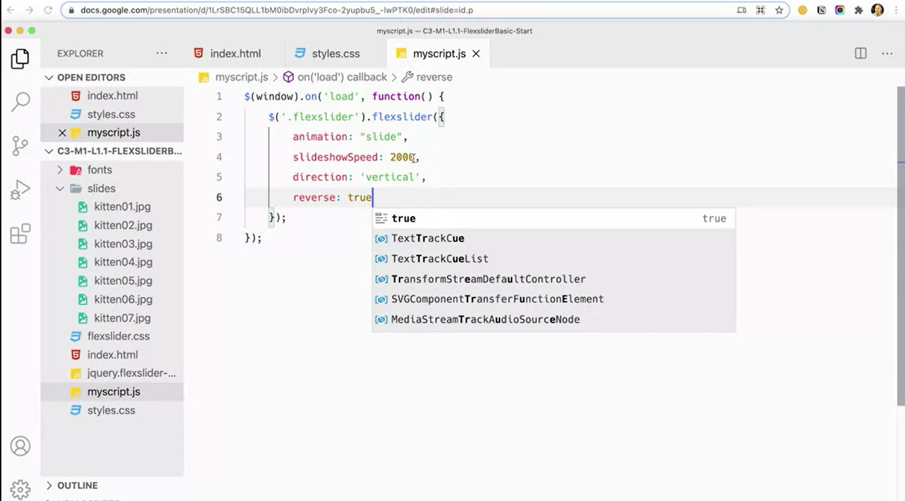

We could do reverse true, so we&apos;ll go from top to bottom instead of
from bottom to top. Reverse true. True is a word that JavaScript knows.
Now it&apos;s going from the top to the bottom.
<!--~~~~~~~~~~~~~~~~~~~~~~~~~~~~~~~~~~~~~~~~~~~~~~~~~~~~~~~~~~~~~~~~~~~~~~~~~~~~~~~~~~~~~~~~~~~~-->
<!--~~~~~~~~~~~~~~~~~~~~~~~~ 93.  (##) ~~~~~~~~~~~~~~~~~~~~~~~~~-->

  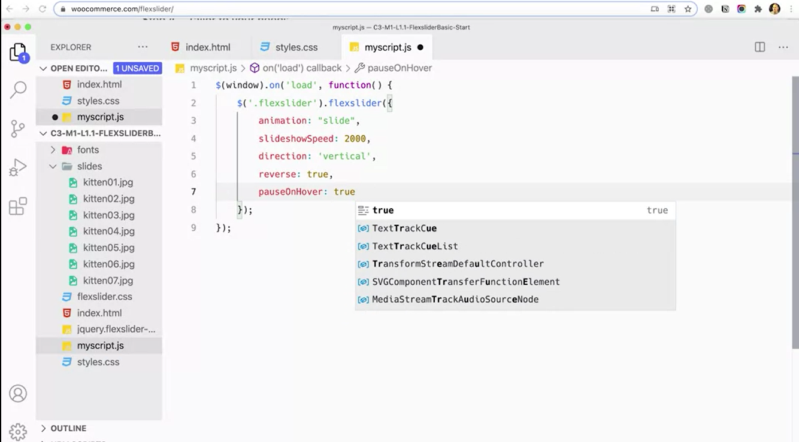

Then finally, another one we could do is pause on hover true. Which is
in here, you can find it in here somewhere pause on hover. There it is.
We had set this, this is a feature that we had tried to build into our
own version, that we did build into our own version. That&apos;s true, and
when you&apos;re hovering over the slides, they&apos;ll stop.

It&apos;s very nice interface on it, right? Now every two seconds, it&apos;s
going to go unless I hover over the slides, in which case it&apos;s going to
stop. It won&apos;t because I want to enjoy these kittens, I want to look at
them for a while, two seconds isn&apos;t really long enough, so I can really
enjoy them and look at them for as long as I want. Then, when I stop
hovering on it, and I&apos;ll wait two seconds and it&apos;ll start going again.
That functionality is built in as well. That&apos;s great. It gives us a lot
of opportunity to build in a lot of extra functionality through these
additional features that are here. There&apos;s a lot of them. Manual
controls, controls container. You can do all kinds of things. There are
arrows. You could swap those arrows out for something else, so that it
doesn&apos;t look like every Website you go to has FlexSlider on it. It
could look the same, because they all have the same arrows here, left
and right arrows. We can get rid of those and do something else that
would be kind of interesting and fun.

<h2 id="ch1-11">1.11. Advanced FlexSlider</h2>
<!--~~~~~~~~~~~~~~~~~~~~~~~~~~~~~~~~~~~~~~~~~~~~~~~~~~~~~~~~~~~~~~~~~~~~~~~~~~~~~~~~~~~~~~~~~~~~-->
<!--~~~~~~~~~~~~~~~~~~~~~~~~ 94.  (##) ~~~~~~~~~~~~~~~~~~~~~~~~~-->

  

Now that you&apos;ve created the basic FlexSlider, with some advanced
options, we can really do some different things with this FlexSlider.
<!--~~~~~~~~~~~~~~~~~~~~~~~~~~~~~~~~~~~~~~~~~~~~~~~~~~~~~~~~~~~~~~~~~~~~~~~~~~~~~~~~~~~~~~~~~~~~-->
<!--~~~~~~~~~~~~~~~~~~~~~~~ 95/96.  (##) ~~~~~~~~~~~~~~~~~~~~~~~~~-->

&nbsp;&nbsp;&nbsp;

To do that, it&apos;s nice to keep the basic version working the way it is
working, so that you have a version of that if you want to refer back to
it. If you want to, you can duplicate that folder and create a new
folder and change the name to something like KittensAdvanced, or
something like that. You can see over here; I have actually changed mine
here. I don&apos;t need that folder anymore, close that one, but I just
duplicated and called it advancedSlider. This set of files is currently
exactly the same as that set of files. But I&apos;ve made a copy so that I
have this version if I want to refer back to it, but I&apos;m essentially
done with it. Now I&apos;m only going to work on the advancedSlider version
here. I have that version; these files open in my code editor.
<!--~~~~~~~~~~~~~~~~~~~~~~~~~~~~~~~~~~~~~~~~~~~~~~~~~~~~~~~~~~~~~~~~~~~~~~~~~~~~~~~~~~~~~~~~~~~~-->
<!--~~~~~~~~~~~~~~~~~~~~~~~ 97/98.  (##) ~~~~~~~~~~~~~~~~~~~~~~~~~-->

&nbsp;&nbsp;&nbsp;

I&apos;ve also switched this over here so that it&apos;s pointing to my
advancedSlider folder here (see top of image), so that I know that I&apos;m
working with the right set of files. Make sure you&apos;re working with the
right set of files in your browser. Make sure you&apos;ve got the right set
of files in your code editor. Over here you can see it says
advancedSlider there, so this is my advanced slider files.
<!--~~~~~~~~~~~~~~~~~~~~~~~~~~~~~~~~~~~~~~~~~~~~~~~~~~~~~~~~~~~~~~~~~~~~~~~~~~~~~~~~~~~~~~~~~~~~-->
<!--~~~~~~~~~~~~~~~~~~~~~~~~ 99.  (##) ~~~~~~~~~~~~~~~~~~~~~~~~~-->

  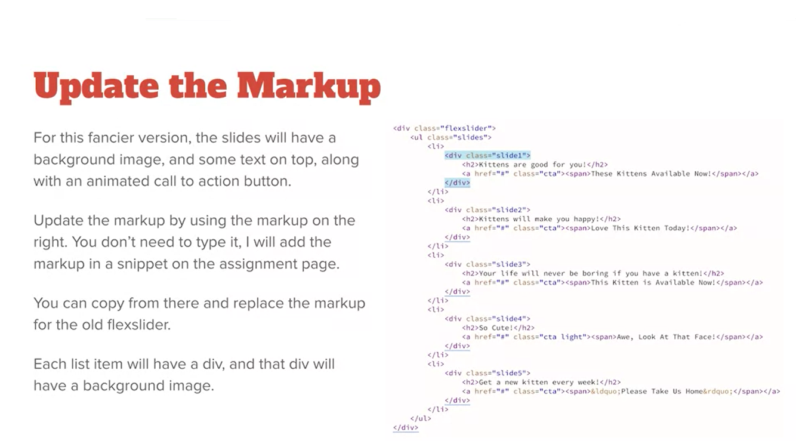

Great. Now that I&apos;ve got that into place and I&apos;m ready to really do
some different things with this FlexSlider, the first thing I want to do
is, I want to have a fancier version where, I actually have some content
on top of each slide. Like we did with the JavaScript version of the
slider, where we had a div on top with the heading and a paragraph in
there. Then these slides, the actual pictures, were background images on
the slides. I&apos;m also going to have an animated Call the Action button,
that will drop down and make it really clear that, what you should do is
adopt one of these kittens on this lovely Kitten page. I need to update
the markup to go along with this, for my FlexSlider. I will provide some
snippets with this lesson that you can open and they look like this.
<!--~~~~~~~~~~~~~~~~~~~~~~~~~~~~~~~~~~~~~~~~~~~~~~~~~~~~~~~~~~~~~~~~~~~~~~~~~~~~~~~~~~~~~~~~~~~~-->
<!--~~~~~~~~~~~~~~~~~~~~~~~~~ 100.   (xx) ~~~~~~~~~~~~~~~~~~~~~~~~~~-->

  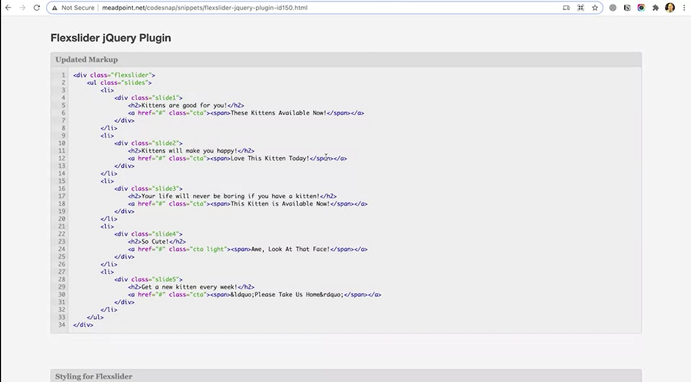

There are some snippets here and so I&apos;m basically going to replace my
slider with this content here. You can type it all out if you wanted to,
instead of just putting the pictures in.
<!--~~~~~~~~~~~~~~~~~~~~~~~~~~~~~~~~~~~~~~~~~~~~~~~~~~~~~~~~~~~~~~~~~~~~~~~~~~~~~~~~~~~~~~~~~~~~-->
<!--~~~~~~~~~~~~~~~~~~~~~~~~~ 101.   (xx) ~~~~~~~~~~~~~~~~~~~~~~~~~~-->

  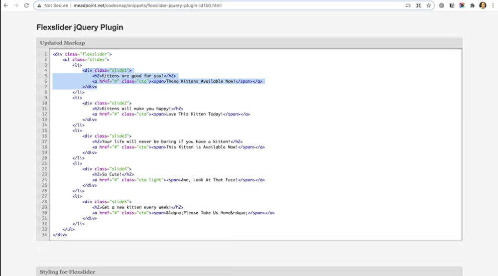

I have a div, with an h2. The div has a class of slide 1, slide 2, slide
3, so on and so forth. Then I have the h1 and the h2 and I have an
anchor tag with the class of CTA for 'Call to Action'. A spin around the
text, which I explain what that&apos;s going to do in a few minutes, that
says these kittens are available now. This is going to be like a 'Call
to Action' button that you can click on to access these kittens. It&apos;s
not really going anywhere because the link is just set to a pound sign.
But if this is a real website, that could be a link to a page where you
could actually adopt this kitten or something like that, that will be
fun. But rather than make you type all of this stuff out, which is
tedious, you can actually come to the snippet page and just copy it.
<!--~~~~~~~~~~~~~~~~~~~~~~~~~~~~~~~~~~~~~~~~~~~~~~~~~~~~~~~~~~~~~~~~~~~~~~~~~~~~~~~~~~~~~~~~~~~~-->
<!--~~~~~~~~~~~~~~~~~~~~~~~ 102/103.  (##) ~~~~~~~~~~~~~~~~~~~~~~~~~-->

&nbsp;&nbsp;&nbsp;

Then come back to your project and on your index file, in place of the
slider down here, this FlexSlider, we&apos;re just going to paste this one
in instead. Paste that in and it&apos;s still div class backsliders, still
your old class slides. All that&apos;s changed is the list items in here.
These divs have a class of slide1, slide 2, slide 3, slide 4 and slide
5. I dump slide 6 and 7 for now, probably five kittens is enough for
this slider and that&apos;s great. That gets us started and on our way with
creating our fancier version of our FlexSlider. In the next lesson,
we&apos;ll start looking at what we need to do to adjust the styling for
this.

<h2 id="ch1-12">1.12. Additional Styling (5:47)</h2>
<!--~~~~~~~~~~~~~~~~~~~~~~~~~~~~~~~~~~~~~~~~~~~~~~~~~~~~~~~~~~~~~~~~~~~~~~~~~~~~~~~~~~~~~~~~~~~~-->
<!--~~~~~~~~~~~~~~~~~~~~~~~~~~~ 104. additional styling (1.12) (56) ~~~~~~~~~~~~~~~~~~~~~~~~~~~~-->

  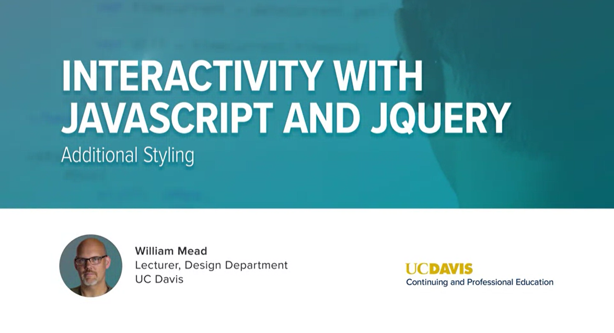

In the last module, we updated the markup for our fancy version of the
slider, and now we need to do some updating for the actual CSS for the
display of the slides.
<!--~~~~~~~~~~~~~~~~~~~~~~~~~~~~~~~~~~~~~~~~~~~~~~~~~~~~~~~~~~~~~~~~~~~~~~~~~~~~~~~~~~~~~~~~~~~~-->
<!--~~~~~~~~~~~~~~~~~~~~~~~~~~ 105/106. styling for flexslider (56) ~~~~~~~~~~~~~~~~~~~~~~~~~~~~-->

&nbsp;&nbsp;&nbsp;

So, I&apos;m going to come back over here to my snippets and I&apos;m just going
to copy these three rules here. And I&apos;m going to come over and paste
them into my CSS file over here, styles.css. And I&apos;m going to stick
them just in my section with the flex slider stuff here. It doesn&apos;t
really matter where they go, I&apos;m going to put them here.
<!--~~~~~~~~~~~~~~~~~~~~~~~~~~~~~~~~~~~~~~~~~~~~~~~~~~~~~~~~~~~~~~~~~~~~~~~~~~~~~~~~~~~~~~~~~~~~-->
<!--~~~~~~~~~~~~~~~~~~~~~~ 107. styles.css: slide1-slide5 background (57) ~~~~~~~~~~~~~~~~~~~~~~-->

  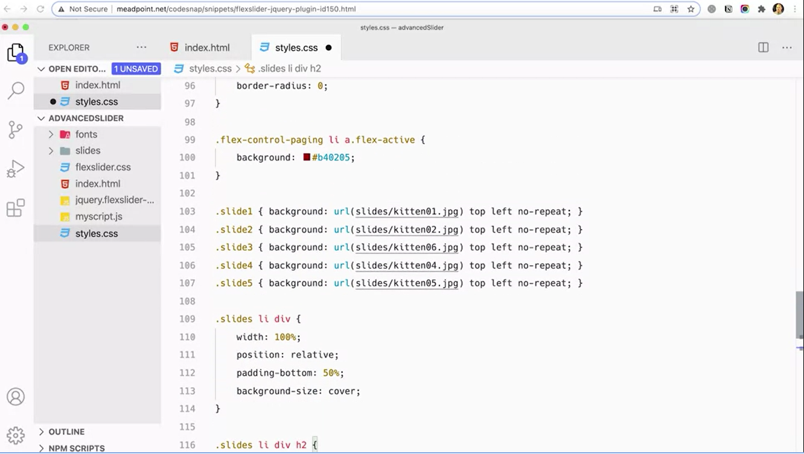

Now, this is really important, the slides the .slide1, .slide2, .slide3,
that corresponds to these divs, div class slide3, slide4. They&apos;re going
to get a background image. Each one is going to get a different
background image, the background image is positioned at the top left and
said not to repeat.

One thing that&apos;s important about this particular slider that you have
to remember is that it&apos;s flexible, that&apos;s why it&apos;s called flex
slider. And it will work for responsive websites and you can make these
slides bigger or smaller. So, we have to pay attention to the
proportions of the slides, from their horizontal width to their vertical
height. What is the proportion there? We want to keep the slides in
proportion so that if they resize on the screen, they resize
proportionally. And keeping track of proportions is a little bit tricky
in CSS currently, there&apos;s some features coming to CSS that will make it
easier in the long run, but for right now it&apos;s a little clunky and
unfortunate.
<!--~~~~~~~~~~~~~~~~~~~~~~~~~~~~~~~~~~~~~~~~~~~~~~~~~~~~~~~~~~~~~~~~~~~~~~~~~~~~~~~~~~~~~~~~~~~~-->
<!--~~~~~~~~~~~~~~~~~~~~~~~~~~~~~ 108. set position of slides (58) ~~~~~~~~~~~~~~~~~~~~~~~~~~~~~-->

  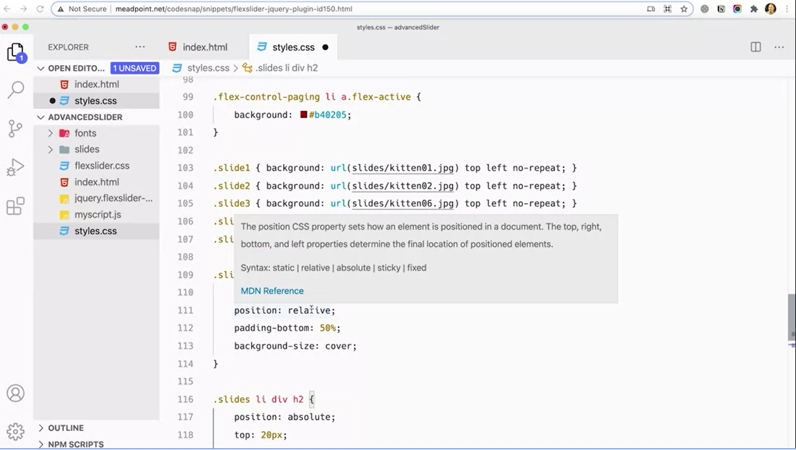

But basically, what I&apos;ve done here is I&apos;ve said the div that&apos;s inside
these list items, I&apos;m going to make it a width 100% position relative
because I&apos;m going to absolutely position some stuff inside of it. And I
set the padding on the bottom to 50%, and it could be either padding top
or padding bottom and background size cover. And essentially the height
of these, and I probably should add in here, height 0. Height 0, add
that in as well. Because the height is 0 but the padding on the bottom
is 50%. These images happen to be twice as wide as they are tall. And
that&apos;s why the padding is bottom 50%. In this case the padding is
relative to the width. So as wide as these things are, they will always
be 50% as high. And these images are twice as wide as they are tall. So
that actually works for these particular images.
<!--~~~~~~~~~~~~~~~~~~~~~~~~~~~~~~~~~~~~~~~~~~~~~~~~~~~~~~~~~~~~~~~~~~~~~~~~~~~~~~~~~~~~~~~~~~~~-->
<!--~~~~~~~~~~~~~~~~~~~~~~~~~ 109. kitten01.jpg image dimensions (59) ~~~~~~~~~~~~~~~~~~~~~~~~~~-->

  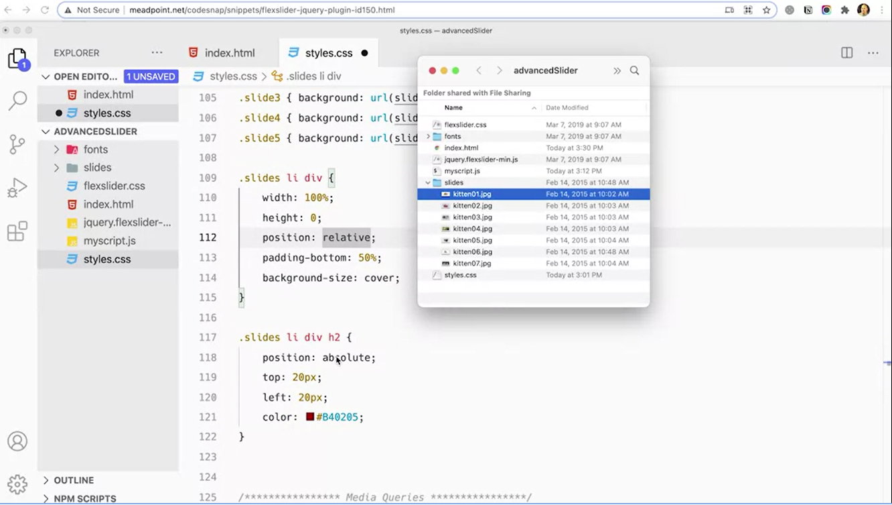

If I come back to the finder and look at these images, if I do CMD+I,
you can see here that the dimensions of this image is 960 by 480, it&apos;s
twice as wide as it is tall. But what if that were not the case?

What if you had images that had a different ratio? You want to make sure
all your images are the same size, but they might have a different ratio
of height to width, and how do you find out what that is? One easy way
of doing it is to open the image in Photoshop, if you have access to
Photoshop. Or if you don&apos;t have access to Photoshop, you could use
another image editor like GIMP is a good image editor that&apos;s free for
Mac or Windows or Linux. But I can go in and find out here what this
image size is. And if I want to find out what the ratio is, if I change
this width to 100, notice that the height is 50. So that means the
height is 50% of my width. Which means I need to set that margin top or
margin bottom to 50%. Setting it to 100 doesn&apos;t give you a lot of
resolution, but if you set it to 1000 it would be 50.0%, in this case
it&apos;s exactly 50%. But if you had a different ratio for images, you
might have 67.25 or something like that for the height to the width
ratio. So that&apos;s a good place to find out what that ratio is. So that
you would set the ratio By Photoshop. And you can set the width to
whatever the height is in relation to the width. And then I&apos;ve got
background size cover.
<!--~~~~~~~~~~~~~~~~~~~~~~~~~~~~~~~~~~~~~~~~~~~~~~~~~~~~~~~~~~~~~~~~~~~~~~~~~~~~~~~~~~~~~~~~~~~~-->
<!--~~~~~~~~~~~~~~~~~~~~~~~~ 110. styling the cta 'call to action' (60) ~~~~~~~~~~~~~~~~~~~~~~~~-->

  

Then down here I&apos;m setting the H2 to position absolute top 20 pixels,
left 20 pixels, then I&apos;m setting the color for that. So that&apos;s not too
fancy. But that&apos;s an important thing to understand with the way that
this is working.
<!--~~~~~~~~~~~~~~~~~~~~~~~~~~~~~~~~~~~~~~~~~~~~~~~~~~~~~~~~~~~~~~~~~~~~~~~~~~~~~~~~~~~~~~~~~~~~-->
<!--~~~~~~~~~~~~~~~~~~~~~~~~ 111. styling the cta 'call to action' (60) ~~~~~~~~~~~~~~~~~~~~~~~~-->

  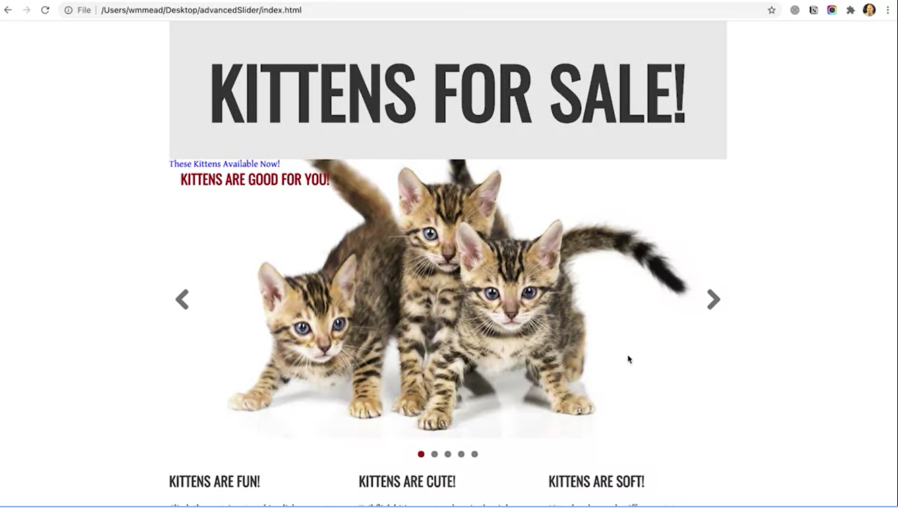

The next thing we need is the styling for the actual call to action
buttons that are going to show up on the slides. If I save this like
this, you&apos;ll see if I come back and test it, it&apos;s fine, but the
call-to-action buttons won&apos;t work very well here. So, there&apos;s my
call-to-action button there and I need to fix that, but you can see that
the background images have come in. These images are now in the
background of my slide, rather than in the foreground. And the
foreground is an H2 that&apos;s been absolutely positioned here. But now I
need to style this call to action, and I&apos;ll do that in the next lesson.

<h2 id="ch1-13">1.13. Styling the CTA 'Call To Action'</h2>
<!--~~~~~~~~~~~~~~~~~~~~~~~~~~~~~~~~~~~~~~~~~~~~~~~~~~~~~~~~~~~~~~~~~~~~~~~~~~~~~~~~~~~~~~~~~~~~-->
<!--~~~~~~~~~~~~~~~~~~~~~~~~ 112. styling the cta 'call to action' (61) ~~~~~~~~~~~~~~~~~~~~~~~~-->

  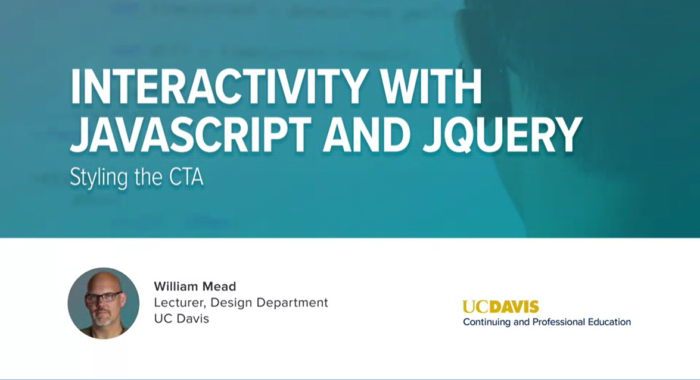

Now we&apos;re down to styling the call to action so that it displays
properly on the page, and I have a rule for the dot CTA anchor tags,
there&apos;s a lot of stuff in here, but you&apos;ll see why as we move forward
and do this, but let&apos;s go ahead and add this rule to our style sheet.
<!--~~~~~~~~~~~~~~~~~~~~~~~~~~~~~~~~~~~~~~~~~~~~~~~~~~~~~~~~~~~~~~~~~~~~~~~~~~~~~~~~~~~~~~~~~~~~-->
<!--~~~~~~~~~~~~~~~~~~~~~~~~~~~ 113. styling the call to action (61) ~~~~~~~~~~~~~~~~~~~~~~~~~~~-->

  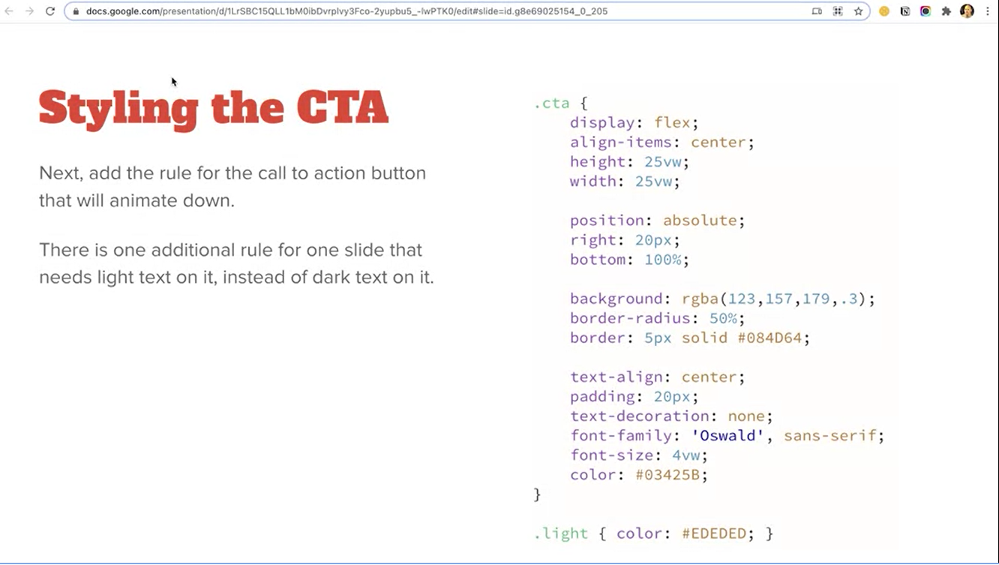

<!--~~~~~~~~~~~~~~~~~~~~~~~~~~~~~~~~~~~~~~~~~~~~~~~~~~~~~~~~~~~~~~~~~~~~~~~~~~~~~~~~~~~~~~~~~~~~-->
<!--~~~~~~~~~~~~~~~~~~~~~~~~~ 114/115. styling the call to action (62) ~~~~~~~~~~~~~~~~~~~~~~~~~-->

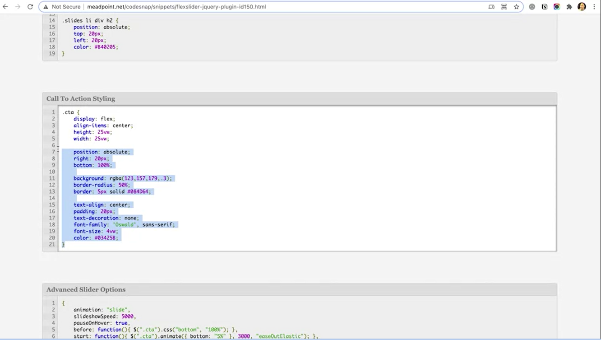
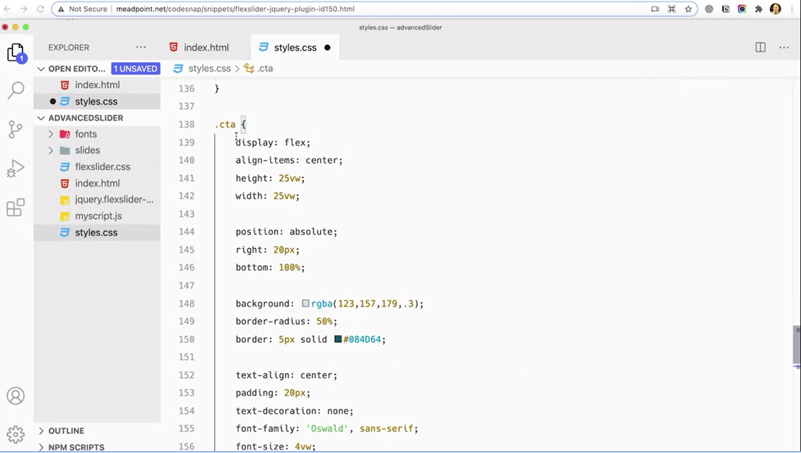

If you come over here, you can see that I have it here, it&apos;s a long one
so, I made it, so you don&apos;t have to tighten it, you can just copy and
paste it. I&apos;ll explain more about exactly why all these decorations are
in here, but for right now, let&apos;s just added in over here.

A few things to look at, it&apos;s set to display flex for the call to
action, and that&apos;s making this anchor tag display flex, so that this
element class of the span in here can get positioned in the vertical
center. By setting that to display flex and align-item center, that will
allow me to put that text in the vertical center of these called
actions, these called actions are going to be round buttons, and I want
the text to be in the vertical and horizontal center, so that allows us
to do that. I&apos;m just setting the height and the width to 25vw, which is
viewport width, 25 percent of the viewport width, so these buttons will
scale up and down with the size of the window, and you&apos;ll see that this
is actually too large for the desktop, we will put in a rule down in the
media queries to fix that in a minute.

I&apos;m also setting position absolute on these, because they&apos;re going to
be absolute positioned from the right, and then bottom 100 percent means
they&apos;re going to be positioned initially off the top of the screen.
I&apos;m setting bottom 100 percent that&apos;s going to push the bottoms of
these up to 100 percent, the height of that parent element, and that&apos;s
going to put them all the way off the top of the screen.

When we come to the slide, they&apos;re going to animate down into the
screen, you&apos;ll see in a minute as we finish this up. I&apos;m setting a
background color, border radius 50 percent is what makes them round,
I&apos;m putting a border on them with the color, and then text-align
center, puts the text in the horizontal center, some padding,
text-decoration, none gets rid of the underlying setting, the font
family, the font size, 4vw is four percent of the viewport width, so
again, the font it&apos;s going to resize based on how wide the screen is,
and then also the color for the text. That&apos;s a lot of stuff.
<!--~~~~~~~~~~~~~~~~~~~~~~~~~~~~~~~~~~~~~~~~~~~~~~~~~~~~~~~~~~~~~~~~~~~~~~~~~~~~~~~~~~~~~~~~~~~~-->
<!--~~~~~~~~~~~~~~~~~~~~~~~~~~~~ 116/117. define class: light (63) ~~~~~~~~~~~~~~~~~~~~~~~~~~~~~-->

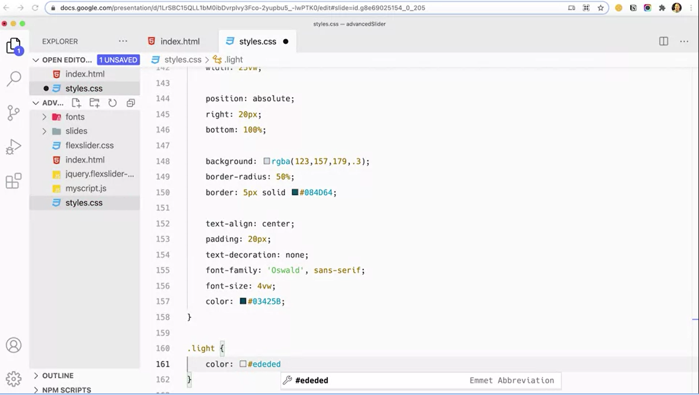
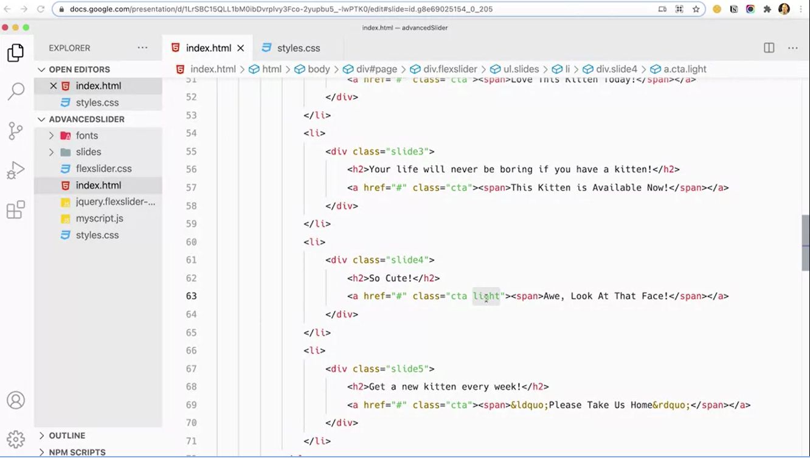

We&apos;re going to do one more rule in here for dot light (.light), and
I&apos;m setting a color in here, color, and I think I set it to, where did
I set it to #ededed. The reason for that, it&apos;s a light gray, one of the
slides is dark, so over here, I have a class of light on slide 4.
<!--~~~~~~~~~~~~~~~~~~~~~~~~~~~~~~~~~~~~~~~~~~~~~~~~~~~~~~~~~~~~~~~~~~~~~~~~~~~~~~~~~~~~~~~~~~~~-->
<!--~~~~~~~~~~~~~~~~~~~~~~~~~ 118. styles.css: background slide (63) ~~~~~~~~~~~~~~~~~~~~~~~~~~~-->

  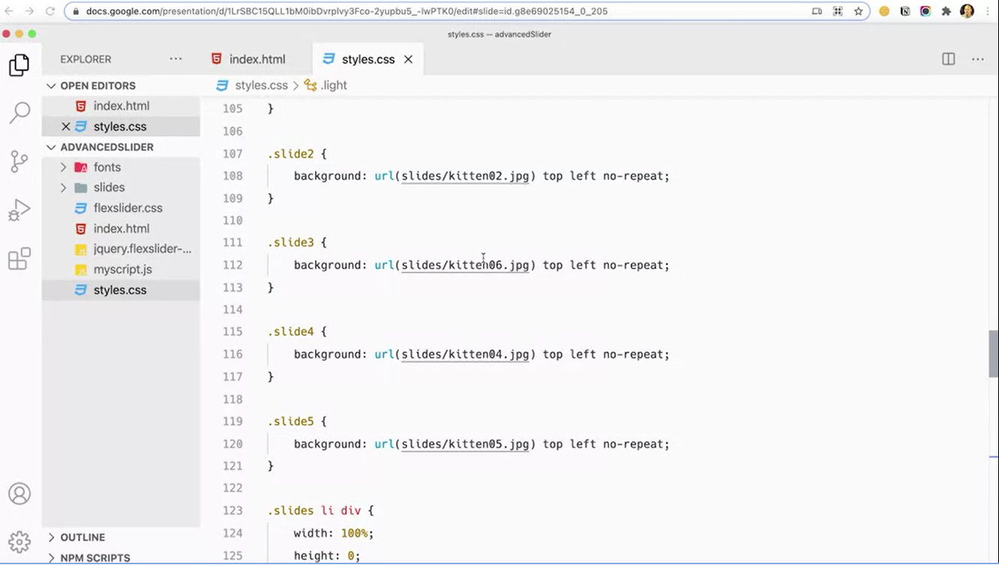

You may have also wondered why on one of the slides I went up here, I
went kitten 2 to kitten 6, and then four, and then five. Kitten 3, the
colors on that one just don&apos;t work well with the colors for the text,
so I swapped it to one of the other ones.

But for number 4 here, I wanted to make this text light, so, I put a
different color in there and a different class for that one, that&apos;s all
we need there for that, so that&apos;s really good and should make sense in
our work.
<!--~~~~~~~~~~~~~~~~~~~~~~~~~~~~~~~~~~~~~~~~~~~~~~~~~~~~~~~~~~~~~~~~~~~~~~~~~~~~~~~~~~~~~~~~~~~~-->
<!--~~~~~~~~~~~~~~~~~~~~~~~~~~ 119. resize call to action button (64) ~~~~~~~~~~~~~~~~~~~~~~~~~~-->

  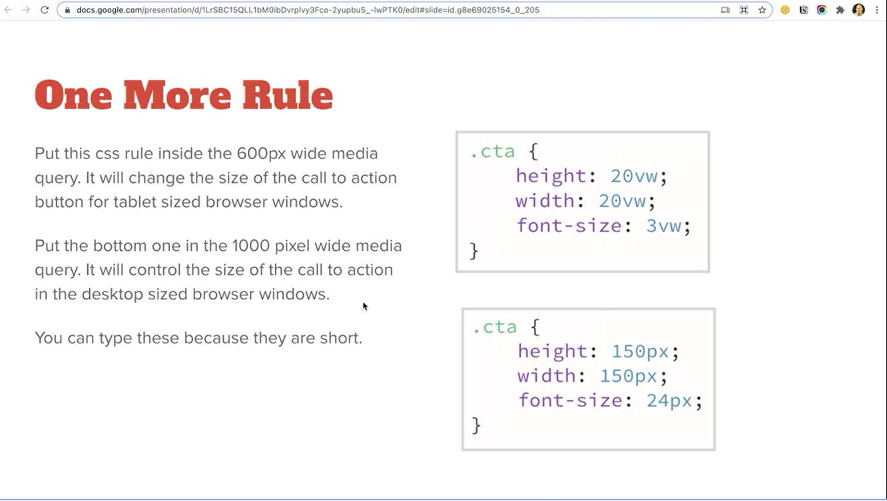

We need a couple more rules that are going to resize these elements for
desktop and for mobile, so we need to add these rules into the media
queries at the bottom of the style sheet (styles.css), and we&apos;re just
setting height, width, and font size.
<!--~~~~~~~~~~~~~~~~~~~~~~~~~~~~~~~~~~~~~~~~~~~~~~~~~~~~~~~~~~~~~~~~~~~~~~~~~~~~~~~~~~~~~~~~~~~~-->
<!--~~~~~~~~~~~~~~~~~~~~~~~ 120/121. tablet-sized min-width: 600px (64) ~~~~~~~~~~~~~~~~~~~~~~~~-->

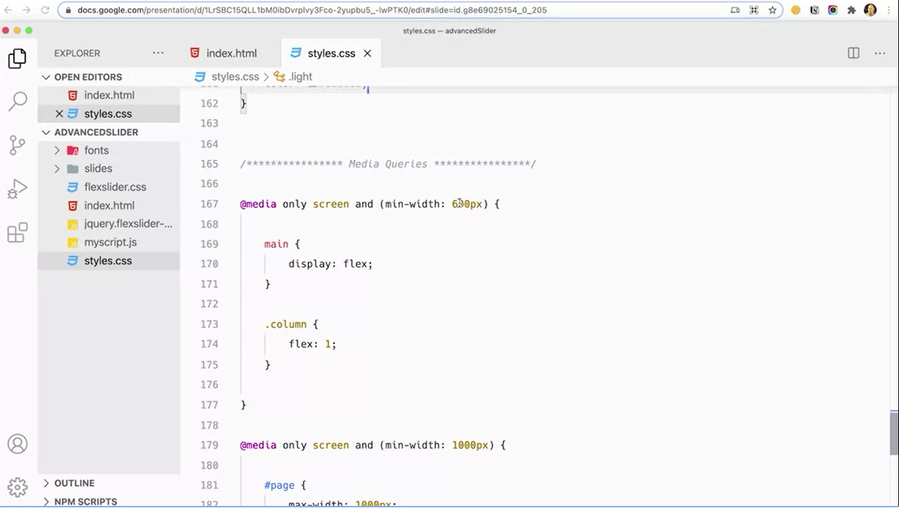
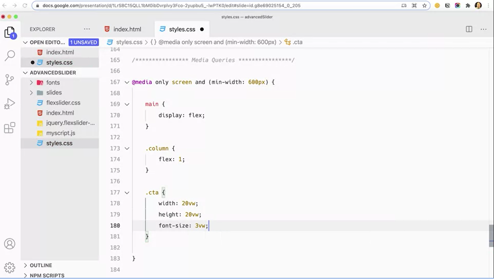

For the tablet-sized versions of the site, which is, screens that are
600 pixels and wider, I&apos;m just going to set dot CTA with 20vw instead
of 25, and height, same height, height 20vw. Because up here, it&apos;s
setting it to 25, and that&apos;s going to get too large as my screen gets
larger, so I&apos;m going to just shrink it down just a little bit there,
and then I&apos;m setting the font size to a little bit smaller, I think is
not what it was, yes, 3vw instead of 4vw, it&apos;s 3vw, and so bringing the
font size down a little bit, 3vw.
<!--~~~~~~~~~~~~~~~~~~~~~~~~~~~~~~~~~~~~~~~~~~~~~~~~~~~~~~~~~~~~~~~~~~~~~~~~~~~~~~~~~~~~~~~~~~~~-->
<!--~~~~~~~~~~~~~~~~~~~~~~~ 122/123. desktop with min-width: 1000px (65) ~~~~~~~~~~~~~~~~~~~~~~~-->

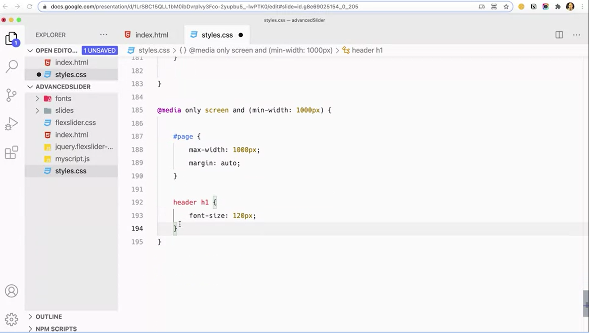
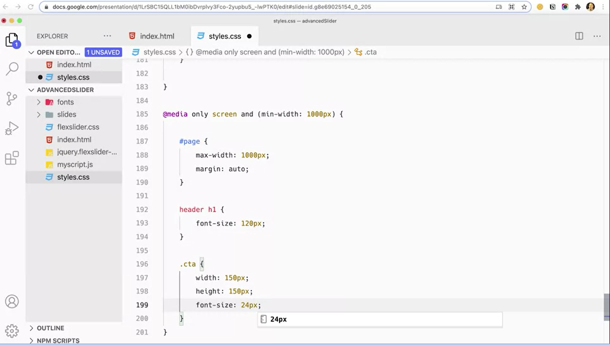

Then, when we get to the full-screen size for desktop, I need this
again, and I&apos;m just going to set it to a maximum size, because at this
point the screen isn't going to be flexible anymore, so I want these to
be set to a specific size, 150px, so it&apos;s not going to be flexible
anymore, because if, this size or wider, it&apos;s always going to be this
size, 150px. Font-size to 24 pixels.
<!--~~~~~~~~~~~~~~~~~~~~~~~~~~~~~~~~~~~~~~~~~~~~~~~~~~~~~~~~~~~~~~~~~~~~~~~~~~~~~~~~~~~~~~~~~~~~-->
<!--~~~~~~~~~~~~~~~~~~~~~~~~~~~ 124. kittens for sale example (65) ~~~~~~~~~~~~~~~~~~~~~~~~~~~~~-->

  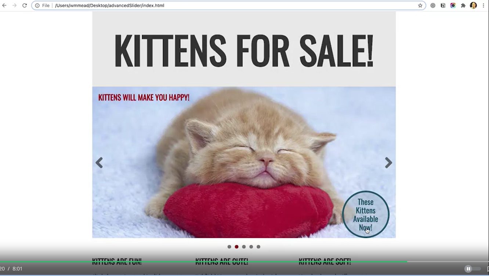

That gets all of the styling in place for these, and if we go back and
review the page, you&apos;ll see that the call to action isn&apos;t on the
screen at all, it&apos;s going to be up here, I actually noticed down here
at bottom 100 percent, so it is showing up. But this is the way they&apos;re
going to look in end here, is round like this.
<!--~~~~~~~~~~~~~~~~~~~~~~~~~~~~~~~~~~~~~~~~~~~~~~~~~~~~~~~~~~~~~~~~~~~~~~~~~~~~~~~~~~~~~~~~~~~~-->
<!--~~~~~~~~~~~~~~~~~~~~~~~~ 125. example: kittens for sale! (66) ~~~~~~~~~~~~~~~~~~~~~~~~~-->

  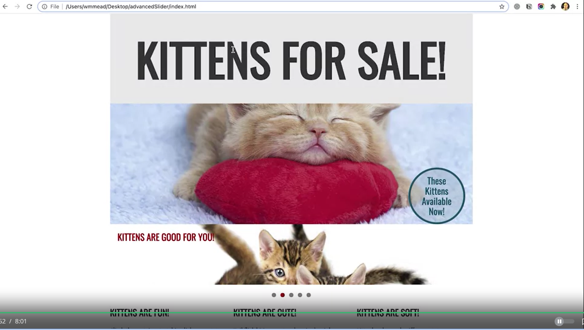

If you go to number 4, slide 4, that one should be picking up the light
class, and I don&apos;t know why it&apos;s not now. You know what, I think I put
it on the wrong one. Let&apos;s fix that. Over here. Cut it from there and
stick it on this one. That seems like it should be the right one. It&apos;s
so cute, it&apos;s that one. I think they&apos;re just #ededed, it should be
right. It may need to be refreshed properly, but that&apos;s okay. Great, so
you got that all in place. The last thing we need to do is get this
animation to work.

<h3>PDF of Presentation</h3>

Here is a PDF of the presentation slides used in the lessons for this
section: **jQuery Plugins and FlexSlider**.

<ul>
  <li><a href="https://github.com/bbauska/UC-Davis-Inter-jQuery/blob/main/pdfs/1.13.FlexSlider.pdf" 
    target="_blank" rel="noopener noreferrer">1.13.FlexSlider.pdf</a></li>
</ul>

<https://github.com/bbauska/UC-Davis-Inter-jQuery/blob/main/pdfs/1.13.FlexSlider.pdf>

<h2 id="ch2-01">2.01 Module 2 Intro (0:38)</h2>
<!--~~~~~~~~~~~~~~~~~~~~~~~~~~~~~~~~~~~~~~~~~~~~~~~~~~~~~~~~~~~~~~~~~~~~~~~~~~~~~~~~~~~~~~~~~~~~-->
<!--~~~~~~~~~~~~~~~~~~~~~~~~ 126. module 2 intro - scroll effects (67) ~~~~~~~~~~~~~~~~~~~~~~~~~-->

  

Hello and welcome to our second module. In this lesson, we will look at
scroll effects. Scroll effects are very popular these days and you see
them a lot around the Web. Plus, we&apos;ll work on a project that will
allow you to test your skills by bringing together, a lot of the scripts
we&apos;ve created so far, all together in one page. And that&apos;s a great way
to test your skills, and see how you&apos;re doing with this. Let&apos;s dive
in, break out our code editors and our web browsers, and get started on
this module.

<h2 id="ch2-02">2.02. Introduction to Smooth Scroll with jQuery (4:15)</h2>
<!--~~~~~~~~~~~~~~~~~~~~~~~~~~~~~~~~~~~~~~~~~~~~~~~~~~~~~~~~~~~~~~~~~~~~~~~~~~~~~~~~~~~~~~~~~~~~-->
<!--~~~~~~~~~~~~~~~~~~~~~~ 127. intro to smooth scroll with jquery (67) ~~~~~~~~~~~~~~~~~~~~~~~~-->

  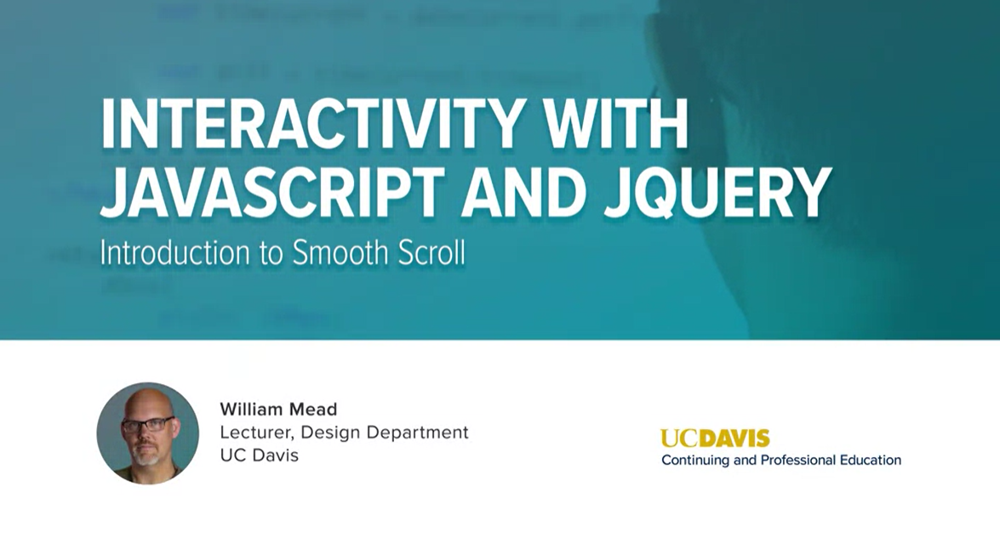

In the first part of this lesson, we&apos;re going to use jQuery to make a
smooth scroll script so that when you click a link at the top of the
page, it does a smooth scrolling action further down the page.
<!--~~~~~~~~~~~~~~~~~~~~~~~~~~~~~~~~~~~~~~~~~~~~~~~~~~~~~~~~~~~~~~~~~~~~~~~~~~~~~~~~~~~~~~~~~~~~-->
<!--~~~~~~~~~~~~~~~~~~~~~~~~ 128/129. section one and two example (68) ~~~~~~~~~~~~~~~~~~~~~~~~~-->

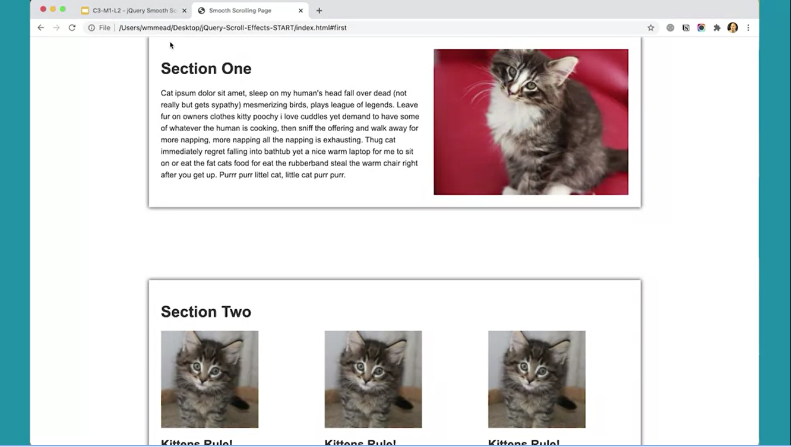
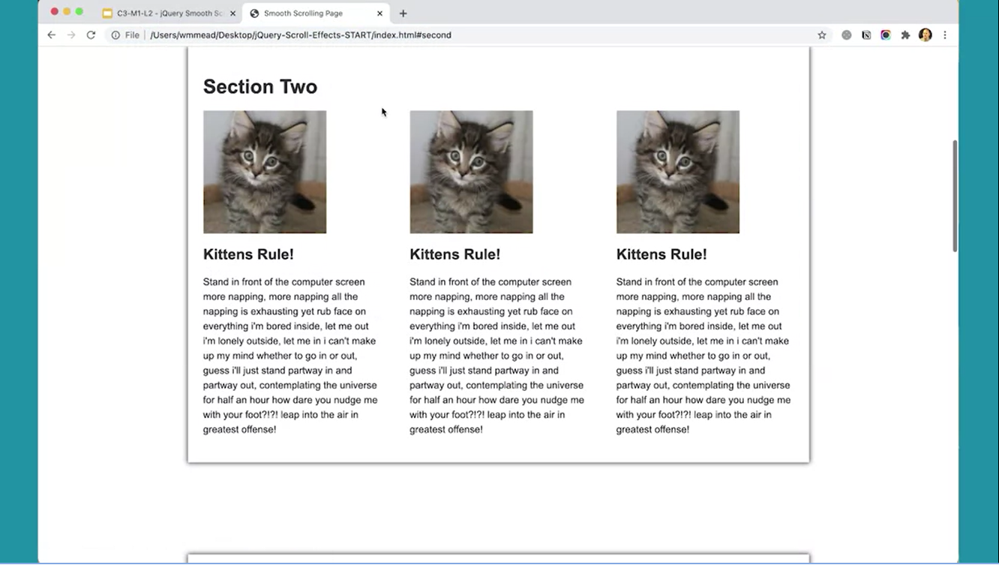

And I have an example page that you can download with example files and
I have them open here and you&apos;ll notice if I click section one, it puts
section one right at the top of the window.

Currently this is just a scrolling page with a bunch of sections on
here. And this is just basic html. If I click section two it just put
section two at the top of the page, you can see here the URL has pounds
second in here.
<!--~~~~~~~~~~~~~~~~~~~~~~~~~~~~~~~~~~~~~~~~~~~~~~~~~~~~~~~~~~~~~~~~~~~~~~~~~~~~~~~~~~~~~~~~~~~~-->
<!--~~~~~~~~~~~~~~~~~~~~~~~~~ 130/131. section links defined (68) ~~~~~~~~~~~~~~~~~~~~~~~~~-->

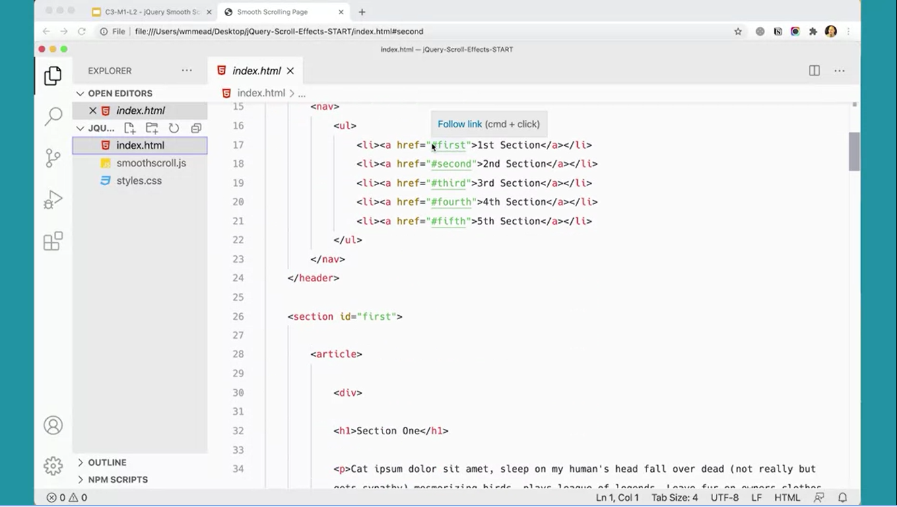
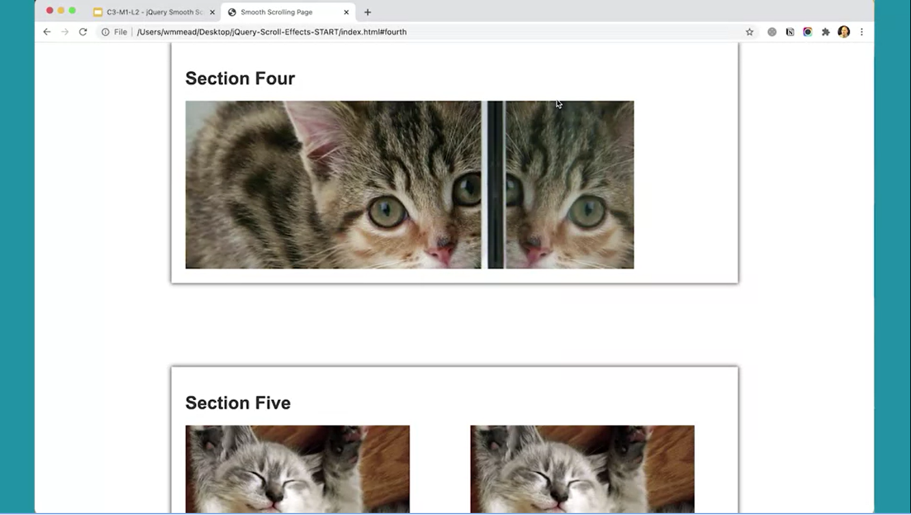

If I go into my files and look at this, you can see that my links are
just linked to these IDs pound first links to section ID first and pound
second links to section links to the ID second down here, so on and so
forth. And that&apos;s just basic HTML. But it doesn&apos;t provide a very good
user experience because when you click on something it just pops to that
section and you don&apos;t get the sense of it actually traveling there.

An interface element that&apos;s been popular for a long time now is to
create a smooth scroll effect so that you can get the sense of traveling
from one place to another place on a web page. And if it happens
smoothly and quickly without a lot of interference, then it adds to the
user experience. So, we&apos;re going to do that using jQuery.
<!--~~~~~~~~~~~~~~~~~~~~~~~~~~~~~~~~~~~~~~~~~~~~~~~~~~~~~~~~~~~~~~~~~~~~~~~~~~~~~~~~~~~~~~~~~~~~-->
<!--~~~~~~~~~~~~~~~~~~~~~ 132/133. adjust the header rule styles.css (69) ~~~~~~~~~~~~~~~~~~~~~~-->

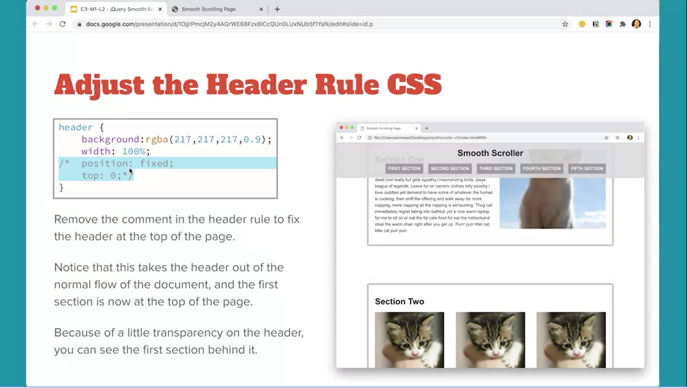
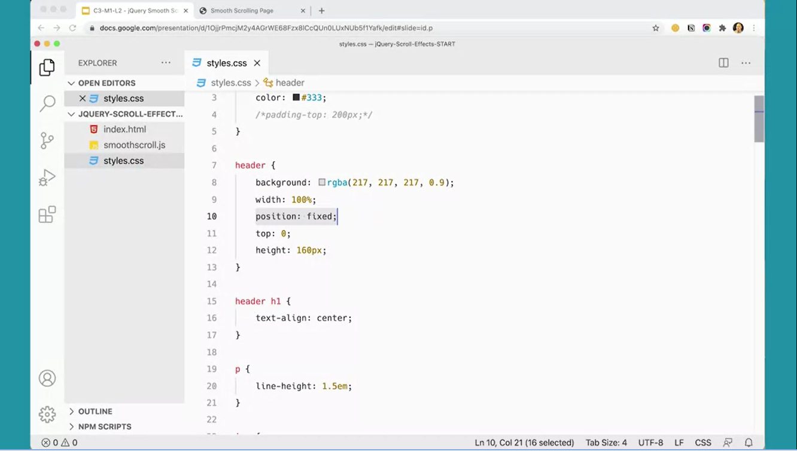
<!--~~~~~~~~~~~~~~~~~~~~~~~~~~~~~~~~~~~~~~~~~~~~~~~~~~~~~~~~~~~~~~~~~~~~~~~~~~~~~~~~~~~~~~~~~~~~-->
<!--~~~~~~~~~~~~~~~~~~~~~~~~~~ 134. smooth scroller set heading (69) ~~~~~~~~~~~~~~~~~~~~~~~~~~~-->
p align="center">
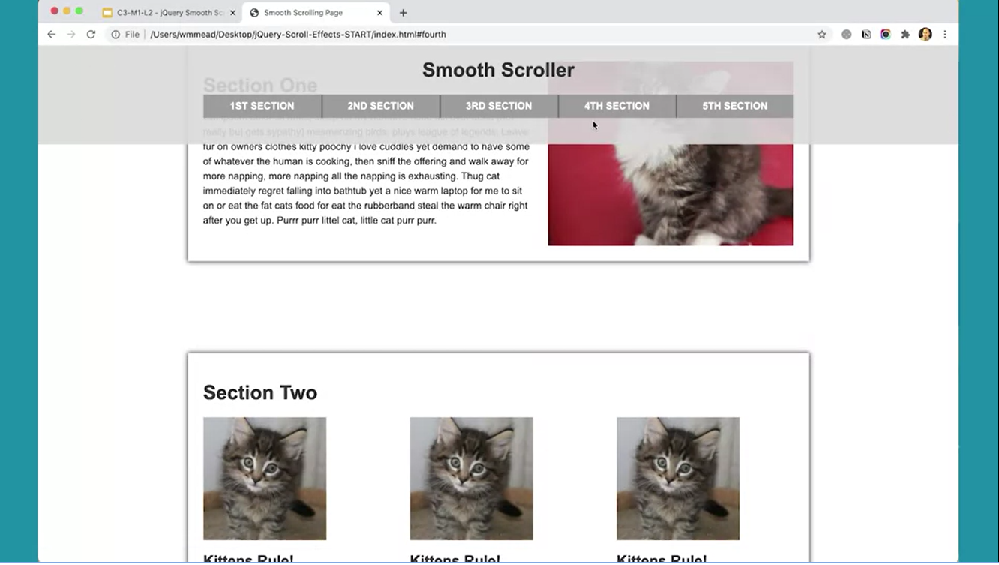

The first thing we need to do is set the header so its position fixed.
And if you go back to the files, you&apos;ll notice in the style sheet up
here at the top, I have position fixed commented out. If you remove that
comment and save it and then come back and refresh the page, you&apos;ll
notice that now the header is fixed to the top of the window and the
section one has now bumped up to the top of the window. And that&apos;s
because the header has now been taken out of the normal flow of the
document.

When you set something to position fixed, it&apos;s no longer part of the
normal flow of the document and the document will ignore it because the
top is set to zero and the left to set to zero. This header is now
pinned to the top left position of the view port here. And it&apos;s set to
width 100% so it will stretch across the entire window. Now you can see
because it&apos;s slightly transparent that the images and every all the
content is passing beneath this header.
<!--~~~~~~~~~~~~~~~~~~~~~~~~~~~~~~~~~~~~~~~~~~~~~~~~~~~~~~~~~~~~~~~~~~~~~~~~~~~~~~~~~~~~~~~~~~~~-->
<!--~~~~~~~~~~~~~~~~~~~~~~~~~~~~~ 135/136. padding-top: 200 (70) ~~~~~~~~~~~~~~~~~~~~~~~~~~~~~~~-->

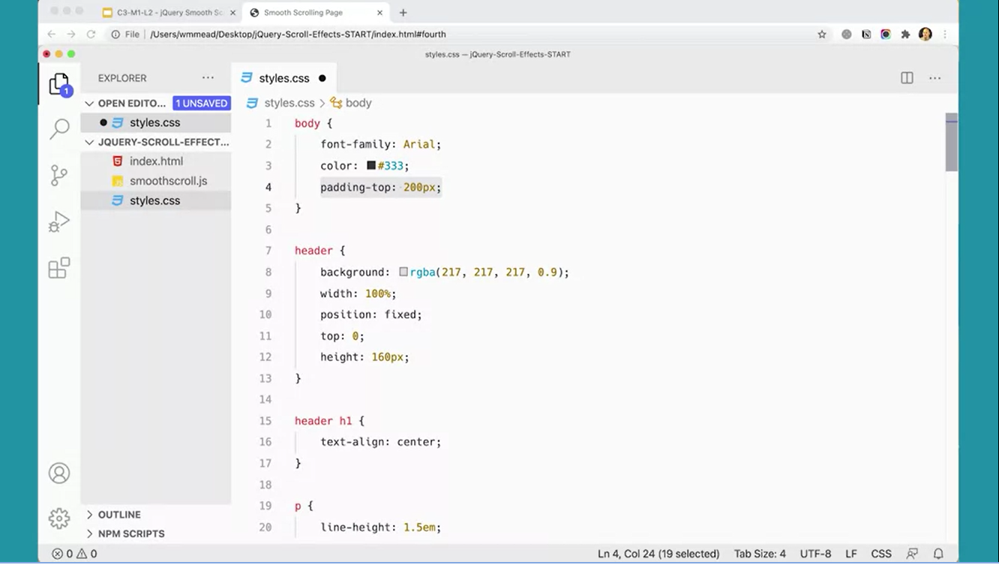
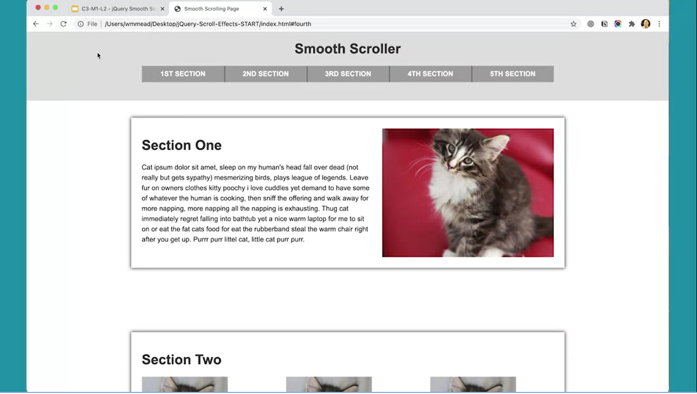

But you also notice that it&apos;s covering up part of section one. So, we
need to go back to our style sheet here and uncomment out this line
here, remove that comment to set the padding on the body to top 200
pixels. And that will push that first section down and we need to do
that because the header is no longer part of the normal flow of the
document. So, we need to push that first section down, hopes to get
saved. 
When you refresh it doesn&apos;t necessarily put the page at the top
of the window. But now you can see when I load the page fresh, it is
loading it with 200 pixels padding, which allows this element here to be
sitting below the header. But the headers out of the normal flow of the
document. Okay, so with some basic CSS and some basic HTML out of the
way, we can start working on our script and getting the interactivity to
work properly.

<h3>Start Files: Smooth Scroll with JavaScript</h3>

Attached is a zip file of the things you need to begin this exercise. A
**zip file** is defined as: a computer file whose contents include one
or more files that are compressed for storage or transmission, often
carrying the extension .ZIP.

<ul>
  <li><a href="https://d3c33hcgiwev3.cloudfront.net/TWch2Fo9RPunIdhaPQT7mg_20a45687745d416696ea6b9617ac6ff1_WEB1092_FlexSliderPlugin.zip?Expires=1700352000&Signature=NMzGqDqh7ukjS3t3QDStmyO63TfJKJODbNBiGheFKRKgduARGm~12s2u9yv2TVnTO0XHYiNSSUtV-ltfPKm5Y98d9WkeqttASMh4~z1OqZM7AsGldhYMl3UI2sbmakAnmXGRMbQvoZaBd5FpL~ExZZrwraKp4Y687myEMvyE8K0_&Key-Pair-Id=APKAJLTNE6QMUY6HBC5A" target="_blank" rel="noopener noreferrer">
    2.02.jQueryScrollEffects-START.zip (ZIP File)</a></li>
</ul>

<h3>Additional Resource:</h3>

<ul>
  <li><a href="https://www.sweetwater.com/sweetcare/articles/how-to-zip-and-unzip-files/" 
    target="_blank" rel="noopener noreferrer">How to open a zip file for either Mac or PC</a></li>
</ul>

<h2 id="ch2-03">2.03. Creating a Click Handler (5:00)</h2>
<!--~~~~~~~~~~~~~~~~~~~~~~~~~~~~~~~~~~~~~~~~~~~~~~~~~~~~~~~~~~~~~~~~~~~~~~~~~~~~~~~~~~~~~~~~~~~~-->
<!--~~~~~~~~~~~~~~~~~~~~~~~~~~ 137/138. creating a click handler (71) ~~~~~~~~~~~~~~~~~~~~~~~~~~-->

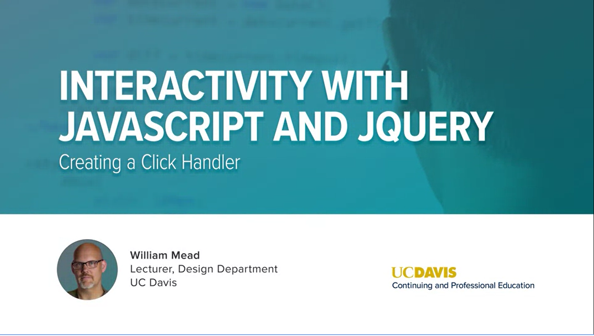
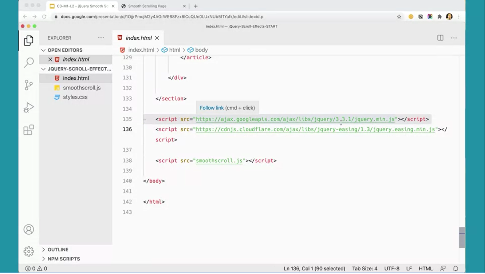

We have set up our files, and we&apos;re ready to start working on our
script, and you&apos;ll notice down here at the bottom of the page, I have
jQuery linked to a slightly older version of the library. You could hook
up the 3.6 version here instead if you wanted to, and I have the
**easing** plugged in because we&apos;re going to make use of that as well.
You&apos;re already familiar with that from a previous lesson. If you&apos;ve
forgotten, you can go back to the previous lessons and review the easing
plug-in and how that works. Then I have linked here a file called
**smoothscroll.js,** which is our JavaScript file, and this is where
we&apos;re going to write our jQuery code.
<!--~~~~~~~~~~~~~~~~~~~~~~~~~~~~~~~~~~~~~~~~~~~~~~~~~~~~~~~~~~~~~~~~~~~~~~~~~~~~~~~~~~~~~~~~~~~~-->
<!--~~~~~~~~~~~~~~~~~~~~~~~~~ 139/140. add click handler to index (71) ~~~~~~~~~~~~~~~~~~~~~~~~~-->

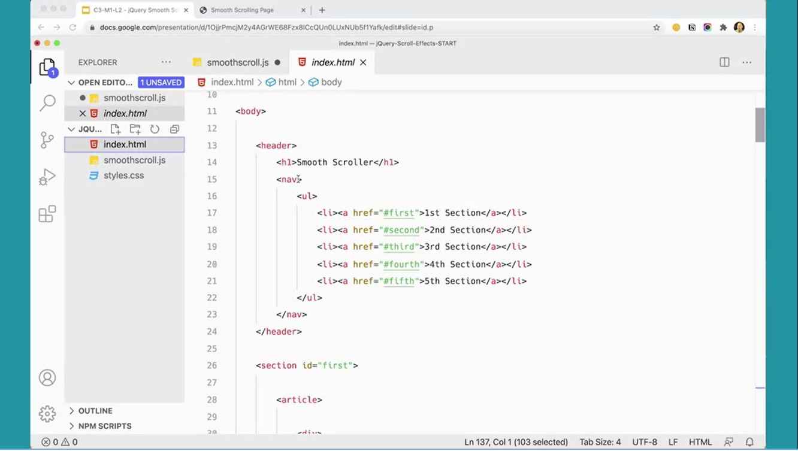
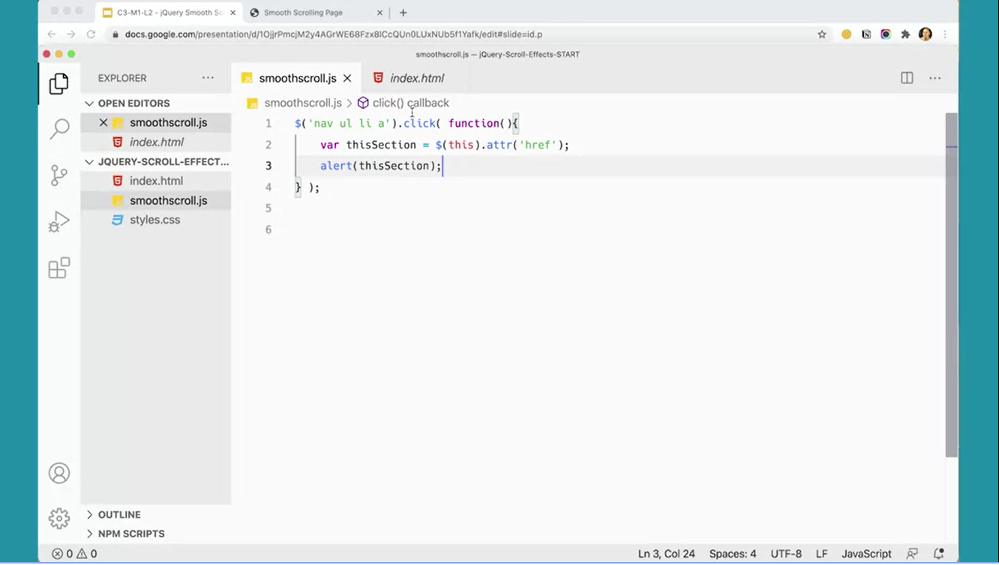

I&apos;m going to remove that comment, and add here a click handler, so I&apos;m
going to use my jQuery object to come in and grab my **nav ul li a**,
the anchor tags in the navigation over here at these anchor tags that I
want to get from up here at the top of the page, **nav, ul, li, a**. If
you had another nav element on the page, you might give this an ID, so
that you would target this very specifically with an ID to get to these
anchor tags, but this page just has one nav element, so this is specific
enough for this particular page. But I&apos;m going to add a.click handler
here, and then, of course, we pass in our function that runs when the
element is clicked, so we&apos;ve got that. Then, in here, I want to make a
variable that&apos;s going to hold the link that&apos;s clicked. This click
handler will be applied to all of the anchor tags, but you can only
click on one of them at a time, so I need to know which one was clicked.
I&apos;m going to make a variable, var thisSection, where you could use
const as well if you preferred, but I&apos;m just going to make var
thisSection, and assign it this.attr(href). What that&apos;ll do is it&apos;ll
get the href of the link that was clicked. Let&apos;s alert that out. You
can see what it actually does.
<!--~~~~~~~~~~~~~~~~~~~~~~~~~~~~~~~~~~~~~~~~~~~~~~~~~~~~~~~~~~~~~~~~~~~~~~~~~~~~~~~~~~~~~~~~~~~~-->
<!--~~~~~~~~~~~~~~~~~~~~~~ 141.  (xxx) ~~~~~~~~~~~~~~~~~~~~~~~~-->

  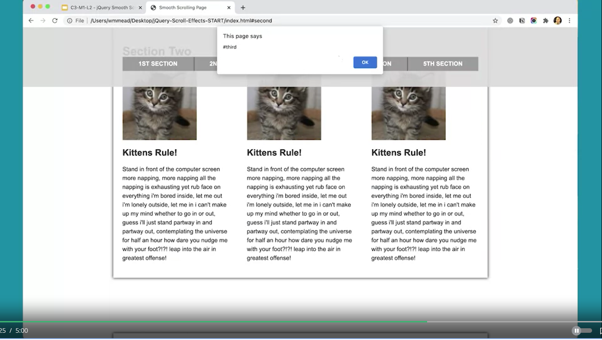

If I come back to my HTML, I&apos;ve put a click handler on all of these
anchor tags here, but you can only click on one at a time. I should be
getting pound 1st, pound, 2nd, pound 3rd, pound 4rth, and 5th, and I
need that href because I need to know which one of these sections I&apos;m
going to down here. It&apos;s the ID. It matches the idea of the section. If
I come back over here, and refresh the page and click one of these
links, I should get pound 1st, pound 2nd, pound 3rd, pound 4th, and
pound 5th. You&apos;ll notice it is actually moving the page there as well
as it does that, but I want to make sure I&apos;m getting those links.
<!--~~~~~~~~~~~~~~~~~~~~~~~~~~~~~~~~~~~~~~~~~~~~~~~~~~~~~~~~~~~~~~~~~~~~~~~~~~~~~~~~~~~~~~~~~~~~-->
<!--~~~~~~~~~~~~~~~~~~~~~~ 142.  (xxx) ~~~~~~~~~~~~~~~~~~~~~~~~-->

  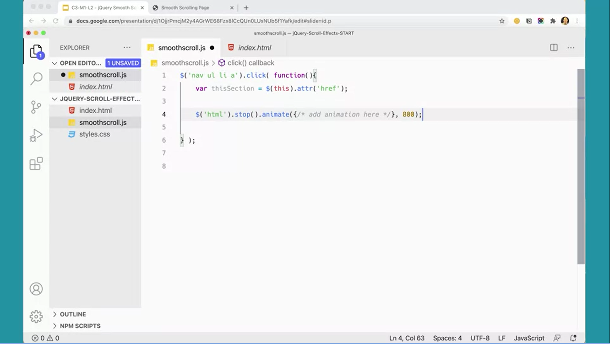

Let&apos;s go back to our script. Now, we don&apos;t need this alert here at
all. That&apos;s not going to help anything, but it just shows us what&apos;s
going on here. But now, I need to tell my page. I&apos;m going to come in
here. I&apos;m going to say get the HTML element, and I&apos;m going to use the
stop method, and I&apos;ll explain what that does in a minute.

The best way to explain it is to see it, so for right now, just put it
in. Then we&apos;re going to use our custom animate method, and we&apos;re going
to pass in an object here that&apos;s going to add animation here. We&apos;ll do
that, and we&apos;ll see, how long is it going to run? We&apos;re going to do it
over 800 milliseconds. That gives us a sense of what&apos;s going on here
when we&apos;re going to do that, and we&apos;ll test this in a minute. This is
going to actually animate our HTML, and in here, we&apos;ll use our
**thisSection** thing to tell us where we&apos;re going to animate to, and
we&apos;ll do that in the next lesson so you see how it all comes together.

<h2 id="ch2-04">2.04. Adding the Animation</h2>
<!--~~~~~~~~~~~~~~~~~~~~~~~~~~~~~~~~~~~~~~~~~~~~~~~~~~~~~~~~~~~~~~~~~~~~~~~~~~~~~~~~~~~~~~~~~~~~-->
<!--~~~~~~~~~~~~~~~~~~~~~~~~~ 143/144.  (xx) ~~~~~~~~~~~~~~~~~~~~~~~~~-->

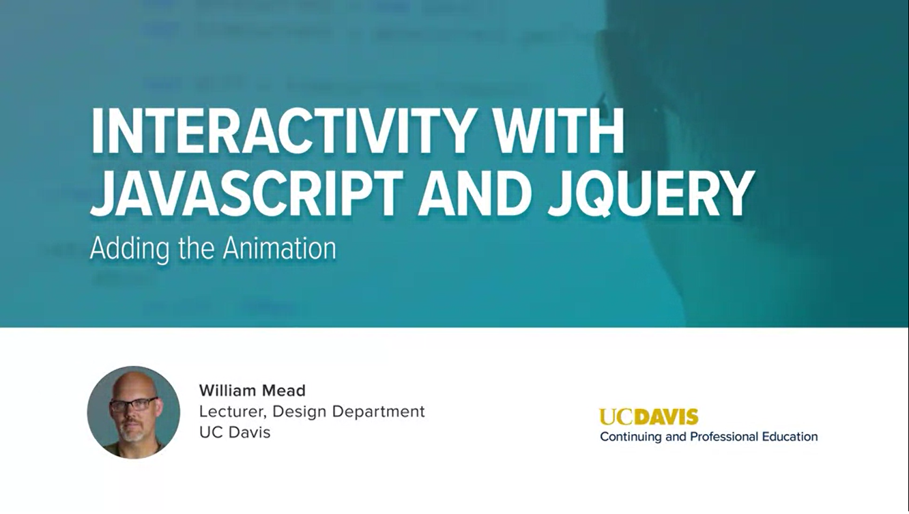
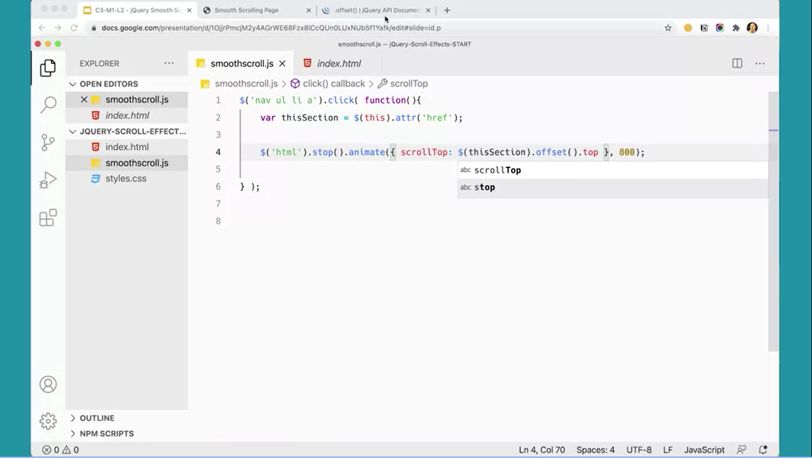

In the previous module we created a click handler for all the anchor
tags and then we got the ID of the particular anchor tag that gets
clicked on because you can only click one at a time. What is the idea
associated with that or what&apos;s the href associated with that? Which
points to the idea of the section down below that we&apos;re going to. It&apos;s
going to be pound (#) 1st or pound 2nd or pound 3rd or pound 4th or
pound 5^th^ (#1st-#5th). We&apos;ve already seen that.
<!--~~~~~~~~~~~~~~~~~~~~~~~~~~~~~~~~~~~~~~~~~~~~~~~~~~~~~~~~~~~~~~~~~~~~~~~~~~~~~~~~~~~~~~~~~~~~-->
<!--~~~~~~~~~~~~~~~~~~~~~~ 144.  (xxx) ~~~~~~~~~~~~~~~~~~~~~~~~-->

  

Then we&apos;re going to animate the html. And I&apos;ll show you in a minute
what this stop thing does, but we&apos;re going to animate and in here we
pass in a key value pair that we&apos;re going to actually animate. What is
that key value pair? We&apos;re going to animate over 800 milliseconds here.
The property that we&apos;re going to animate is **scrollTop**. Now, what is
scroll top? Scroll top is an HTML property that you may not be aware of
and it returns or sets the position that an element is going to be from
the top of the window.

When we click on a particular link, we want to put the corresponding
section at the top of the window. So how are we going to do that? We&apos;re
going to do it with the offset method. The offset method and we want to
offset top. We&apos;ll set it to offset top. So, dollar sign in parentheses,
this section and set its offset, to the top over 800 milliseconds. And
that will actually animate the page to the top of the window.
<!--~~~~~~~~~~~~~~~~~~~~~~~~~~~~~~~~~~~~~~~~~~~~~~~~~~~~~~~~~~~~~~~~~~~~~~~~~~~~~~~~~~~~~~~~~~~~-->
<!--~~~~~~~~~~~~~~~~~~~~~~ 145.  (xxx) ~~~~~~~~~~~~~~~~~~~~~~~~-->

  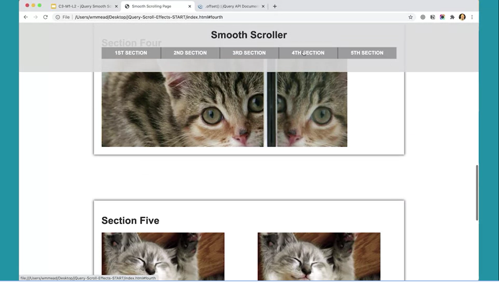

If we test this out and if you&apos;re wondering what offset is, you can go
look it up on the jQuery documentation and see what offset does and how
it&apos;s used. But essentially it allows us to move a particular element to
a particular place on the screen. And where are we moving it to? We&apos;re
moving it to the top. Let&apos;s see what happens if I&apos;m going to get rid
of the pound second from up here and refresh the page. And then if I
click 2nd, you can see that it does a smooth scroll right to with that
section going right up to the top of the window.
<!--~~~~~~~~~~~~~~~~~~~~~~~~~~~~~~~~~~~~~~~~~~~~~~~~~~~~~~~~~~~~~~~~~~~~~~~~~~~~~~~~~~~~~~~~~~~~-->
<!--~~~~~~~~~~~~~~~~~~~~~~~~~ 146/147.  (xx) ~~~~~~~~~~~~~~~~~~~~~~~~~-->

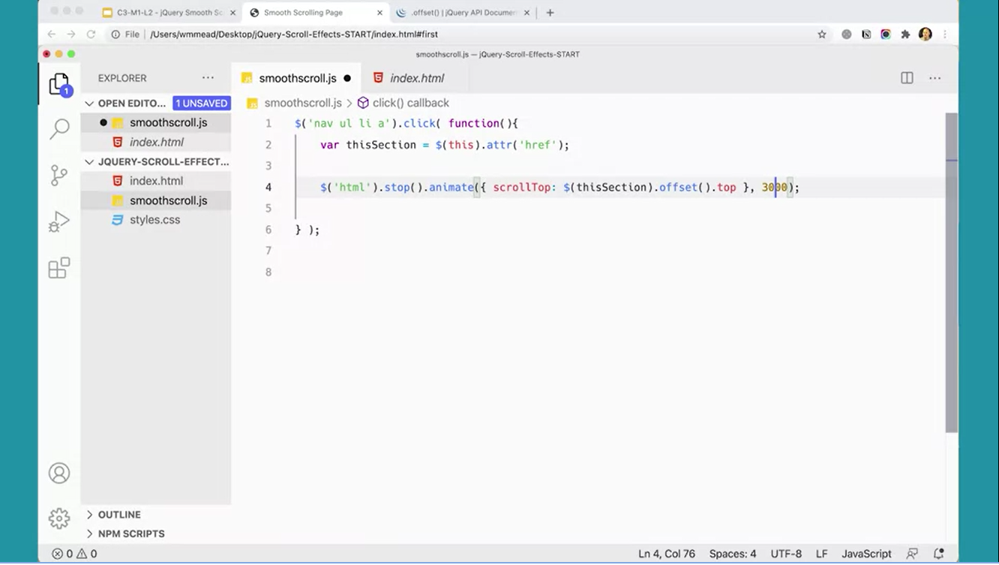
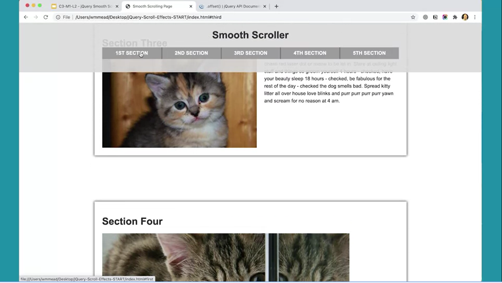

We don't want it to go all the way to the top of the window, we want it
to stop here and we&apos;ll fix that in a minute. But before we do, what
I&apos;d like to point out is what this stop method does. So over here I&apos;m
going to actually set this to a longer period of time. 3000. It&apos;s kind
of really long, but I&apos;m going to set it to 3000. And if I come back and
test this again, you&apos;ll notice it&apos;ll take a long time to go to the
section three, four seconds. But you&apos;ll notice if I press section one
and before it goes there, if I press section two it&apos;ll stop that
animation and continue on. It will continue on to the next one that
I&apos;ve started. So I press section five, it starts, but if I do four
it&apos;ll actually not finish that first animation and go to the fourth
section instead. And that&apos;s what this stop method is doing here. If I
take stop out, you&apos;ll notice that the animation start to stack. So now,
if I come back here and go back up to the top of the page and click
refresh. If I press 3rd while if I press 4^th^ section and then 2nd
section and then 4th section, then second section you&apos;ll notice that
the animation stack and it&apos;s waiting for each animation to complete
before it goes on to the next one. Which is not really the experience
that we want to have. We want it to stop that animation. I clicked on
5th section. And I&apos;ve changed my mind and I want to go to the 2nd
section. I want it to go there right away without having to wait for it
to go all the way down to the 5th section. So that&apos;s what this stop
method is doing for us. Don&apos;t stop. So it will stop the animation
that&apos;s running and then animate the thing that we&apos;ve clicked on next.
<!--~~~~~~~~~~~~~~~~~~~~~~~~~~~~~~~~~~~~~~~~~~~~~~~~~~~~~~~~~~~~~~~~~~~~~~~~~~~~~~~~~~~~~~~~~~~~-->
<!--~~~~~~~~~~~~~~~~~~~~~~~~~ 148/149.  (xx) ~~~~~~~~~~~~~~~~~~~~~~~~~-->

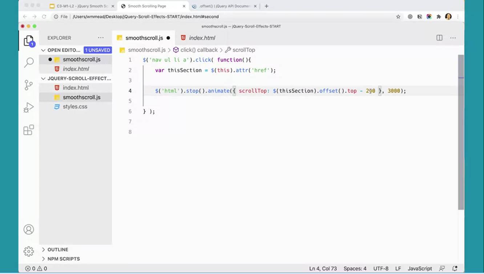
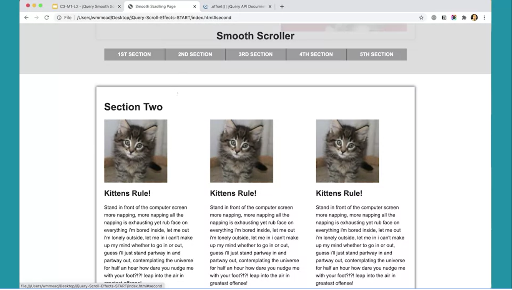

Okay, now the next thing is this there are two minor things we need to
fix. First of all, I really want it to move to top minus 200 like so.
Because I really don&apos;t want to go all the way to the top of the page.
So that&apos;s one. So now if I come back here and test this. Now if I click
section two instead of going all the way up to the top of the page, it
goes to 200 pixels down from the top of the page. Which you&apos;ll
remember, we put 200 pixels padding up there. So that&apos;s now putting it
in the correct place, so that helps. So that&apos;s one thing, I&apos;m going to
put this back to 800 because the animation is so slow now.
<!--~~~~~~~~~~~~~~~~~~~~~~~~~~~~~~~~~~~~~~~~~~~~~~~~~~~~~~~~~~~~~~~~~~~~~~~~~~~~~~~~~~~~~~~~~~~~-->
<!--~~~~~~~~~~~~~~~~~~~~~~ 150.  (xxx) ~~~~~~~~~~~~~~~~~~~~~~~~-->

  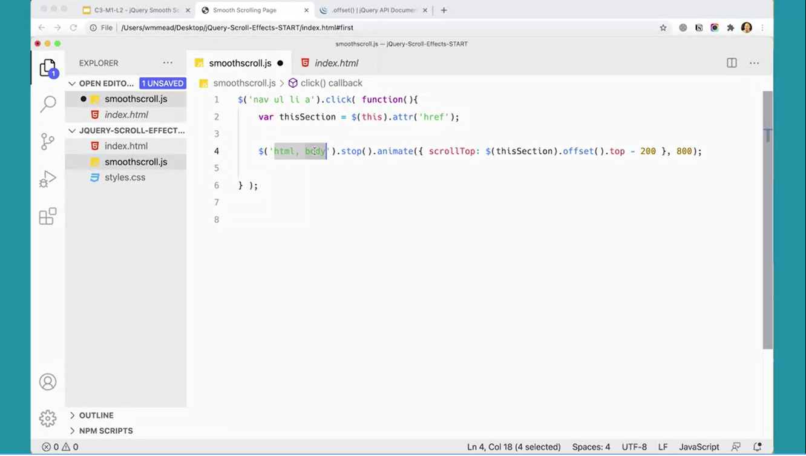

Okay, the other thing is I&apos;m going to put a comment here and add body.
Now, pretty much these days all the browsers will animate the HTML
element and you won&apos;t run into a problem with this, but there have been
in the past certain browsers that won&apos;t do that and so you have to
actually put this animation on the body tag instead. Now in fact, it
seems like the most updated versions of Safari and Firefox and Chrome
all handle the HTML just fine. But this is kind of just to fall back
just in case somebody is using an older browser. I&apos;m not sure when they
actually fixed up, so we won&apos;t see a difference because of that now,
but it&apos;s just something to be aware of, Going forward.

<h2 id="ch2-05">2.05 Add Some Easing and a Callback Function</h2>
<!--~~~~~~~~~~~~~~~~~~~~~~~~~~~~~~~~~~~~~~~~~~~~~~~~~~~~~~~~~~~~~~~~~~~~~~~~~~~~~~~~~~~~~~~~~~~~-->
<!--~~~~~~~~~~~~~~~~~~~~~~ 151.  (xxx) ~~~~~~~~~~~~~~~~~~~~~~~~-->

  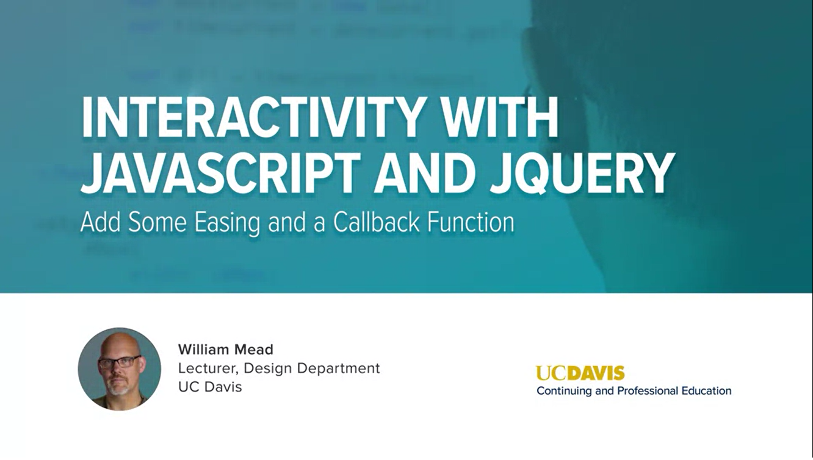

The smooth scroll script is working and that&apos;s great, but because we
have the easing plugin plugged in, we can give the script a little bit
more personality by adding some easing.
<!--~~~~~~~~~~~~~~~~~~~~~~~~~~~~~~~~~~~~~~~~~~~~~~~~~~~~~~~~~~~~~~~~~~~~~~~~~~~~~~~~~~~~~~~~~~~~-->
<!--~~~~~~~~~~~~~~~~~~~~~~~~~ 152/153.  (xx) ~~~~~~~~~~~~~~~~~~~~~~~~~-->

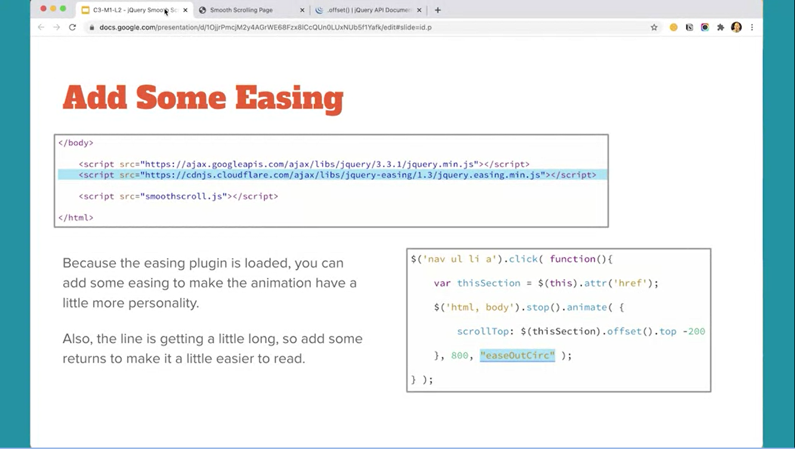
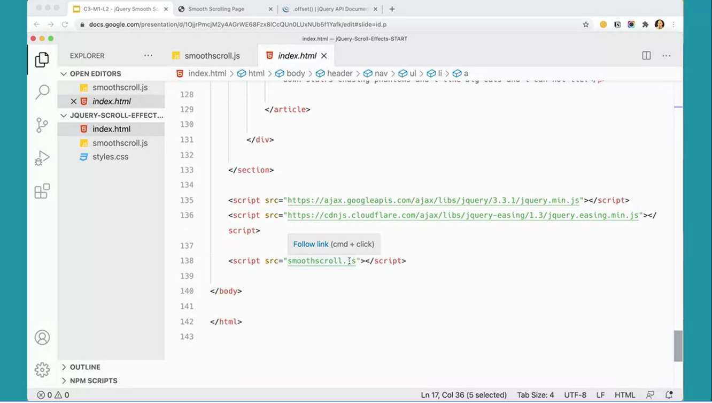

Let&apos;s go ahead and do that. Over here, just to verify on our index file
here down at the bottom of the page, you can see I have the jQuery
library loaded and then I have the easing plugin loaded and then my
script comes after that. Always, your script has to come after the
jQuery library and any plugins that you&apos;re using.
<!--~~~~~~~~~~~~~~~~~~~~~~~~~~~~~~~~~~~~~~~~~~~~~~~~~~~~~~~~~~~~~~~~~~~~~~~~~~~~~~~~~~~~~~~~~~~~-->
<!--~~~~~~~~~~~~~~~~~~~~~~ 154.  (xxx) ~~~~~~~~~~~~~~~~~~~~~~~~-->

  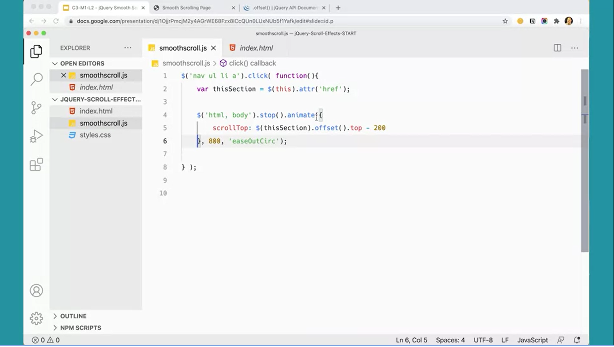

Over here, after my 800, I can add a comma and add an easing and I used
**easeOutCirc** as my easing here, which gives us a pretty dramatic set
of easing. If I set that and then while I&apos;m here, I&apos;m just going to
put a return in here. That opens and then that closes there. I want to
move that down like so, there we go, **easeOutCirc**. I think that looks
a little bit better, a little bit easier to read. We animate this over
800 milliseconds when we are using **easeOutCirc**.
<!--~~~~~~~~~~~~~~~~~~~~~~~~~~~~~~~~~~~~~~~~~~~~~~~~~~~~~~~~~~~~~~~~~~~~~~~~~~~~~~~~~~~~~~~~~~~~-->
<!--~~~~~~~~~~~~~~~~~~~~~~ 155.  (xxx) ~~~~~~~~~~~~~~~~~~~~~~~~-->

  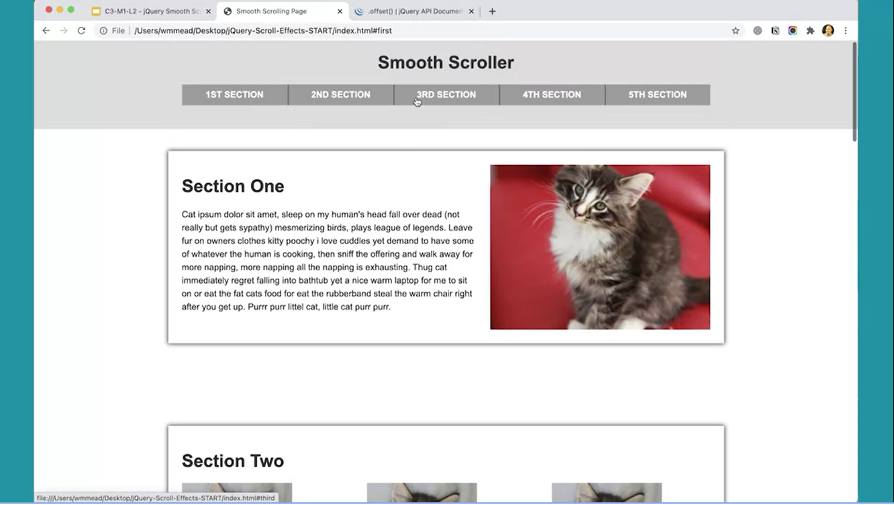

Let&apos;s go take a look and see how it looks. Now it&apos;s got a nice,
slightly snappier feel going to the sections, and if it&apos;s still going
too slowly for you, you could reduce the time further. Come over here
and set this to instead of 800 set it to 400. We will cut it in half,
see what happens. You have to find the right setting that you think
feels good. This feels very snappy because they&apos;re very quickly, but
does it still give you the sense that you&apos;re traveling to that part of
the page? Yeah, it does, so that&apos;s nice. Maybe I&apos;ll leave it like
that.
<!--~~~~~~~~~~~~~~~~~~~~~~~~~~~~~~~~~~~~~~~~~~~~~~~~~~~~~~~~~~~~~~~~~~~~~~~~~~~~~~~~~~~~~~~~~~~~-->
<!--~~~~~~~~~~~~~~~~~~~~~~ 156.  (xxx) ~~~~~~~~~~~~~~~~~~~~~~~~-->

  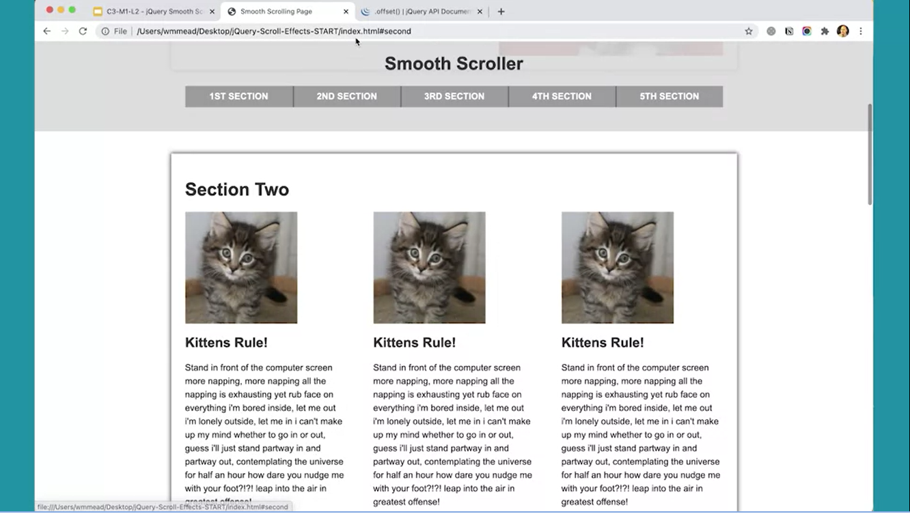

This is all working and I could leave the script like this. It&apos;s
certainly functioning, but I want to do a little bit more with it. What
I want to do is actually change the highlighting on these links to
indicate which link I&apos;m actually on when I get to that section. Up
here, this becomes an indicator of which section I&apos;m looking at along
with sort of the label on that section. I&apos;m going to do that by adding
a callback function in here. Function. After the animation completes,
I&apos;m going to run a function in here. In this callback function, I&apos;m
going to add an alert and, in the alert, I&apos;m going to actually alert
out the offset, so you can see how far from the top of the page the
element actually is. How far off the top of the window, really, it&apos;s
what it is. I&apos;m going to use my jQuery object to go get the window and
see what it offset, is it offset? I think it&apos;s like that offset. We
have done that right. Here we go. Let&apos;s see if I did that right. I
think I did. I come back here, refresh the page, click second and I did
something wrong there.

<h2 id="ch2-06">2.06 Highlighting Elements</h2>
<!--~~~~~~~~~~~~~~~~~~~~~~~~~~~~~~~~~~~~~~~~~~~~~~~~~~~~~~~~~~~~~~~~~~~~~~~~~~~~~~~~~~~~~~~~~~~~-->
<!--~~~~~~~~~~~~~~~~~~~~~~ 157.  (xxx) ~~~~~~~~~~~~~~~~~~~~~~~~-->

  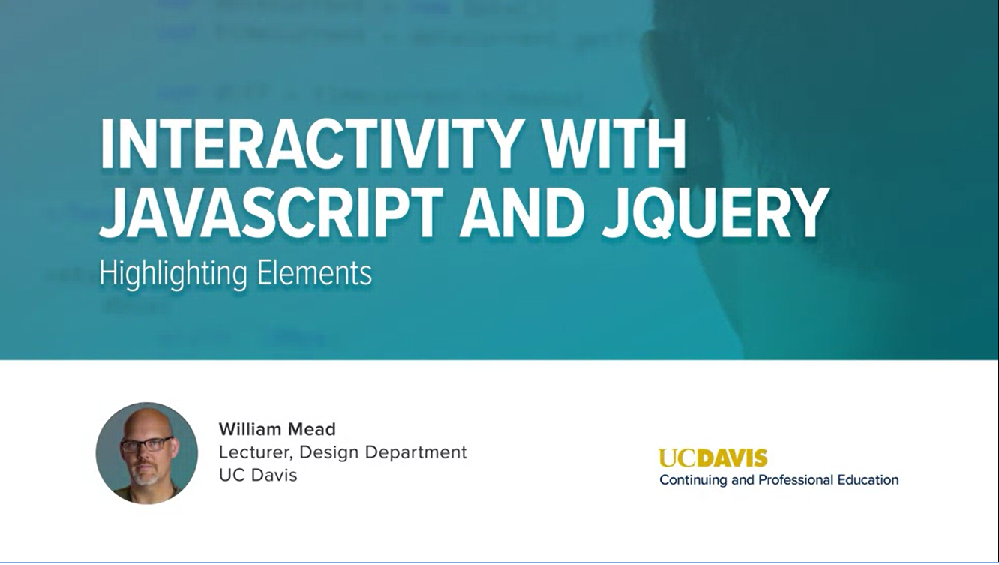

On the style sheet is a rule, selected, and I might have it commented
out. Let&apos;s go over and see because if we do, we need to uncomment it
out.
<!--~~~~~~~~~~~~~~~~~~~~~~~~~~~~~~~~~~~~~~~~~~~~~~~~~~~~~~~~~~~~~~~~~~~~~~~~~~~~~~~~~~~~~~~~~~~~-->
<!--~~~~~~~~~~~~~~~~~~~~~~ 158.  (xxx) ~~~~~~~~~~~~~~~~~~~~~~~~-->

  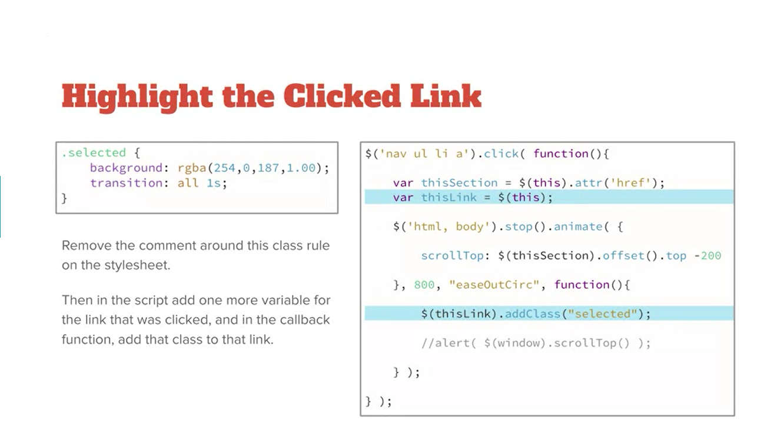

We go to Styles, go down here and it&apos;s not commented out, good. I&apos;ve
got Selected here and it&apos;s set to a color, and it&apos;s got a one second
transition for transitioning that class there. What we&apos;re going to do
is we&apos;re going to change the link that we&apos;ve clicked on, we&apos;re going
to add the class, selected, to it. I need to add a variable, this link,
and it&apos;s just this, the link that I clicked. The item that I clicked
and I could just use this down here, but I think it&apos;s a little bit
helpful to have the variable name. This link is just the thing that
I&apos;ve clicked, it&apos;s this, so let&apos;s go ahead and add that. On our
smooth scroll script here at the top, I may add a variable for this link
equals dollar sign this. Down here, we don&apos;t really need this alert
anymore. I&apos;m just going to comment it out. I&apos;m going to leave it there
in case you want to refer to it. That scroll type stuff can be a little
bit confusing, sometimes it&apos;s helpful to have that in there just to
remind yourself what the heck scroll top is and how that&apos;s actually
working.

Now I&apos;m going to say this link, dot attr, amazing class name I figured
when I put over there. I&apos;m using add class. We&apos;ll use that method. You
could also use the attr method, but I&apos;m going to just use add class,
select it. Now, there&apos;s one small problem here in that this will work
the first time you click on a link, but it won&apos;t work every time.
We&apos;ll see here as we use this when I click second, it&apos;ll add the
class, and then when I click third, it&apos;ll add the class, when I click
forth, it&apos;ll add the class. It&apos;s working, but what I really wanted to
do is remove the class from these, and then just put it on the one that
I&apos;ve clicked so they don&apos;t just all turn pink. Although you could have
an interface that shows which ones if you clicked on and it would work
for that, but I really wanted to just highlight the one that I&apos;ve
actually clicked on.
<!--~~~~~~~~~~~~~~~~~~~~~~~~~~~~~~~~~~~~~~~~~~~~~~~~~~~~~~~~~~~~~~~~~~~~~~~~~~~~~~~~~~~~~~~~~~~~-->
<!--~~~~~~~~~~~~~~~~~~~~~~~~~ 159/160.  (xx) ~~~~~~~~~~~~~~~~~~~~~~~~~-->

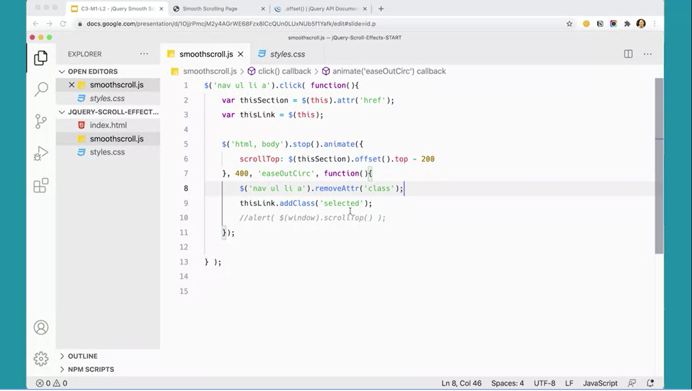
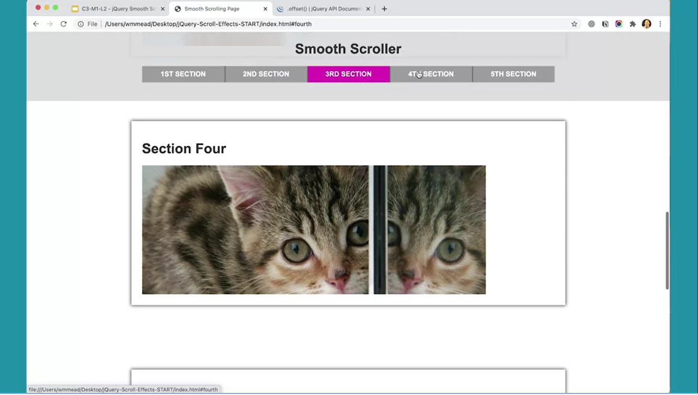

I&apos;m going to go back to my script, and I&apos;m just going to modify just a
little bit here by saying, use my jQuery object to go in here and get
all those anchor tags, nav ul li a. Here I&apos;m going to use attr. Well, I
don&apos;t think I&apos;m going to do that, I think I want to do something else.
I want to use actually, I&apos;m going to remove the class attribute. That
removes the class attribute from all of them, and then just adds it to
the one that I&apos;ve clicked on. Let&apos;s see if that works. Come back here,
refresh the page, now when I click on that, it adds the class there; it
removes the class from all of them and then adds it to the one that
I&apos;ve clicked on. That&apos;s working great.

Now, you could go back at the beginning when the page loads, and just
add selected to the class of this element, of this first one here.
Let&apos;s do that, just so that when the page loads, we&apos;re obviously going
to be up at the top of the page. We might as well have, class equals
quote, selected, on that first link in the navigation, so that now when
you load the page from the start. You get rid of this stuff here press
return. That comes up live because that&apos;s what we&apos;re showing; we&apos;re
showing Section one, and then we&apos;ll go to section two and it will turn
off all of them and then add it there, and that&apos;s working great. With
that, part of the script is finished. We have a script where we can
click on these, and it will animate that section, and highlight the
correct section. One thing you&apos;ll notice, though, is that if you scroll
the page, it doesn&apos;t change what&apos;s highlighted up here, and to do
that, we really need to manage this scroll event so that we can handle
what happens as we scroll the page and move from one section to another.
We&apos;re going to deal with that in the next lesson.

<h3>PDF of Presentation: 2.06.jQuerySmoothScroll.pdf</h3>

<h2 id="ch2-07">2.07 Introduction to Page Location Tracking</h2>
<!--~~~~~~~~~~~~~~~~~~~~~~~~~~~~~~~~~~~~~~~~~~~~~~~~~~~~~~~~~~~~~~~~~~~~~~~~~~~~~~~~~~~~~~~~~~~~-->
<!--~~~~~~~~~~~~~~~~~~~~~~ 161.  (xxx) ~~~~~~~~~~~~~~~~~~~~~~~~-->

  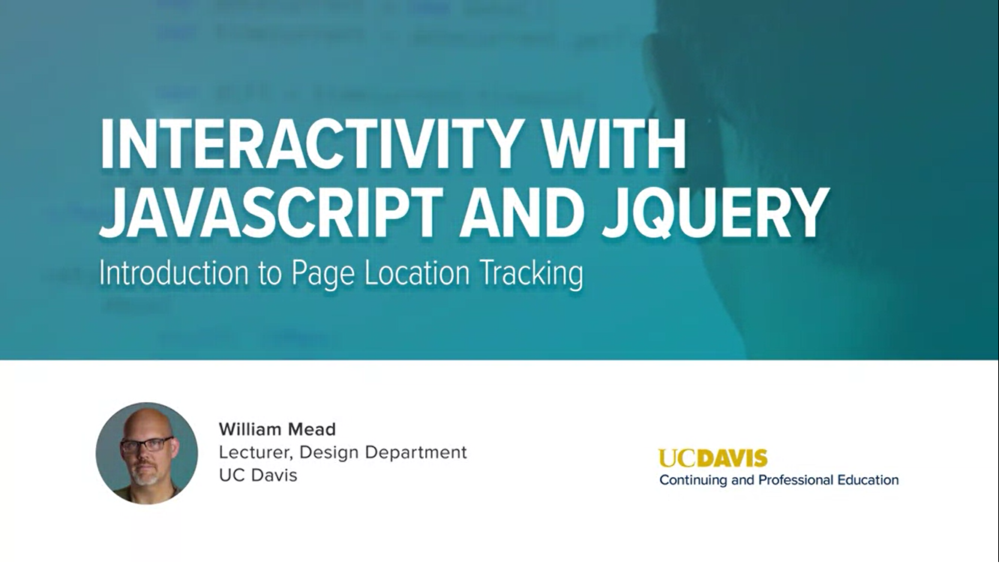

In this lesson, we&apos;re going to take the files that we already started
here, and this script is working so that if I click on the section it
goes to the correct section and it highlights the correct menu item up
here.
<!--~~~~~~~~~~~~~~~~~~~~~~~~~~~~~~~~~~~~~~~~~~~~~~~~~~~~~~~~~~~~~~~~~~~~~~~~~~~~~~~~~~~~~~~~~~~~-->
<!--~~~~~~~~~~~~~~~~~~~~~~ 162.  (xxx) ~~~~~~~~~~~~~~~~~~~~~~~~-->

  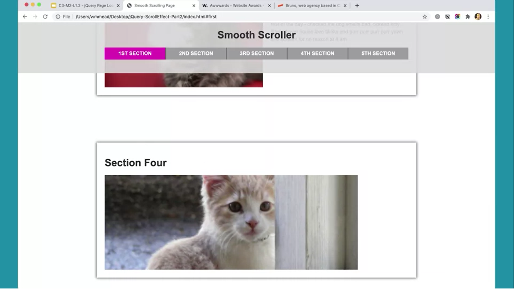

But what it does not do is if I scroll down the page, it doesn&apos;t change
the highlighting to demonstrate the section that I&apos;m looking at here.
This may seem like a little thing, a minor detail, and I suppose that it
is in this page, and we&apos;re going to work on a script to fix this, and
it may seem that the script we&apos;re creating is awfully complicated to
fix such a small thing. But what&apos;s really cool is the script that
we&apos;re going to write that will allow us to change the highlighting
based on where we are in the page is capturing the scroll of that.

Working with scroll scripts can be challenging because there are some
difficulties that you have to deal with. But the really cool thing is
that if we could get these things to highlight, we could do anything on
the page based on where we are, scroll down the page. If you think about
that for a second and go look at some of the interesting websites that
are out there. https://callbruno.com/en
<!--~~~~~~~~~~~~~~~~~~~~~~~~~~~~~~~~~~~~~~~~~~~~~~~~~~~~~~~~~~~~~~~~~~~~~~~~~~~~~~~~~~~~~~~~~~~~-->
<!--~~~~~~~~~~~~~~~~~~~~~~~~~ 163/164.  (xx) ~~~~~~~~~~~~~~~~~~~~~~~~~-->

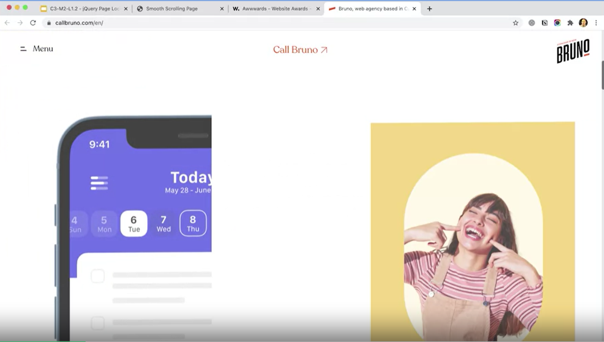
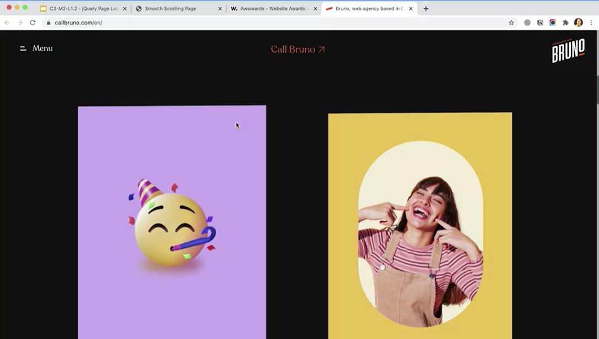

<!--~~~~~~~~~~~~~~~~~~~~~~~~~~~~~~~~~~~~~~~~~~~~~~~~~~~~~~~~~~~~~~~~~~~~~~~~~~~~~~~~~~~~~~~~~~~~-->
<!--~~~~~~~~~~~~~~~~~~~~~~~~~ 165/166.  (xx) ~~~~~~~~~~~~~~~~~~~~~~~~~-->

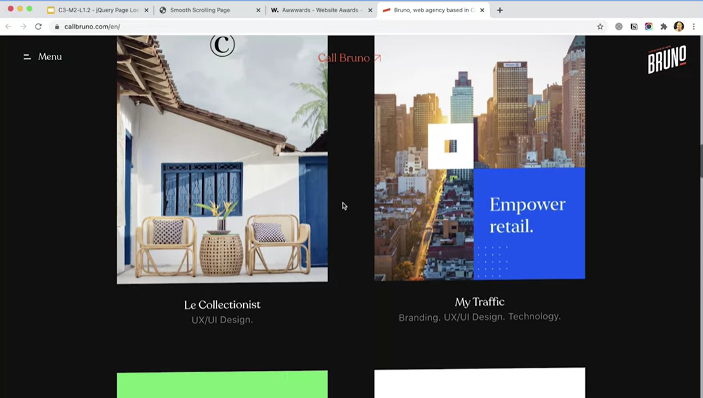
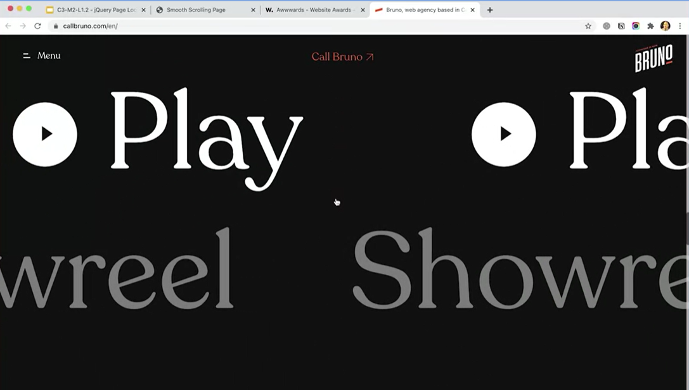

For example, I have one pulled up here, this website here, and as I
scroll down, different things are happening based on whether I&apos;m
scrolling. Scroll down, this happens, scroll up this go back out. This
is capturing the scroll event and doing something on the page based on
whether or not I&apos;m scrolling. So, I scroll down the page here that
animation plays differently while I&apos;m scrolling up or scrolling down.
It&apos;s affected by the scroll.
<!--~~~~~~~~~~~~~~~~~~~~~~~~~~~~~~~~~~~~~~~~~~~~~~~~~~~~~~~~~~~~~~~~~~~~~~~~~~~~~~~~~~~~~~~~~~~~-->
<!--~~~~~~~~~~~~~~~~~~~~~~~~~ 167/168.  (xx) ~~~~~~~~~~~~~~~~~~~~~~~~~-->

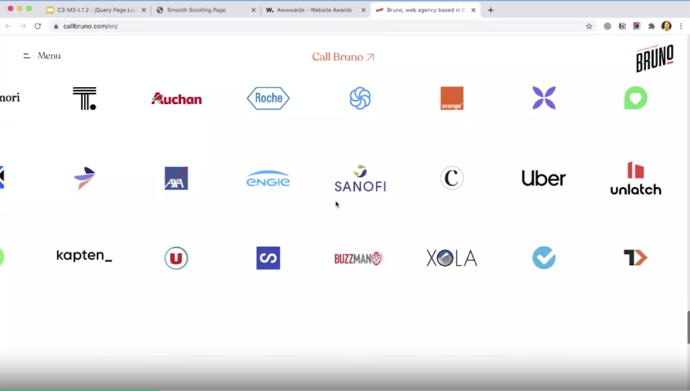
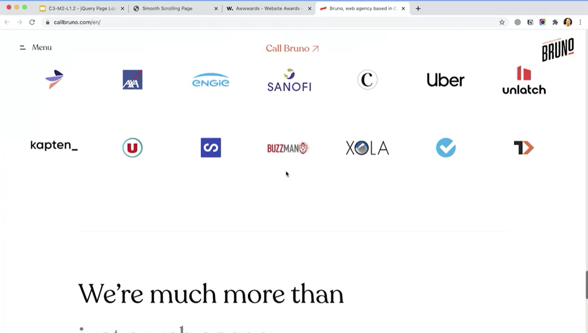

Down here there&apos;s another one such as switch to white, which switched
based on when and where I was scrolling my scroll up will switch to
black or dark gray. When I get down here, this set of icons is moving
based on whether I&apos;m scrolling or not. If we want to be able to do any
of these types of effects, you need to capture the scroll event, and you
need to be able to do things with that scroll event when you capture it,
and that can be a little bit challenging and we&apos;ll get into why in just
a minute here.
<!--~~~~~~~~~~~~~~~~~~~~~~~~~~~~~~~~~~~~~~~~~~~~~~~~~~~~~~~~~~~~~~~~~~~~~~~~~~~~~~~~~~~~~~~~~~~~-->
<!--~~~~~~~~~~~~~~~~~~~~~~ 169.  (xxx) ~~~~~~~~~~~~~~~~~~~~~~~~-->

  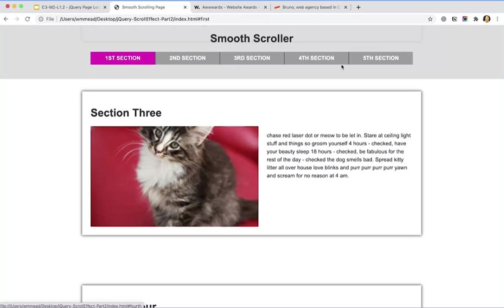

But for right now, for this script, all we&apos;re going to do is change the
highlighting on these links, which seems like a very minor thing. But
just keep in mind that when we&apos;re done with this script, we will have a
script that you could use on lots of Web pages to track where you are in
the page and do lots of different animations or cool effects or other
things based on where you are on the page. That&apos;s pretty exciting.
<!--~~~~~~~~~~~~~~~~~~~~~~~~~~~~~~~~~~~~~~~~~~~~~~~~~~~~~~~~~~~~~~~~~~~~~~~~~~~~~~~~~~~~~~~~~~~~-->
<!--~~~~~~~~~~~~~~~~~~~~~~ 170.  (xxx) ~~~~~~~~~~~~~~~~~~~~~~~~-->

  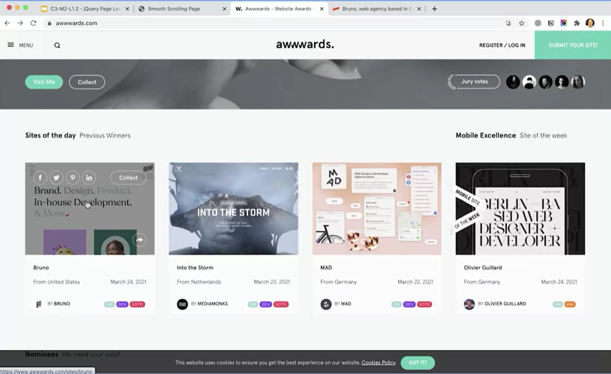

By the way, I should add that I don&apos;t know anything about this Web site
or this company, I just went to the awards website (awwwards.com) and
picked the first one that showed up over here. This is a good Web site
to come to. I think I&apos;ve pointed out in previous lessons, if you want
to see some interesting interactions that people have created on the
Web, they often get posted here. This is a good place to come to get
inspiration about different things that you can do.
<!--~~~~~~~~~~~~~~~~~~~~~~~~~~~~~~~~~~~~~~~~~~~~~~~~~~~~~~~~~~~~~~~~~~~~~~~~~~~~~~~~~~~~~~~~~~~~-->
<!--~~~~~~~~~~~~~~~~~~~~~~ 171.  (xxx) ~~~~~~~~~~~~~~~~~~~~~~~~-->

  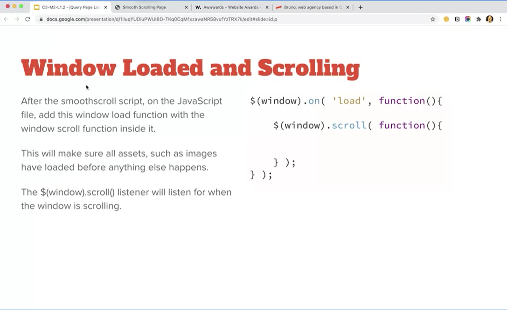

Let&apos;s get started with our script and we&apos;re going to work with the
same files that we just completed, you don&apos;t need to change anything on
them. We&apos;re just going to continue to work on the JavaScript file in
that folder. We&apos;re going to start by adding an event handler that waits
for the whole page to be loaded. Again, we don&apos;t want anything to
happen until the whole page is loaded with all the images and everything
else. Then we&apos;re going to capture the actual scroll with an event
handler for capturing scroll using jQuery. Let&apos;s go ahead and add these
to our script here.
<!--~~~~~~~~~~~~~~~~~~~~~~~~~~~~~~~~~~~~~~~~~~~~~~~~~~~~~~~~~~~~~~~~~~~~~~~~~~~~~~~~~~~~~~~~~~~~-->
<!--~~~~~~~~~~~~~~~~~~~~~~ 172.  (xxx) ~~~~~~~~~~~~~~~~~~~~~~~~-->

  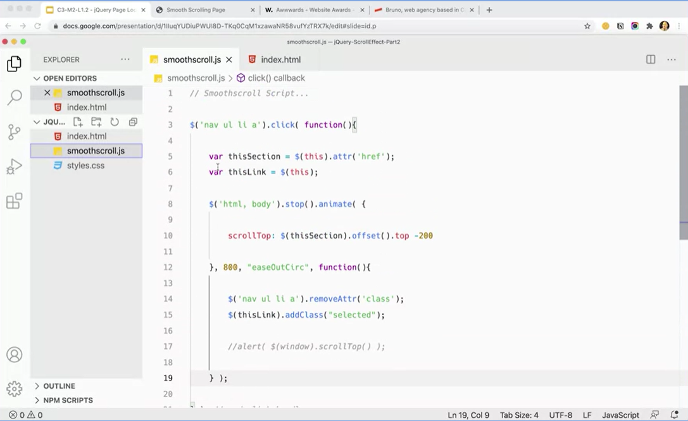

Over here on my Spitzkoppe page here, I&apos;m just going to go down here.
We&apos;ve got this script is handling this scroll, and I&apos;m going to click
after that and I&apos;m going to add a jQuery object for window, the window
object on,load, we&apos;re going to run a function. Again, this dysfunction
runs when all of the content of the page is loaded, and in this case,
that&apos;s important because one of the things we need to keep track of is
how tall each of these sections are. Well, how tall this section is has
something to do with how large this picture is. If this picture was in
here, the section would take up less space because it would end here. It
wouldn&apos;t be that tall.
<!--~~~~~~~~~~~~~~~~~~~~~~~~~~~~~~~~~~~~~~~~~~~~~~~~~~~~~~~~~~~~~~~~~~~~~~~~~~~~~~~~~~~~~~~~~~~~-->
<!--~~~~~~~~~~~~~~~~~~~~~~ 173.  (xxx) ~~~~~~~~~~~~~~~~~~~~~~~~-->

  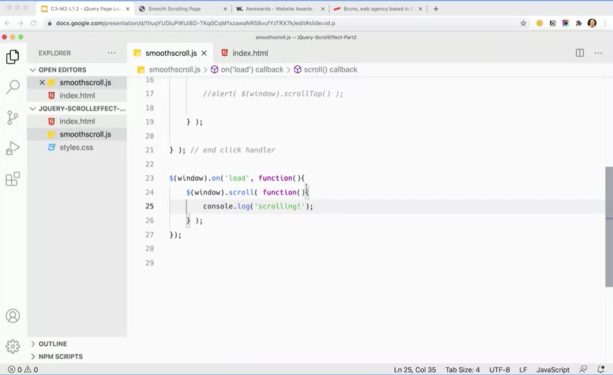

If I want to track which section is on the screen, I need to know how
big the section is. For me to know how big the section is all of the
content has to be loaded, including images, provide videos or other
content. It all has to be loaded before I say, \"Well, how tall are
you?\" I need to know how tall you are so I can know whether the
sections on the page or not. So that&apos;s why I need to make sure I put
everything inside this window on load call back here to make sure that
I&apos;m capturing when the window loads, so that everything I do is inside
of there.

Then I&apos;m going to next add the jQuery object for window, that scroll.
This event will tell us if the page is scrolling at all, as with a peer
review or click handler, we&apos;re going to pass in a function that&apos;s
going to run when the page scrolls. This function runs when the page
scrolls, and that&apos;s where we&apos;re going to put our script is inside here
as the page scrolls, and I could just for right now, I could just do
alert, I could do console.log. You don&apos;t want to do alert because
you&apos;ll get a ton of alerts scrolling, and save that.
<!--~~~~~~~~~~~~~~~~~~~~~~~~~~~~~~~~~~~~~~~~~~~~~~~~~~~~~~~~~~~~~~~~~~~~~~~~~~~~~~~~~~~~~~~~~~~~-->
<!--~~~~~~~~~~~~~~~~~~~~~~ 174.  (xxx) ~~~~~~~~~~~~~~~~~~~~~~~~-->

  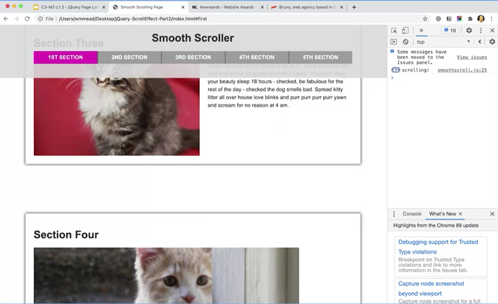

If I come back to my page now and choose my inspector over your turn on
my console, keep that a little bit narrower and to refresh the page. As
I move it, you&apos;ll see this event is firing. It fired 41 times already.
Any time I move just a tiny little bit, that event for scrolling is
fiery. This is one of the really big things that you have to pay
attention to when working with the scroll event, is that it&apos;s going to
capture every time you scroll the tiny, tiny little bit. If you&apos;re
doing big things on your page, then you have to be careful about
overloading your processor, if you want to move stuff around on the
screen, it&apos;s easy to overload it by firing this event so many times and
trying to do too many things at once.

<h2 id="ch2-08">2.08 The Crux of the Problem</h2>
<!--~~~~~~~~~~~~~~~~~~~~~~~~~~~~~~~~~~~~~~~~~~~~~~~~~~~~~~~~~~~~~~~~~~~~~~~~~~~~~~~~~~~~~~~~~~~~-->
<!--~~~~~~~~~~~~~~~~~~~~~~ 175.  (xxx) ~~~~~~~~~~~~~~~~~~~~~~~~-->

  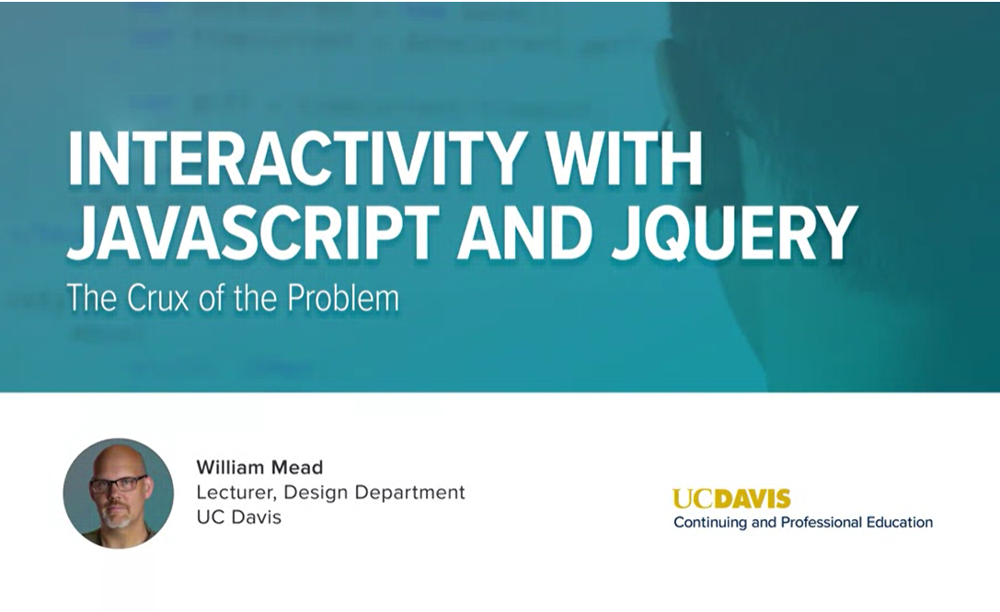

Now, we&apos;re going to get to the crux of the problem. What we&apos;re going
to do is we&apos;re going to look at a couple of variables and watch what
happens as we scroll on the page.
<!--~~~~~~~~~~~~~~~~~~~~~~~~~~~~~~~~~~~~~~~~~~~~~~~~~~~~~~~~~~~~~~~~~~~~~~~~~~~~~~~~~~~~~~~~~~~~-->
<!--~~~~~~~~~~~~~~~~~~~~~~ 176.  (xxx) ~~~~~~~~~~~~~~~~~~~~~~~~-->

  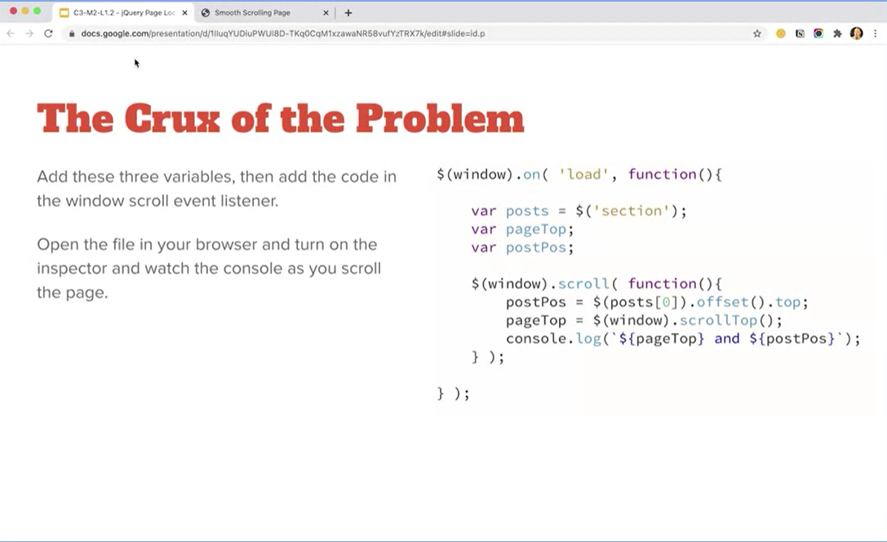

On your page, you want to add some variables here. You want to add these
three variables, and then we&apos;re going to set the value of inside the
scroll event. These are outside the scroll event.

Then inside the scroll event, we&apos;re going to change post position every
time you scroll the page and change page top, every time we scroll the
page and then we&apos;ll just console log these two values out here. Let&apos;s
add this to our file over here. I&apos;m just going to piece these variables
and you&apos;re going to have to type them, these three variables here. Now
posts is just going into the index page and finding all of the sections.
This is going to be an array that holds five sections over here. That&apos;s
going to have post and this is going to have five sections. Then down
here, we need to set the values of these. I&apos;m just going to piece them
in here. I&apos;m going to remove this console log; we don&apos;t need that one
anymore and put this in instead.
<!--~~~~~~~~~~~~~~~~~~~~~~~~~~~~~~~~~~~~~~~~~~~~~~~~~~~~~~~~~~~~~~~~~~~~~~~~~~~~~~~~~~~~~~~~~~~~-->
<!--~~~~~~~~~~~~~~~~~~~~~~ 177.  (xxx) ~~~~~~~~~~~~~~~~~~~~~~~~-->

  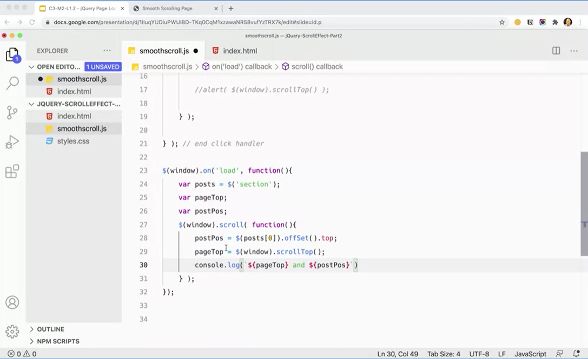

PostPosition is going to go find post zero, the first section on the
page and get its offset top and then page top is going to go get window
scrollTop. Then we&apos;re going to console log the two values of these
things out, so we can see what they are. Save that and then come over to
your page and with your console log showing over here, refresh the page
and I&apos;m going to close this down here.
<!--~~~~~~~~~~~~~~~~~~~~~~~~~~~~~~~~~~~~~~~~~~~~~~~~~~~~~~~~~~~~~~~~~~~~~~~~~~~~~~~~~~~~~~~~~~~~-->
<!--~~~~~~~~~~~~~~~~~~~~~~ 178.  (xxx) ~~~~~~~~~~~~~~~~~~~~~~~~-->

  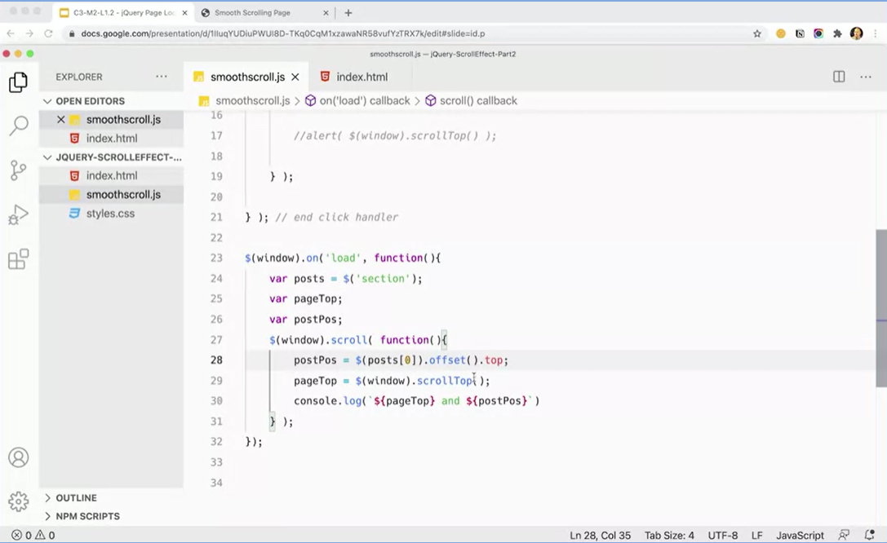

I&apos;ve got something wrong over here. Offset is not a function. Is it
offset with s? It&apos;s offset with lower-case s. Make sure you do this
right offset. There we go. Try that again.
<!--~~~~~~~~~~~~~~~~~~~~~~~~~~~~~~~~~~~~~~~~~~~~~~~~~~~~~~~~~~~~~~~~~~~~~~~~~~~~~~~~~~~~~~~~~~~~-->
<!--~~~~~~~~~~~~~~~~~~~~~~ 179.  (xxx) ~~~~~~~~~~~~~~~~~~~~~~~~-->

  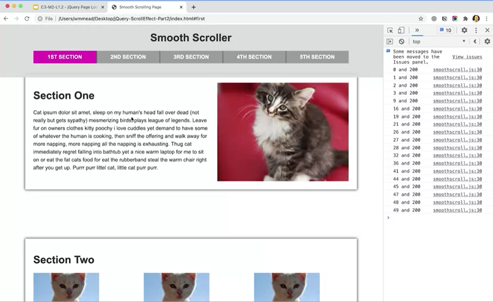

There we go. I got zero, for the first one and 200 for the second one.
Remember, the first one is pageTop. That&apos;s where my Window is. It&apos;s at
position zero. My first post is 200 pixels down the page and we knew
that already because when we set up this page in the previous lesson, we
put padding on the top of 200 pixels, which pushes this down. But now,
as I scroll the page, notice that the number on the left changes as I
scroll the page. That&apos;s telling me how many pixels above the top of the
screen my pages. But the number on the right does not change. That&apos;s
the position of that top section from the top of the page. By using
these two numbers, I can know whether a particular section is on the
screen or not. If I&apos;m scrolled up at the top of the screen and this
number here, it&apos;s a zero right now, if that number is less than two
hundred, or less than the height of that element, then I know that
element is showing on the screen. I need to know how tall this section
is. But however tall that section is, I know it&apos;s on the screen, if
this number here is less than the number of how tall that section is.

The first piece that we need to know is where does the section start. It
starts at 200. Then I need to know how tall is that section. From that,
I can figure out how much of the page is this section taking up and
where in my page am I in terms of scrolling. That will help me figure
this thing out. It&apos;s really important to understand this before we
continue to get what we&apos;re going for here, because I need to know when
a particular section is in a particular place on my screen or in my view
port.
<!--~~~~~~~~~~~~~~~~~~~~~~~~~~~~~~~~~~~~~~~~~~~~~~~~~~~~~~~~~~~~~~~~~~~~~~~~~~~~~~~~~~~~~~~~~~~~-->
<!--~~~~~~~~~~~~~~~~~~~~~~~~~ 180/181.  (xx) ~~~~~~~~~~~~~~~~~~~~~~~~~-->

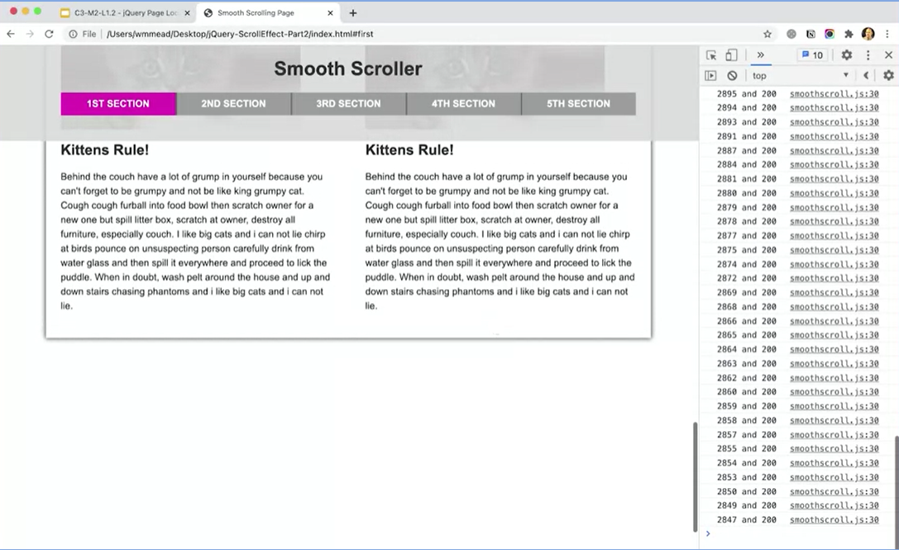
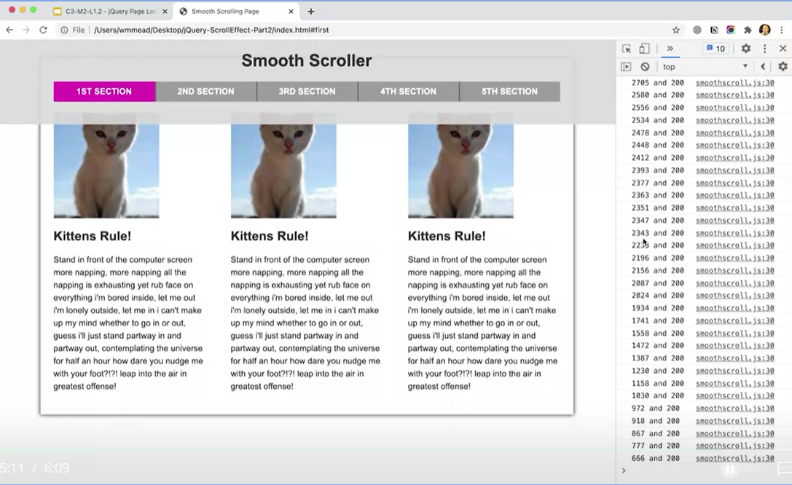

The next thing to pay attention to, let me just go up to the top of the
page and refresh the page, is notice when I scroll the page, if I scroll
really quickly and look over here, you&apos;ll notice I&apos;m not hitting every
pixel. If I scroll slowly, I&apos;m more likely to hit more of the pixels.
But if I scroll quickly, I might not hit all of the pixels. So, you can
see in here, 2,351 was registered, 2,347 was registered, 2,343 was
registered, and then 2,333 was registered. So I&apos;m not hitting every
single pixel.

What&apos;s important about that is I can&apos;t write a script that says, if
your X number of pixels down the page do something. I can&apos;t do that
because while I&apos;m scrolling I might not hit that specific pixel. I
might but I might not. That&apos;s another thing to be aware of when writing
scripts that are about the scroll effect or capturing scroll events.
Then again, we want to watch out for performance because this scroll
event is firing every time I scroll a tiny little bit. Those are the two
pieces that make capturing scroll events tricky, the fact that you
can&apos;t be sure which pixel you going to hit and you have to watch out
for performance.

<h2 id="ch2-09">2.09 Strategy</h2>
<!--~~~~~~~~~~~~~~~~~~~~~~~~~~~~~~~~~~~~~~~~~~~~~~~~~~~~~~~~~~~~~~~~~~~~~~~~~~~~~~~~~~~~~~~~~~~~-->
<!--~~~~~~~~~~~~~~~~~~~~~~ 182.  (xxx) ~~~~~~~~~~~~~~~~~~~~~~~~-->

  

Now, the next thing we need to watch out for are what could the user
possibly be doing on the page when it comes to scrolling?
<!--~~~~~~~~~~~~~~~~~~~~~~~~~~~~~~~~~~~~~~~~~~~~~~~~~~~~~~~~~~~~~~~~~~~~~~~~~~~~~~~~~~~~~~~~~~~~-->
<!--~~~~~~~~~~~~~~~~~~~~~~ 183.  (xxx) ~~~~~~~~~~~~~~~~~~~~~~~~-->

  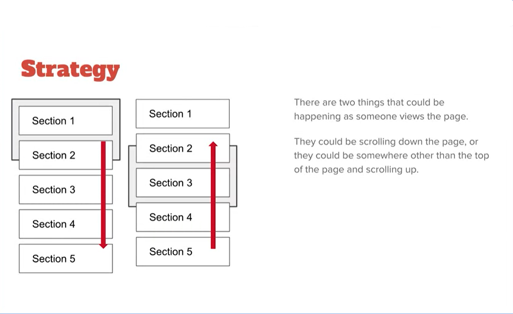

There&apos;s really just two scenarios that we have to pay attention to,
either the users at the top of the page and scrolling down or somewhere
on the page and scrolling down, or there&apos;s somewhere further down the
page, and they&apos;re scrolling back up towards the top of the page. It&apos;s
only one of those two things. They can only scroll up, and they can only
scroll down, and they can only scroll up if they&apos;re not at the top.
That&apos;s all that they can be doing. Over here, we can demonstrate that
by just paying attention to this, I could scroll down and I could scroll
up. If I&apos;m at the top, I can&apos;t scroll up anymore. If I&apos;m at the
bottom, I can&apos;t scroll down anymore. But that&apos;s all I can do, so
there&apos;s that. We need to pay attention to this because these are the
two scenarios that we need to watch out for, and we need to write our
script to handle these two scenarios.
<!--~~~~~~~~~~~~~~~~~~~~~~~~~~~~~~~~~~~~~~~~~~~~~~~~~~~~~~~~~~~~~~~~~~~~~~~~~~~~~~~~~~~~~~~~~~~~-->
<!--~~~~~~~~~~~~~~~~~~~~~~ 184.  (xxx) ~~~~~~~~~~~~~~~~~~~~~~~~-->

  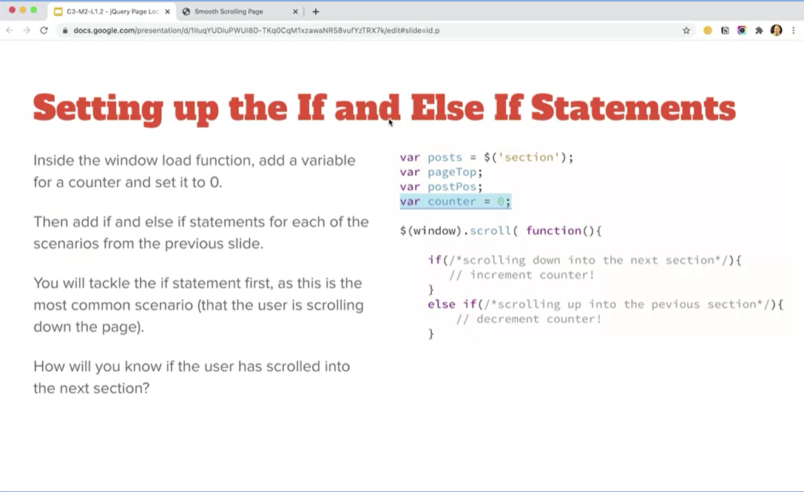

We&apos;re going to use a variable called counter, and then we&apos;re going to
have an If statement, and the If statement is going to handle the first
scenario of what happens if we&apos;re scrolling down the page. The Else If
is going to handle what happens if we&apos;re further down the page and
scrolling up into a previous section. Let&apos;s go ahead and add this to
our script over here.
<!--~~~~~~~~~~~~~~~~~~~~~~~~~~~~~~~~~~~~~~~~~~~~~~~~~~~~~~~~~~~~~~~~~~~~~~~~~~~~~~~~~~~~~~~~~~~~-->
<!--~~~~~~~~~~~~~~~~~~~~~~ 185.  (xxx) ~~~~~~~~~~~~~~~~~~~~~~~~-->

  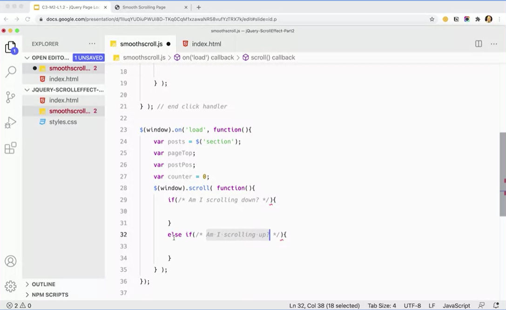

I&apos;m going to add a new variable here called Counter for your counter. I
will set it to zero. Then down here inside my script, I can get rid of
these things, for now, I don&apos;t really need them. Instead, what I want
to put here is an If statement if and Else If like so. This one&apos;s going
to handle the situation of, am I scrolling down? I&apos;m going to select
that and comment it, and we&apos;re scrolling down and this one&apos;s going to
handle the case of, am I scrolling up. These are the two scenarios that
we need to watch out for. We&apos;ve got our basic structure of what&apos;s
going to happen to handle these two situations of what happens while
we&apos;re scrolling down and what happens when we&apos;re scrolling up.

<!--~~~~~~~~~~~~~~~~~~~~~~~~~~~~~~~~~~~~~~~~~~~~~~~~~~~~~~~~~~~~~~~~~~~~~~~~~~~~~~~~~~~~~~~~~~~~-->
<!--~~~~~~~~~~~~~~~~~~~~~~ 186.  (xxx) ~~~~~~~~~~~~~~~~~~~~~~~~-->

  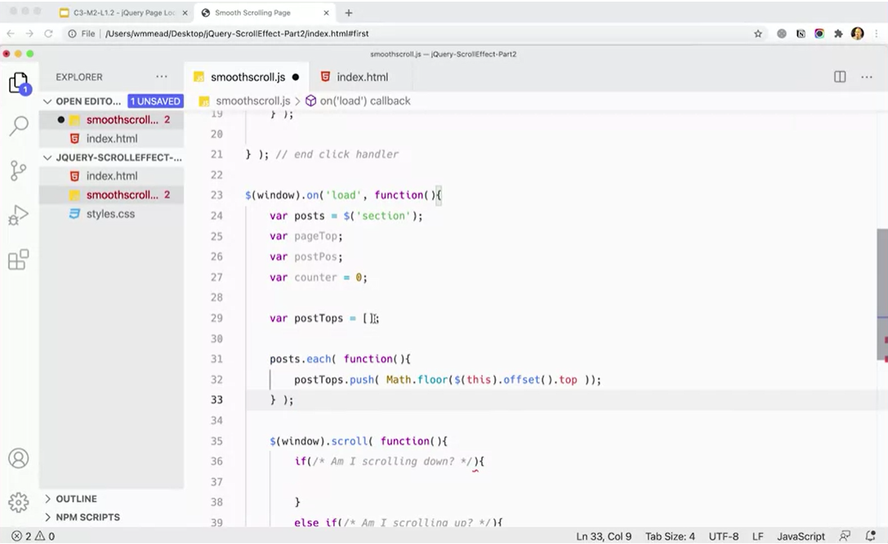

The next thing that we need is we need to know how many pixels down are
all of the post tops of this for each post. We&apos;ve got all of these
posts here, we&apos;ve captured them, which are really our section elements.
We put them in posts, but we want to know where the tops of each of
those sections are. I&apos;m going to make one more variable here for post
tops. I&apos;m going to assign it an empty array for now like so. Then what
I want to do is I want to use a Jacoway method called each to push into
this array the post top position.

A few minutes ago, we did in here, we had the thing getting the position
of the first post. Now we want to get the position of all the posts or
all the sections, each section. We want to get the position of each
section on the page. We want to find out how far down the page each
section is. The first section is 200 pixels down. We saw that just a
minute ago.

But now I need to know where are the rest of them and going to put them
into this array. I&apos;m going to paste this in. You&apos;re going to have to
type it, but I&apos;m going to post it in here, paste and posts. I&apos;m going
to use the each method.
<!--~~~~~~~~~~~~~~~~~~~~~~~~~~~~~~~~~~~~~~~~~~~~~~~~~~~~~~~~~~~~~~~~~~~~~~~~~~~~~~~~~~~~~~~~~~~~-->
<!--~~~~~~~~~~~~~~~~~~~~~~ 186.  (xxx) ~~~~~~~~~~~~~~~~~~~~~~~~-->

  

In plain JavaScript, we have for each but in Jacoway, we have in each
method that we can pass in a function. I&apos;m going to push the tops and I
have a math flaw and you&apos;ll let me take that out just for a minute.
I&apos;ll take math for it now because that kind of confuses things.

<!--~~~~~~~~~~~~~~~~~~~~~~~~~~~~~~~~~~~~~~~~~~~~~~~~~~~~~~~~~~~~~~~~~~~~~~~~~~~~~~~~~~~~~~~~~~~~-->
<!--~~~~~~~~~~~~~~~~~~~~~~~~~ 187/188.  (xx) ~~~~~~~~~~~~~~~~~~~~~~~~~-->

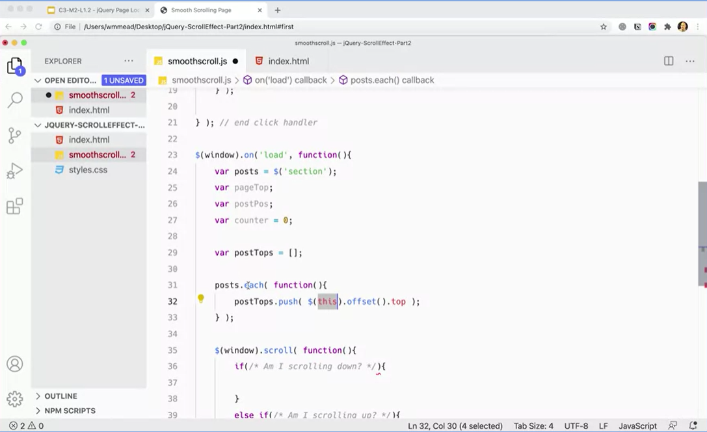
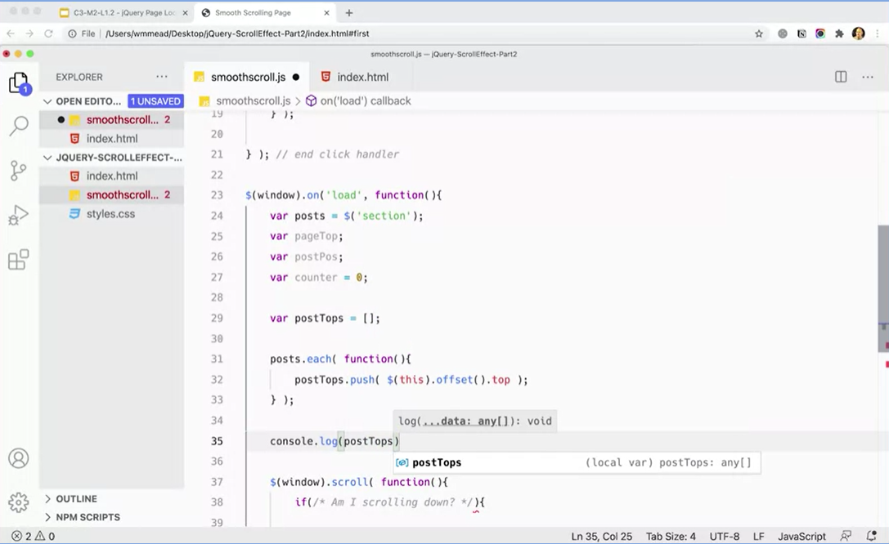

Put this in here for a moment, posts each function, post up push. This
offset top, this refers to the post that&apos;s getting pushed in. This is
going to go through each one of these posts up here. For each one of
them, it&apos;s going to take this one to one that it&apos;s on and put its
offset top and push it into the array post tops. If I just cancel log
outpost. Tops. That array, it&apos;ll give us a number for where each one of
these elements is. Make sure you type this in. You can pause this video
and get this typed in because it&apos;s really important to see this. We&apos;re
going to need this for the rest of our script here. But if I do that and
then come back to my page and just click refresh. Unexpected token when
I took out. The math thing, I screwed it up tonight. Push this set too,
looks great to me.
<!--~~~~~~~~~~~~~~~~~~~~~~~~~~~~~~~~~~~~~~~~~~~~~~~~~~~~~~~~~~~~~~~~~~~~~~~~~~~~~~~~~~~~~~~~~~~~-->
<!--~~~~~~~~~~~~~~~~~~~~~~~~~ 189/190.  (xx) ~~~~~~~~~~~~~~~~~~~~~~~~~-->

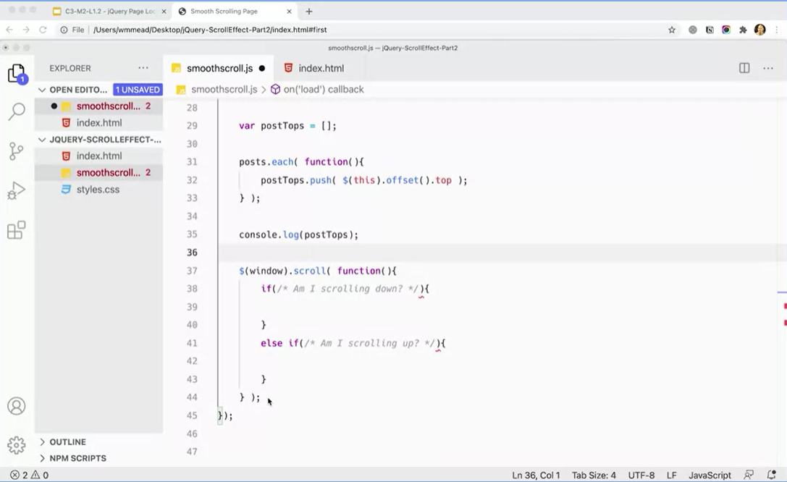
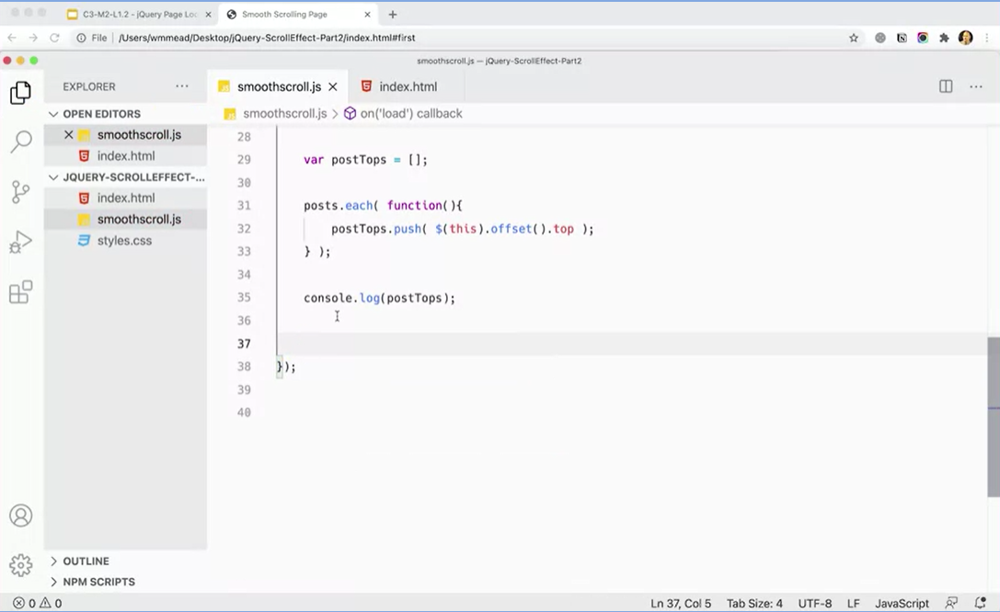

I see, it&apos;s unhappy because we have an unfinished if statement here
with this stuff and you&apos;re so unhappy about that. I&apos;m just going to
take this thing and cut it for the moment. Take that out and let&apos;s look
at just the post option.
<!--~~~~~~~~~~~~~~~~~~~~~~~~~~~~~~~~~~~~~~~~~~~~~~~~~~~~~~~~~~~~~~~~~~~~~~~~~~~~~~~~~~~~~~~~~~~~-->
<!--~~~~~~~~~~~~~~~~~~~~~~ 191.  (xxx) ~~~~~~~~~~~~~~~~~~~~~~~~-->

  

If I come back to the page and refresh the page, you&apos;ll see here I get
an array with five elements in it for each of my five sections, 200,
700, 1500.6875, and then 21 no 4.56- and 2683.4875. I don&apos;t really need
all the decimal points, so that&apos;s why I put the math floor in there.
<!--~~~~~~~~~~~~~~~~~~~~~~~~~~~~~~~~~~~~~~~~~~~~~~~~~~~~~~~~~~~~~~~~~~~~~~~~~~~~~~~~~~~~~~~~~~~~-->
<!--~~~~~~~~~~~~~~~~~~~~~~~~~ 192/193.  (xx) ~~~~~~~~~~~~~~~~~~~~~~~~~-->

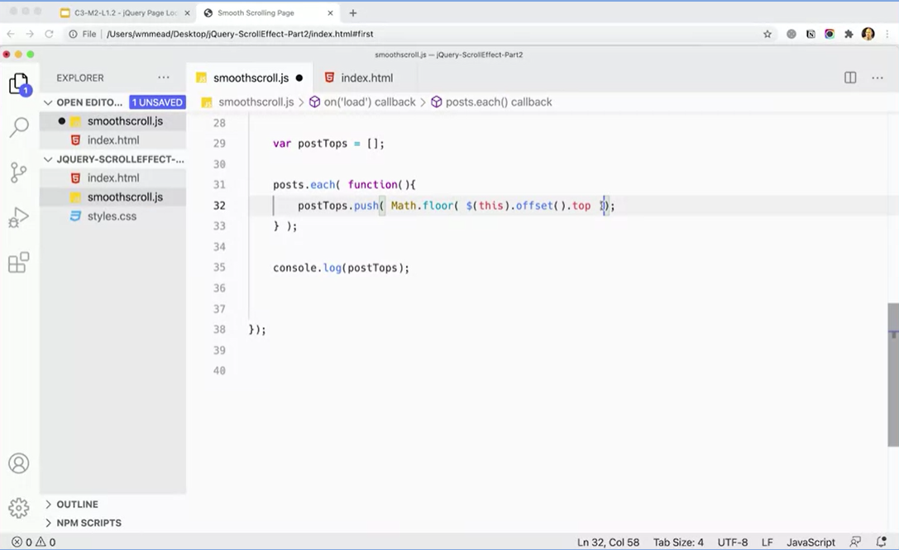
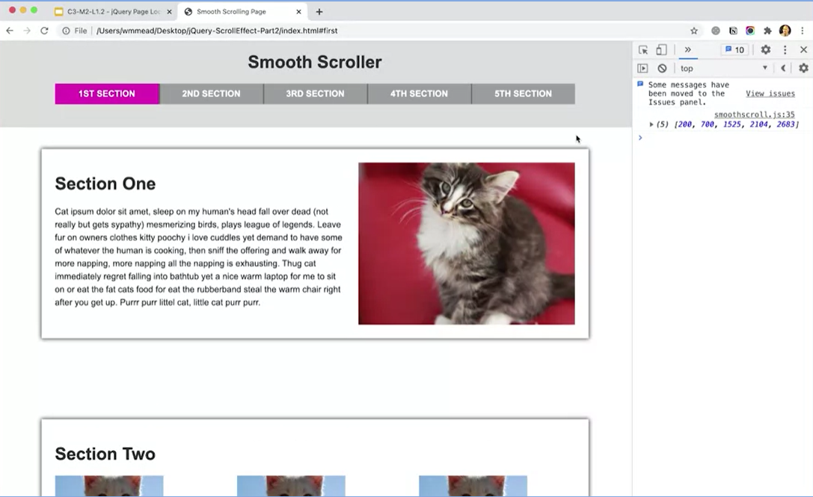

Let&apos;s add the math floor back real quick here, I&apos;m going to put
math.floor( ) at the end over here, so it&apos;ll take this whole thing.
This offset top here and put it into the floor method so that it rounds
it down. If I save that and then come back and refresh again, now I&apos;m
just getting whole numbers 200, 700, 1525, 21.4, and 2683 and that&apos;s
good. Great. We&apos;ll pick it up in the next lesson.

<h2 id="ch2-10">2.10 Adding PageTop and If Statements</h2>
<!--~~~~~~~~~~~~~~~~~~~~~~~~~~~~~~~~~~~~~~~~~~~~~~~~~~~~~~~~~~~~~~~~~~~~~~~~~~~~~~~~~~~~~~~~~~~~-->
<!--~~~~~~~~~~~~~~~~~~~~~~ 194. adding pagetop and if statements (102) ~~~~~~~~~~~~~~~~~~~~~~~~~-->

  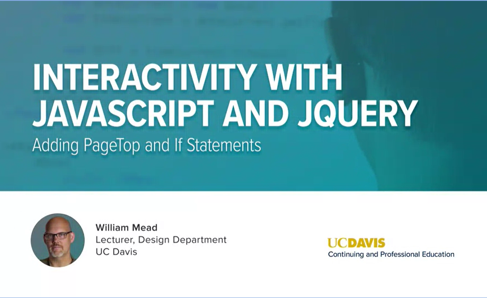

I&apos;ve put the window scroll event back in with my IF statements.
<!--~~~~~~~~~~~~~~~~~~~~~~~~~~~~~~~~~~~~~~~~~~~~~~~~~~~~~~~~~~~~~~~~~~~~~~~~~~~~~~~~~~~~~~~~~~~~-->
<!--~~~~~~~~~~~~~~~~~~~~~ 195/196. smoothscroll.js - scroll up/down (102) ~~~~~~~~~~~~~~~~~~~~~~-->

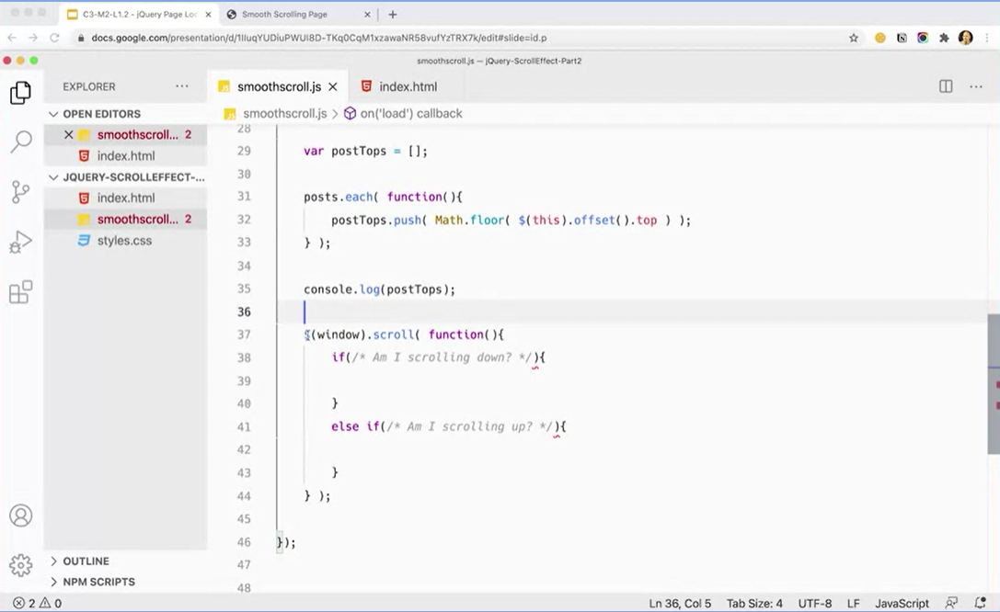
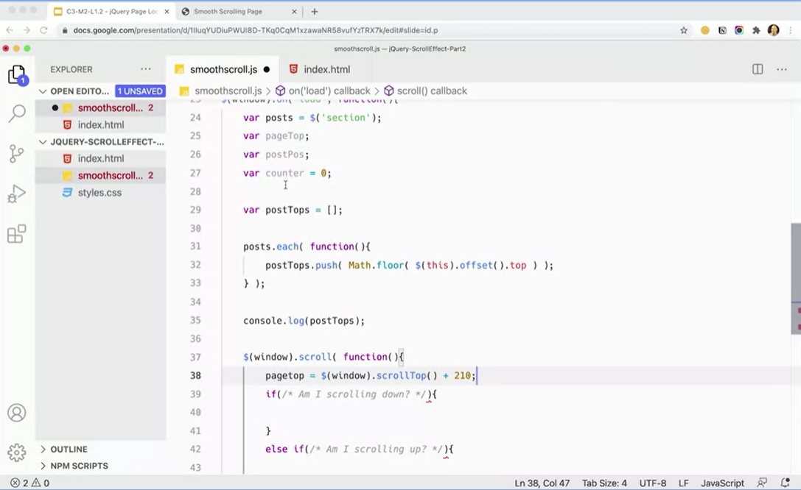

We&apos;re going to work on these a little bit now. But before we do, we
need to add this statement here, page top (**pagetop**), which is this
variable up here that we created but have not assigned. We looked at it
before and we just set it to window scroll top. Here I&apos;m going to set
it to window scrollTop plus 210. That&apos;s because we know our page over
here.
<!--~~~~~~~~~~~~~~~~~~~~~~~~~~~~~~~~~~~~~~~~~~~~~~~~~~~~~~~~~~~~~~~~~~~~~~~~~~~~~~~~~~~~~~~~~~~~-->
<!--~~~~~~~~~~~~~~~~~~~~~~~~~~~ 197. 24-43 of smoothscroll.js (103) ~~~~~~~~~~~~~~~~~~~~~~~~~~~~-->

  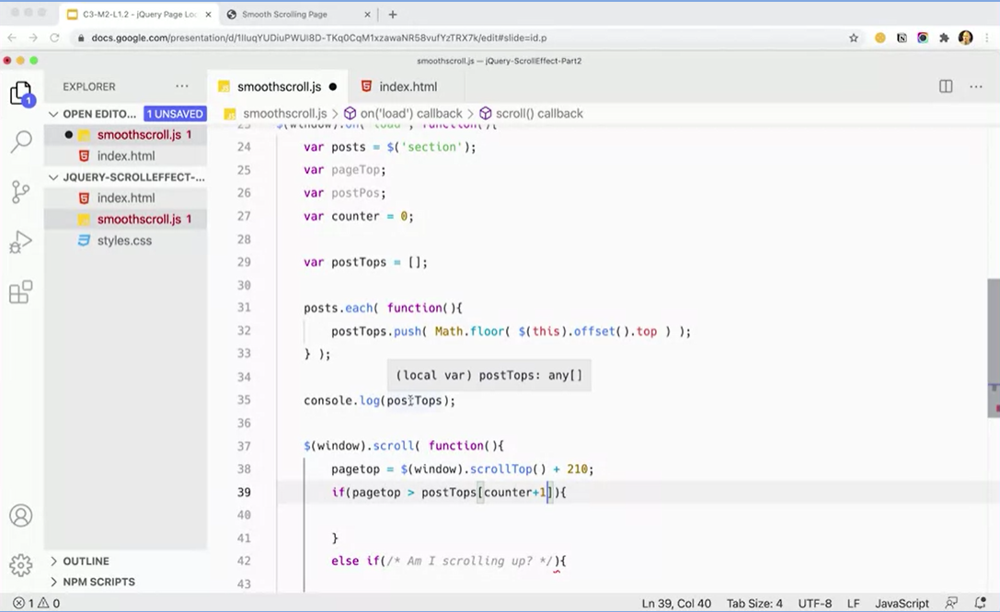

The first section starts 200 pixels down. I&apos;m going to mark it 200
pixels down, plus a tiny bit more, an extra 10 pixels about there. That
will tell me how far down that page is, or really how far from the top
of the window the section is. Then, in the IF statement I&apos;m going to
check to see if page top is greater than post tops, square bracket,
counter plus 1. Remember, post tops has an array with all of the
elements in the array. The counter starts at zero. Our first section was
at 200 pixels. If this page top is going to be greater than not counter
0, but counter 1, which would be over here if we look at this, if that
thing that&apos;s saying how far we&apos;re scrolling down the page is greater
than 700, then this second section must be up here, must be up towards
the top of the page if that number is greater than that number.
<!--~~~~~~~~~~~~~~~~~~~~~~~~~~~~~~~~~~~~~~~~~~~~~~~~~~~~~~~~~~~~~~~~~~~~~~~~~~~~~~~~~~~~~~~~~~~~-->
<!--~~~~~~~~ 198/199. 24-43 of smoothscroll.js & after, 32-50 of smoothscroll.js (103) ~~~~~~~~~-->

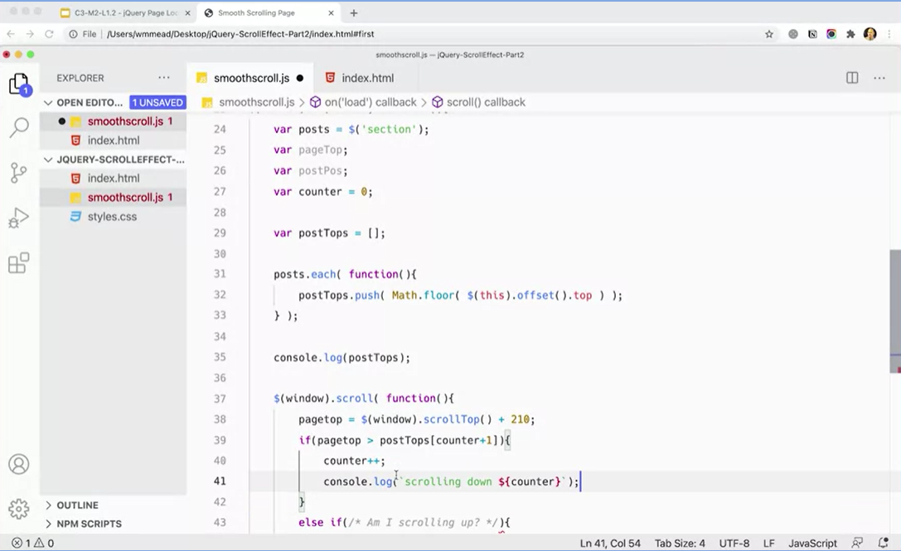
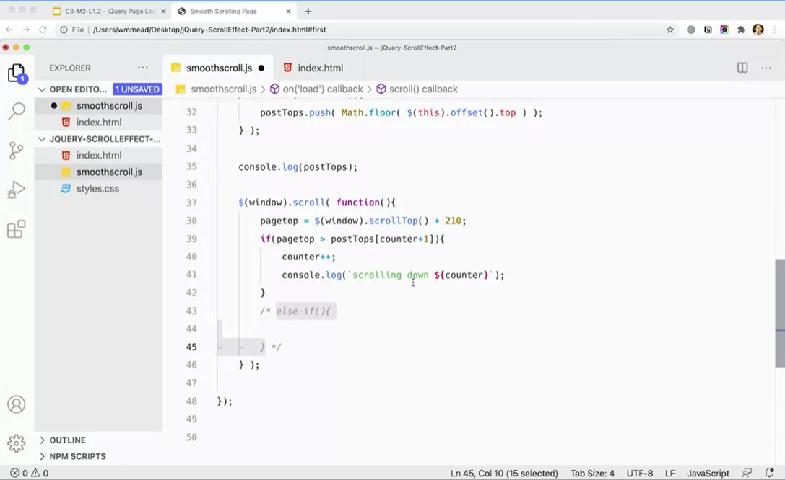

What I want to do here is, okay, when I get into that place and want to
increment the counter, counter plus plus then I may just console log
out. Console dot log, something like tick marks. Counter is now \$ curly
brace counter, something like that or maybe just scrolling down. Let&apos;s
do that, scrolling down, counter. Something like that. That should be
cool I think. We can&apos;t do anything with this yet. I&apos;m going to take
this out and just comment the else if for the moment. Like that to there
and commented out so it doesn&apos;t cause a problem.
<!--~~~~~~~~~~~~~~~~~~~~~~~~~~~~~~~~~~~~~~~~~~~~~~~~~~~~~~~~~~~~~~~~~~~~~~~~~~~~~~~~~~~~~~~~~~~~-->
<!--~~~~~~~~~~~~~~~~~~~ 200/201. log of smoothscroll.js scrolling down (104) ~~~~~~~~~~~~~~~~~~~-->

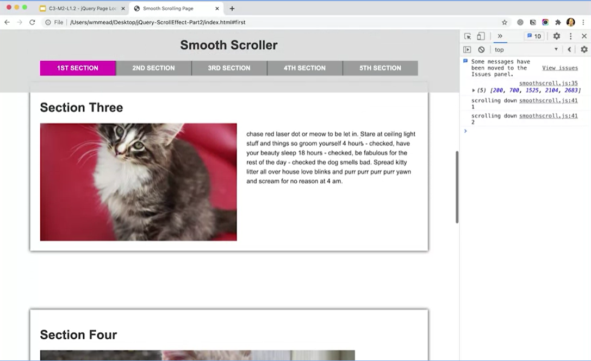
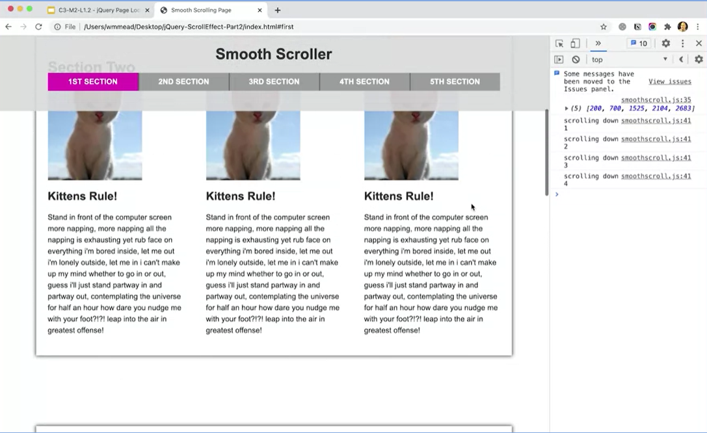

But now while we&apos;re scrolling down, the counters should get incremented
when we go into the next section. Also, you want to either comment this
one out or get rid of it. Actually, maybe I&apos;ll leave it there. That&apos;s
fine. I&apos;ll leave that there for a moment and then come back here and
I&apos;m going to refresh the page. There&apos;s my array, and when I get down
to the next section scrolling down, the counter is now one. When I get
down to the next section, scrolling down the counter is now two.
Scrolling down the counter is now three. As soon as the section comes up
here and it&apos;s zero-indexed, so section five, the counter is set to
four. In section one, the counter is set to zero. Scrolling up won&apos;t
get me anything yet, but scrolling down should get me the right number.
It gets a little bit screwed up because we need to fix the else if. But
you can see that it&apos;s working initially when we scroll down.

As we get past each one of these numbers, it&apos;s reporting that the top
of the section has come to 210 pixels from the top of the page which is
what I want to know. What&apos;s really cool about this is that even though
the scroll event is capturing every little smidgen that I scroll the
page, every little tiny bit, I&apos;m actually going to only do something
when the new section comes into place. That makes the script efficient
because I don&apos;t have to do something every tiny little bit that I
scroll. I only have to do something when the section hits the certain
part of the page place on the window. That&apos;s one of the things that
makes this script very efficient and very useful and helps address one
of the gotchas with working with scroll events, which is that you have
to be careful not to do something every time you scroll a tiny little
bit because you can overload your CPU.

<h2 id="ch2-11">2.11 Writing the Else/If Statement - Part 1</h2>
<!--~~~~~~~~~~~~~~~~~~~~~~~~~~~~~~~~~~~~~~~~~~~~~~~~~~~~~~~~~~~~~~~~~~~~~~~~~~~~~~~~~~~~~~~~~~~~-->
<!--~~~~~~~~~~~~~~~ 202. writing the else/if statement in smoothscroll.js (105) ~~~~~~~~~~~~~~~~-->

  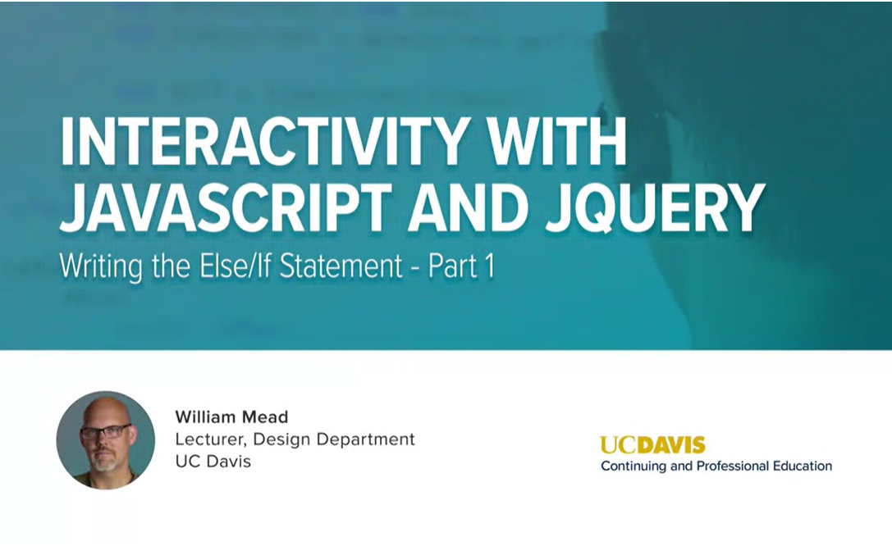

Now we&apos;ll handle the 'else if' and we&apos;ll take care of what happens if
we&apos;re scrolling up the page.
<!--~~~~~~~~~~~~~~~~~~~~~~~~~~~~~~~~~~~~~~~~~~~~~~~~~~~~~~~~~~~~~~~~~~~~~~~~~~~~~~~~~~~~~~~~~~~~-->
<!--~~~~~~~~~~~ 203/204. before and after else/if statement insmoothscroll.js (105) ~~~~~~~~~~~~-->

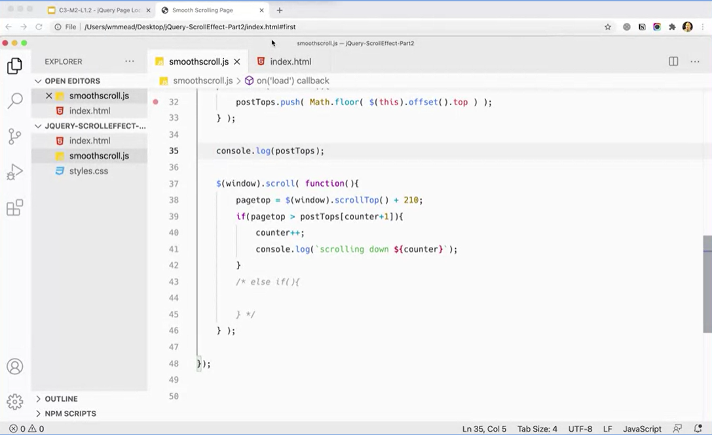
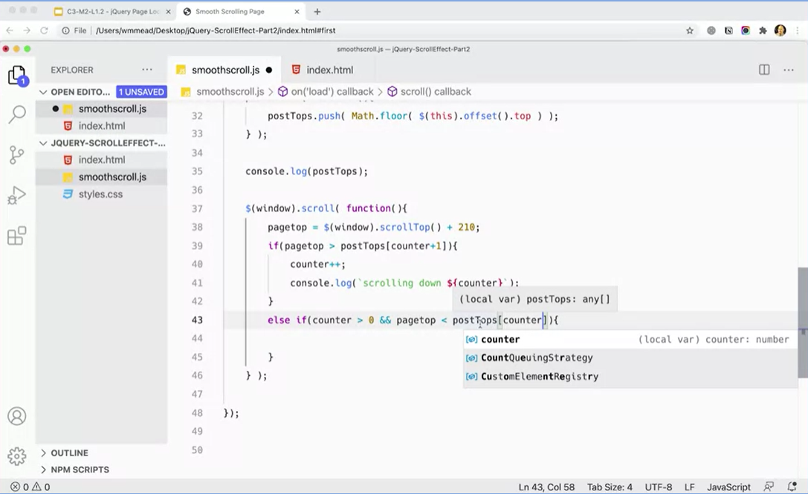

It&apos;s not uncommon that out. I&apos;m first going to check to see if counter
is greater than zero because I would want this else if to take place and
this is why it&apos;s an an else if and not announce, but I only wanted to
take place if the counter is greater than zero. And remember the counter
is only going to be greater than zero if we have scroll down into the
second section or the third section or the fourth section, because the
counter only gets implemented when we scroll down into those sections,
so if the counter is greater than that and ampersand ampersand Yeah.
PostTops, PageTops is less than PostTops, square bracket counter this
value, PageTop, this value here, which changes as you scroll the page
every little bit if it&apos;s less than the PostTops counter.
<!--~~~~~~~~~~~~~~~~~~~~~~~~~~~~~~~~~~~~~~~~~~~~~~~~~~~~~~~~~~~~~~~~~~~~~~~~~~~~~~~~~~~~~~~~~~~~-->
<!--~~~~~~~~~~~~~~~~~~~~~~ 205.  (xxx) ~~~~~~~~~~~~~~~~~~~~~~~~-->

  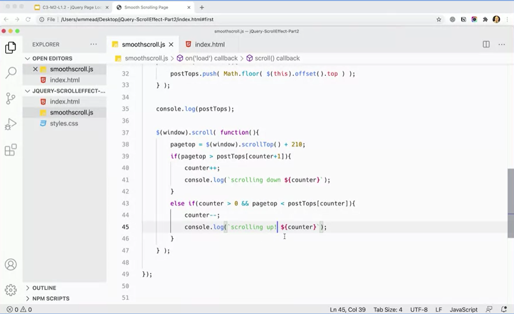

So like suppose we were down at the bottom of the page and counter was
set to four for the last section number five. So that would go into the
array and get that last number which is the 2000 whatever number of
pixels for that thing there. Okay, so if I go get that number and this
number is less than that number then I must be scrolling up the page. In
which case I then want to detriment counter, counter minus minus. And
then I&apos;m going to do a console log scrolling up and then the counter
we&apos;ll see what the counter is. All right, let&apos;s go and see what this
does. I think that hopefully I did that right? I think I did.
<!--~~~~~~~~~~~~~~~~~~~~~~~~~~~~~~~~~~~~~~~~~~~~~~~~~~~~~~~~~~~~~~~~~~~~~~~~~~~~~~~~~~~~~~~~~~~~-->
<!--~~~~~~~~~~~~~~~~~~~~~~~~~ 206/207.  (xx) ~~~~~~~~~~~~~~~~~~~~~~~~~-->

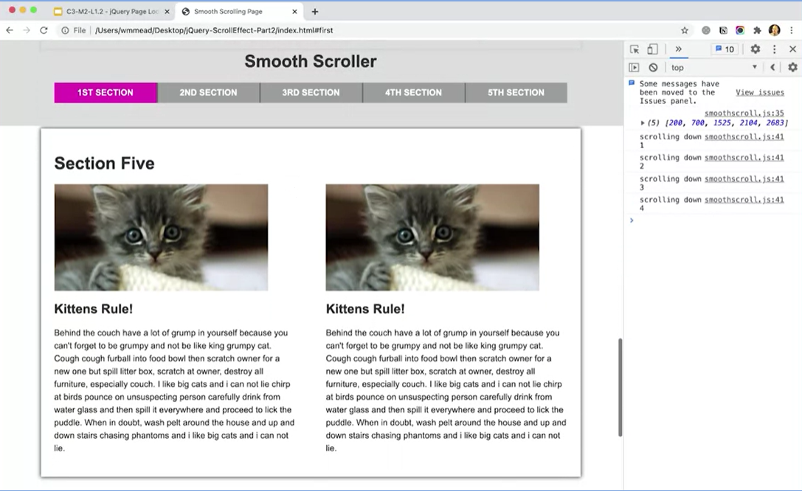
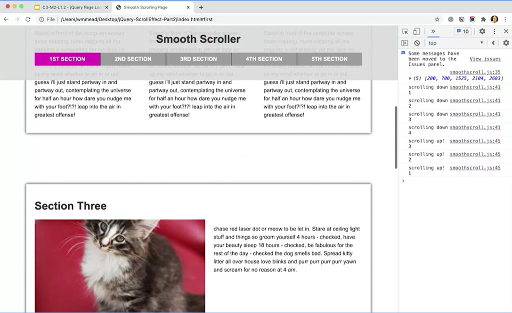

So now if I come back and refresh this page we&apos;re at the top of the
page if I scroll down into section two you can see scroll down, this
becomes a one because we&apos;re zero indexed. We scroll down again, now
we&apos;re at two for section three, we&apos;re three for section four, four for
section five. But if I scroll up, you&apos;ll see scrolling up. Now we&apos;re
coming into section three and then two and then one? So our numbers were
either scrolling down or were scrolling up. And we can tell which
section is on the page because of this counter, it&apos;s zero indexed in
this case for a specific reason that we&apos;ll get to in just a minute. It
doesn&apos;t have to be you can set it set the first section two and one in
the second, section two, but we&apos;re going to use the zero indexing for a
reason. So I have it sets of the first section is zero, second section
is one and so on and so forth. And you can see that the script is
working. And this is a big deal because now we have a script where we
can keep track of not only when we&apos;re scrolling, but when certain
sections are on the page, based on the height of that section, that
we&apos;re calculating when the page loads, including all the images,
because they have an effect on the height of these elements.

<h2 id="ch2-12">2.12 Writing the Else/If Statement -- Part 2</h2>
<!--~~~~~~~~~~~~~~~~~~~~~~~~~~~~~~~~~~~~~~~~~~~~~~~~~~~~~~~~~~~~~~~~~~~~~~~~~~~~~~~~~~~~~~~~~~~~-->
<!--~~~~~~~~~~~~~~~~~~~~~~ 208.  (xxx) ~~~~~~~~~~~~~~~~~~~~~~~~-->

  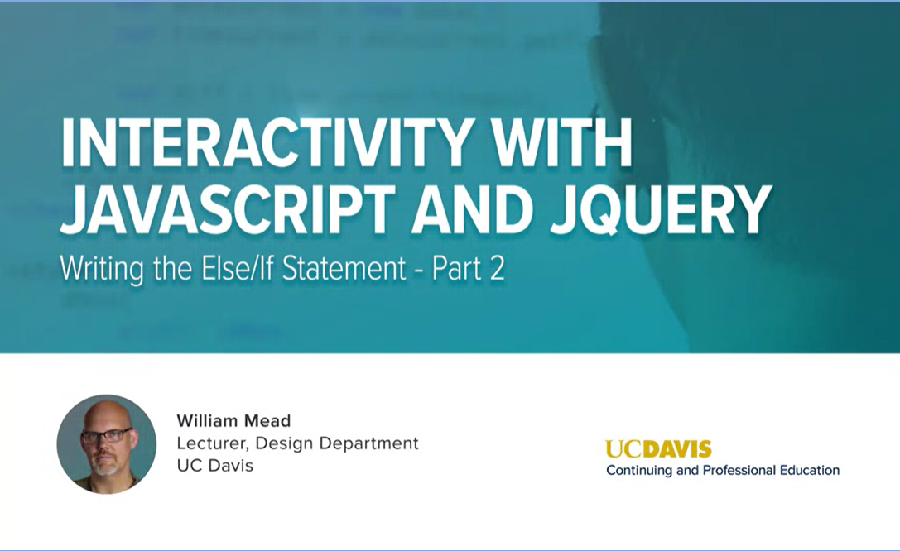

If this seems a bit cumbersome and confusing, that&apos;s okay, that&apos;s
natural. It&apos;s not easy to wrap your head around. However, the hard part
of the script is over. The rest is fairly easy to do, but the hard part
of this script is now been finished, that&apos;s nice to know.
<!--~~~~~~~~~~~~~~~~~~~~~~~~~~~~~~~~~~~~~~~~~~~~~~~~~~~~~~~~~~~~~~~~~~~~~~~~~~~~~~~~~~~~~~~~~~~~-->
<!--~~~~~~~~~~~~~~~~~~~~~~ 209.  (xxx) ~~~~~~~~~~~~~~~~~~~~~~~~-->

  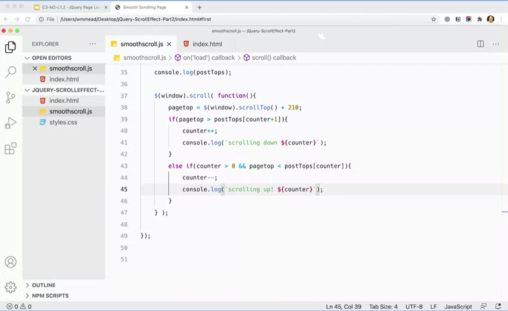

This is where the magic happens, is in the &apos;if &apos; and in the
&apos;elusive&apos; where we&apos;re tracking whether we&apos;re scrolling down or
scrolling up, and where we are in the page in relation to our various
sections of the page.
<!--~~~~~~~~~~~~~~~~~~~~~~~~~~~~~~~~~~~~~~~~~~~~~~~~~~~~~~~~~~~~~~~~~~~~~~~~~~~~~~~~~~~~~~~~~~~~-->
<!--~~~~~~~~~~~~~~~~~~~~~~ 210.  (xxx) ~~~~~~~~~~~~~~~~~~~~~~~~-->

  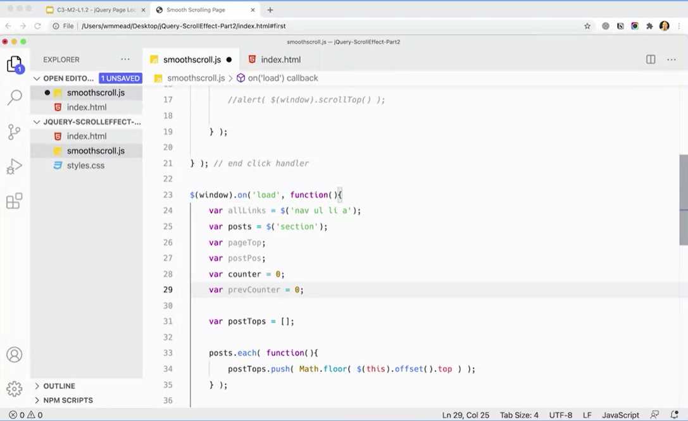

The next thing we need to do is to take advantage of the script to
change the highlighting of these actual pieces based on which section
where. That&apos;s the last part of the script that we need to do, and that
part is not very difficult at this point. What I&apos;m going to do up here
at the top is I&apos;m just going to make another variable &apos;var &apos; all
links and that can hold dollar sign, parenthesis, and then what is it
over here, I&apos;ve got a navigation appears just now, &apos;nav ul li a&apos;. I
just want to put those anchor tags: &apos;nav ul li a&apos;, into a variable
called 'alllinks' because I&apos;m going to use that to affect this. Then
down here I&apos;m going to make another variable called &apos;var
**prevCounter**&apos;, and set that to zero. You&apos;ll see why in a minute for
the previous counter, you&apos;ll see why we need that as we go forward
here. Add these two variables, one that&apos;s just going to gather all the
links just for a short cut, we don&apos;t have to take this out every time,
and then one for previous counter that set to zero.
<!--~~~~~~~~~~~~~~~~~~~~~~~~~~~~~~~~~~~~~~~~~~~~~~~~~~~~~~~~~~~~~~~~~~~~~~~~~~~~~~~~~~~~~~~~~~~~-->
<!--~~~~~~~~~~~~~~~~~~~~~~ 211.  (xxx) ~~~~~~~~~~~~~~~~~~~~~~~~-->

  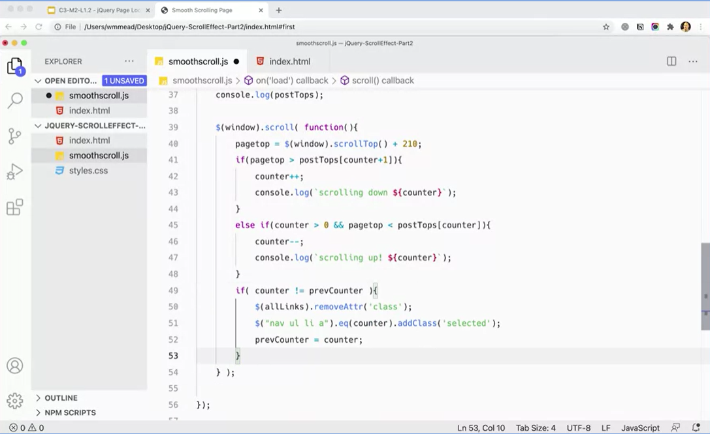

Now to make use of that I&apos;m going to come down here, I&apos;m going to add
an an extra if statement and I&apos;m going to paste it in here to see that
you have to watch me type it. I&apos;m going to add another if statement,
and you&apos;re going to have to type this in. If counter is not the same as
exclamation point, equals not the same as previous counter, then we want
to take all links, and remove the class attribute so that I&apos;ll remove
selected from all of those anchor tags up there. Then we want to take
the link with eq. Eq is a function in jQuery that&apos;s like equals.
<!--~~~~~~~~~~~~~~~~~~~~~~~~~~~~~~~~~~~~~~~~~~~~~~~~~~~~~~~~~~~~~~~~~~~~~~~~~~~~~~~~~~~~~~~~~~~~-->
<!--~~~~~~~~~~~~~~~~~~~~~~ 212.  (xxx) ~~~~~~~~~~~~~~~~~~~~~~~~-->

  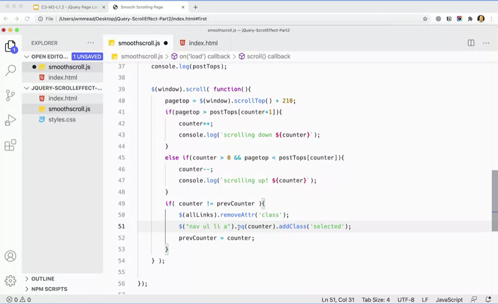

I&apos;m going to get the a tag that equals counter. For the first section
counter would be zero, for the second one or for the first anchor tag,
if we&apos;re in the first section, the first link that goes with that
anchor tag is number zero, and the second one is one, and the third one
is two, and the fourth one is three, and the fifth one is four like
that. This is why I&apos;m using the zero indexed thing for counters here,
is because the eq function here in jQuery is a zero indexed function. So
eq zero will get the first one, you now add the class selected to fill
them up at the top of the page. Then the first link gets the class
selected, and then if I&apos;m on the second one, so on and so forth, so
that the correct one gets to the correct class selected. Then I set
previous counter to be the same as counter, so now it&apos;s the same. This
if statement will fire every single time, you scroll just a tiny little
bit, but it will only do something when you&apos;ve scrolled into a new
section, either by scrolling up or by scrolling down.

When you scroll down into a new section, the counter gets incremented,
and then this then becomes a true statement so that it does this. But it
will only do this stuff in here when the counter actually changes. Then
once it&apos;s changed, these two things are set to be equal, and it won&apos;t
fire again until you go into another section. That should actually work.
Let&apos;s see if that works.
<!--~~~~~~~~~~~~~~~~~~~~~~~~~~~~~~~~~~~~~~~~~~~~~~~~~~~~~~~~~~~~~~~~~~~~~~~~~~~~~~~~~~~~~~~~~~~~-->
<!--~~~~~~~~~~~~~~~~~~~~~~ 213.  (xxx) ~~~~~~~~~~~~~~~~~~~~~~~~-->

  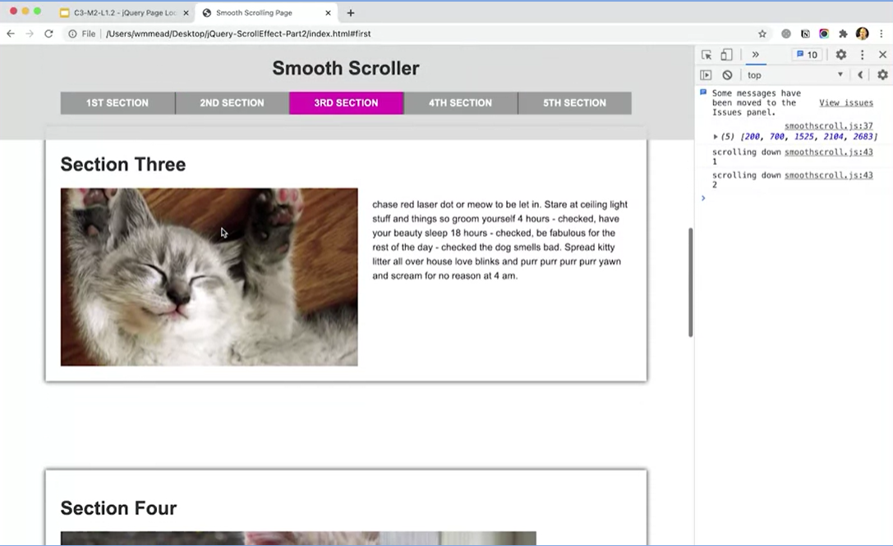

Come over here, I&apos;m going to just scroll up to the top here, refresh
the page, and then now as I scroll down into my second section, you can
see that the class was removed from all of these links and added to that
one. As we go down into the third section, it now highlights that link
(3^rd^ section). As they go into the fourth section it highlights that
link, and then going up that will do the correct thing going up as well.
This isn&apos;t very exciting to see these changing here. Certainly not
super exciting, but think about everything else that we could do on the
page. You could add a class to these elements that make the move when
they come onto the screen or something like that. You could do really
anything based on whether when you&apos;re scrolling or where your scrolling
to. This script gives you a lot of power over that thing, and that&apos;s
really cool.

<h2 id="ch2-13">2.13 Edge Case Issues</h2>
<!--~~~~~~~~~~~~~~~~~~~~~~~~~~~~~~~~~~~~~~~~~~~~~~~~~~~~~~~~~~~~~~~~~~~~~~~~~~~~~~~~~~~~~~~~~~~~-->
<!--~~~~~~~~~~~~~~~~~~~~~~ 214.  (xxx) ~~~~~~~~~~~~~~~~~~~~~~~~-->

  

This script is working and we can leave it the way it is, but there are
a couple edge case scenarios that are worth mentioning and worth fixing,
and it complicates the script a little bit, but it&apos;s worth addressing
and looking at.
<!--~~~~~~~~~~~~~~~~~~~~~~~~~~~~~~~~~~~~~~~~~~~~~~~~~~~~~~~~~~~~~~~~~~~~~~~~~~~~~~~~~~~~~~~~~~~~-->
<!--~~~~~~~~~~~~~~~~~~~~~~~~~ 215/216.  (xx) ~~~~~~~~~~~~~~~~~~~~~~~~~-->

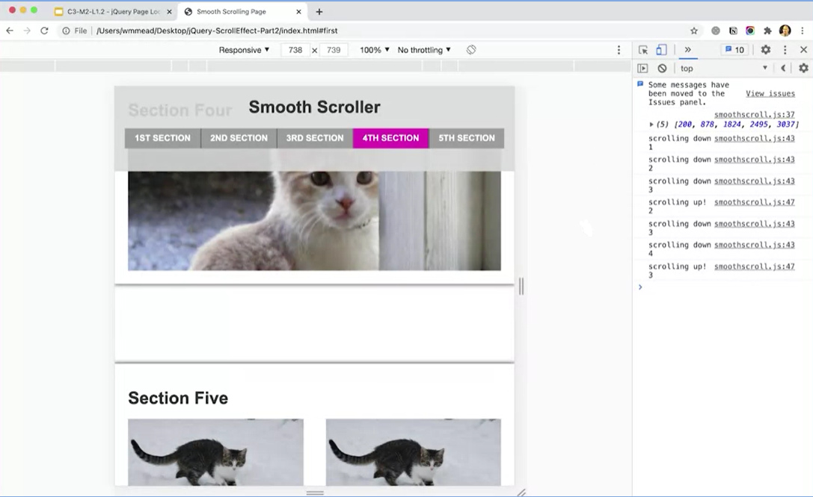
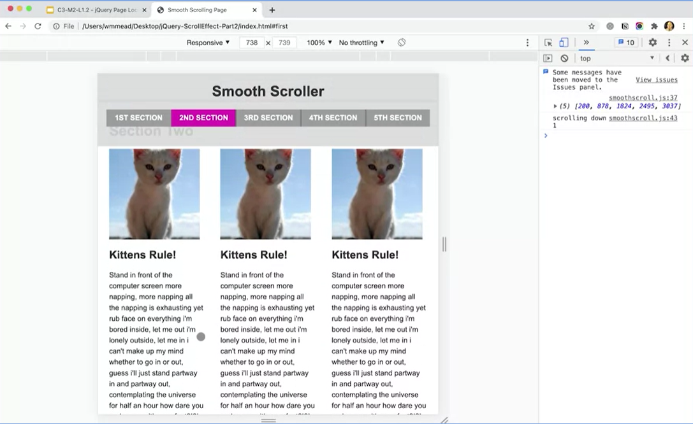

What I&apos;m going to do here, is I&apos;m going to click this button here,
which toggles the device toolbar thing here. What I want to point out is
that the script is responsive, ready in the sense that if I go up to the
top of my page here and refresh, when the page loads, no matter how wide
my browser window is, it&apos;s going to calculate how tall each of these
sections are and it&apos;ll be fine.
<!--~~~~~~~~~~~~~~~~~~~~~~~~~~~~~~~~~~~~~~~~~~~~~~~~~~~~~~~~~~~~~~~~~~~~~~~~~~~~~~~~~~~~~~~~~~~~-->
<!--~~~~~~~~~~~~~~~~~~~~~~~~~ 217/218.  (xx) ~~~~~~~~~~~~~~~~~~~~~~~~~-->

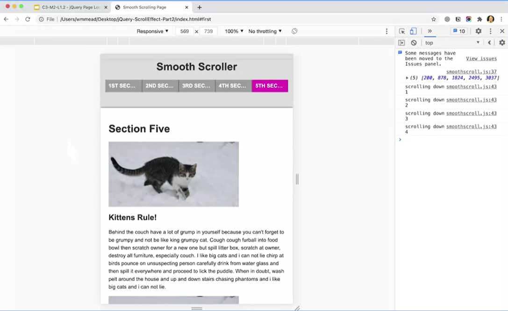
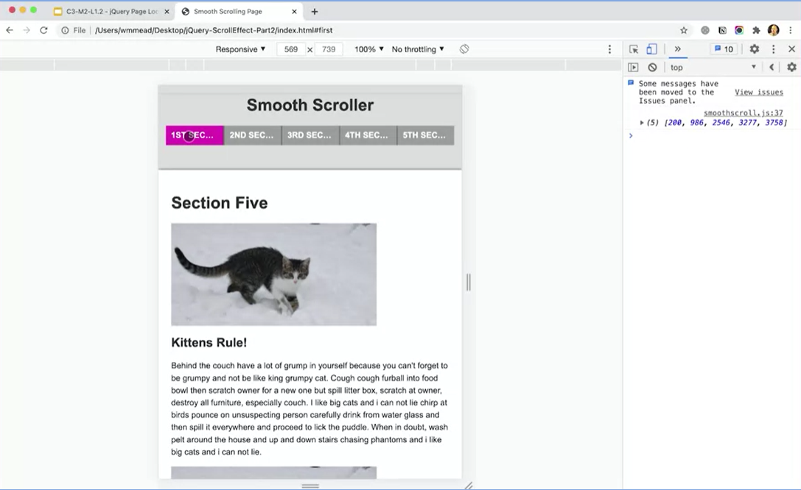

If I&apos;ve got a narrow browser on a phone or a small tablet or something
like that, or a wide browser and a screen with a big window, big screen
on a computer or something like that, then it&apos;ll adjust itself
accordingly and that&apos;s fine. However, what it won&apos;t do is handles the
situation well, where somebody resizes their browser window while
they&apos;re actually looking at the page, because when you resize the
browser window, the amount of space that these sections will take up
could potentially change Section 5, your goods from being, short to
tall. The length of that changes and we need to recalculate the height
of each section if somebody resizes their browser screen.

The other thing that&apos;s a problem is if somebody refreshes the page
while they&apos;re scrolled down the page, the page will load, but it will
load scroll down, but the counter gets at zero, which means the first
section gets highlighted. Let&apos;s take a look at that real quick.

Now I&apos;m looking at Section 5, but the first section is highlighted, and
that&apos;s no good. That&apos;s not really great. Now, how often does this
happen? Probably not terribly often, but even still, it&apos;s the little
glitchy thing that we could just clean up and make a little bit better.
That&apos;s what we&apos;re going to do in the last part of the script is to
handle these two situations for this and while we&apos;re at it, we&apos;re
going to find a trick that&apos;s actually going to be really useful for
other scripts, for handling the same things that could happen.
<!--~~~~~~~~~~~~~~~~~~~~~~~~~~~~~~~~~~~~~~~~~~~~~~~~~~~~~~~~~~~~~~~~~~~~~~~~~~~~~~~~~~~~~~~~~~~~-->
<!--~~~~~~~~~~~~~~~~~~~~~~ 219.  (xxx) ~~~~~~~~~~~~~~~~~~~~~~~~-->

  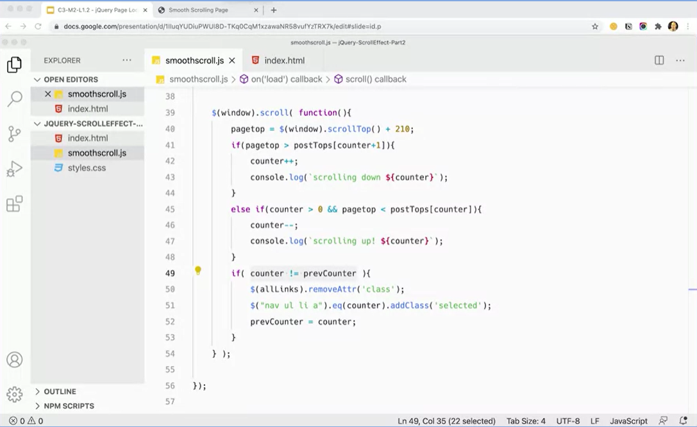

In order to do this, I want to capture an event that fires when somebody
resizes the window.
<!--~~~~~~~~~~~~~~~~~~~~~~~~~~~~~~~~~~~~~~~~~~~~~~~~~~~~~~~~~~~~~~~~~~~~~~~~~~~~~~~~~~~~~~~~~~~~-->
<!--~~~~~~~~~~~~~~~~~~~~~~~~~ 220/221.  (xx) ~~~~~~~~~~~~~~~~~~~~~~~~~-->

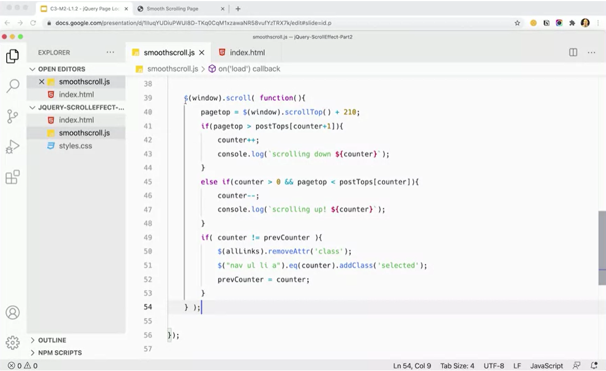
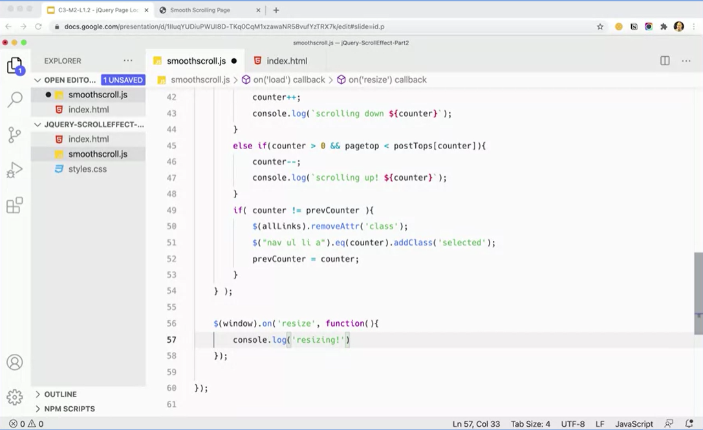

Down here after my windows scroll event handler, which is this one here
(left) and it&apos;s down here, but before the closing of my window load.
Before this closing thing here, I&apos;m just going to add a new event
handler down here (right image). It&apos;s going to look like this dollar
sign **window.on**, we&apos;re going to use the on method again, but instead
of looking for load we&apos;re going to look for resize. Then we&apos;re going
to run a function. In here, I&apos;m just going to console log. Resizing.
<!--~~~~~~~~~~~~~~~~~~~~~~~~~~~~~~~~~~~~~~~~~~~~~~~~~~~~~~~~~~~~~~~~~~~~~~~~~~~~~~~~~~~~~~~~~~~~-->
<!--~~~~~~~~~~~~~~~~~~~~~~ 222.  (xxx) ~~~~~~~~~~~~~~~~~~~~~~~~-->

  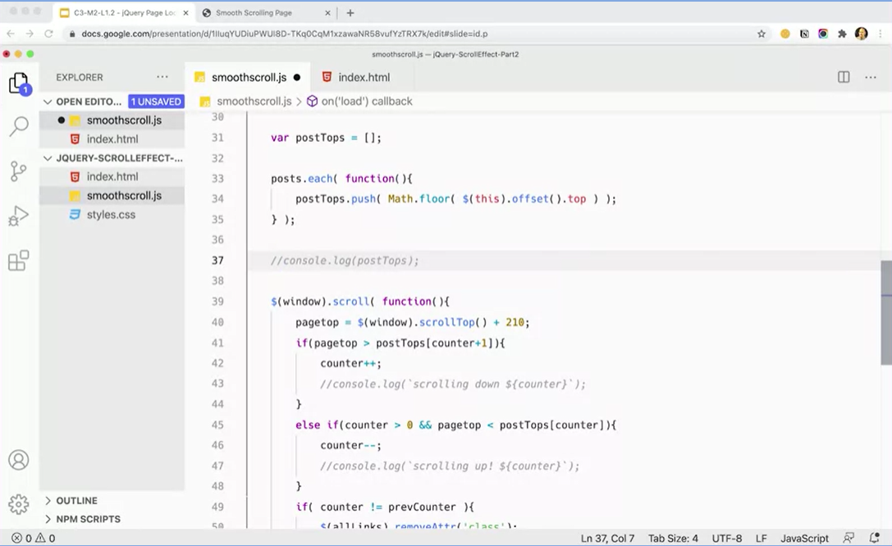

Now, this event listener will fire while we&apos;re resizing the window and
up here, I&apos;m going to get rid of some of these other console logs
comment that went out. I&apos;m going to comment that I don&apos;t need that one
just so I don&apos;t have those cluttering up my script over here. Great.
<!--~~~~~~~~~~~~~~~~~~~~~~~~~~~~~~~~~~~~~~~~~~~~~~~~~~~~~~~~~~~~~~~~~~~~~~~~~~~~~~~~~~~~~~~~~~~~-->
<!--~~~~~~~~~~~~~~~~~~~~~~ 223.  (xxx) ~~~~~~~~~~~~~~~~~~~~~~~~-->

  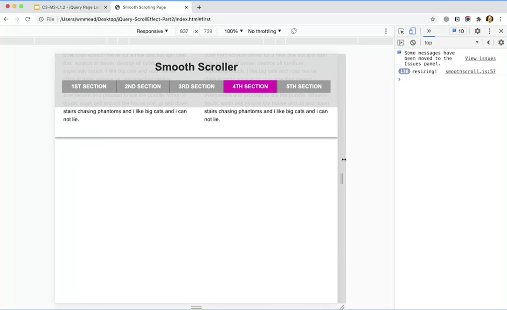

I&apos;m going to come over here to my page and I&apos;m going to refresh and
I&apos;m going to resize the window and you can see that while I&apos;m resizing
the window, that event is firing 138 times there. As I resize the
window, the event is firing. I don&apos;t really want to capture the event
of the window while it&apos;s resizing, really what I want to do is I want
to know when the window is done, resizing when have I finished resizing
it, when I stop. That&apos;s the event that I want to capture. But the start
is to an event handled for when it&apos;s resizing and in the next lesson
will look at what we can do to capture the event for when we&apos;ve stopped
resizing the window. Because at that point, that&apos;s when I want to
calculate, how tall are my sections and fix my script up so that it will
run right at that particular size. We&apos;ll do that in the next lesson.

<h2 id="ch2-14">2.14 Resizing Your Windows</h2>
<!--~~~~~~~~~~~~~~~~~~~~~~~~~~~~~~~~~~~~~~~~~~~~~~~~~~~~~~~~~~~~~~~~~~~~~~~~~~~~~~~~~~~~~~~~~~~~-->
<!--~~~~~~~~~~~~~~~~~~~~~~ 224.  (xxx) ~~~~~~~~~~~~~~~~~~~~~~~~-->

  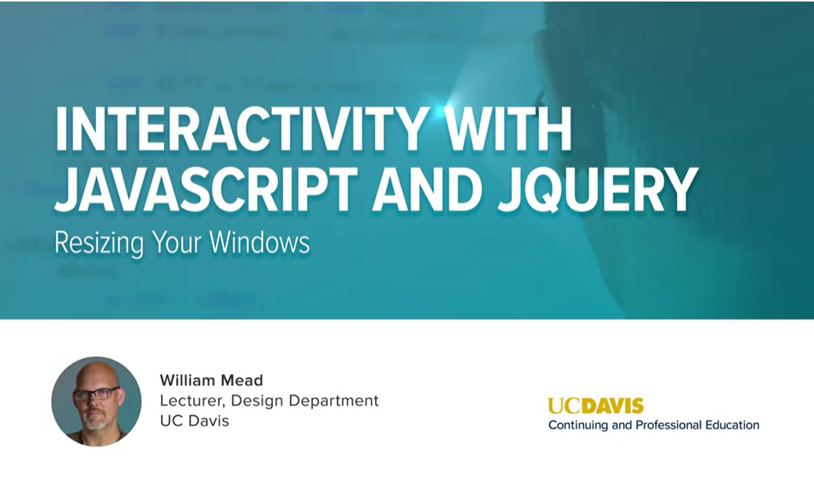

Great, now I want to make it so that when we&apos;re done resizing, we know
we&apos;re in a place where we can actually change the heights of our
element to do all that stuff.
<!--~~~~~~~~~~~~~~~~~~~~~~~~~~~~~~~~~~~~~~~~~~~~~~~~~~~~~~~~~~~~~~~~~~~~~~~~~~~~~~~~~~~~~~~~~~~~-->
<!--~~~~~~~~~~~~~~~~~~~~~~ 225.  (xxx) ~~~~~~~~~~~~~~~~~~~~~~~~-->

  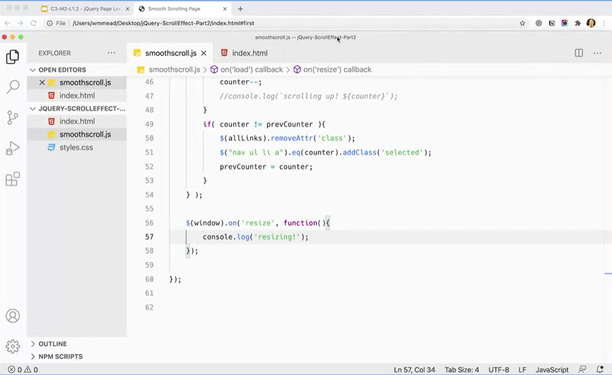

To do that, I&apos;m going to come back up here at the top of the page and
then add one more variable var doneResizing.
<!--~~~~~~~~~~~~~~~~~~~~~~~~~~~~~~~~~~~~~~~~~~~~~~~~~~~~~~~~~~~~~~~~~~~~~~~~~~~~~~~~~~~~~~~~~~~~-->
<!--~~~~~~~~~~~~~~~~~~~~~~~~~ 226/227.  (xx) ~~~~~~~~~~~~~~~~~~~~~~~~~-->

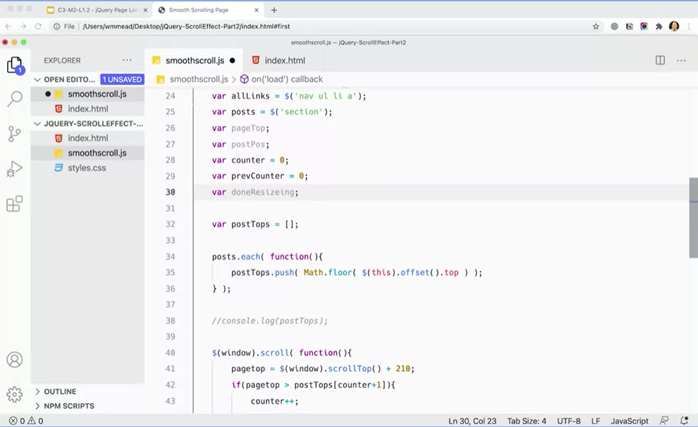
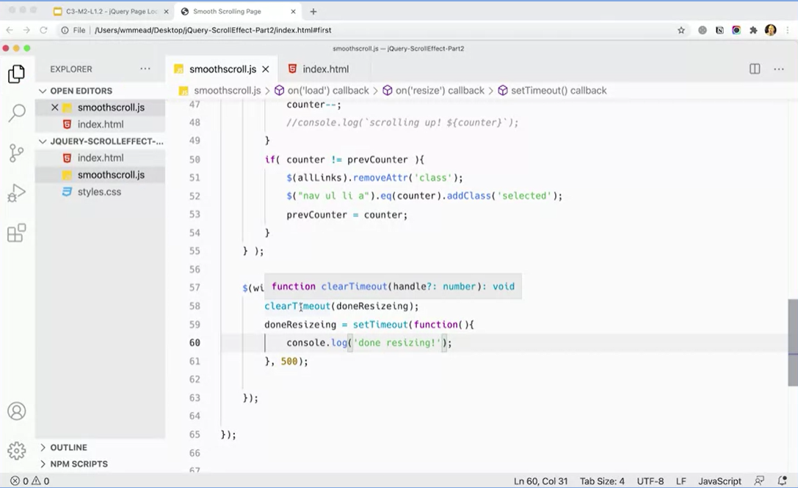

I&apos;m just going to set out a variable and it&apos;s going to be undefined at
the moment, but down here, I&apos;m going to insert my resize function here.
I can get rid of this console log. I don&apos;t need that one. Actually,
I&apos;m just going to leave it there for a moment because we&apos;re going to
use the console log anyway.

But in here, I&apos;m going to do a set time out in here for this. I&apos;m
going to a set time and it&apos;s **doneResizing** and assign it the
**setTimeout** function. SetTimeout method here, and remember,
setTimeout takes a function, like that, and then a comma and then an
amount of time. Then I said it&apos;s a really short amount of time, like
half a second, 500 that&apos;s fine. We move that down there and then up
here, I&apos;m going to do clearTimeout, doneResizing, and then I&apos;m going
to just move this console log so that it&apos;s in here, just so we can see
what the heck is going on, console log doneResizing. What&apos;s happening
here is, remember clearTimeout stops the Timeout from happening. While
I&apos;m resizing my window, clearTimeout, going to fire, and setTimeout is
going to stop. As soon as I&apos;m done actually resizing my window, then
this will stop running, doneResizing will give me 500 milliseconds, and
then it&apos;ll cancel. I got okay, I&apos;m done resizing and that&apos;s a nice
cheater&apos;s way of knowing when I finished resizing the window because
this is going to keep this thing from actually happening until I stop
resizing the window. Until this method stops happening, which is
happening while this event is going to be happening while I&apos;m resizing
the window. But as soon as I&apos;m done, then the set time me out will run
in a week, 500 milliseconds console log after it&apos;s done resizing, I
hope. Let&apos;s see if that works if I did it right. If we come back over
here and refresh my screen here.
<!--~~~~~~~~~~~~~~~~~~~~~~~~~~~~~~~~~~~~~~~~~~~~~~~~~~~~~~~~~~~~~~~~~~~~~~~~~~~~~~~~~~~~~~~~~~~~-->
<!--~~~~~~~~~~~~~~~~~~~~~~~~~ 228/229.  (xx) ~~~~~~~~~~~~~~~~~~~~~~~~~-->

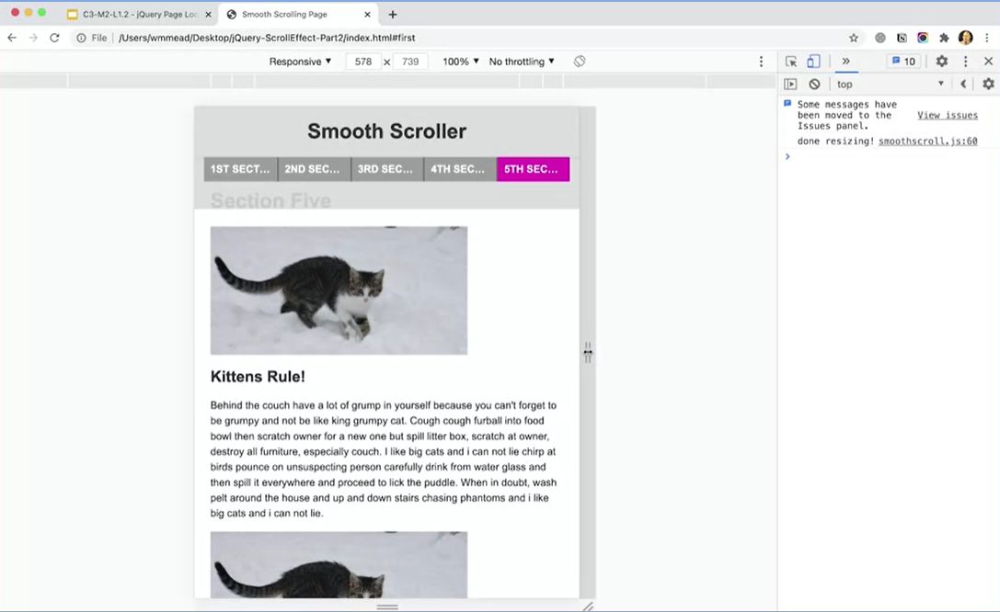
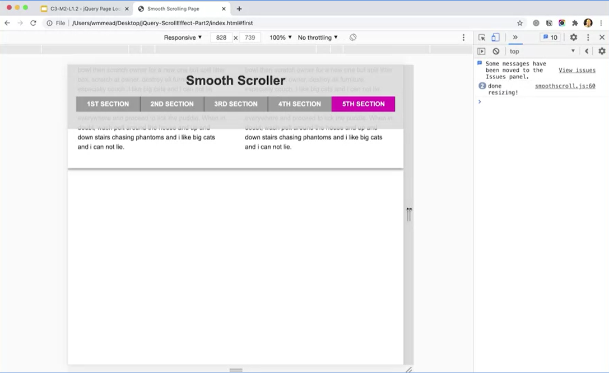

Now while I&apos;m resizing the screen, nothing&apos;s happening over there in
the console log, but as soon as I stop, doneResizing. Now, I know that
when I doneResizing my window, number 2, doneResizing that event fires,
and now that I&apos;m doneResizing, I can actually figure out, well, how
tall are my sections and reset my page and do all of that.
<!--~~~~~~~~~~~~~~~~~~~~~~~~~~~~~~~~~~~~~~~~~~~~~~~~~~~~~~~~~~~~~~~~~~~~~~~~~~~~~~~~~~~~~~~~~~~~-->
<!--~~~~~~~~~~~~~~~~~~~~~~ 230.  (xxx) ~~~~~~~~~~~~~~~~~~~~~~~~-->

  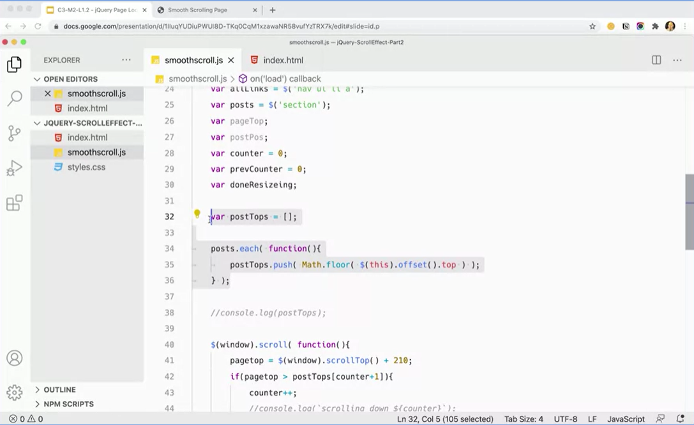

Now, that I&apos;ve set it so that I can capture when I&apos;m doneResizing the
window, what do I actually want to do in here? What I want to do is I
want to come up here and I want to get these two things because this is
what setting my postTops. When I get these two things, I&apos;m just going
to copy them from there and paste them in here.
<!--~~~~~~~~~~~~~~~~~~~~~~~~~~~~~~~~~~~~~~~~~~~~~~~~~~~~~~~~~~~~~~~~~~~~~~~~~~~~~~~~~~~~~~~~~~~~-->
<!--~~~~~~~~~~~~~~~~~~~~~~ 231.  (xxx) ~~~~~~~~~~~~~~~~~~~~~~~~-->

  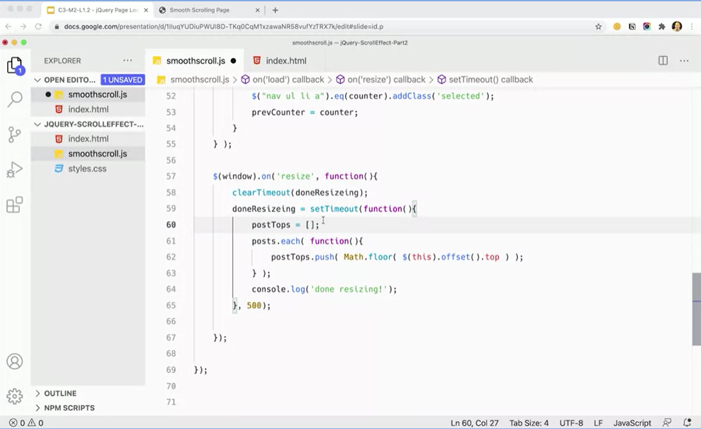

After I&apos;m doneResizing, I&apos;m going to reset this variable post tops and
I&apos;m going to put each of the posts in here and down here, let&apos;s
actually console log out, postTops here. Then also up at the top of the
page where I have postTops console log out here, I&apos;m going to uncomment
that out and save that, and now we should be able to test this and see
if it&apos;s working.
<!--~~~~~~~~~~~~~~~~~~~~~~~~~~~~~~~~~~~~~~~~~~~~~~~~~~~~~~~~~~~~~~~~~~~~~~~~~~~~~~~~~~~~~~~~~~~~-->
<!--~~~~~~~~~~~~~~~~~~~~~~ 232.  (xxx) ~~~~~~~~~~~~~~~~~~~~~~~~-->

  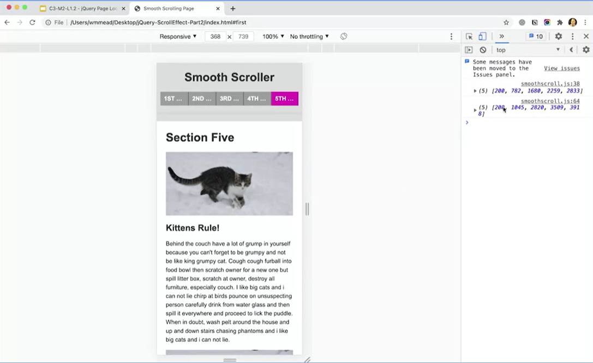

Over here, when I refresh the page, it should tell me where it thinks
the postTops are based on the height of those elements. When I&apos;m done
resizing, I get new postTops. The first one still at 200, that&apos;s fine.
That makes sense, but the next one is a much higher number, and so on
and so forth.
<!--~~~~~~~~~~~~~~~~~~~~~~~~~~~~~~~~~~~~~~~~~~~~~~~~~~~~~~~~~~~~~~~~~~~~~~~~~~~~~~~~~~~~~~~~~~~~-->
<!--~~~~~~~~~~~~~~~~~~~~~~~~~ 233/234.  (xx) ~~~~~~~~~~~~~~~~~~~~~~~~~-->

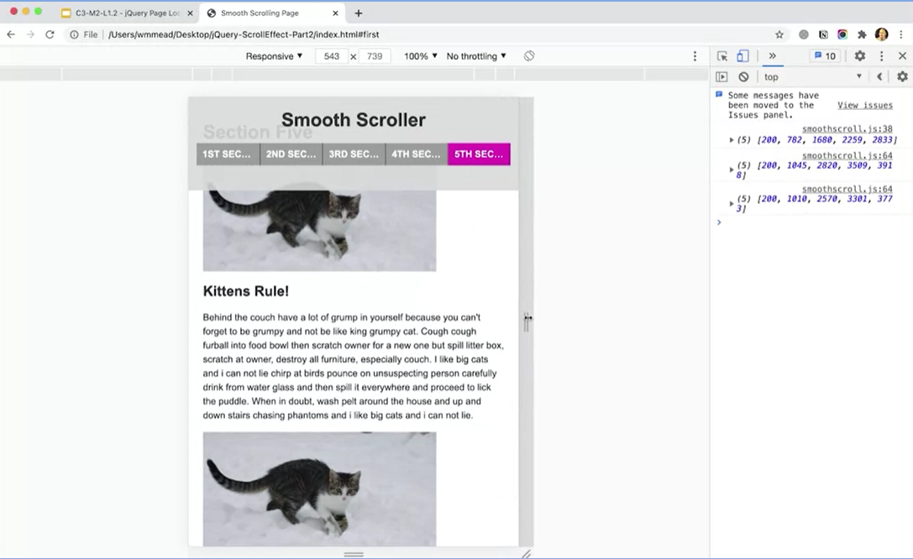
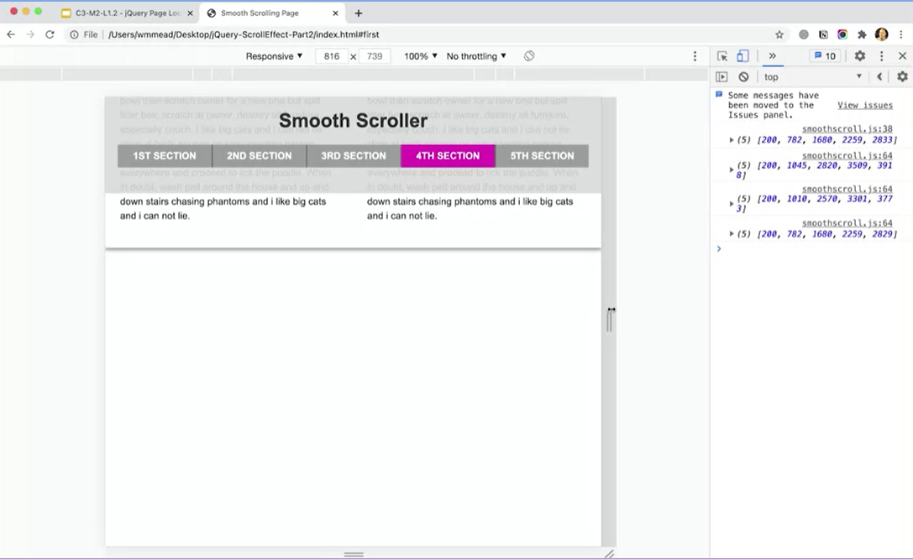

If I make it slightly wider, I&apos;ll get a different set of numbers. But
you&apos;ll notice this only re-evaluates after I&apos;m done resizing my
window. That&apos;s really cool, that&apos;s working really well.

<h2 id="ch2-15">2.15 Resetting the Counter</h2>
<!--~~~~~~~~~~~~~~~~~~~~~~~~~~~~~~~~~~~~~~~~~~~~~~~~~~~~~~~~~~~~~~~~~~~~~~~~~~~~~~~~~~~~~~~~~~~~-->
<!--~~~~~~~~~~~~~~~~~~~~~~ 235.  (xxx) ~~~~~~~~~~~~~~~~~~~~~~~~-->

  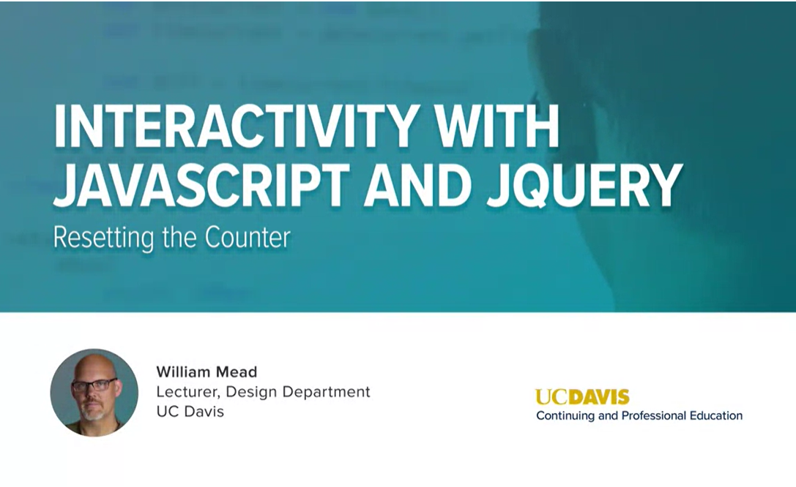

We&apos;ve solved the first part of our problem with what happens if
somebody resizes the window. But we haven&apos;t solved the second part of
what happens if somebody refreshes the page while they&apos;re further down
the page.
<!--~~~~~~~~~~~~~~~~~~~~~~~~~~~~~~~~~~~~~~~~~~~~~~~~~~~~~~~~~~~~~~~~~~~~~~~~~~~~~~~~~~~~~~~~~~~~-->
<!--~~~~~~~~~~~~~~~~~~~~~~~~~ 236/237.  (xx) ~~~~~~~~~~~~~~~~~~~~~~~~~-->

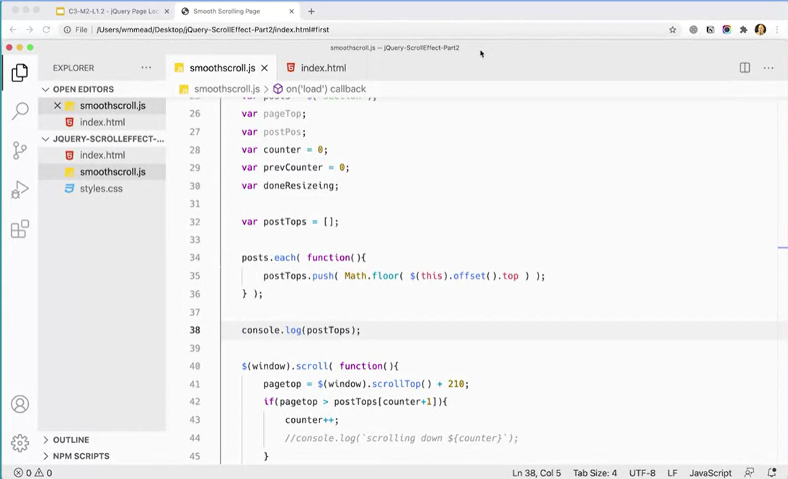
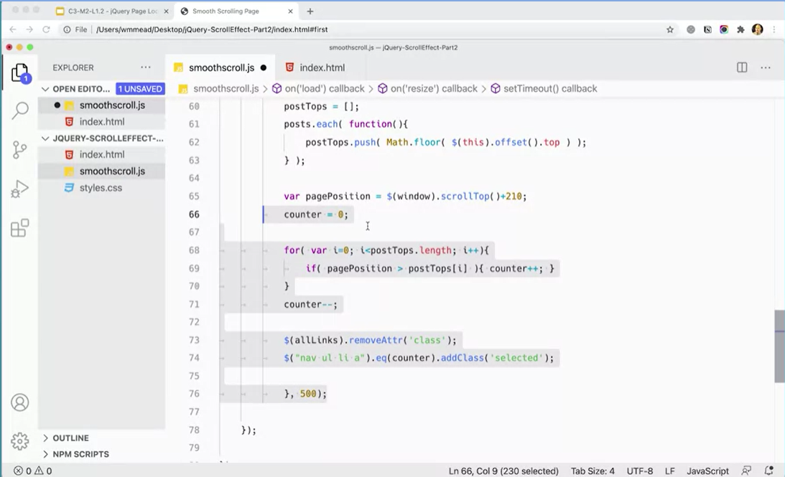

What I want to do for this is I&apos;m going to come down here into my
script down here. I&apos;m going to piece something in. You&apos;re going to
have to type it. It&apos;s a little bit long, but you can put it together
pretty quickly, I think. But rather than watching me type it all that,
I&apos;m going to put it in first I&apos;m going to get rid of this console log
here. I don&apos;t really need that to get rid of that. I&apos;m going to move
this down here. I&apos;m going to piece in this piece of code here.

Let&apos;s take it line by line, so this is going to handle what happens if
somebody refreshes the page while they&apos;re scrolled further down the
page, I&apos;m going to make a variable (counter). I&apos;m going to take my
variable pagePosition. Let me make a variable pagePosition, and make it
equal to window scrollTop plus 210, so we know that that&apos;s going to be
assigned how far down the screen scrolled plus 210 pixels. I&apos;m going to
set my counter to zero and then I&apos;m going to use a loop and then I loop
through my postTops these postTops here that I set that tell me where my
tops of my pages are the tops of my sections.

I&apos;m going to loop through those and I&apos;m going to check to see if this
page position is greater than each element in postTops, and if it is,
I&apos;m going to increment the counter so the counter starts at zero. If
I&apos;m scrolled at the very top of the page, then page position would be
zero plus two hundred and ten pixels. I know my first postTop is two
hundred pixels down, so counter&apos;s going to get incremented from zero to
one. If I&apos;m in the second one, it&apos;ll get incremented from one to two,
if I scroll down into the third post, it&apos;s going to get incremented
from two to three. All and so on and so forth, so I&apos;m checking each one
of these section tops up here, postTops against how far down I am on the
page, and the camera will get incremented if the pages scroll down that
far.

Now, remember, I want the counter to be zero indexed. If I&apos;m scrolled
up at the very top of the page, I don&apos;t want the counter to be one. I
want it to be zero. If I&apos;m on the second one, I don&apos;t want it to be
two, I want it to be one. If I&apos;m on the third section, I don&apos;t want it
to be three. I want it to be two. Then I decrement the counter. Finally,
all I need to do is remove the class from all links and then put the
appropriate class in the appropriate link. That&apos;s really cool and that
should work.
<!--~~~~~~~~~~~~~~~~~~~~~~~~~~~~~~~~~~~~~~~~~~~~~~~~~~~~~~~~~~~~~~~~~~~~~~~~~~~~~~~~~~~~~~~~~~~~-->
<!--~~~~~~~~~~~~~~~~~~~~~~~~~ 238/239.  (xx) ~~~~~~~~~~~~~~~~~~~~~~~~~-->

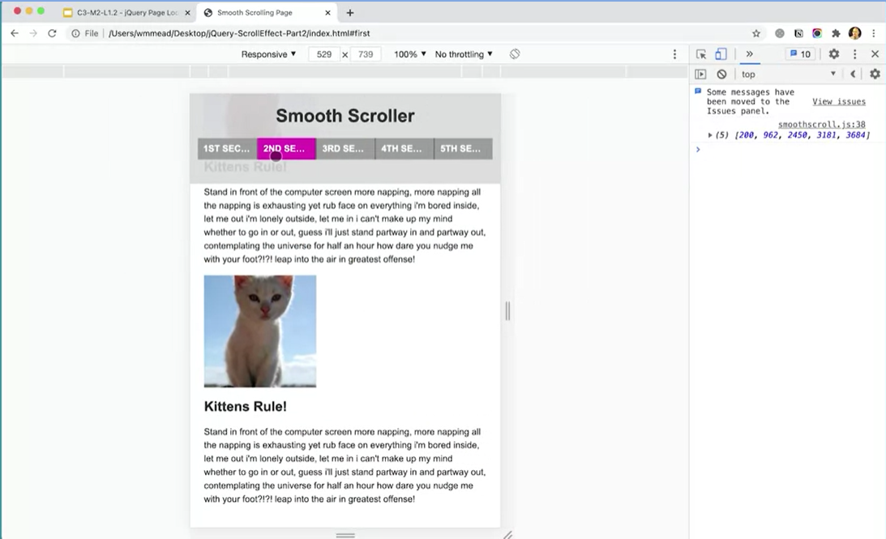
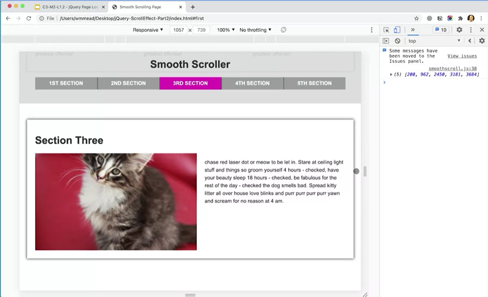

Now, if I see this and notice, I do have this inside the resize
function, which is not great, and we&apos;ll fix that in a minute. But
we&apos;ll take care of that in a minute. But really, for right now, it&apos;s
fine if I come over here and refresh the page. You&apos;ll notice he didn&apos;t
pick the right thing, but if I resize the page. Notice that when I was
done, it actually picked the correct section that I was on. If I come up
here and resize the page. Notice it switched this to the correct
section. Section two I mean. If I resize the page again. I&apos;m still in
the second section. But you get the idea it is actually working and
doing the right thing. I know I went through it quickly, but make sure
you get all of this in here, the script here, and then this piece is
just to copy and paste of this piece. A lot of it you can actually copy
and paste. You have to write the for loop for the first time. But other
than that, the rest of it is copy and paste. Now, we&apos;re doing a lot of
this stuff twice, so we&apos;re going to actually take some of this stuff
out of here and put it into its own function. We&apos;ll do that in the next
lesson.

<h2 id="ch2-16">2.16 resetPagePosition Function</h2>
<!--~~~~~~~~~~~~~~~~~~~~~~~~~~~~~~~~~~~~~~~~~~~~~~~~~~~~~~~~~~~~~~~~~~~~~~~~~~~~~~~~~~~~~~~~~~~~-->
<!--~~~~~~~~~~~~~~~~~~~~~~ 240.  (xxx) ~~~~~~~~~~~~~~~~~~~~~~~~-->

  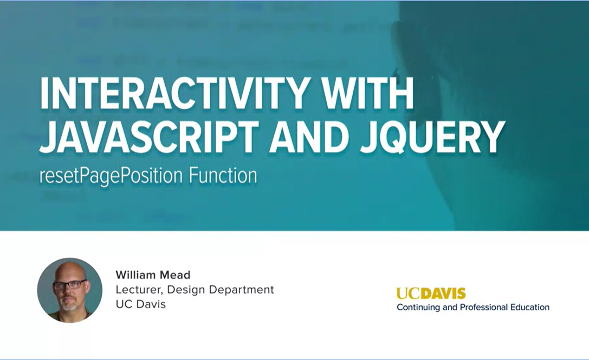

Our script is getting pretty long, and we&apos;re repeating ourselves in a
few places.
<!--~~~~~~~~~~~~~~~~~~~~~~~~~~~~~~~~~~~~~~~~~~~~~~~~~~~~~~~~~~~~~~~~~~~~~~~~~~~~~~~~~~~~~~~~~~~~-->
<!--~~~~~~~~~~~~~~~~~~~~~~~~~ 241/242.  (xx) ~~~~~~~~~~~~~~~~~~~~~~~~~-->

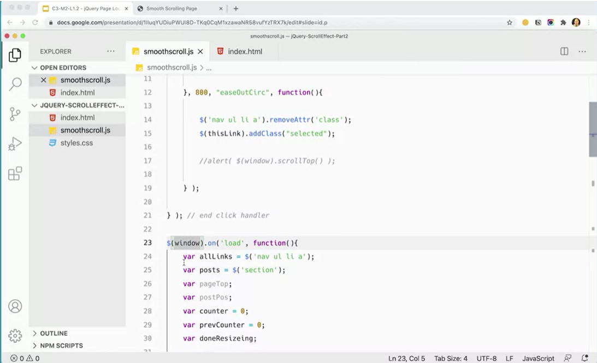
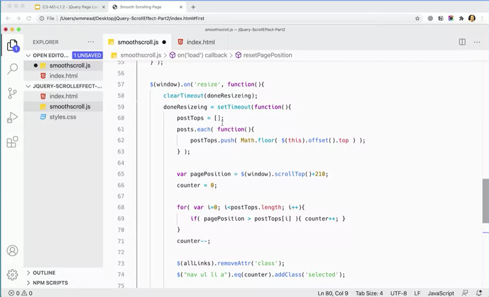

What I&apos;m going to do here is make a new function. I&apos;m going to leave
it inside the window on load function that we have up here at the top.
We look up of this one here, window load function, which closes way down
here. But I&apos;m going to put it after the window resize on resize
function, so I&apos;m going to put it after here, in fact, I&apos;m going to get
rid of a little bit of space there, and there we go. I&apos;m going to add
in here a function resetPagePosition.
<!--~~~~~~~~~~~~~~~~~~~~~~~~~~~~~~~~~~~~~~~~~~~~~~~~~~~~~~~~~~~~~~~~~~~~~~~~~~~~~~~~~~~~~~~~~~~~-->
<!--~~~~~~~~~~~~~~~~~~~~~~~~~ 243/244.  (xx) ~~~~~~~~~~~~~~~~~~~~~~~~~-->

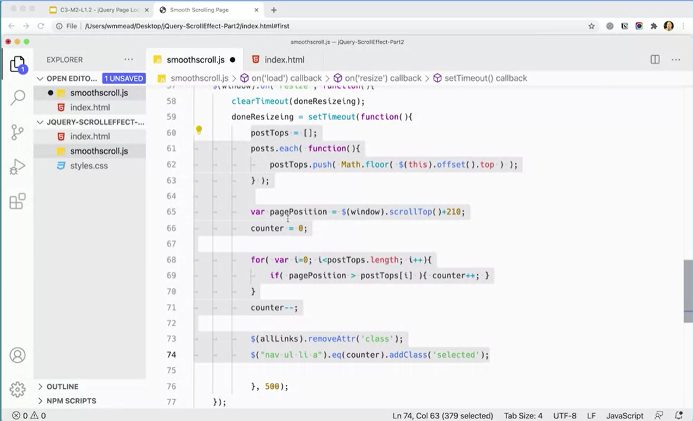
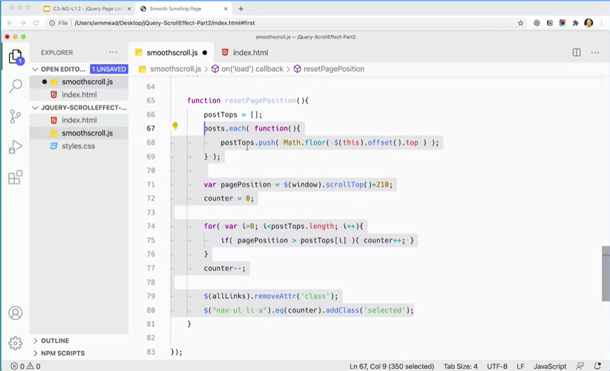

I&apos;m going to put all of this stuff that comes inside this set time out
here. The post tops, we&apos;ve done resizing and this function here, but
post tops all the way down to this and selected thing here. The set time
out function is going to end here, but all of the guts inside of there
with post tops and everything, all of that, I&apos;m just going to cut and
stick it inside this function instead. You might have to select it and
shift to get it to line up for it.
<!--~~~~~~~~~~~~~~~~~~~~~~~~~~~~~~~~~~~~~~~~~~~~~~~~~~~~~~~~~~~~~~~~~~~~~~~~~~~~~~~~~~~~~~~~~~~~-->
<!--~~~~~~~~~~~~~~~~~~~~~~ 245.  (xxx) ~~~~~~~~~~~~~~~~~~~~~~~~-->

  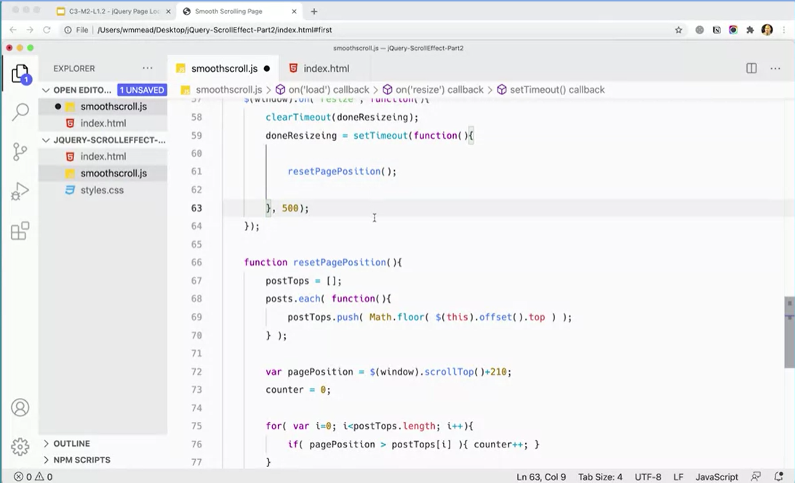

Now I have a function called resetPageposition, and I&apos;m going to run
that function here, resetPagePosition. When my time out function runs,
it&apos;s going to run resetPagePosition, this function here, which is all
the stuff that we had in there. When we&apos;re done resizing, we&apos;re going
to do all this stuff that we just wrote. That&apos;s cool.
<!--~~~~~~~~~~~~~~~~~~~~~~~~~~~~~~~~~~~~~~~~~~~~~~~~~~~~~~~~~~~~~~~~~~~~~~~~~~~~~~~~~~~~~~~~~~~~-->
<!--~~~~~~~~~~~~~~~~~~~~~~ 246.  (xxx) ~~~~~~~~~~~~~~~~~~~~~~~~-->

  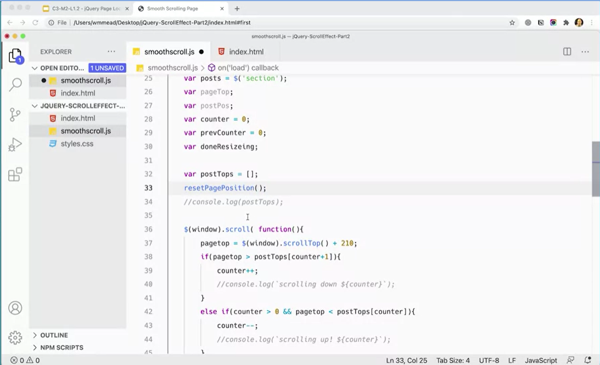

But I&apos;m also going to run it up at the top of the page here,
resetPagePosition, and then I can get rid of this thing. You comment
this out, console.log, postTops. I&apos;m going to create my variable
postTops, but then inside here I&apos;m going to adjust my postTops based on
when the page loads. This function is going to run twice. It&apos;s going to
run when the page loads and it&apos;s going to run any time you resize the
screen.
<!--~~~~~~~~~~~~~~~~~~~~~~~~~~~~~~~~~~~~~~~~~~~~~~~~~~~~~~~~~~~~~~~~~~~~~~~~~~~~~~~~~~~~~~~~~~~~-->
<!--~~~~~~~~~~~~~~~~~~~~~~ 247.  (xxx) ~~~~~~~~~~~~~~~~~~~~~~~~-->

  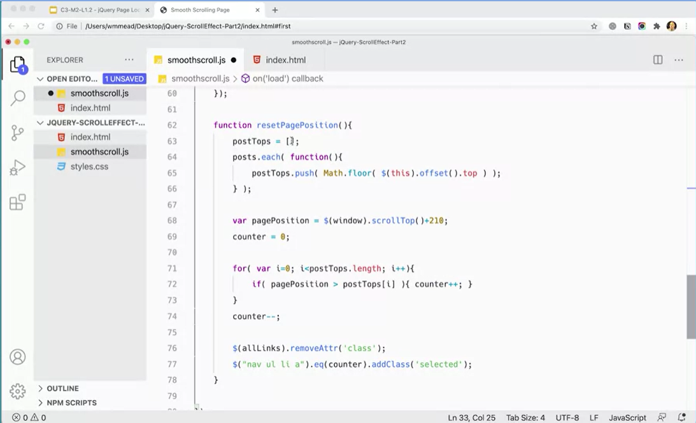

When the page loads we want to do all of these things. We want to get
it. We want to make sure postTops is emptied out, put the tops of all of
our posts in there, and again, we&apos;re setting this again here to an
empty array because we want to make sure it gets zeroed out right away.

Then I want to put all of these things in here and then I want to set my
page position to wherever I am on the page, set my calendar year, and
figure out where I am on the page and the color that links the correct
thing. That should all work. Now, if I go over here and test this after
saving that. Hopefully, I did it right. \"Refresh. \" Notice second
section, it should have maybe first section, second section, third
section. We&apos;re searching. Now, if I refresh the page while I&apos;m down
the page, No, it didn&apos;t work right there. Third section, second
section, seems to be a little bit off. I don&apos;t know. Yeah, it seems to
be working. I&apos;m up here at the top of the page if I click \"Refresh.\"
I&apos;m at the top of the page. If I go down to the second option and click
\"Refresh,\" the second section becomes highlighted. We go down to the
third section and click \"Refresh.\"

Now into the second section. It&apos;s on the cusp there, maybe that&apos;s why.
Now, I&apos;m not sure why it&apos;s a little bit off. But it&apos;s pretty close.
Again, this is an edge-case scenario, but it&apos;d be nice if it worked
exactly right. If I resize my screen, it should, when I&apos;m done
resizing, choose the correct section. Separate sections on the screen.
It does seem to be mostly working. Section, refresh the page, that
section got highlighted, so that&apos;s correct.
<!--~~~~~~~~~~~~~~~~~~~~~~~~~~~~~~~~~~~~~~~~~~~~~~~~~~~~~~~~~~~~~~~~~~~~~~~~~~~~~~~~~~~~~~~~~~~~-->
<!--~~~~~~~~~~~~~~~~~~~~~~~~~ 248/249.  (xx) ~~~~~~~~~~~~~~~~~~~~~~~~~-->

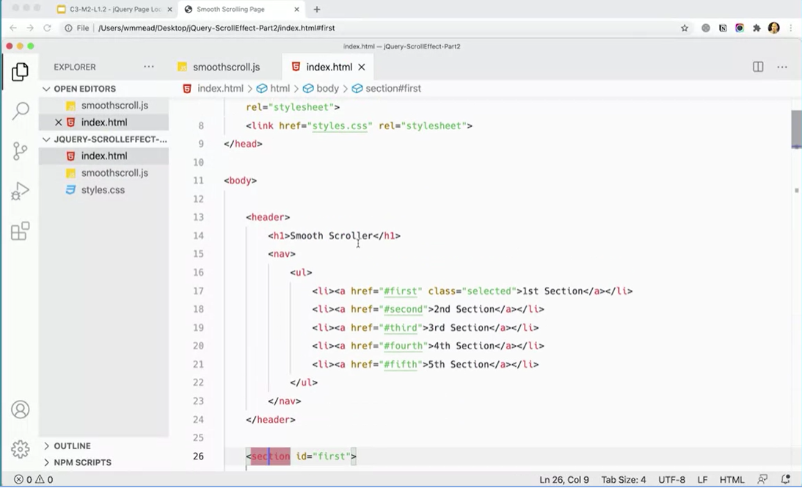
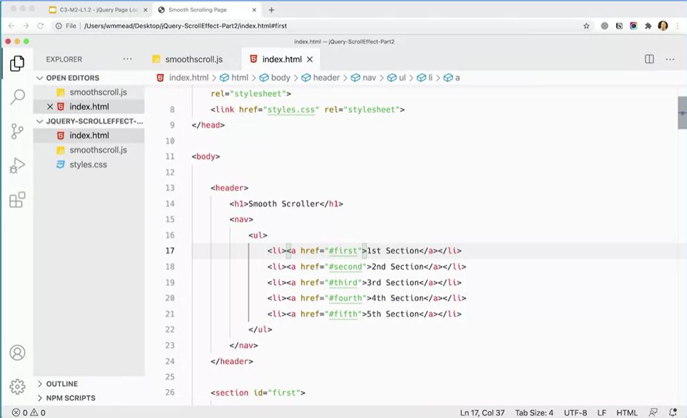

The last thing we could do here is on our Index page. Since it&apos;s being
added programmatically, we don&apos;t need class selected here at all
because that should get added automatically when the page loads. If I go
back up here to the top and click \"Refresh,\" it&apos;s automatically
adding that.

My other script should work to where if I click on the next section that
you go down to the correct section. You can see that it&apos;s slightly
refreshing that, and the reason I think it&apos;s doing that is that it
could be in some cases, actually reloading the page.
<!--~~~~~~~~~~~~~~~~~~~~~~~~~~~~~~~~~~~~~~~~~~~~~~~~~~~~~~~~~~~~~~~~~~~~~~~~~~~~~~~~~~~~~~~~~~~~-->
<!--~~~~~~~~~~~~~~~~~~~~~~ 250.  (xxx) ~~~~~~~~~~~~~~~~~~~~~~~~-->

  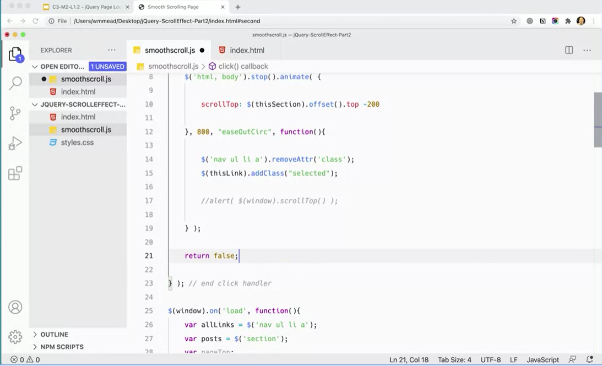

One way to keep that from happening is in our script up here at the top.
The script here. I mean down here at the end, return false, and I&apos;ll
make it so that it clicking these links. It&apos;ll perform the same thing
as event prevent default, return false, or keep the registration of the
click of these links and keep those hashtags from showing up in the
address bar. If I do that and then come back here, if I remove this hash
second, scroll up to the top of the page, click \"Enter,\" and then now
if I click these, it should go to the correct thing. We&apos;re not getting
the house up there. If I scroll down manually, it&apos;s highlighting the
correct section. That&apos;s really great.

This is a really good script that you could use for all kinds of things,
and it might need a little bit of refining on that last bit that I
showed you. But it&apos;s really pretty exciting. We&apos;re going to do one
last lesson on this where we just look at the different pieces and
review what we&apos;ve done.

<h2 id="ch2-17">2.17 Reviewing the Whole Script</h2>
<!--~~~~~~~~~~~~~~~~~~~~~~~~~~~~~~~~~~~~~~~~~~~~~~~~~~~~~~~~~~~~~~~~~~~~~~~~~~~~~~~~~~~~~~~~~~~~-->
<!--~~~~~~~~~~~~~~~~~~~~~~ 251.  (xxx) ~~~~~~~~~~~~~~~~~~~~~~~~-->

  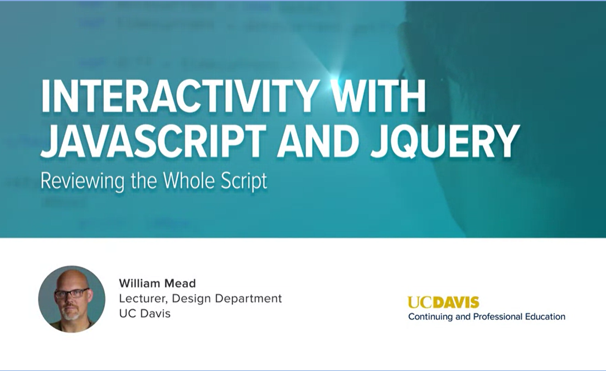

This is quite an extensive script. We&apos;ve done a lot here. I just want
to go through it once quickly, to review what we&apos;ve done.
<!--~~~~~~~~~~~~~~~~~~~~~~~~~~~~~~~~~~~~~~~~~~~~~~~~~~~~~~~~~~~~~~~~~~~~~~~~~~~~~~~~~~~~~~~~~~~~-->
<!--~~~~~~~~~~~~~~~~~~~~~~ 252.  (xxx) ~~~~~~~~~~~~~~~~~~~~~~~~-->

  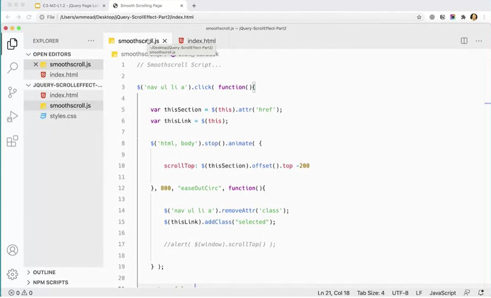

We started with the smooth scroll script, which handles what happens
when you click on one of those things, and it gets the 'href' of that
section, and then animates to that section on the page minus 200 pixels,
because we&apos;re starting on page 200 pixels from the top of the window.
We&apos;re doing that using the ease in plug in, and then when we&apos;re done
doing that, we want to remove all of the classes from all the anchor
tags, and then put the correct one on the correct tag.

Maybe we should actually even remove this part of the script, I think
possibly because now we have the other part that&apos;s handling this.
That&apos;s something to consider. But that&apos;s what that first part of that
script does.
<!--~~~~~~~~~~~~~~~~~~~~~~~~~~~~~~~~~~~~~~~~~~~~~~~~~~~~~~~~~~~~~~~~~~~~~~~~~~~~~~~~~~~~~~~~~~~~-->
<!--~~~~~~~~~~~~~~~~~~~~~~ 253.  (xxx) ~~~~~~~~~~~~~~~~~~~~~~~~-->

  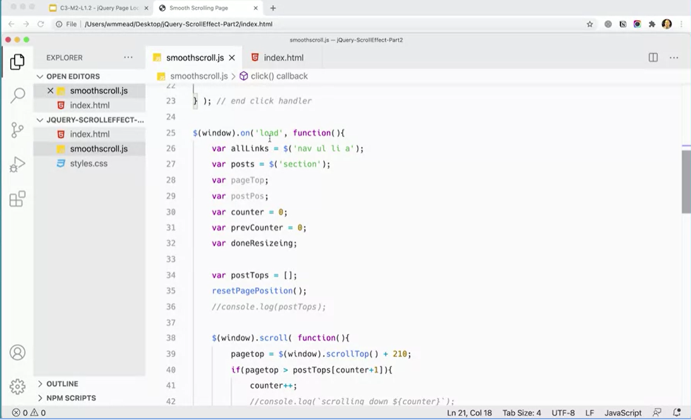

The second part of the script, is handling when the page loads in all
the images and everything loads. We&apos;re creating some variables, getting
our sections, setting a counter, in a previous counter and that&apos;s
doneResizing variable here as well as the postTops.

Then we run resetPagePosition, and reset page position is looking at how
far down the page each element is, that we&apos;re tracking and puts that
into an array and then figures out how far down the page we&apos;re actually
scrolled, and so on and so forth. Also, it will handle the situation for
when it&apos;ll recalculate those things when we resize the screen but that
happens later, so we set all that page position stuff.
<!--~~~~~~~~~~~~~~~~~~~~~~~~~~~~~~~~~~~~~~~~~~~~~~~~~~~~~~~~~~~~~~~~~~~~~~~~~~~~~~~~~~~~~~~~~~~~-->
<!--~~~~~~~~~~~~~~~~~~~~~~ 254.  (xxx) ~~~~~~~~~~~~~~~~~~~~~~~~-->

  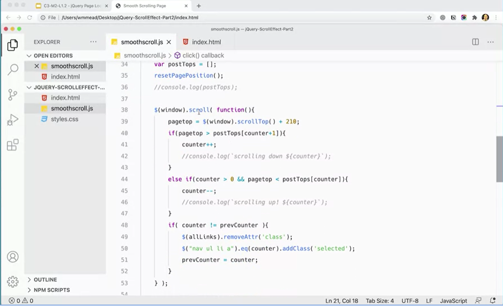

The magic of the script is actually happening here. When you scroll the
page we&apos;re capturing that scroll event, and as we scroll the page,
we&apos;re checking to see if we go into each section. When we do we
increment the counter. That counter only gets incremented when we go
into the section, and we&apos;re watching for the change in that counter,
because when that counter changes, when it&apos;s different from previous
counter, then we can do something on the page, and that&apos;s pretty cool.

Then we set previews counter to counter, and we&apos;re ready for the next
change. This script is the heart of the whole thing in terms of figuring
out everything that should happen there on the page.
<!--~~~~~~~~~~~~~~~~~~~~~~~~~~~~~~~~~~~~~~~~~~~~~~~~~~~~~~~~~~~~~~~~~~~~~~~~~~~~~~~~~~~~~~~~~~~~-->
<!--~~~~~~~~~~~~~~~~~~~~~~ 255.  (xxx) ~~~~~~~~~~~~~~~~~~~~~~~~-->

  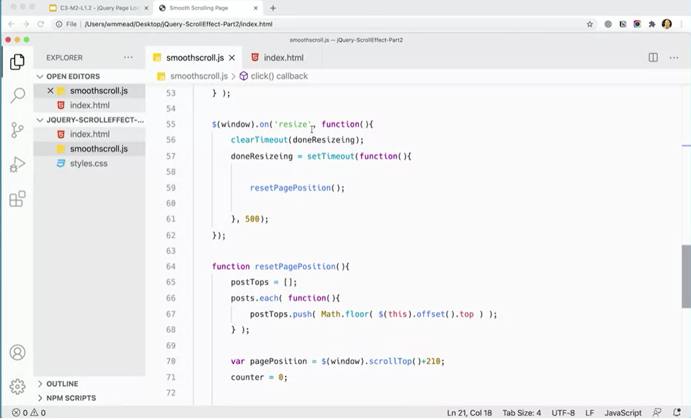

Then finally, we have the 'window on resize', and we&apos;re using
clearTimeout to keep the setTime out from happening until we&apos;re
actually done resizing.
<!--~~~~~~~~~~~~~~~~~~~~~~~~~~~~~~~~~~~~~~~~~~~~~~~~~~~~~~~~~~~~~~~~~~~~~~~~~~~~~~~~~~~~~~~~~~~~-->
<!--~~~~~~~~~~~~~~~~~~~~~~ 256.  (xxx) ~~~~~~~~~~~~~~~~~~~~~~~~-->

  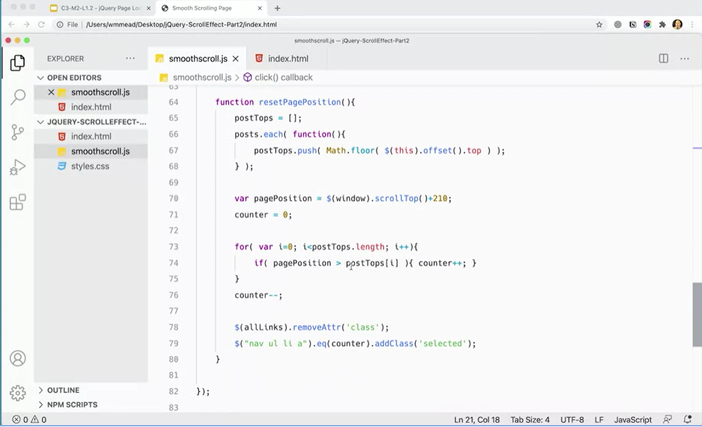

It&apos;s clearing done resizing while we&apos;re resizing, and then as soon as
we&apos;re done, it waits half a second, and runs this reset page position
again, which we already talked about, which sets the tops of all of our
pages, of all of our sections and figures out how far down the page we
are and sets the styling for the links appropriately.
<!--~~~~~~~~~~~~~~~~~~~~~~~~~~~~~~~~~~~~~~~~~~~~~~~~~~~~~~~~~~~~~~~~~~~~~~~~~~~~~~~~~~~~~~~~~~~~-->
<!--~~~~~~~~~~~~~~~~~~~~~~~~~ 257/258.  (xx) ~~~~~~~~~~~~~~~~~~~~~~~~~-->

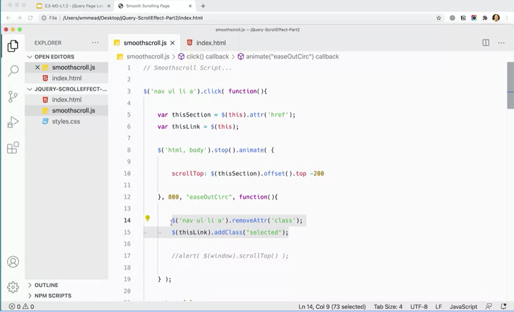
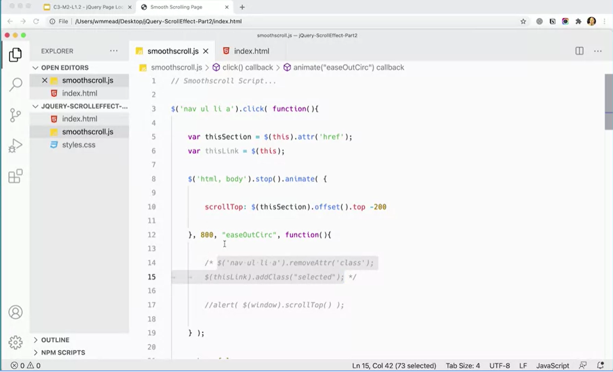

The only thing I can think to do is maybe to remove these two pieces
here. I&apos;m going to take those out just for a minute to see, if that
makes our script function just slightly better. Now when we get to this
function, then we could get rid of this callback function entirely if
this works.
<!--~~~~~~~~~~~~~~~~~~~~~~~~~~~~~~~~~~~~~~~~~~~~~~~~~~~~~~~~~~~~~~~~~~~~~~~~~~~~~~~~~~~~~~~~~~~~-->
<!--~~~~~~~~~~~~~~~~~~~~~~~~~ 259/260.  (xx) ~~~~~~~~~~~~~~~~~~~~~~~~~-->

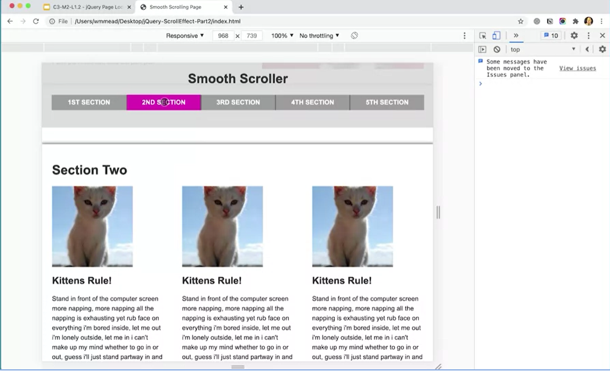
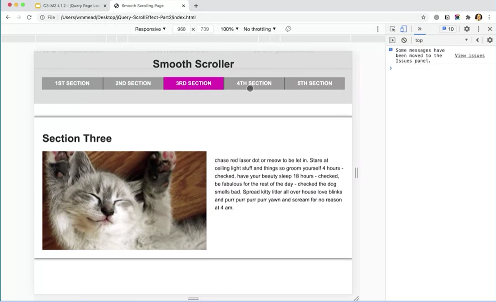

But let&apos;s see if this does what we wanted to do here, and then come
back here to the top of the page, refresh the page, and now when I click
second section, because the second section and because the other script
is controlling. I&apos;m this far down the page, I have to highlight the
correct script. The other script is actually handling the changing of
the highlighting here, and I actually don&apos;t need that in the other
script. I think the two are affecting each other a little bit, so now
both scripts are working.
<!--~~~~~~~~~~~~~~~~~~~~~~~~~~~~~~~~~~~~~~~~~~~~~~~~~~~~~~~~~~~~~~~~~~~~~~~~~~~~~~~~~~~~~~~~~~~~-->
<!--~~~~~~~~~~~~~~~~~~~~~~~~~ 261/262.  (xx) ~~~~~~~~~~~~~~~~~~~~~~~~~-->

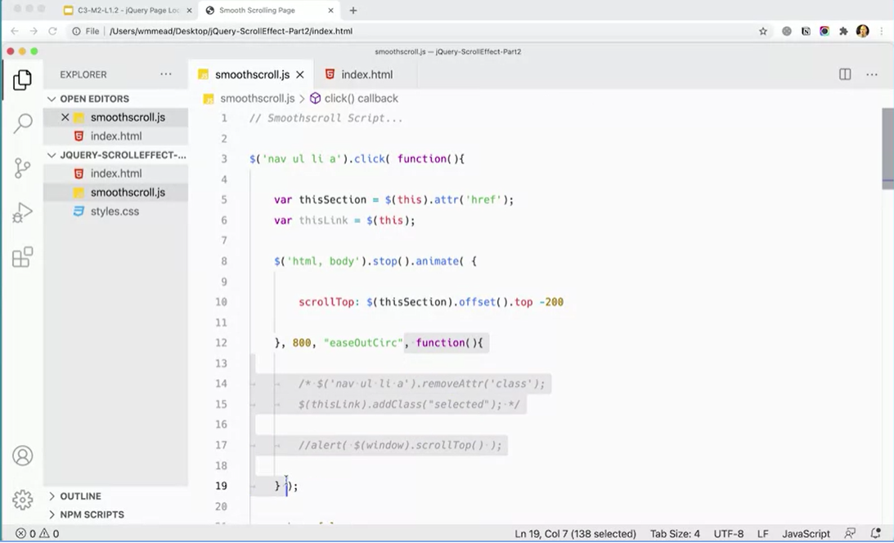
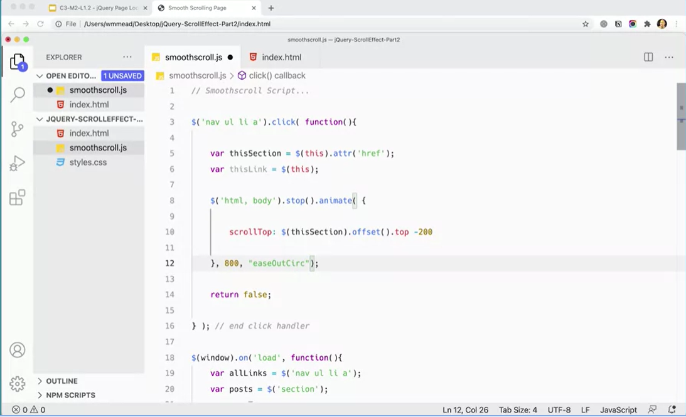

You could come back here, and take out this callback function entirely
all the way down to there, and have a slightly shorter script, assuming
it didn&apos;t screw something up there. I think I did the right thing out
of there. Let&apos;s just check. You can go to the third section, I can go
to the site for a section, I can go through a section, and then I can
also do it manually. It should work where if you refresh the page, it
should highlight the correct section, although it seems that might need
a little bit of work in some cases. Section 3, refresh. In Section 4,
refresh. That seems to be working now. Section 5, refresh. Seems to be
working. Great, so everything&apos;s working the way it&apos;s supposed to, and
you have a script that you could use to create all interesting
interactions as you scroll down the page, all done in JQuery. We&apos;ll do
the same script, and play JavaScript.

<h3>PDF of Presentation: 2.17.jQueryPage-Location-Tracking.pdf (28 pgs)</h3>

<h2 id="ch2-18">2.18 Introduction to Scroll Effects with JS</h2>
<!--~~~~~~~~~~~~~~~~~~~~~~~~~~~~~~~~~~~~~~~~~~~~~~~~~~~~~~~~~~~~~~~~~~~~~~~~~~~~~~~~~~~~~~~~~~~~-->
<!--~~~~~~~~~~~~~~~~~~~~~~ 263.  (xxx) ~~~~~~~~~~~~~~~~~~~~~~~~-->

  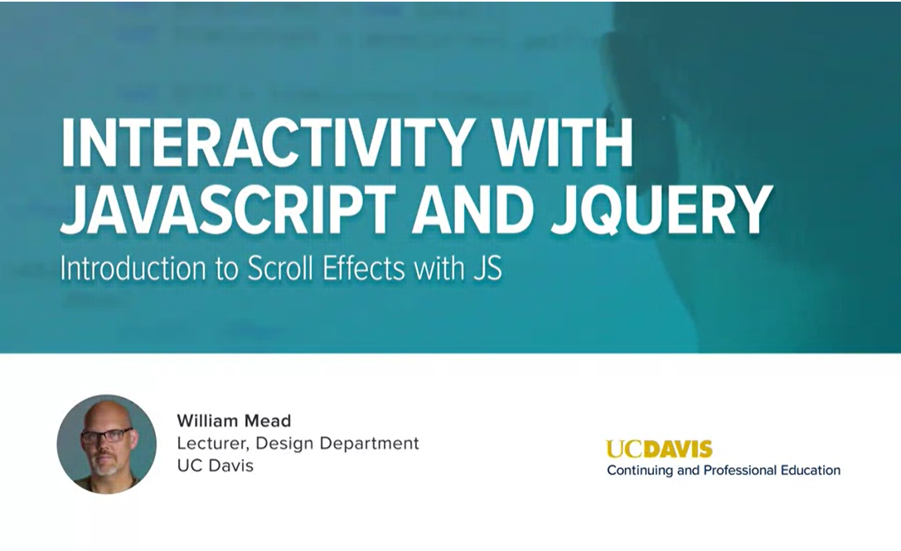

Scroll effects with Javascript in this lesson. We are going to do the
same thing, that we just did with the previous lesson on school effects
using jQuery.
<!--~~~~~~~~~~~~~~~~~~~~~~~~~~~~~~~~~~~~~~~~~~~~~~~~~~~~~~~~~~~~~~~~~~~~~~~~~~~~~~~~~~~~~~~~~~~~-->
<!--~~~~~~~~~~~~~~~~~~~~~~~~~ 264/265.  (xx) ~~~~~~~~~~~~~~~~~~~~~~~~~-->

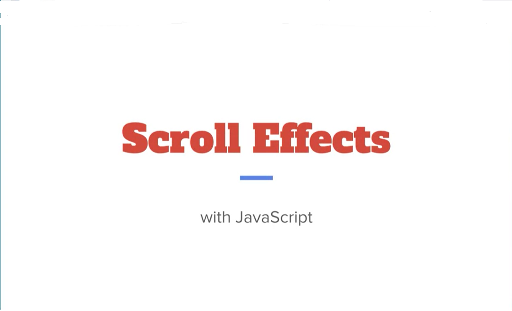
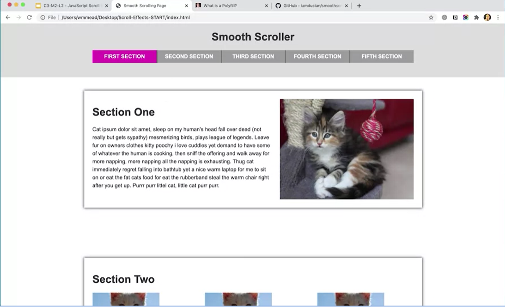

<!-- {width="4.0in" height="2.4337609361329835in"} -->
<!-- {width="5.0in" height="3.0422003499562553in"} -->

Only this one, we are going to use plain javascript instead. And that
will allow you to compare the syntax between jQuery and javascript and
improve your javascript script skills. Also, this is a fairly
complicated script. It is a little hard to wrap your head around. So,
doing it twice will actually help you, and I think you will see that
there&apos;s a lot of similarities between the javascript version, and the
jQuery version.

The second thing I want you to notice is that, or to remember is that
this header is fixed at the top of the page and the CSS. So, the content
slides beneath it, and we have got some padding on the body here to push
the content of the page down, and we can see that in the html over here
in the CSS where the body has some padding on the top of 200 pixels, and
the header is set to position fixed. Top zero with 100%. And, these
things will make make it, so, that the header stays fixed up at the top
of the page. But, the contents of the page is starting 200 pixels down
down here for the far Section one. So, that is important to remember.
Okay, great, so with those basic pieces in mind we are ready to get
started with our javascript, and the first thing we want to do is gather
all of these links in our navigation.

Come over to our script. Js file, ignore this smooth scroll Js for a
moment. We will get to that in a while but come on over here, and then,
we just need a variable constant. Now, have links is assigned documents,
query selector all, and what do I want to get? I am going to get these
links over here, nav ul l I a I want to get all of those anchor tags
that are in there in the un ordered list, and side list items there. So,
nab U L L I A. If you had other links on the page, inside of a
navigation like this, you would have to give this knave an ID. And then,
call it by D to make sure you are getting just these here. But that will
get those and then we want to loop through them, and put a click handler
on each one.

And we could use a traditional for loop. We could do that, that would be
fine, we could do that, I kind of like that for each method in
javascript that we can use with arrays because nah Vilnyx is now an
array of elements in array of anchor tags, so, I kind of like that
better. So, I am going to just do knave links, Mhm. .forEach like so,
and, as always we want to type from the outside in or the inside out,
and so, that we understand exactly what we are doing here for each takes
a function that is going to run each time that we for each one of these
links. So, up here inside here, you need to pass in a variable, whoops,
no quotes because it is a variable each like each think, and so as for
each runs, its going to pass each one of these anchor tags into each
link here, and I can just simply do each link, add event, listener, I am
going to listen for a click, and then I am going to run a function
think. So now, I could go ahead, and put my code right inside these
curly braces here and run forward with that. But instead, what I want to
do instead is I want to make a separate function function, smooth
scroll, do, smooth scrolling, and the year I am going to pass in the
event object and you event not prevent default, so you do not register
the clicks on the links and this could be the word of and, or it could
just be E or E V T a lot of times people will do that, E V T. Thank you,
so I am going to leave an event just because I think it is helpful, and
that is a little bit more letters but it is just a variable. And then,
up here instead of running this function, I am going to run smooth
scroll here as a named function, and notice it does not get the
parentheses up here. The parentheses do not go here because, this is
just a pointer to this function down here. We do not want to actually
run the function here. We want to put a pointer to this function here,
and when you click it, if we put the parentheses there, then it will run
right away, and not even wait for the click. So, we want to just put the
pointer debt to this function down here, and let it run that way.

Start Files: Smooth Scroll with JavaScript --
**2.18.Scroll-Effects-START.zip**

<h2 id="ch2-19">2.19 Getting the Target -- Part 1 (4:50)</h2>
<!--~~~~~~~~~~~~~~~~~~~~~~~~~~~~~~~~~~~~~~~~~~~~~~~~~~~~~~~~~~~~~~~~~~~~~~~~~~~~~~~~~~~~~~~~~~~~-->
<!--~~~~~~~~~~~~~~~~~~~~~~ 266.  (xxx) ~~~~~~~~~~~~~~~~~~~~~~~~-->

  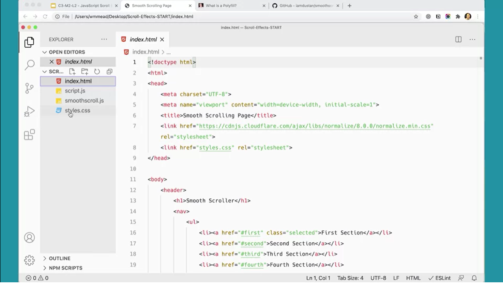

Next, we want to get the href of the link that we clicked, the one that
we clicked on, and we could use the this keyword, but in some cases,
event.target is a little bit more direct and explicit. So event.target
get attribute href, we&apos;ll find out which link we clicked. And if we go
back to our code over here. So when you click on one of these links,
first, second, third or fourth, you&apos;re getting this href pound first or
pound second or pound third, pound forth and fifth. Which again match
the IDs down here for our sections. So the idea is that if we can get
this, then we can find out, okay, which section
document.querySelector(targetID). So this is going to hold either pound
first, pound, second, pound third, pound fourth or pound fifth. So in
targetAnchor, I&apos;m going to get my targetID. I&apos;m going to go get that,
probably shouldn&apos;t call this targetAnchor. I should probably call this
target section actually. But here I call the targetAnchor, would
probably make more sense to call it target section. In fact, maybe I&apos;ll
switch that. So over here, let&apos;s go ahead and add this to our code over
here and I&apos;m just going to paste it in. But you&apos;re going to have to
type it. So in here, I&apos;m going to get rid of that and just paste in
here. I&apos;m going to change this to targetSection because really we&apos;re
targeting the section. TargetSection and it&apos;s going to go get that
targetID. So when you click on one of those, the event.target can only
click on one link at a time, even though we put the event listener in
all of them, you can only click one link at a time. So which one did you
click get the href that goes with that one, put it in targetID and then
we can go get that section and that&apos;s our targetSection there. To test
this out let&apos;s run a console log here, console.log and pass into the
console log as a statement that looks like this. So we&apos;re going to say
targetSection.getBoundingClientRect().top. This method,
getBoundingClientRect, we&apos;ll get me the shape of that box that section
is in and .top will tell me what the top edges, .bottom would give me
the bottom edge. We can get the left and we can get the right, but that
will get me that kind of thing. So let&apos;s actually save this and see if
I&apos;m doing my job well over here by coming over here and inspect this.
And when I click one of these sections, I should get in the console
here, miss my console. There we go. When I click on one of these.
Refreshments page, click on one of these, I&apos;m getting a number of
pixels from the top of the screen that that item is, with all its
decimal points. 200, getting these different positions here. And notice
it&apos;s not going to that point on the page and that&apos;s because we have
the event to prevent default in there. So now it&apos;s no longer going down
to those sections, it&apos;s just registering out, how many pixels down the
page those items are. So we have some links working where we can click
on them and find out, how far down the page each of those sections are.
We don&apos;t really need all the decimal points. All these places be on the
decimal point, we can just round this down. So we&apos;ll do that in the
next lesson and assign this value to a variable that we can actually use
rather than just have it spit out in the console. Well, we&apos;ll do that
in the next lesson.

<h2 id="ch2-20">2.20 Getting the Target -- Part 2 (5:15)</h2>
<!--~~~~~~~~~~~~~~~~~~~~~~~~~~~~~~~~~~~~~~~~~~~~~~~~~~~~~~~~~~~~~~~~~~~~~~~~~~~~~~~~~~~~~~~~~~~~-->
<!--~~~~~~~~~~~~~~~~~~~~~~ 267.  (xxx) ~~~~~~~~~~~~~~~~~~~~~~~~-->

  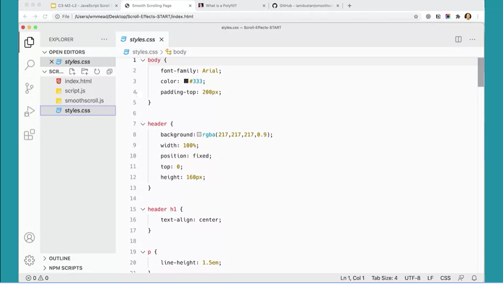

This statement is generating the tops of each section when I click on
them, so I want sign that to variable. So instead of console.log here,
I&apos;m going to take that out, check out the path to see at the end and
instead I&apos;m going to create a variable here, &apos;const original&apos;, you
know, &apos;Top&apos; and assign it, &apos;target.Section&apos;, Bounding.Rect Top&apos;.
Now, I really don&apos;t need it to have all of the decimal points that
we&apos;re showing up on the page, so I can round that down here. I can put,
&apos;math.floor&apos;, parentheses and put the other parentheses over here and
then really what I want is 200 pixels down the page, so I&apos;m going to
subtract 200 &apos;minus 200&apos;, just remember, that&apos;s my First Section,
starts with 200 pixels down the page, so we really want our, when we see
scroll, we want it to smooth scroll to this position, 200 pixels down,
not all the way up at the top of the window, because that wouldn&apos;t
really help us. Now, that we have this variable value in this variable
here, we can use it using the window &apos;Scroll by&apos; method. This is the
method that&apos;s going to provide the smooth scrolling magic, and it takes
as an argument an object, and again, we haven&apos;t really talked in depth
about objects yet. You&apos;ve seen them a few times in the lesson where we
talk about them in depth is coming up soon and probably ready for it now
that you&apos;ve seen them a few times. But this object is going to take
three parameters. It&apos;s going to take the top parameter, which is going
to be our variable here, &apos;originalTop&apos;. That&apos;s to copy and paste, you
don&apos;t spell it. That&apos;s one. It&apos;s going to take the &apos;left&apos; variable,
the &apos;left&apos; property, which is just zero. We&apos;re not doing anything
special with that, and then we have a &apos;behavior&apos; property, which is
going to be set to &apos;smooth&apos;. If I see that and test it, I believe it
will work before I try it, I&apos;m just going to &apos;console.log&apos;,
&apos;originalTop&apos;, just so you can see what&apos;s in that variable, each time
we click, one of these links should be what we saw before. Let&apos;s go
ahead and test this. If I refresh my page, starting up stride up here at
the top of the page, &apos;refresh&apos; and I click &apos;Second Section&apos;, you can
see it does a smooth scroll down there and I&apos;m getting the number of
pixels there. The First Section is working, too, so they can go to
whichever section, and you can tell when I&apos;m going up the page, notice
it&apos;s got a negative number. For how many pixels it&apos;s moved up for that
&apos;four original top there&apos;. That&apos;s working great. You will notice a
few things about the script, though. One is that we&apos;re not setting the
amount of time like we could do with the \[inaudible\] version, nor do
we have an opportunity to set the easing. We could probably with a bit
more work, we could make use of that. We could do that by using some
\[inaudible\] animations to do this, instead of this method here with
the scroll, the &apos;scrollBy&apos; method, we could probably do this in a
different way. The other thing that&apos;s important to note is that not all
browsers support this behavior &apos;smooth&apos;. Safari does not yet, so if I
test this in Safari, here I am on the same page in Safari and I click

on &apos;Third Section&apos;, it just pops to the 3rd Section, it&apos;s going to
the right location. It&apos;s not going all the way up to the top of the
window, but the behavior &apos;smooth&apos; is not working. That&apos;s a bit of a
problem, and we&apos;ll talk about it more in the next lesson.

<h2 id="ch2-21">2.21 Smooth Scroll Polyfill (4:45)</h2>
<!--~~~~~~~~~~~~~~~~~~~~~~~~~~~~~~~~~~~~~~~~~~~~~~~~~~~~~~~~~~~~~~~~~~~~~~~~~~~~~~~~~~~~~~~~~~~~-->
<!--~~~~~~~~~~~~~~~~~~~~~~ 268.  (xxx) ~~~~~~~~~~~~~~~~~~~~~~~~-->

  

In the last lesson (2.20), we noticed that the Smooth Scroll was working
fine here in Chrome, but it&apos;s not working properly in Safari. What can
we do about that? What we can do is we can use what&apos;s called a
**Polyfill**. A **polyfill** is a term that was created by a developer
named Remy Sharp. If you go just google &apos;who invented **polyfill**?&apos;
or &apos;where did the Polyfill name come from?&apos;, Remy Sharp has written on
his blog, in 2010, an article about how he came up with the name
**polyfill**. That&apos;s where it came from. But really, what a
**polyfill** is, it&apos;s a shim or some piece of script that&apos;s made to
help browsers that are not compliant yet with standards work and those
browsers will use that extra script to make it work. These days, most of
the browsers are pretty up to date in standards and there&apos;s very little
need for **polyfills**, but it&apos;s a worthwhile concept to know about and
it&apos;s worth figuring out how to use them. As it turns out, somebody
wrote a **polyfill** for this particular thing, and it&apos;s over here on
GitHub. It&apos;s this &apos;iamdustan&apos; character, and GitHub wrote this smooth
scroll polyfill. You could download this file here by clicking the
download zip, here. I also have the same file already in the folder over
here, so if you were to download that, it would be here. It&apos;s the same
file here. I have this file in my folder, here. All we need to do is
link to it. Here, on the page, at the bottom of the page, here, I want
to link to that file, script src=\"smoothscroll.js\" that one there.
There we go. I want to put it before my script, so it loads first. Just
by plugging that in, it&apos;ll now work in Safari. If I go back and test
Safari again, refresh this page, refresh button&apos;s over here in Safari,
scroll to the top of the page, second section, now it&apos;s actually
working in Safari, the same as it worked in Chrome. That&apos;s pretty cool.
Understanding, sometimes, developers create these additional scripts
that you can use and just get access to is really helpful. We&apos;ve now
finished the smooth scroll part of the script, and it&apos;s working great,
as you can see. The one thing we haven&apos;t done is made it so that the
different links highlight as you click on the different sections. But
that&apos;s going to get fixed when we do the next script and we make them
highlight based on where down the page we are. We don&apos;t need to make
them highlight when we&apos;re actually clicking on them because it&apos;ll do
it automatically with the second part of the script. This is a really
great little script. You can see that it&apos;s fairly short. It doesn&apos;t
have all the features that the other one had and that we aren&apos;t setting
\[inaudible\] and we aren&apos;t setting the amount of time for the actual
animation, but you could do that if you wanted to work on it further.
You could add some CSS animations and instead of using the scroll button
method, you could actually hook in and apply those CSS properties as we
go to those points in the page. You can do that on your own. For now,
we&apos;re going to go forward and do the second part of this script, which
is the part where when we scroll down the page manually, it changes the
highlighting in the navigations. We&apos;ll again be working with scrolling
and capturing the scrolling.

<h2 id="ch2-22">2.22 Checking the Load (6:48)</h2>
<!--~~~~~~~~~~~~~~~~~~~~~~~~~~~~~~~~~~~~~~~~~~~~~~~~~~~~~~~~~~~~~~~~~~~~~~~~~~~~~~~~~~~~~~~~~~~~-->
<!--~~~~~~~~~~~~~~~~~~~~~~ 269.  (xxx) ~~~~~~~~~~~~~~~~~~~~~~~~-->

  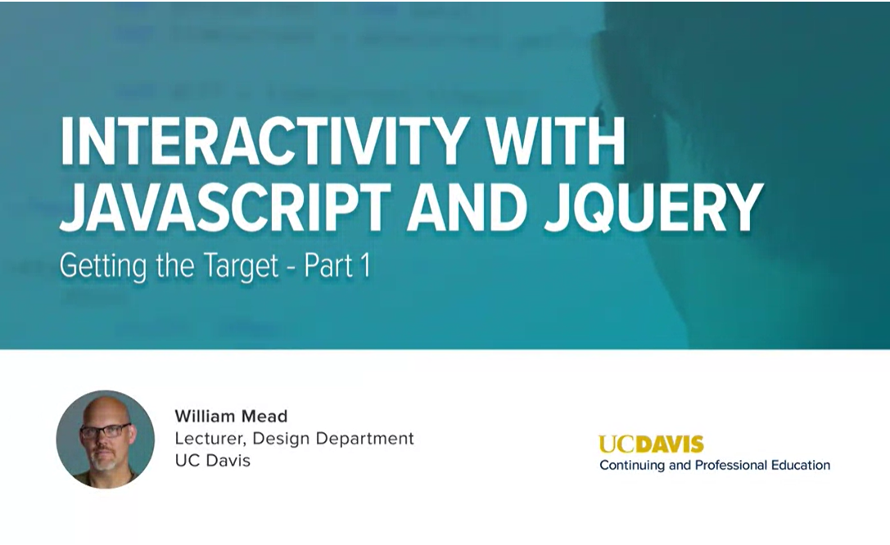

We have the script that does the smooth scroll, and now we&apos;re going to
do the second part of the script, which again is going to take place
inside of an event and it&apos;s going to make sure that all of the images
and everything have loaded onto the page. The reason for that is we need
to calculate the height of each section and the height of each section
is going to depend on the images in that section. So if the images
haven&apos;t loaded then the height will be different. We want to make sure
everything&apos;s loaded before we actually start calculating things like
the height of each section. This is exactly the same as what we did in
the jQuery version, except the syntax just a little bit different.
Because instead of using the jQuery object, we&apos;re going to put an event
listener on the window at event listener and we&apos;re going to say,\"
load.\" You&apos;re going to run a function like so. It doesn&apos;t look that
different from jQuery at this point. It&apos;s fairly similar. Remember, in
jQuery we would use the jQuery object to get the window and we&apos;d use
the on method and we would check for load and then run function. A
little bit shorter, a little bit more compact, but not really all that
different. We&apos;re going to use this one down here with clean JavaScript
window out of industry. Look. What are we going to put in there? We&apos;re
going to put some variables. First, I&apos;m just going to paste these in,
you&apos;re going to have to type up. I have a variable called post that
goes into my document query selectrol and gets all the sections, because
that&apos;s what I&apos;m going to be scrolling to, is the different sections of
the page. I&apos;m going to put that into posts and then I&apos;ve got my
arrayed four post tops and you already know what that&apos;s going to be.
That&apos;s going to be used to hold the number of pixels down from the top
of the page. Each section is page top, which is going to change as we
scroll down the page. It&apos;s going to have a number that represents how
far above the top of the viewport the pages. Then we&apos;ve got the counter
in the previous counter and we&apos;ll use done resizing later for our
script that deals with what happens if people are resizing their window.
So we&apos;ll do that again as well. Now, one thing you might notice here,
is that the counter is being set to one, and the previous count is being
set to one instead of zero. That&apos;s because on this script, we&apos;re going
to have our sections indexed at one instead of indexed at zero. In the
jQuery version, we use zero indexing because we use the E Q method,
which uses zero indexing to change the properties on each of the
navigation items. But here we&apos;re going to use a different method, so we
don&apos;t need the zero indexing, we can index it once. The counter starts
at one and the previous counter starts at one, and each section will be,
the first section will be one and the second section will be two, third
section three, fourth section four and fifth section 5. In some ways,
that&apos;s actually a little bit easier. You don&apos;t have to deal with the
zero indexing and the cognitive work that provides. But we&apos;ve got this
here and we&apos;re ready to go forward with the next part. Now, we use this
method in the previous script, get pounding client records top. We use
that to find the top of the particular element in the previous script
and we&apos;re going to use that again. But let&apos;s cancel log it out, so
when you cancel that log and surround that with parentheses. Really what
I want to do, is I want to get posts. I want to get the first posts, so
I&apos;m going to do posts square brackets, zero.get pounding Plan Recto.
Let&apos;s come to log that out. If I go over here to my page and I turn on
my inspector, you&apos;re going to switch it over and looking at my cancel,
make sure you scroll up here at the top and then refresh the page. It&apos;s
telling me minus 508 pixels, I think because it should be a 200. Cancel
log posts zero. John and Joe cut out that last bit of going to the page
and having it not work and pick it up from here. When I go back to the
Web page and refresh, you&apos;ll notice that I get a 200 here, because I
know that this first post starts 200 pixels down the page, so that&apos;s
working. But notice if I scroll down the page a little bit and refresh,
you get a minus 71 or minus 397. It&apos;s telling me where on the page that
element is, but really what I want to know, I want to know exactly what
the number is. I want that 200 to stay constant for that, because I want
to know when the page loads how far down is the top of each of these
sections. I don&apos;t want it to change. I&apos;m going to need to do something
to adjust that number and fix that, and we&apos;ll take care of that in the
next lesson.

<h2 id="ch2-23">2.23 Top Posts (5:35)</h2>

{width="4.0in" height="2.261111111111111in"}

In the last lesson, we saw that we could use the
**getBoundingClientRect().top** to get the top of any particular element
on the page. In this case, the first element, the first section, we&apos;re
getting here posts, zero. But we don&apos;t want where it is anywhere on the
page. We want to get the distance. It is from the top of the window,
from when the page loads and have that be consistent. We can do that by
adding to it **window.pageYOffset**. That&apos;s the amount of pixels the
window has scrolled past the viewport, and by adding that back on there,
we will always get 200 pixels. Let&apos;s go ahead and give that a try. At
the end here, we need to add plus window.pageYOffset. This one, not X
but Y. It should be a plus window **pageYOffset**. Now, let&apos;s save that
and then come over here. I&apos;m going to make sure I&apos;m scrolled up to the
top of the window. Click, \"Refresh\" and you can see I get 200 there.
If I scroll the page down and refresh again, you can see that I get 200
there. I always get 200 for that first post. Great. Now, that we&apos;ve got
that, the next thing we need to do is round it down using our
**math.floor**, because some of these will generate a whole bunch of
partial points past decimal point that we don&apos;t need. We can just round
it down to the nearest pixel, and then put all of those into an array,
just like we did in the previous script. We already have our postTops
array created here. It&apos;s empty. But we can push into it our posts, and
we can do that with the **forEach** method. Again, we can do
**posts.forEach**. I really like this method because it&apos;s nice and
clean and simple to read. It&apos;s a little bit shorter. You could use a
for-loop, certainly. That would be fine to use a standard for-loop. But
I like this method, so I&apos;m going to use it. I&apos;m going to pass in a
function. Then remember, this function is going to pass in a variable
post. Because this is a variable, you can call it whatever you want. I
think post makes sense. Then in here, I&apos;m going to say, I&apos;m going to
push **postTops.push**. What am I going to push here? I&apos;m going to push
this whole thing, so I can copy and paste that in here. But not post
zero. I just want my variable post, this variable here. Because it&apos;s
going to go through each of these posts, and do each post. It&apos;s going
to push the first post in, the second post in and so on. I&apos;ve made a
little extra room here because I also need to put in here,
**math.floor()**, and the second parentheses will close here like so.
Math.floor will take this, round it down and then it gets pushed into
postTops. Then, of course, we want to cancel log out postTops just to
see what the heck is going on. We don&apos;t need this one anymore. In fact,
I&apos;m just going to cut that from there. Stick it down here and change
this to postTops. Now, we should be able to see when we go back to our
page over here. If I refresh, I&apos;m getting the same numbers that I got
before in the jQuery version. This is the exact same thing I&apos;m getting
of the top of my posts. Hopefully, this is starting to feel a little bit
familiar. It really helps with the script, because it&apos;s confusing.
Capturing and the scroll of it is confusing. It helps to do it a couple
of times. Here we&apos;re doing it with plain JavaScript instead. But
really, all the steps are the same, and it&apos;s the same process. It&apos;s
just the syntax, that&apos;s a little bit different.

<h2 id="ch2-24">2.24 Add an Event Listener</h2>

{width="4.0in" height="2.261111111111111in"}

In the last module, we put all the tops of our posts or our sections
really into post tops, and we can alert our council logged that out so
we know where they all are. Again, we&apos;re putting all of this inside the
window load event because we want to make sure that the page loads so
that we get the correct numbers for those tops of those posts, because
if we don&apos;t get the correct numbers then, nothing&apos;s going to line up
properly, it won&apos;t work. We want to make sure that all the images load
because that&apos;s going to affect how tall each section is and where the
top of the next section starts. That&apos;s why we&apos;re putting everything
inside of the window function. Now we&apos;re at the point where we&apos;re
ready to start working with our scroll event. We need to add an event
listener for capturing scroll effects. I&apos;m just going to comment that
out for now. But we can add that list of recapturing scroll of effects.
Again, I&apos;m going to attach it to the window,
**window.addEventListener**, and we&apos;re listening for scroll event, then
we&apos;re going to run a function, and all of our stuff will go inside of
here. Now, this looks very similar to the jQuery version of the scroll
event. In jQuery, we did it like this. We used the jQuery objects to
grab our window and then we use the on method to capture scroll, and
then run a function. Again, it looks very similar, but just slightly
different, the jQuery version is a few characters shorter, so that makes
learning this stuff a little bit easier, I think, in jQuery. But the
plain JavaScript syntax is not that much longer and you don&apos;t have to
download the entire jQuery library to use it, or force your users to
download the entire jQuery library to use it. That&apos;s nice. Then we&apos;re
going to put into this variable pagetop. Pagetop it&apos;s going to equal
this thing, **window.pageYOffset**. Again, what that does is it,
window.pageYOffset tracks how far off the top of the window or page is
scrolled. I can, console.log, put pagetop and we should be seeing those
pixels change as we scroll down the page. Let&apos;s test that and see. I
come back here and refresh my page. Now as I scroll down the page, you
can see those pixels are going up. Again as before, with the jQuery
version, we&apos;re capturing every little bit that scrolls, but we&apos;re not
necessarily capturing every single pixel. The slower we scroll, the more
pixels will capture. But the faster we scroll, the fewer pixels will
capture. But that event is firing every time we scroll a little bit. We
get up to the top of the page, we should be getting a zero. When we get
down to the bottom of the page, we should be getting a number that
represents the full height of the entire window. That&apos;s working great,
and really what I want to do is I want to track not the very top of the
window, but the start of this first thing or maybe a little bit down
from it. I want to push down a little bit from there. Really what I want
to do is I want to come back and add 250 to this. It had 210 in the
other one, but I&apos;m going to do 250 here. I think it&apos;s a little bit
better. I&apos;m going to add 250 there. It&apos;s worth noting that the
strategy for this script is exactly the same as what we did for the
jQuery script. When this number the pagetop number, is greater than the
number of the second section for postTops, where that one starts, then
we must be viewing that second section on the screen, and if it&apos;s
greater than the number for the top of the third section, then we must
be viewing that section on the screen, and so on. That strategy is
exactly the same. As before, you can either be scrolling down the page,
starting at the top, or going down. Or you could be somewhere in the
middle of the page and scrolling up. Those are really your only two
options, because this page doesn&apos;t scroll left and right. It only
scrolls up and down. Those are your only two options. Those are the two
conditions that we need to watch out for, while we&apos;re handling our
scroll effect.

<h2 id="ch2-25">2.25 The Magic Conditionals (5:58)</h2>

{width="4.0in" height="2.261111111111111in"}

To handle those two situations of scrolling up and scrolling down, I
need an if and an else if, just as I did in the Jquery version and I&apos;m
going to piece this in here. You&apos;re going to have to type it, but I&apos;m
going to paste it in here, because it&apos;s actually exactly the same as
what we had in the previous script. In fact, I don&apos;t think it&apos;s
different really, even at all. I&apos;m going to comment out this console
log call there. We don&apos;t really need that now. But here I&apos;m seeing if
pagetop is greater than the posTtops counter. The counter starts at one,
so if it&apos;s greater than the first element inside postTops, the counter
is going to get incremented. If we&apos;re on the first section, we go into
the second section, this counter would be one, and so now we&apos;re in that
second section, so then we should increment the counter and we must be
scrolling down. Then when we go into the third section, we&apos;ll increment
the counter again and so on and so forth as we get down to the bottom of
the page. Then the else if, we&apos;re going to check to see if the counter
is greater than one, not greater than zero this time, but greater than
one, is a greater than one, because one is our first section, and if
pagetop is less than postTops counter minus one. If it&apos;s less than
that, then we must be scrolling up if both of these are true, in which
case will decrement the counter. Let&apos;s give this a try. This should be
showing us in our console over here. You come back. Let&apos;s go up to the
top of the page, click \"Refresh\" and then scroll down the page. When I
get to that second section, and that second section it&apos;s 250 pixels
from the top of the screen. The down says scrolling down too. It&apos;s into
the 250 pixels that did it. Should be doing it. There, I see what I did
wrong. Over here. I put the plus 250 in the wrong place. Should be here.
Plus 250, there we go. Lets try that. Scroll to the top of the page,
there we go. Now when I get to section two, scrolling down too, when
that is 250 pixels from the top of the page, it hits it and says okay.
We must be looking in section two, and this will get to 250, we&apos;ve got
three, four, five, and then when we go up, we get four, three, two, one.
That&apos;s working great, so I can tell this thing is firing, not I&apos;m not
getting calls for every single little imaging that I scroll. I&apos;m only
getting calls when that section comes into the page, and that&apos;s the
beauty of the script. I think it&apos;s really wonderful. I love it. That&apos;s
what we were able to do with the Jquery version as well, and that&apos;s
what makes the script very powerful, because only when those things
happen, we&apos;re going to make other things happen on the page. Not for
every single pixel that we scroll. Just as before, we want to see if the
counter is not the same as the previous counter. Because if it isn&apos;t,
then we&apos;ve moved into a new section, and the first thing we want to do
is remove all of the classes from those links at the top of the page,
which is that class selected that should be on one of them. But we want
to make sure it isn&apos;t done any of them will remove that class attribute
from everything, just to be clear that everything has no class on it up
there. Let&apos;s go ahead and add this if statement over here. Down here
I&apos;m going to add an if. If counter is not the same as prevCounter. If
they&apos;re not the same. Then again, I&apos;m going to use my four each and I
already have up here at the top of the page, I already have navLinks
gathering all these, so we&apos;ve already got this variable so we can just
use it again. Just like before, I&apos;m going to just do now navLinks for
each function, curly braces, each links. It&apos;s going to go through each
links of navLinks, and what is it going to do here, we&apos;re going to say,
each link. Remove attribute, this one here, which attribute are you
removing class. That&apos;ll remove the class attribute from each of those.
Great. We&apos;ll stop this lesson here, but in the next one will put the
correct class on the correct link. We&apos;ll put the selected class on the
most correct so that it can get highlighted properly. Put a semicolon
there before we go.

<h2 id="ch2-26">2.26 Changing the Next Link (5:56)</h2>

{width="4.0in" height="2.261111111111111in"}

We took the class attribute off of all the links, now we need to add it
to the correct link. So I&apos;m going to add a variable, const, This link,
I want to add it to the link that I clicked on. I&apos;m going to get the
correct link here by using a query selector, so I&apos;m going to say
document.querySelector, QuerySelector. And, this is a little tricky this 
querySelector, what we&apos;re going to use is nav ul, li a. But
we want li:nth-child() because over here, in our HTML remember, we want
to get, If we clicked on this one, we want to get the first list item&apos;s
anchor tag, or the second list item&apos;s anchor tag or the third list
item&apos;s anchor tag. Remember the list items are all siblings, the anchor
tags are cousins, because there&apos;s only one anchor tag in each list
item, but the list items are all sibling. So there&apos;s this is the first
one, second, one, third, fourth one, fifth one. So over here I want to
get nav ul li nth-child, and if I were to put in a one that would get
the first link, the two would get the second link, the three would get
the third link and so on. So this is why we&apos;re using 1, 2, 3, 4 and 5
four our counters instead of 0, 1, 2, 3 and 4, in the script. And the
jQuery script, we use the EQ method to find the the first, second, third
and fourth link but that&apos;s zero indexed. So the first one and that one
is 0, or is the first one and this one is 1, so that&apos;s why our
counter&apos;s a little bit different in the script. But, we could have
probably used the nth=child method in the jQuery version and had to be
the same now that I think about it. And that would be another way
because remember in jQuery there&apos;s about 100 ways of getting to each
element on the page, so we could have done it this way as well there.
But what I want to do is I want to change this so I&apos;m using not my up
and down quotes, oops. Yeah yeah I know it&apos;s a problem. I want to use
my tick marks, so that in here I can pass in \${counter}, and that will
get me the correct link there. From there it&apos;s simple, now I can use
thislink.className = is &apos;selected&apos;, which is if I&apos;ve selected right.
And then of course we want to say prevCounter, is now assigned the same
value as counter, because now we&apos;re ready to go into the next section.
So if I save that and test it, assuming I did it all right, it should
work let&apos;s see. Refresh the page, start up here at the top, now look at
that it&apos;s already working second, third, fourth, the fifth sections so
that&apos;s working perfectly fine. It&apos;s nice and smooth, because the
animation is happening within the CSS, and the JavaScript is super
efficient, because it&apos;s only calling these, as you move into these
sections. And not only that, but when you click on these, it&apos;ll
actually highlight their correct section, as you&apos;re going to and even
sort of highlight in between, it&apos;s that fast. So that&apos;s working really
great, I&apos;m really pleased with the way that works. Over here in my
console log, I can see where I&apos;m scrolling up and scrolling down and
these numbers must be coming in, when I&apos;m clicking on one of these
links, I must have left a console log open in that script as well. So we
could go over and kind of clear out these console logs, we don&apos;t really
need them all. They&apos;re kind of handy to have while we&apos;re making the
script but, we don&apos;t really need this one or this one, or up here and I
must have one up here somewhere as well here it is original top. So I
don&apos;t need those or you could just to keep them all together and
that&apos;s great, and the script is working. The last thing that we need to
do is take care of the situation, there&apos;s edge cases of what happens if
somebody is re sizing the window, or if they refresh the page while
you&apos;re scrolled down the page. And so we&apos;ll take care of that in the
next lesson, and then we&apos;re done with this script and you&apos;ll have two
versions of it, one that works with jQuery, and one that works with
plain Vanilla JavaScript.

<h2 id="ch2-27">2.27 Resizing Function (5:07)</h2>

{width="4.0in" height="2.261111111111111in"}

Just as we did before, I want to add an event listener that captures
when I&apos;m resizing my Window. So over here I&apos;m going to get rid of a
little bit of spacing in here just because, I want to be able to see
everything here. All right, so I want to add this event listener after
the event listener for my scroll function here, so I want to add it
after that, but before my event listener for when the Window loads. So
when I added in here, make sure you&apos;re putting it in the right place
because that&apos;s really important. And here I&apos;m just a Window.outevent
listener and I&apos;m going to look for a resize event. Eminent type
functioning, that&apos;s going to run when the Window resize is semi code
and we will put stuff in here. Now remember when we were doing JQuery,
we used our JQuery object to get the Window and we use the on method to
then capture the resize event and run a function. That&apos;s how we did it
with JQuery. So here the syntax is slightly different but not that
different. We&apos;re just adding an event listener to the Window and
resizing it for when we resize. So it&apos;s not that different it&apos;s a
little bit different and the JQuery is a little bit shorter but that&apos;s
okay. Once we&apos;re in here, what we&apos;re going to do is we&apos;re going to
use this variable that we left up here done resizing and we&apos;re going to
say done resizing=, yeah, I&apos;m doing this wrong. I need to do, a clear
time out. Clear time out, done resizing. And then I need my done
resizing=set timeout. That&apos;s what we&apos;re set time out and set time out
runs a function, after comma a certain period of time, 500. This is
exactly the same as what we had before, and basically what&apos;s going to
happen is this going to capture while we&apos;re resizing. But clear time
out is going to keep keep this thing from actually doing anything until
we&apos;re done resizing. So we only want to capture this when we&apos;re done
actually resizing the Window console.log time resizing. Which will
happen 500 half a second after we&apos;re done actually resizing the Window.
So let&apos;s just test that really quickly over here. I&apos;m going to refresh
the page and I&apos;m going to click this button here to get into resize
mode and then I can resize this Window up and down and sideways and do
all this stuff, but it&apos;s not going to actually do anything until I let
go and stop resizing. In that case it&apos;ll say done resizing, at the end
of that done resizing. What am I going to put inside there, that&apos;s
going to run while when I&apos;ve done resizing, I&apos;m going to add my
function. Research age position. That&apos;s what I call it. Yeah, that&apos;s
the same function we had before in the JQuery version. So, I&apos;m going to
come down here, I&apos;m going to have to function reset page position ()
currently braces and we will go on from there and we&apos;ll build that up
in the next lesson to finish the script off. But this is really all
exactly the same as what we did in the for the jQuery version.

<h2 id="ch2-28">2.28 Finalizing the Scripts</h2>

{width="4.0in" height="2.261111111111111in"}

We&apos;re down to the end of this lesson and we just need to fill out this
resetPagePosition, their function here. And we&apos;re going to start by
coming up here and basically just stealing this thing here. And sticking
it in here. I also want want to have. Make sure postTops. Gets
reassigned in empty array. Just to be absolutely certain that, that
thing is empty. And then, I&apos;m going to go through each of my posts and
push into there, at the top of that postTops. So, that makes sure that
again, if I&apos;m resizing my window and recapturing where the tops of each
of those sections, is because they may have changed based on how wide
the window is once I&apos;ve finished resizing it. The next thing I want to
do, is, create a variable called PagePosition and again set it to the
window. Page y offset 250 pixels. This is going to report to me page
position how far down the page I am. Because, I need to know that if
I&apos;m refreshing my window, refreshing the page and I&apos;ve scrolled down
the page somewhat, I need to know how far down the page I am. And then,
I&apos;m going to set the counter to zero and I&apos;ll explain why in a minute
and it has to do with this next piece of code that we&apos;re going to write
here. I want to go through the postTops array for each. And having to
run a function here. And for each of the posts that are in there, for
each post in postTops, and really, this is the actual number that
represents the top of the post. So, for each of those, I want to do an
if statement if. PagePosition is greater than the post, that number for
how far down the page that is, if that&apos;s true then, I want to increment
counter ++. Now think about this for a second, pagePosition is going to
be at least 250 pixels. If I&apos;m scrolled up at the very top of the
window, it&apos;s going to be at least 250. This first post, we know is 200.
So, even if I&apos;m scrolled very much to the top of the window, counter is
going to get incremented from 0 to 1. If I&apos;m in the second post, if
I&apos;m scrolled further down and I&apos;m in the second post, somewhere below
the first post and in the second post, then it&apos;s going to get
incremented, not once but twice. Because, it&apos;s going to do this, it&apos;s
going to go through posts each time. So, it&apos;s going to check, is it
larger than the first post? Yes. Is it larger than the second post? Yes.
So, then it&apos;s going to get incremented twice. If we&apos;re scrolled
further down the page inside the third post, then this is going to go
and it&apos;s going to say, am I larger than the first post? Yes, am I
larger than the second post? Yes. Am I larger than the third post? Yes.
And counter is going to get incremented to 3. So, each time I go into a
post, it&apos;s going to get incremented and then it&apos;s going to check the
fourth post. Is it larger than that? No. So, it&apos;s knocked this. So, if
statement is not going to run, it&apos;s not going to get incremented. So,
counters can end up being the number that matches how far down the page
we are and which post is actually showing. So, hopefully that makes
sense. It&apos;s a little tricky but hopefully it makes sense. Okay, so if
we&apos;ve done that, the next thing we need to do is remove the class from
each link and we did that up here. We already have that up here. This
for each year. So, I&apos;m just going to copy that one. And come down here
and paste that in. Make sure you put it in the right place. This is
closing out this for each group here, knave links for each, I&apos;m just
going to remove the class. Once we remove the class, we&apos;re just going
to do this same thing here. So, the correct link gets highlighted. So,
it&apos;s kind of a long function, where it looks long and we could probably
shorten it up. This could all go in one line really. Kind of a long
line, but not that bad. This could probably go all in one line. You
could add some comments and you&apos;re saying exactly what does what, but
that kind of shortens it up a little bit, makes it a little bit more
compact. Maybe be helpful with some comments, I don&apos;t know. All right
great. So now that we&apos;ve got this, the last thing we need to do, we&apos;re
already running it, we&apos;re already running this function here. We need
to run it again up at the top of the page. And we can run it instead of
this stuff, we can get rid of this all together because we&apos;re because
this is going to include doing that, so we don&apos;t need to do that again,
we can just run it here. And that should work. Let&apos;s go over and test
it out really quickly.

Come back to my page over here and I&apos;m going to make sure I&apos;m scrolled
up to the very top. I&apos;m going to refresh and then I&apos;m going to resize
the screen. I guess I should scroll down. So, if I scroll down to
section three here and resize the screen down. When I&apos;d done resizing,
it should give me the correct location for that. Here we go now. Section
five, there is fifth section is showing. Scale it down again. Now, I&apos;m
in the fourth section. So, that&apos;s actually working. If I&apos;m down the
page, say here, section three and I refresh, the third section should
come up highlighted. If I&apos;m showing the second section and I refresh,
the second section should come up highlighted. So, this part of the
script seems to be working a little bit better without J query. I think
the javascript version is a little bit smoother and a little bit
cleaner. J query sometimes with, it&apos;s just not quite as smooth as plain
javascript. So, I think I think actually I really like this version of
the script a lot. So with that you have a great script. This is a script
you could use to do all kinds of really cool effects based on where
you&apos;re scrolling on the page and we have it both in j query and in
javascript. So, you could use either one if you like. And I think
that&apos;s really fantastic. It should be pointed out that frequently
people will use plugins to do this kind of thing or libraries. There&apos;s
some good ones out there. There&apos;s one called Animate On Scroll. Animate
On Scroll, this library here. And you could plug this in and do some,
and it gives you access to all kinds of really cool effects that you can
use while you&apos;re animating, while you&apos;re scrolling the page. But, I
think it&apos;s really helpful to have a foundational understanding of how
this kind of thing actually works. And before just jumping into using a
library or if you want to do your own thing, I think it&apos;s helped. This
script is really great, and I think really you could do a lot with it
without even going to a library, like Animated On Scroll. But, that&apos;s
up to you.

<h3>PDF of Presentation: 2.28.JavaScript-Scroll-Effects.pdf</h3>

<h2 id="ch2-29">2.29 Scription Site: HTML & CSS</h2>

{width="4.0in" height="2.261111111111111in"}

{width="4.0in" height="2.4508552055993in"}

{width="5.0in" height="3.0635684601924758in"}

Scription site, part 1, building the HTML and CSS in this lesson we&apos;re
going to look at building a web page that looks like this and it&apos;s a
long scrolling page. So we look down here, it&apos;s got a bunch of elements
on here. And when we&apos;re done, this page is going to have a number of
interactive elements in it. And you&apos;ll be able to use a lot of the
skills you&apos;ve gained so far in this course by creating these
interactive elements. This will be a slider using flex slider up here.
Further down the page will have tabbed interface, will have content
rotator, so you&apos;ll get to use some of these different scripts,
including the smooth scroll script and some of these other scripts that
we&apos;ve created on this page. And I think that&apos;s really fun and will be
a really great lesson. For this first lesson for building the HTML and
CSS. It&apos;s not required that you do this, you this is optional. But
remember that JavaScript and j query are manipulating the HTML and CSS
and I think it&apos;s to your benefit to build this page and see how the
HTML and CSS come together. We&apos;re going to put it together mostly by
copying and pasting snippets, so it won&apos;t be quite so tedious with
having to type it all on one hand, although you could type it if you
really want to understand the html and CSS, I certainly would applaud
you for doing that, but it&apos;s not really necessary. I think just by sort
of copying pasting the html in place, copying and pasting the CSS in
place and going through this lesson, you&apos;ll get a lot out of
understanding how this page is built and how it all comes together. And
then you can take on the challenge of adding the interactive elements
because you&apos;ll understand how the HTML and CSS come together. So we&apos;ll
be copying and pasting from snippets and I have some snippets over here
so you can see that will be sort of copying and pasting these to build
up our html. I&apos;ve got more snippets for the CSS so you&apos;ll see how that
all comes together. Okay so we&apos;ve got that and that&apos;s really cool.
There are a few things to pay attention to before we really start. There
are some start files download and on those start files, you&apos;ll notice
that the description. Start files include the basic html file and the
CSS file, the link to an empty JavaScript file on the html file. There
are links to normalize CSS script and what that does is it ensures that
styling is the same or very similar between browsers, kind of normalizes
the differences between different browsers. Then you&apos;ll see that there
are links to the google funds that we&apos;re going to use on our own style
sheet. J query and the J create using plug in that were already familiar
with are already in place so they&apos;re ready to be used and the style
sheet has some different sections for different parts of the page and
some media queries from different for some different screen sizes. So
the site will be constructed with this mobile first approach where
we&apos;ll be adding layout for the larger screens in the in the media
queries. So the page will be responsive but it&apos;s not great responsive.
It&apos;s I think it&apos;s it could be better, but it&apos;s enough to get us
started. So here you can see here is the link for the normally script
and the google fonts. Our style sheet, we&apos;ve got leaks for J query
using and then on the style sheet we have some sections that we can put
our different pieces in. So those are all in place and ready to go along
with some media queries for the bottoms of the page and getting it all
into place that way. And then on the JavaScript we have a script file
here with some comments for where you&apos;re going to put your scripts but
well you&apos;ll be adding that in a later lesson for here, you&apos;re just
going to build up this html and CSS. Okay, so now we&apos;re ready to get
started and the first thing we need to do is put our basic site
structure in place, this kind of thing. So this is the basic structure
of the page. We&apos;ve got a header and then we&apos;ve got a dip for the
slider and then we&apos;ve got a section for each part of the page as you
scroll down the page. So going back to our design here, if we look at
this, you&apos;ll see up here, this is going to be the header with the
navigation. And we&apos;ve got this will be for the flex slider here and
then that&apos;s a section, that&apos;s a section, that&apos;s a section, that&apos;s a
section and that&apos;s a section, so we&apos;ll be put and then the footer. So
we&apos;ve got all of those pieces in there. So to get that going, we&apos;re
going to start by going ahead and adding this HTML to our page over here
so we can go ahead and add that into our body here. Yeah, boom, done. So
this is how this page is going to come together a lot of copy and paste
and you just have to be careful to paste things into the correct place.
But if you go wrong, don&apos;t worry about it at the end, I will give you
my finished file so you could do this without going through this. But I
think it&apos;s helpful to go through it anyway.

## Start Files: 2.29.Scription-Part1-START.zip

## Scription: 2.29.Scription-Part1-Snippets.zip

## Start Files: 2.29.Scription-Part2-START.zip

## Scription: 2.29-Scription-Part2-Snippets.zip

## Flex Files: 2.29.Flexslider-files.zip

<h2 id="ch2-30">2.30 Header HTML</h2>

# {width="5.0in" height="3.0635684601924758in"}

Inside the header, you&apos;re going to have a div with the logo in it and
the H 1 for the page. It&apos;s important for pages to have a main heading
because google pays a lot of attention to that. And then we&apos;ve got our
navigation and again, this is on the snippet, so you don&apos;t have to type
it, it&apos;s all here, you just come in here and copy this and paste it. So
we&apos;re going to come over here and it&apos;s going to go inside the header
there like that. So it&apos;s all displayed properly there. Great. So that
the HTML for the header is done, we can save that and let&apos;s see what we
need to do next. The HTML for the slider is set up ready for us to use
flex slider. And we&apos;ll be using the your challenge will be to implement
the more complex flex slider where you put the pictures of what&apos;s going
to go on the slide in the background and then put a div on top. So I
have this set up with just one slide so that the page looks good. But
then later you can add flex slider but you&apos;ll have the right markup in
place to make it easier to add flex slider later. So let&apos;s go ahead and
take a look at how to put that in there over here. It&apos;s on the
snippets, we can just copy this piece here and then come over to our
layout, our page here and stick that stuff inside the slider Div. There
we go. Easy enough. And then we&apos;ve got the overview section. And
there&apos;s a lot more HTML that can be shown here on this slide. But it&apos;s
all in the snippets and basically we have an article with an H2 and some
paragraphs and then we&apos;ve got a section with some articles in it. And
what we&apos;re going for is something like this, come over here and scroll
up on this thing. So we&apos;ve got an article with some paragraphs in it.
And then we&apos;ve got a section with some articles in it. So this section
is going to come over here and take care of that, okay? So let&apos;s go
ahead and put that in. Its on the snippets. This whole big chunk here,
and you click in your to command A and command C. And then come over to
your file and that&apos;s going to go inside the overview section, paste.
There&apos;s nothing too fancy in here. There&apos;s no reason to make you go in
and type all of this. It&apos;s just articles and paragraphs with each
threes. But it&apos;s important to recognize the structure. So we have a
section that&apos;s going to have this whole thing. So we&apos;ve got a section
inside of a section here. And it&apos;s important to recognize when you&apos;re
making mark up for things that you&apos;re looking at, your design and
trying to figure out. Okay, how do I need to break this down into
smaller sub pieces. Next comes the download section. And again, there&apos;s
more actual markup than fits in the picture here in the right. But
we&apos;ve got an article with a div and an ordered list and then we&apos;ve got
another article within H3 and a div with an ordered list. And
ultimately, this is an ordered list that has the class. Each feature is
going to get animated. So that will be part of your challenge later will
be to animate that annoy ordered lists, that it works in place and I&apos;ll
show you the finished version later and how it&apos;s supposed to look. But
for right now, we can just get the markup going in place over here. So
I&apos;m going to come over here and come down and just hear it all this
here. So I&apos;m just going to come in here, command A command C to copy
it. And then come back to my code and put all of that over here, and
it&apos;s going to go inside the download section here. So it&apos;s just going
to go there. Just paste it all in. Perfect. Nothing too fancy. It seems
really long. But will be this is all of our content for our page. Okay,
great. We&apos;re coming along really well here. And we&apos;ll stop this lesson
here and then we&apos;ll pick up putting in the rest of the HTML out in the
next lesson.

<h2 id="ch2-31">2.31 Pricing HTML</h2>

{width="4.0in"
height="2.261111111111111in"}

{width="5.0in"
height="2.826388888888889in"}

We will continue placing HTML into our index file and if you thought the
other sections had a lot of content, this one has even more. This one is
going to represent the tabs that show up in this tab section here, and
it&apos;s kind of an indicator of how powerful tabs are because we&apos;ve got
content here. And then, we&apos;ve got the same amount of content in each
one of these tabs, and it really adds up to a lot of content. But when
you use tabs properly, you&apos;re really reducing the cognitive load of
your user because you&apos;re not giving them all of the information at
once. And they can click on the correct tab that applies to them, and
you&apos;ll be adding that script later as part of your challenge. But for
right now we just need to get the actual HTML in place which I have
here. I have it in pieces here. So first we&apos;ll just add the structure
for the tabs. So I&apos;m going to put this in over here. And it goes down
here inside the pricing section, Here, and each one of these tabs is
going to get content in here, so I&apos;ve got tab 1, tab 2, and tab 3, and
each one of those is going to get a pile of content. So if we come back
here you can see this is all of the content just for a tab 1, so I&apos;m
going to select all of this and all of this. So you have to be really
careful to put it in the right place. So here, this is all going inside
of this container for tab 1 here, so make sure you&apos;re in the right
place and paste it in there. And then, scroll down and the next one is
going to go here inside tab 2, let&apos;s put that in tab 2 content, copy
all of that, that&apos;s a lot of content. And then, tap 3 content, same
thing, tab that in and then come over here and come back and grab the
next pile of content for tab 3, that&apos;s a lot of content. And tabs are
really efficient at making sure you&apos;re not showing too much content at
once when they&apos;re used properly. So there we go. So we&apos;ve got all of
this stuff in here, we&apos;re already up to over 300 lines of code under
HTML file. Okay great. So we&apos;ve got all of our tabs in place and then
the next section we need to do, we need to work on is the, I have their
pricing section content here. And then, the hey listen section or the
list in section and this is going to get a rotator, and you can see ID
rotator. We&apos;re going to rotate block quotes. For right now, we&apos;ve just
got one block quote in, but later when you make that work you can add
some more block quotes. So let&apos;s come over to our snippets and here&apos;s
our listen section. Yeah and again just to go over to our design and see
what that looks like. That&apos;s this section down here, it&apos;s going to
have this piece and this piece of continue which will use our rotator
content rotator to actually rotate that around. So you&apos;ll get lots of
practice putting this together, so that&apos;s going to go inside this
listen section here. And then finally after that, we have our team which
isn&apos;t too long, that&apos;s going to be next. Not quite the last thing but
we&apos;ll get that next and put that in our team, and then we&apos;ll go and
get the footer content and copy that and put it into the footer. You&apos;ve
probably never built an HTML page quite so fast. And it&apos;s great to be
able to copy and paste this stuff in, but I recommend taking a few
minutes to look at how the pages structured, how the content is
structured. And how the page is using best practices and semantic markup
to make sure that things that are articles are marked, articles, things
that are lists are marked lists. Headings, have the correct headings on
them have the correct levels of headings on them and all of this kind of
stuff. We want to make sure that everything is marked up properly
because Google will be looking at it and scanning it over and using this
kind of information to make your page findable. So it&apos;s really
important to make sure that you&apos;re using semantic markup properly, and
with that we have all of our HTML in place. If you were to come over and
load up the page over here, you would see it doesn&apos;t look very good,
but it&apos;s readable, without any styling at all you could read the page
if you had to without any styling at all. And that&apos;s kind of the
purpose of semantic markup, is that if for some reasons, the styling
doesn&apos;t work or somebody&apos;s working in some real low quality browser,
the pages still readable and the information is still accessible.

<h2 id="ch2-32">2.32 Beginning Styling</h2>

{width="4.0in"
height="2.261111111111111in"}

In the last lesson (2.32), we finished with the html, and now we are
going to start styling, and getting the styling in place. And, I have a
new set of snippets, so, you make sure you open this because we are also
going to copy, and paste the styling into place, so, it goes fairly
quickly. But hopefully you have got all of this in place. And, what I
recommend you do is we are going to do a mobile first approach. So, what
I recommend you do is right, click on the page and choose, inspect and
then make sure this little button is toggled on here. This this button
here because, when it is toggled on, you can actually set aside through
yours for your page here, and I am going to set it to like iPhone 6, 7
and eight that seems like a good size to set for to begin with. And
yeah, so, there we are and hopefully that is all working well if I got
the yes, if you port things set there. Okay, good, so we should be all
set with that and from here we can go over, and start working on some
styling for the page here. Now, I have some initial basic resets. The
normalized CSS helps smooth out differences between browsers, but I have
often found it helpful to change some default styling on some elements
to help speed up development. Removing padding and margin from a bunch
of elements helps removing bullets from a new ordered lists, and ordered
lists if they happen to be inside of Nab elements often helps the
asterix on the box. Sizing means that I am going to switch everything
from using box sizing, content box to box sizing border box. If you do
not know the difference between those two, I recommend that you look it
up and become familiar with it. The short answer is that in CSS when you
have the width of an element set, suppose I have a section and I set it
to 500 pixels wide. If I add padding, if I had border, if I had margin
it is going to add to the width of that element. The 500 pixels is the
width of the content. So, when we switch it to box sizing border box,
when I set the width of the elements of 500 pixels that will include the
padding, and the border, not just the content. And, so that is usually
pretty helpful to have set, and we will just set it that way for
everything for images. I am going to set the max within those 200, and I
like to set them to display block images by default are in line
elements, but we rarely use them in line. So, I think it is helpful to
set them to display block. I am also going to get rid of the ugly
underlines on links. I do not really like the way they look all style
weeks differently, and I am using some variables for the colors of the
page. So, if you wanted to change the colors of the page, you could just
change them here once and it will change it throughout the, throughout
the whole page. If we come over and look at the design here, you can see
if I move up over here that I have got. This is the color scheme that I
am working with. I created a color scheme. So, these are the colors that
I am actually working with to create all of my colors on the page. And,
it is helpful when you are designing to start with the color scheme, you
may not stick with it exactly, but it is helpful to do that. All right,
so you can come over to our snippets here, and copy this first snippet
which has all the basic styling on it, and paste it in over here on our
style sheet. So, we are going to start working on the style sheet, and I
am going to go all the way up to the top, and put this stuff into the
basics reset section here, save that. And, visual studio code does not
like my shorthand styling for things, which drives me nuts, but I have
yet to figure out how to get it to not do this. So, I really prefer it
not to, but that is okay. It is fine, it will space everything out a
little bit further and, it is always a good idea each step along the way
to come back, and see how this is affecting the look of our page, and
already it is already kind of affecting the look of our page. It is
making it look worse, and generally reset to do. They will make your
page look worse, because you are taking styling out, you are resetting
it to a basic, and then you are going to add more styling back to make
it look better. All right, there we are with the resets. That is great,
next, we can add some basic typography. Again, I am using some google
fonts, and they are loaded already in the html. They are loading from
google, and setting some color some sizes, and that kind of stuff. And,
you will see that this will quickly start to bring some life, and
breathe some life back into the page as we had this stuff back in. So,
let us go over to our snippets and add these rules here, and there&apos;s
more than what I showed on the pages. Rules for the footer, and for the
button as well. So, we will add those in under basic typography. And, I
do like to do things in this order, where I sort of set some basic
settings for the page basic resets typography and maybe some, basic page
section stuff. That is going to get inherited across the entire page.
Let us go take a look at what that looks like, those rules applied.
Boom, already starting to look a little bit better once we get a font in
there, and some and some stuff working along and going along, that is
great. All right, we will continue with the styling in the next lesson.

<h2 id="ch2-33">2.33 Styling That Attaches to Whole Page</h2>

{width="4.0in"
height="2.261111111111111in"}

Next, we&apos;ll apply some styling that will attach to the whole page and
there&apos;s just a few rules here, but they&apos;ll actually make quite a big
difference. So let&apos;s go over and grab these three rules. Paste them on
our style sheet here inside the basic sections section. And you&apos;ll see
just with these little bit of rules over here, it&apos;s going to make a big
difference. Currently, we&apos;ve got no padding here, everything&apos;s running
right up against the edge, it&apos;s kind of a mess. It doesn&apos;t look that
great yet, but I&apos;m going to scroll up to the top here. And if I
refresh, you&apos;ll see immediately we&apos;re starting to get some spacing
between the sections and a little bit more. It&apos;s getting a little bit
better, a little bit more readable coming along. And as you work down
the page, starting with these basic sections and stuff further down the
page is inherits, then you need fewer and fewer rules as you go down the
page. You&apos;ll see as it sort of works out that way, headers are always a
pain in the neck. They always have a lot of styling in them to kind of
get things to look right. And sort of copy all of this stuff and I&apos;m
going to go ahead and paste that in the header and they had her section
year. There&apos;s a lot to look at in these header styles so it&apos;s worth
spending a few minutes on this. I changed my background color for that
for my head are here to a great, but you could try a different
background color. This is one of my other colors with some transparency.
2.75 gives it a little bit of transparency, but you could own comment
this out if you wanted to see how it looks. The header is going to be
set to position fixed so that the header stays up at the top of the page
no matter what as you scroll down the page. And then setting the top 0
and left 0, and then with 100% and I&apos;m making sure it stays on top of
the z-index at the dent. The logo is going to be set to position
relative because I&apos;m going to do some absolute positioning for the H1
inside that logo down there, so that&apos;s such a relative positioning
margin. Auto is going to center that give it a width and set the margin
on the bottom. When you hover over the logo, it&apos;s going to turn the
pointer to a cursor because ultimately that&apos;s going to be a link,
something that we can click on. And it&apos;s going to activate a smooth
scroll effect that you&apos;ll put in later when you&apos;re completing the
interactive challenges part of this lesson. But you can see basically
everything&apos;s kind of coming into place here. I&apos;ve got the the rules
for the navigation in here we&apos;re displaying. It is flex flexes a
display method that allows you to get things to line up next to each
other in a row, which is what we want for our navigation. And then the
anchor tags are set to display block. And that&apos;s because anchor tags by
default, in line elements and usually in navigation you want them to be
block elements and then I&apos;m setting my colors and my font size and that
kind of fun stuff. So with all that in place, we should go over and take
a look and see what all this magic does to the head header of our of our
page here. Boom, look at that, all that styling, got that all into
place. So the navigation could maybe be a little bit better for mobile.
I&apos;m kind of squeezing it all in here. You could replace it and put a
hamburger menu and have a drop down menu. But that&apos;s a lot more work
and I wanted to make the project feel a little bit, otherwise it was
going to be a lot of work if I added that for you and I didn&apos;t want to
do that. But you&apos;ll notice now the header is fixed so the header will
stay there as I scroll down the page and if you wanted to try the
greenish background, you can put that in if you wanted to. I kind of
liked the gray in the end. I kind of liked it that way. All right, so
the headers in place and we&apos;re ready to see what we need to do for the
next section.

<h2 id="ch2-34">2.34 Slider Styling</h2>

{width="4.0in"
height="2.261111111111111in"}

Continuing with our styling, we&apos;ll add some styling for the slider.
These styles, again, are only snippets. It puts the image for the slider
in the background of this element. Let&apos;s go ahead, come down here, and
add this. I&apos;m just going to copy all of this, select it all, copy it,
and then come over and add this into the section for the slider here.
There&apos;s a lot going on here, and if you&apos;re not that familiar with CSS,
I recommend poking around with this. What happens if you remove some of
these declarations? And see how it looks, see how it changes it. The
angle brackets here indicate that I&apos;m applying this to the direct
child. This makes sure that if I have another div that&apos;s further down
the chain, that it doesn&apos;t get that styling attached to it. But the
best thing to do if you&apos;re not really sure about how this is working is
to mess around with it, play around with the settings. Even if you screw
it up entirely, you can just delete it, and then paste it back in again
from the snippets. Don&apos;t worry about messing it up. With that in place,
let&apos;s go see if our slider is displaying properly. There we have it.
For the mobile version, we&apos;re going to have this called action stretch
across the entire slide. It&apos;ll look better for the desktop version
because you saw over here it&apos;s going to look a little bit different.
When we get to desktop, it&apos;s going to look like this instead. I&apos;ve
left off this thing, I&apos;ve actually decided to put that in. But it&apos;s
going to look like this with our called action here instead. We&apos;ve got
that in place and we&apos;re ready to go on to the next part. We don&apos;t need
to do much for the overviews settings because a lot of it is set nicely
already by the styles we&apos;ve already added. This is what I meant by, as
you go down the page, you need to do less styling, because a lot of
things get inherited. We just need a few rules to sort out some of these
things, and set the the overview section to display the grid, so that it
looks right there. Let&apos;s go ahead and add these rules for the overview
section. Just a few of them here. We just need to stick in over here
inside the overview. I&apos;m going to save that. Then when we come back and
refresh the page. We&apos;ve got our description and we&apos;ve got an overview
here with our columns of stuff. It looks really good, it looks really
nice. You can imagine seeing this on your phone, it should look pretty
nice. Again, we&apos;re doing the mobile first, because we&apos;ll be adding the
desktop view in later. Then next, we&apos;ve got to look at the desktop, the
download section. Download styles, let&apos;s add those. There are a lot of
rules for the download section. Some of these are specifically in place
because of the JavaScript you&apos;ll be adding later. Again, I recommend
adjusting the settings and removing declarations to see what happens.
Only a few of the roles are shown over here, but I&apos;ve got a lot more on
here. There&apos;s a whole big chunk for the download section. It&apos;s a lot.
Let&apos;s just grab it all. Again, the best thing to do is to mess with it,
and see what happens if you mess around with it. If you screwed up, just
paste it back in again, it&apos;s not a big deal. We put that in. I&apos;m not
can you go through, and describe all of these, but they&apos;re all in here.
Let&apos;s go take a look and see what that did to our page. Download
section. It looks pretty nice from \[inaudible\] like this. This thing
here is going to be an element. I&apos;ll show you the finished version that
animates, and moves these things up and down, or moves them up into
place, and highlight them as they go by. You&apos;ll be adding that
scripture, you&apos;ll have a challenge to add that script on your own in a
future lesson here. Great, we&apos;re coming along.

<h2 id="ch2-35">2.35 Pricing Styles</h2>

{width="4.0in"
height="2.261111111111111in"}

We&apos;re going to continue adding styling to our page and the next section
is the pricing styles. And that&apos;s going to set us up to get our tabs
working the way we need them to work when we add the the tapped script
later, you&apos;ll be able to add that later to make that work. So most of
that content is going to be hidden because we&apos;re only showing the first
tab and the other tabs are going to be set to display none. So there&apos;s
only a few of the rules shown here, but there&apos;s a lot more over here on
the snippets down your pricing section styles, you can see there&apos;s a
big old chunk of styles here. And again, if you&apos;re not sure what these
do recommend playing around with them and inspecting your page, take
something out, see what happens, change the values mess around with it.
It doesn&apos;t matter if you screwed up, it&apos;s totally fine. So I&apos;m going
to go ahead and add those here under the pricing style section, And
you&apos;ll see once we get that in and save it and then come back here and
refresh the page. I&apos;m going to scroll down to the pricing section here
and click refresh and just like magic. Look at that, we have a tabbed
interface. These tabs don&apos;t work because we haven&apos;t done anything with
them yet. And now we&apos;re I&apos;m getting those things up there in the
header, I don&apos;t really want those there. But we&apos;ll get that to work
later, that would be great if we get that to work. But we&apos;ve got all of
that content designed and looking pretty good. Now, we just need to go
on to the next section. Let&apos;s get these styles for the listen section.
It&apos;s not that many here, it&apos;s just a few. We&apos;ll add more, you&apos;ll add
some more later. When you do the JavaScript to make the actual content
rotator work, we&apos;ll add a few more, but we&apos;ll get those into place and
then let&apos;s come back over here. And put these in just to kind of get
that to display properly, save that. And then let&apos;s take a look and see
how that is actually coming through. Refresh this scroll down and
here&apos;s our listen section, looks nice for mobile. Next, we&apos;ve got the
our team section, let&apos;s go ahead and add that. There isn&apos;t going to be
any interactive elements for the rest of the page. So these styles will
just stay the way they are and we&apos;re not going to do anything
interactive with these last two sections, there our team part and the
footer. And again, if you&apos;re not sure what these rules are doing or
recommend playing around with them, take some time with it to see what
they actually do, save that. Let&apos;s come back and see how the rest of
our page shapes up. There&apos;s the our team section for mobile and the
footer and now we&apos;ve got the entire mobile version of this page set.
The next thing we need to do is, add will adjust styling in the media
queries for when the page gets larger, so we&apos;ll do that next.

<h2 id="ch2-36">2.36 Tablet Styles</h2>

{width="4.0in"
height="2.261111111111111in"}

You&apos;ve finished the styling for the mobile version, and now it&apos;s time
to get the styling in place for the tablet version. So to get ready for
that, come over here to your view, switch this to be responsive and make
the screen just a little bit larger than 670 pixel over here. I&apos;ve
forgotten now, 760 pixels. Honestly, I probably could do a little bit
more for the styling in between these sizes, somewhere in 61, sure,
that&apos;s fine. But at this point, we&apos;re getting to a point where our
layout just doesn&apos;t look quite as good at this size, we could do a
better job. We can add a media query, adjust our layout a little bit
based on the size here. Again, we&apos;ll just copy and paste our styles in
place so you can get a sense of how that could work. Once you&apos;ve got
that set up, let&apos;s go in and add some styles for immediate query.
Again, Visual Studio is going to mess up my formatting for these, but
that&apos;s okay. When I&apos;m putting stuff inside the media, I like things to
line up all in one long line rather than to expand the output visuals to
you. It&apos;s not going to cooperate with me in that, but that&apos;s okay So
I&apos;m going to add 760 media query styling for the slider and for the
overview to make those two areas look a little bit better. I&apos;m going to
copy that. Come over here and scroll down and you can see I have a media
query here for 760 pixels, so these rules are going to go between these
two curly braces in here. I&apos;m going to paste those in, and even tap
them in a little bit there. When I click save, it&apos;s going to expand
more, which drives me nuts, but that&apos;s right. But if I come back and
look at that, if I come back here and refresh up at the top of my page,
you&apos;ll see it&apos;s adjusted this down here, it&apos;s made some adjustments
to this area. Basically, what I&apos;m doing here is I&apos;m just overriding
some of the styles that are up above with some slightly new versions,
set overview to display Fleck&apos;s, for example, so that I can get this
entire section here, so I can get this card sitting next to these
columns rather than just one column. By the time I get to 760 pixels,
I&apos;ve got enough room for some additional columns. It&apos;s a lot easier to
add layout as the screen gets wider than it is to take it away as the
screen gets smaller. So that&apos;s where we start with mobile first, is
that we can easily just add layer by just tying this section to the
split flex and just add a few rules to add some layout as the screen
gets wider. Okay, great. we&apos;ve got that into place. I have a few more
rules for the download and pricing style sections. Again, they&apos;re just
giving me some lay up by satting display, flex and flex wrap, setting
the article to flex 1, just giving me some layout since I&apos;ve got enough
screen space to do it here. All of these are actually just providing a
little bit of layout using the flex parts model here, flex parts layout
model. Again, these are going to go into the 760 media query. So just
after these rules here, but this is the closing of the media career,
that curly brace, don&apos;t lose that. It can screw things up, it goes
after that one. I wish that it didn&apos;t. Do this thing where it piles
them all up. In fact, I&apos;m going to leave those like that and not save
it until we and get the next set, which is for the lesson and our team.
Then we&apos;ll do a few minor changes for the footer as well. So it&apos;s
great to put all of these in. Again, if you&apos;re not sure what these do,
I really recommend coming in and messing around with them, see what they
do when you take them out, see what happens. We got that and then we&apos;ve
got the ones for the footer as well. Hopefully, and I realized that by
copying and pasting the stuff in you probably just copying and pasting
without really understanding and following along. But hopefully, some of
this sinks in a little bit in terms of seeing the page come together so
that when you start doing the interaction design stuff, it&apos;ll make more
sense. That&apos;s my hope. But if it doesn&apos;t feel like it seems like it&apos;s
doing that and that&apos;s fine, you could skip to the end. I will provide
this file before you&apos;re finished when we&apos;re done. You can see I&apos;ve
added a little bit of layout here. Down here, I have added a little bit
lay. Pricing is over here and my tabs are on this side instead of one on
top of the other. This is now on the left instead of on top, and then
we&apos;ve got a quote here which will use content rotator for. Your team
has been reconfigured to make that look a little bit better, and in the
footer set up to look a little bit better. By the way, in the footer, I
have the names of all the different people who provided these images
taken off on splash. Great, we&apos;ve got the 760 media query done, let&apos;s
go ahead next and work on the next media query for the full desktop
size.

<!--~~~~~~~~~~~~~~~~~~~~~~~~~~~~~~~~~~~~~~~~~~~~~~~~~~~~~~~~~~~~~~~~~~~~~~~~~~~~~~~~~~~~~~~~~~~~-->
<h2 id="ch2-37">2.37 Media Query for 1020 Pixels Wide</h2>
<!--~~~~~~~~~~~~~~~~~~~~~~~~~~~~~~~~~~~~~~~~~~~~~~~~~~~~~~~~~~~~~~~~~~~~~~~~~~~~~~~~~~~~~~~~~~~~-->

{width="4.0in"
height="2.261111111111111in"}

The next breakpoint for my media query is 1020 pixels. When I get my
screen that wide, I want to make further adjustments to the layout. And
we&apos;re really getting much closer to the design that you saw over here
on my Adobe XD file. At that point I have one more but plan, we&apos;re
getting a lot closer to that. So come over to your thing here and set
this so that it&apos;s 1020 pixels wide or a little bit wider and I might
need to move my with this thing down or maybe make this a little bit
smaller here. 1020 1021 that&apos;s plenty. There we go. At this point, like
if you look at this, the visual relationships just aren&apos;t as good as
they could be. Like this is too wide in here, I&apos;ve got too much space
in here and this is kind of scrunched in year now. This is where I want
to make some adjustments here to this looks kind of funny, maybe it&apos;s
narrow enough and wide enough now that I can get all these three things
kind of in a row here. So, we just want to make some adjustments to how
these different elements layout and the space available for them to make
them look a little bit better. And this is all just part of what you do
as a designer. I&apos;m going to come in here, I&apos;m going to grab these
rules here for the body, the header and the slider styles just got some
basic styling changes that I want to make happen here and we will put
those inside of the large tablet size 1020 pixels. Stick them in there.
Okay that&apos;s going to take care of those elements the body, the header
and the slider. I&apos;ll get slightly different layout different, slightly
different padding, you can tell all this stuff has to do pretty much
with layout with 33% padding 30. It&apos;s all having things to do with
layout in here that I&apos;m applying to these elements. And again, if you
want to mess around with it, feel free. Well, these ones for the pricing
Tableaus in I mean add that&apos;s the pricing and the downloads. This one
is the listen and teams. You don&apos;t need to do anything for the footer.
It&apos;ll just get wider. Listen styles tab those in. Now when I say this
is all going to get expanded sadly, but there we go. Maybe like reading
it that way for the media queries. I like them all in one line. I find
it there&apos;s usually just one or two declarations. Not that much going
on. This one had more, but I prefer to put them on one line. Let&apos;s go
take a look and see what all that did for our 1020 version of our page
refresh. Now, this is now taking up a third of the width of the page. My
logo&apos;s over here. My navigation is lined up down here. The spacing
looks nicer for this down here. This is all in one line, like I was
mentioning before, that makes sense. This is all set and ready to be
animated, which is kind of cool over here, we&apos;ve got less space for
this thing and more space for the tabs makes sense now that we&apos;ve got
more room for that. It&apos;s just a matter of coming up with the right
proportions down here. This has been made smaller and this takes up more
space in the size of the font has been adjusted. This is looking
slightly different with the picture over here now, so that&apos;s all-in-one
row and the footer stays the same. There we go. The 1020 media query is
done and our page is really coming together. I&apos;m going to look at the
next one in the next lesson.

<h2 id="ch2-38">2.38 Media Query for 1200 Pixels Wide</h2>

{width="4.0in"
height="2.261111111111111in"}

The media query for 1200 pixels wide is for when somebody is viewing
this website on a nice large desktop in their browsers, nice and wide,
and they&apos;ve got lots of screen real estate, in which case we can really
kind of optimize our layout for that look. So let&apos;s go ahead and add
these rules in over there and you need to set your width here for me to
do it. I&apos;m going to need to move this thing down to the bottom here and
I&apos;m going to shrink that down a little bit. And then set this to 1200,
maybe 1201 like that, because now I&apos;ve got a lot of room so I can
really do some nice stuff here. I&apos;m going to put these into three
columns instead of two. This is too wide over here, I can shrink that
one down, just make minor changes in here. Some of them don&apos;t need
much, this one doesn&apos;t need a lot of change, but just making some minor
changes to kind of make the stuff look a little bit better on the wider
screen. So let&apos;s go over and add those rules that we have on our
snippets and they&apos;re here. I want to cut this set first. I&apos;m giving
sections 50 pixels padding, so now I&apos;ve got a lot of room, I can
actually space things out, give them a little bit of room to breathe,
all that kind of stuff. It all just has to do with providing some better
spacing in here, and when you&apos;re a designer, spacing is really
important because it really helps communicate. So you want to get that
kind of stuff just right as much as possible. And then we&apos;ve got a few
more here for the overview, download and pricing styles. Oops, want to
switch to here and add those in. Again, the angle brackets are there to
make sure that only articles that are direct descendant of the overview
section. So it won&apos;t apply to an article inside of an article, it will
only apply to those parent level ones, and that&apos;s kind of helpful to be
aware of. Okay, continue on here and get the last piece for this one.
And finally, put that in here. The footer gets some new styling at 1200
pixels to adjust for that. And then finally, we&apos;ve got one little rule
that goes in the 1500 or larger media query, and it has to do with the
fact that the header is set to fixed positioning, but I want to make
sure it gets centered in the screen. If my screen is larger than 1500
pixels, which would be really large, and I can&apos;t even demonstrate that
here in this lesson, but you&apos;ll have to trust me that it works. Or try
it out or if you&apos;ve got a nice big monitor you&apos;ll see the difference.
Take it out and see what it looks like without it and then put it back
in. So now I&apos;ve got that all sort of sorted out. And in there, I can
come over and take a look at my page. You can see this got reconfigured
even smaller to fit a little bit better. Down here, I&apos;ve given 50
pixels padding on the edges, 50 pixels padding. I&apos;ve got some room
here. It&apos;s nice to have some room. And so since I&apos;ve got some room, I
might as well use it to give myself some white space, make the page a
little bit easier to read, make it a little bit nicer. Down here, again,
adding some room, 50 pixels padding around these things. 50 pixels
padding around this element here. Give it a little bit of breathing
room. Same thing down here. Now I&apos;ve got some extra padding in here.
Give it a little bit of breathing room, extra padding here to give it a
little bit of breathing room. I bumped up the sizing of this quote a
lot. I mean, really make it stand out. I got the room now, might as
well, right? Down here, the team hasn&apos;t changed too much, just some
extra spacing there, and then the footer got cleaned up with a little
bit of extra room and kind of cleaning that up. And now we have the
entire style of the entire page put into place, and hopefully, it came
together. Okay, for you, I recommend playing around with it, seeing what
sort of different kinds of things you can do with it. You can always
come back to my version. I will give you this version as something that
you can download and so you can get my version anyway, so there&apos;s no
reason why you shouldn&apos;t play around with this and mess around with it,
come up with your own styling and see what you can do with it. It&apos;s
always fun to do that.

<h2 id="ch2-39">2.39 Scription Site: Building Interactive Elements Challenges</h2>

{width="4.0in"
height="2.261111111111111in"}

In the previous lesson, we did the HTML and CSS to create this fictional
web page for scription, and this fictional company, and it looks really
nice, and I hope you like it and perhaps you did this or perhaps you&apos;re
working with my files, and either way, you&apos;ve got a nice foundation on
which you can actually build in some interactive elements. This is your
opportunity to show all the great things you&apos;ve learned in our
JavaScript specialization and to do some challenges to build some
interactive elements in here.

Let&apos;s take a look at what some of these different interactive elements
are. If I come over to this tab here and I will provide this page for
you, so that you can see what you&apos;re supposed to be doing. Here I have
the scription web site with all of the interactive elements put in it.
You can see that it&apos;s got a flex slider and it&apos;s running and doing its
thing and it&apos;s functional, and you can click on the different links
here, different pieces here. It&apos;s stuff set that up, so that&apos;s all
working. You&apos;ll notice that I&apos;ve got a nice, smooth scroll script
working here and it moves down to each section as we go down here, when
we get down to the download section. Of all of the challenges, this is
the toughest one, because this is the one that doesn&apos;t match exactly
what we&apos;ve done in the other lessons, you&apos;re going to have to figure
out this one on your own. These list of items moves up and pops into
place and highlights the top item. To give you a sense of all the
features this piece of software has to offer over here, this would be a
lesson, but it&apos;s really just a picture of a lesson. No big deal. We go
into pricing, and sure enough, you have tabs, you know how to make a
tabs interface, you do it with JQuery, you do it with JavaScript, either
one. I leave it up to you to choose which one you want to use. Tabs
interface. Turn to the listen section. You will see that we have the
content rotator, you know how to put any content rotator. We&apos;ve done
that script. It&apos;s your job to add all of these scripts together to make
them all look right on the page. Our team doesn&apos;t have anything
interactive on it and the footer doesn&apos;t, but we can go all the way
back up to the top of the page by clicking the logo. These are all of
the pieces for you to build in, and it should be pretty fun.

Let&apos;s take a quick look at the challenges as they&apos;re laid out here.
We&apos;ve got all of that done, and that&apos;s our introduction, we want to
make sure that you link to a script file to make sure there are no
variables in the global scope, so each script needs to be in IIFE
closure or some other function that will keep the variable from creeping
into the global scope. The first challenge is the smooth scroll. Again,
when the user clicks the links in the navigation, it should scroll to
the correct point on the page. In addition, when the user clicks on a
logo, it should scroll to the very top of the page. See if you can
figure it out. It&apos;s just a very small change from what we&apos;ve done in
the past with the smooth scroll script. It&apos;s really just the easy part
of the smooth scroll script where it&apos;s scrolling down to the correct
part of the page, we&apos;re not doing any of the page tracking stuff that
was much harder. So that&apos;s challenge one. Some hints for this, see if
you can modify the JQuery smooth scroll script from the first lesson
module to make it work. You might find it easiest to use two click
handlers, one that targets the links in the navigation and one that
targets the logo. I also made the animation feel snappy. I set it at 600
milliseconds and I used the easeinCirc easing. The easing plug in is
already included on the page, so you don&apos;t even have to add that. Be
sure to put the entire script inside of an IIFE, immediately invoked
function expression so that no variables end up in the global scope.
Also, make sure that all the variables are declared with either const or
let const as preferred only use let if the value of the variable needs
to change in the course of writing the script, and the way to do that is
just to set everything to const and then if it breaks, find which one is
breaking and change that one to let. Usually it&apos;s const. Challenge 2,
add the Flexslider. For this challenge, turn the image at the top of the
page into a flexslider. To do this, go back to the Flexslider lesson for
a reminder on how the Flexslider works. Add the link to the Flexslider
the CSS to the index file at the markup for the additional slides, the
index file. By the way, I&apos;ve provided some additional snippets so that
adding this markup will be easier. Here are all the list items that you
need for the Flexslider and I will provide this file for you so you can
just paste this right in. You don&apos;t have to do a lot of tedious typing
and all that stuff, which is what I did when I made this. I&apos;m saving
you the pain that I went through by providing you with these snippets.
You&apos;ll add the additional markup, add the link to the Flexslider JS
script to the bottom of the index file. I provided with this lesson,
again, the download for the Flexslider&apos;s files. You&apos;ll need those in
order to make this work. Adjust the styling in the CSS file and add
appropriate script to the JS file to initialize the slider. I did modify
the slider a little bit with some of the features that we saw in the
other slider. Notice that I also got rid of the arrows that point left
and right. That&apos;s a setting, so you can just turn them off by just
setting it to false. I got rid of that because they look okay on the
desktop version, although they don&apos;t really go with the style of the
site. But they really look terrible on the mobile version. I decided I
didn&apos;t want them anymore. I didn&apos;t really need that particular item in
there. I did that as well.

Once you get the Flexslider done, you can go on to, Challenge 3, add the
tabs. For this challenge add the script to make the tabs work in the
pricing section. You need to learn how to make the tabs. In the second
course, you learned how to make the tabs earlier on in this course and
in the previous course. The only real adjustments you need to make to
the jQuery, of the JavaScript for this version of the script is the
background color settings. Other than that, it&apos;s really a copy and
paste of the script. You could use the plain JS version of the script.
You could use that version but if you do, you&apos;ll need to add a few
styles to the style-sheet to make that version work and you can go back
and look at that version of that script to see what styles you would
need to add. That&apos;s Challenge 3, to get that to work.

Challenge 4, is the content rotator. Add the content rotator for the
client quotes to this challenge. To do this, you&apos;ll need to add more
markup for the additional quotes which are provided in the snippets. You
also need to modify the script so that they&apos;re rotating block quotes
instead of paragraphs. You&apos;ll also need to add these two rules to the
style-sheet in the listen section, set their rotator min-height, and set
the block-quote to display none initially so they don&apos;t come up showing
at all. Also, in the 1020px style-sheet, you&apos;ll change the min-height
for the rotator to 550 pixels. Once you get those pieces in place, you
can go ahead and work on the content rotator. You can pause this video
here, we&apos;ll come back to it to see exactly what you need to do in order
to get that to work.

Challenge 5, this is really the toughest challenge because you have not
seen this one before. But you have all of the pieces you need in order
to make the script work, so see if you can do it, see if you can figure
it out from scratch. Check out how the feature is supposed to work by
looking at the finished example and see if you can make the element
function. There are a few ways to write the script. You can either use
the set-interval method or you could use set-timeout and recursion. You
might also find the clone method helpful and ultimately that&apos;s what I
did. When the page loads, I make a copy of that unordered list that is
rotating into place. I clone it and put it at the bottom and then I move
them both up together. When the top one moves off the screen, I remove
it and then clone it at the bottom. This is very similar to what we did
in our own spider script that we wrote with jQuery. It&apos;s a very similar
technique. See if you can make it work. With that, I&apos;ll let you go
forward and see what you can do with this and I hope you post on the
discussion boards what you found successful and help out others who are
working on this project. Hopefully, it&apos;s a lot of fun.

<h3>Scription Finished Version</h3>

Here is a <a href="https://cpe-web-assignments.ucdavis.edu/scription/">link</a>.

to the finished version of the Scription Site Honor&apos;s Assignment.

<h3>PDF of Presentations</h3>

Here is a PDF of the presentation slides used in the videos for this
section:

-   **2.39.ScriptionSite-Part1-HTML&CSS.pdf**

-   **2.39.ScriptionSite-Part2-InteractionChallenges.pdf**

<h2 id="ch3-01">3.01 Module 3 Intro (0:37)</h2>

{width="4.0in"
height="2.261111111111111in"}

Hello, welcome to the third module and our third course on JavaScript.
In this module, we&apos;re going to introduce objects and we&apos;ll do a lot of
practice with them so you can get good at the syntax, and get
comfortable with working with them. Plus, we&apos;re going to introduce a
game that we&apos;re going to work on in our fourth module, and see how we
can take a more complex script and break it down. It&apos;s really
interesting content and I think you&apos;re going to get a lot out of it. I
look forward to doing it with you. Let&apos;s get started.

<h2 id="ch3-02">3.02 Introduction to Objects and Data in JS (5:52)</h2>

{width="4.0in"
height="2.261111111111111in"}

In JavaScript. Let&apos;s talk about a few of the familiar pieces we have
with the JavaScript language. You&apos;re already familiar with variables.
That&apos;s a data structure that can hold a variable. We have the var
cheese and it can hold a value like yummy or we have an array, that&apos;s
another data structure that we&apos;re familiar with. And an array can have,
here we have var animals and it can have several animals in the array.
So we&apos;re familiar with those in JavaScript. One thing the JavaScript
does not have is associative arrays. Other languages, some languages
like PHP have associative arrays. And an associative array as seen below
here is an array that has a key value pair for each element of the
array. So down below here we have a variable person and in PHP
recognized variable because it starts with the dollar sign. But we have
variable person and it&apos;s an array, and in the array we have key value
pairs. The key is first name and the last name is and then there&apos;s the
first name value which is John. And then we have another key which is
last name, which has the value Smith in there. Well we can do the same
thing with JavaScript but not with the arrays. Instead we&apos;ll use
objects. This is the object literal in JavaScript. Here I have a
variable person and it&apos;s assigned an object, and the object consists of
key value pairs. Sometimes these are referred to as members and
sometimes they&apos;re referred to as properties. The first name property of
person where the last name property of person. And then first name has a
value which is John and the last name is a value which is Smith. And
ages another property with the value of 25. And the way you would access
these in JavaScript is typing the name of the variable person and then a
period or dot and then the key, the property first name. And that will
give you the value John. Frequently you&apos;ll see objects organized like
this. var a person and then you&apos;ll have the first name on its own line.
The first each member of the object, each key value pair. Each property
will have a line inside the object. And notice that first name doesn&apos;t
have quotes around it and but John does. And this is how you will
frequently see objects listed in JavaScript is in this sort of format,
because it&apos;s easier to read. Now notice here again, I&apos;m going to point
this out because this is really important. The key in the object first
name does not get quotes around it, but the value does unless the value
is a number like 25. Here, we have aged 25, and JavaScript knows what a
25 is. The other thing to notice here is that each key value pair is
followed by a comma except for the last one. And that&apos;s really kind of
important as well. So you&apos;ll have key value pairs and one on each line,
one key value pair in each line followed with a comma. Now it&apos;s really
important to get in the habit of actually typing this. And to do this
now just to demonstrate, you could come over to a new browser tab, open
up, choose, inspect, right? Click and choose inspect and open up your
console log here, you get to the console log here. And the practice
typing this bar person equals quote and you can see I had typed this
before, so it&apos;s already in here but I&apos;ve got first name Jose and that
goes in quotes. And it&apos;s really important to type this and to do this
even with these very basic exercises, just because the way you learn
JavaScript is by actually typing it. You&apos;re not going to really learn
it unless you actually type it and really see and feel and get some
muscle memory in around the actual syntax. And then we have a comma
there and then while at age 25 or whatever you want to put in for an
age. And remember that one does not get a comma, we just close the
object and that object has been defined. And now I could access
person.firstname and you can see it even fills it out for me, I can
press tab and it&apos;ll and it&apos;ll return Jose and that&apos;s great. So you
want to practice this as much as you can, and get used to using these
data structures. One more thing about objects before we close out this
video is that you can also create an object like this. Here I have
person, a variable person and I&apos;ve assigned it using the new keyword,
new object with a capital O. And that will create a new object. And then
I can create members of that object very easily by just typing person
dot and then a key like first name and then assign it a value like so.
And you can create objects this way, but it&apos;s much more common to see
them created the other way using the object literal. It&apos;s shorter
syntax, is a little bit easier to follow, but you can create objects
this way as well.

<h3>Start Files: Working with Objects in JavaScript</h3>

Attached is a zip file of the the things you need to begin this
exercise. A **zip file** is defined as: a computer file whose contents
include one or more files that are compressed for storage or
transmission, often carrying the extension .ZIP.

-   **3.02.jsonExample.html.zip**

<h3>Additional Resource:</h3>

-   [How to open a zip file for either Mac or
    PC](https://www.sweetwater.com/sweetcare/articles/how-to-zip-and-unzip-files/)

<h2 id="ch3-03">3.03 Objects can Contain Arrays and Other Objects (5:04)</h2>
 
{width="4.0in"
height="2.261111111111111in"}

The object data format in JavaScript is very flexible because objects
can contain arrays and other objects. So here you can see we have an
object called person and we&apos;ve expanded it a bit so it has first name
and last name, but it also has an array for pets. So pets is holding a
value that&apos;s an array. It has another object as a member of this
object. The phone number is an object, so it&apos;s an object inside of an
object and inside phone number it has its own key value pairs. And then
we can access these different values through similar methods that we
used before down here. So I really recommend typing this out and seeing
if you can get it to work exactly the way this works. I&apos;m going to do
that over here and you&apos;re not going to have to watch me type it out
because that&apos;s kind of painful. I&apos;m just going to paste it in here.
But you can see I&apos;ve created this object and now I could access
elements of this object by doing person.firstname or person.pets square
bracket two. Well get me a chicken 012. So it gets me the chicken or I
could do a person.phonenumber and then within phone number I could have
work and that will get me the work phone number. So we can access all
the data inside of this object. You can even update data very easily
with this and we&apos;ll talk more about this later but it&apos;s possible to
update data if I did Person.firstname \[SOUND\] equals Jose. I need to
go in quotes So you can now see that person. If I just do person you&apos;ll
see I get the whole object here and that first name is set to Jose. So
we can actually work with the data inside the object and we can update
it or we can access the data that&apos;s inside the object and the object
can have other objects. It can have a raise. All kinds of fun stuff can
go in there and that&apos;s a really important thing to understand about
objects as a data structure. They&apos;re very flexible and very useful for
working with in this way. Another thing that&apos;s interesting about
objects is that they can contain functions as one of the values of one
of their properties and that may seem like a weird thing, but remember
in JavaScript functions are first class. So wherever you can put data
you can put a function. So here you can see I have an object with for a
person with first name and last name. And then I have a greeting which
is a function which has a value, which is a function. And the function,
all that function does is console log out. Hello, it doesn&apos;t do
anything very interesting, but we can access that value. We can access
that function by doing person dot greeting and then putting the
parentheses after greeting after that property. And it will run that
function that&apos;s in that assigned to that greeting key there. So let&apos;s
do this really quickly because this is kind of interesting. If you come
back over here to your tab, we can clear out the console here and I&apos;m
just going to paste this in just so that it&apos;s there and it&apos;s all all
done. But now I could you person.greeting and you can see I get hello.
So it&apos;s actually running this function, this anonymous function that&apos;s
assigned to greeting here. And remember when we put a function as a
member of an object, this hello function belongs to person. Remember
what we call that, that&apos;s called a method. So, it&apos;s really kind of
amazing that you can assign a method, creative function, create a method
that belongs to an object and then access that method through the
object, like this person.greeting. And that&apos;s a really cool feature of
JavaScript in objects.

<h2 id="ch3-04">3.04 Functions Inside Objects Equals Methods (x:xx)</h2>

{width="4.0in"
height="2.261111111111111in"}

Let&apos;s take this idea a little bit further. We can put functions inside
objects, which again are called methods. But also we can use the this
keyword, to reference other objects or other keys within the object. And
that&apos;s pretty, that can be pretty handy, this can be pretty helpful
from time to time. So, here we have person and we have, a property
called first name, which has a value, john a property called last name,
which is a value smith and a property called greeting that holds a
function. And this function is going to just do a console log, but the
console logs going to say hello this dot first name. So that&apos;s going to
go into the first name property and get the value and put it there. And
this dot last name so that&apos;s going to go into the last new property and
get its value and put it there. So, we should get hello John Smith out
of this. And, the this keyword can be somewhat confusing in javascript,
but it refers to this object, this person, that&apos;s the context in which
this makes sense here. So, let&apos;s give this a try over here. And again,
I&apos;m just going to paste it in. You&apos;re going to have to type it, but
I&apos;ve got, see if you can tab this in a little bit, make it look a
little better there you go. So I&apos;ve got that in there, and now when
I&apos;ve define that, I could do person. God greeting. And it will say
hello John Smith. So this is referring to this first name and this last
name. And remember that this is a key word here in in javascript, so
that&apos;s important. The next thing to talk about is the object
constructor. This will push our objects, even further into something
even more useful. And what an object constructor does, is it creates
uses a function to create an object that could be like a reusable
template that you could use over and over again. So here, if you look at
this, what we have here on this screen, we have a function person, and
when you create constructive functions, the the standard is to make the
first letter of the name of that constructor a capital letter. So it&apos;s
a person with a capital P. And we&apos;re going to pass in some values
first, last age and eye color. And you could have other values if you
wanted to as well. Height, weight, hair color, I don&apos;t know whatever
other things you want to use to describe that person and notice we&apos;re
using the this keyword. This, dot first name creates a first name,
property on person and it&apos;s going to be assigned whatever gets passed
in, as the value for first when the object is in stan she hated and the
same thing for last name and age and eye color. So let&apos;s give this a
try to see how it works and I really recommend, typing this out because
we&apos;re starting to have seen a number of different ways of using objects
now and if you&apos;re not typing them, you&apos;re not going to get comfortable
with them or remember them. So I&apos;m going to go over here to my tab
here, and I&apos;m just going to paste it in but you should definitely type
it. Type this whole thing out here. And once I put this in here and
press return, or enter on my keyboard, I can then make a copy of this
person used this as a template. So I could say something like, bar my
mother, and I can assign it using the new keyword new person noticed
with the capital P. And then in here I&apos;m going to put in, first name,
&apos;&apos;Mary&apos;&apos;, &apos;Read&apos;, age 60 maybe, I don&apos;t know whatever you want to
put and then I color I don&apos;t know brown. So now I have a copy of this
object in my mother and I can access its values by typing my mother dot
first name. It&apos;s that 2nd 1 there. No we had first name with the
capital in there. And that gets me married. So there we go, we can
actually access these values for this object here and I can make another
object. Bar, my father, equals new person. George need 85. Great, I know
something like that. And now I can access my father. Right, last name.
And you&apos;ll see that I get meat. So I can use this constructor function,
to create objects that are reusable objects, and can have different
values for each time you in stance, create a new object from that
constructive function. And this is a very powerful pattern, that you&apos;ll
see frequently in, more sophisticated, more complex javascript
programming.

<h2 id="ch3-05">3.05 Putting Objects and Functions Together (x:xx)</h2>

{width="4.0in"
height="2.261111111111111in"}

Putting objects and functions together, this is a really powerful
pattern, and it&apos;s used frequently in more sophisticated JavaScript
programming, and we&apos;re not going to do anything in this course that&apos;s
going to really make use of a pattern like this. But I want to show it
to you as we&apos;re talking about objects, so you can start to think about
ways in which you can use objects and functions together that are very
powerful. Here on the left, you can see that we have a function called
printableMessage, and in that function there&apos;s a variable called
message which is, set to the value of &apos;hello&apos;. Then we have another
function in here called printMessage, which all it does is print out
that value that&apos;s inside the message variable. But I have another
function called set message, which takes a parameter, and what that
parameter will do is it&apos;ll change the value, of message, at least
temporarily, you&apos;ll see in a minute, and then what&apos;s really important
here is that this function returns an object, and the object that it
returns has two members as the function printMessage is returned, and
the function sentMessage is returned. We can actually use this thing as
a factory to create different values for these variables within this
function. We&apos;ve talked a bit before about closures, and really any
function in JavaScript is a closure. However, we&apos;ve talked about
scoping closures, and this is a really good example of the power of a
closure, because we can actually assign variables that hold
printableMessage, and we can do different things with them without
actually affecting what&apos;s inside this closure. Let&apos;s see how this
works, and again, I strongly recommend that you actually print this out,
type this out and put it into either put it into an HTML file or else in
script tags. If you don&apos;t want to type it in the console log. I&apos;m just
going to switch over here to the console log and paste it in, so that
you can see that it gets defined here. That will get to find,
printableMessage. Now I can make a variable var awesome1, equals
printable message{} there, and I can do, awesome1. PrintMessage{}, and
it should run that function in there and give me hello, but I could also
make another variable var awesome2, and assign it also that same
function PrintableMessage, like that. I have assigned that the same
function and here I can do, awesome2.setMessage, I&apos;m going to put in a
new message, greetings like so. What that will do, is it&apos;ll go in run
this function and say, new message greeting, a sign message greeting, so
that when I run print message, it&apos;s going to actually print that
message. Now if I do, awesome2.printMessage, I get greetings, however,
again, if I do awesome1. dot printMessage, I still get hello. That&apos;s
really interesting that I can actually use this pattern here to set
different values and then access those values in different ways through
different variables. It&apos;s a very powerful pattern and worth being aware
of, even though we&apos;re not going to do this thing a lot in this course.
But as we&apos;re talking about objects, it&apos;s important to talk about how
objects and functions together in JavaScript are very powerful, and give
you this opportunity to create things that are reusable modules. That&apos;s
a a key thing in any programming language is to be able to do that.

<h2 id="ch3-06">3.06 Data Formats - XML (x:xx)</h2>

{width="4.0in"
height="2.261111111111111in"}

The next thing to talk about in our journey with Objects, is to talk
about data formats and to talk about data. Here, we&apos;re seeing a data
format called XML. If you look at it, it should look fairly familiar in
the sense that we have data that has been described using tags, and the
tags look a little bit like what you would see with HTML, except unlike
HTML, where you have certain set tags that browsers understand, you can
use any tag you want in XML as long as you open it and close it
properly. You can actually create whatever tags you want that will help
describe your data. XML was and is a very popular format, has been for a
long time. It has certain advantages. One of the advantages is that,
because you&apos;re using tags to describe the data, it provides structure
for the data, that is easily understood. However, XML has largely been
eclipsed by another data format called JSON, which stands for JavaScript
Object Notation. Over here, we have a level graph here, about the
popularity of these. You can see JSON&apos;s going off the chart here. This
comes from this article over here, \"The Rise of JSON.\" This is
interesting, about how JSON has become very popular. You&apos;ll also notice
this name, Douglas Crockford, was involved with the invention of this
data format JSON. We&apos;ve talked about him before. XML is a valuable
format for data, but it&apos;s being largely replaced by JSON. If we look at
JSON and Objects now, on the left you&apos;ll see something that is JSON
formatted strings. This is data in JSON format, again, JavaScript Object
Notation. On the right, you&apos;re seeing a JavaScript object and you
should notice that the two of these things look very similar to each
other.

The differences are; that on the left, the whole thing is a string.
You&apos;ll notice that there&apos;s a quote mark right at the very top, and a
quote mark right at the bottom. Then inside there, we&apos;ve got the curly
braces with the key-value pairs. You&apos;ll notice that with JSON, both the
keys and the values are inside quotes, whereas in the Object, only the
values are inside quotes. This is an important difference between the
two, but other than that, they&apos;re very similar to each other in the way
they look and the way they act. We are familiar with this format right
from the beginning if you&apos;re already using Objects. To take a JSON
string of data and turn it into an object in JavaScript, is a trivial
matter, as we&apos;ll see in just a minute because this is something that
happens a lot. A lot of times you&apos;re going to have data in JSON format,
and then you&apos;re going to convert that data into an object that you can
manipulate and use within your JavaScript program.

<h2 id="ch3-07">3.07 Example File (x:xx)</h2>

{width="4.0in"
height="2.261111111111111in"}

With this lesson, there is a example file, so I recommend you open up
that example file in Visual Studio Code or whichever code editor you&apos;re
using and work with that to see what you can do with that file, with
some JSON data.

I have that file open over here. In it is just a variable called JSON
with a string of JSON data. We can do something with this, we could say
var user equals. We will need to do. JSON.parse. I think it needs to be
capital letters. And we parse in the json this variable here. Great. Now
let&apos;s see what happens. I&apos;m going to console.log. I&apos;m just going to
console. Log the json variable up there, and that should just give me my
string of data. Let&apos;s see what happens if I do that. If I go over to
here, and then to my file here and click refresh, you can see I&apos;m just
getting my string of data. This is my raw data coming in here. Usually
you&apos;re not going to have your raw data built into a file. You&apos;re going
to be getting it from some external source, maybe from a database or
from some 3rd party API. We&apos;ll be talking about those later in this
course. But for right now, I&apos;ve just built a little bit of JSON in
here. Next, I&apos;m going to come to logout user and you&apos;ll see I&apos;m going
to actually do a whole separate. When you see you can see both next to
each other. There&apos;s a user see that, and then come back here and
refresh this and you&apos;ll see. The first one is just the data, it&apos;s just
the raw data. The 2nd one has been turned into an object. This is now an
object, so that&apos;s what this parse method does here is it takes the
json. This parse method here takes that JSON and JSON.parse will take
that JSON and parse it and stick it into user. Now, it&apos;s an object that
I can actually do some things with. What can I do with it? I can do a
number of things with it. I can access the data so I could use
user.last_name or user.social media\[0\] to get into those elements and
see what data is in there or user.phone_numbers.mobile to get inside the
objects, inside the object. We can also change the values of an object.
We talked about this a little bit before, but I can just assign a new
value. If I cancel log user out again, you actually see that it&apos;s
there. You can delete values. I could say delete user phone numbers
home. I&apos;ve done the cord cutting thing and I&apos;ve gotten rid of my home
phone number. Perhaps I want to delete that from my object, from my
data. If I can&apos;t log out users, you&apos;ll see that it&apos;s gone. I could
add objects, add values too to the objects so I could have
user.social_media\[3\] wordpress.com, if that&apos;s a new social media
place that want to add to my object, and you&apos;ll see that each of these
things works and runs in there. I recommend trying some of these things
out. If you go over here, and just add some calls to the console log,
you can comment these out. If you don&apos;t want to actually see them right
now and try some different ones, console.log. First user, first_name. It
should work if I come back here and refresh this, I&apos;m getting Joe. You
can go through and try some of these different pieces here. I strongly
recommend that you do this just so you can see what happens when you&apos;re
working with data that comes in from JSON. You can do all the same
things because it&apos;s an object. Just practice working with objects. One
thing students tell me when I&apos;m teaching JavaScript is I didn&apos;t spend
enough time on objects. Really, the truth is they didn&apos;t spend enough
time on objects. I&apos;ll tell you to do this stuff. But if you don&apos;t do
it, you won&apos;t get used to it and you won&apos;t get good at working with
JavaScript and objects. The last thing here is occasionally you need to
take an object and convert it back into JSON or convert it into JSON.
You can do that by simply using the stringify method with using the JSON
object, JSON stringify and we could take user, which again is an object,
and if we run JSON stringify on it, you will see that it gets converted
back into JSON. You might wonder, when would you want to do that.
Suppose you want to create an API, and you want people to access your
data. You might need to take some data that&apos;s in some sort of object
and turn it back into JSON. Or perhaps you want to send that JSON data
to something else, maybe a database or something like that. It is
possible to take data that is in JSON format in an object, and turn it
into a JSON string using the stringify method so you could go back and
forth between JSON and an object. Very useful stuff. In this lesson
we&apos;ve learned a lot about objects and some of it takes some practice.
We&apos;ll be working with objects more in the course. But really to get to
more sophisticated use of objects, we would need to be building bigger,
more sophisticated programs and we&apos;re going to have time to build in
this course. But I want least introduce you to the topics.

<h3>PDF of Presentations</h3>

Here is a PDF of the presentation slides used in the videos for this
section: **Objects and Data in JavaScript**.

-   **3.07.Objects-&-Data-in-JS.pdf**

-   **3.07.JavaScript-Object-Challenges.pdf**

<h2 id="ch3-08">3.08 Intro to Pig Dice Game (5:44)</h2>

{width="4.0in"
height="2.261111111111111in"}

This is a game of luck created that we can create in JavaScript and I
didn&apos;t invent this game. You can look it up in the Internet and see
other all variations of this game. In fact, at the end of this lesson,
I&apos;m hoping you can make some of your own variations of this game and
make it more interesting than my variation of this game. We&apos;ve been
working in this course and really for the whole specialization at
creating Java scripts. You&apos;ve learned a lot about JavaScript so far. If
you&apos;ve been following along and doing the exercises and really working
through everything. But most of the scripts we&apos;ve worked on are fairly
short and have a very limited scope. Now, as we get into working with
data with JavaScript and we start thinking about creating more
sophisticated applications or scripts are going to become longer. We
really need to think about how we&apos;re going to go about building them
more carefully. Let&apos;s start with this game of Pig. In the first place
to start is with the rules and the game of pig rules. The rules that
we&apos;re going to start with anyways for our version of the game is that
there are two players and each player takes turns rolling a pair of
dice. The total of the current players&apos; roll is added to their score
unless either die comes up as a one. If that happens, this player&apos;s
turn is over and it becomes the other player&apos;s turn. After each roll,
the current player can either roll again with the hope of adding to
their score and assuming a one was not rolled, they can roll again. Or
if the player feels that luck is running thIn for them they can pass to
the other player. In our version of the game, the first player to get to
thirty points or higher wins. If a player roles two one&apos;s snake eyes
that player&apos;s current score gets zeroed out and they have to start over
from scratch, accumulating points from zero. Those are the rules that
we&apos;re going to play with, and the first thing to do is to really think
about these rules, to review them carefully, and think about the
different things you would need to make this game actually work in
JavaScript. Before we get into that, I want to also add that generally
as programmers or in these lessons generally, I present how to make
these types of things in a logical, a linear fashion. But it&apos;s really
important to understand that for myself as a developer, that&apos;s not how
I develop them. I don&apos;t just start at the beginning on line one of my
program and type on through to the end of the program with all the
lines. As you get into larger programs and more complex programs and
programs that have functions, they interact with each other. It&apos;s even
less likely to be a linear start to finish process.

What we need to do here, what I really want you to get out of this is to
recognize that even though, yes, we&apos;re going to go through and build
this pig game and yes, it&apos;s going to be presented in a logical, linear
way because otherwise, it would be really confusing. It&apos;s really
important for you to understand that that&apos;s not how the game was
created. That&apos;s not how I created it. To really think about the process
needed in order to go about creating something more complex like this.
It&apos;s a creative process and it&apos;s a circular process. You have to go
over things multiple times. It&apos;s more like vacuuming the rug where you
go over it than it is mowing the lawn where you go over it once and then
go on to the next row. That&apos;s going to be the process we go through
here. I really strongly recommend that you do these steps in that you
really think about this as thoroughly as you can before going into the
lesson where we actually build the game. Okay. With that said, do this
with nothing more than those rules, that set of rules, nothing more than
the rules on that previous slide. What do you notice about the game from
a programming perspective? Get a piece of paper, get a pen. Pause this
video or stop the video and jot down everything you can think of. What
data needs to be managed in the game? What will you need to be able to
keep track of during the game? What images are needed, if any? What flow
control structures, sequence, selection, loop, do you think you&apos;ll
need, and for which parts? What else comes to mind? Just with nothing
other than the rules. Sit down and take a few minutes to think about
this and to see what you can get, I&apos;ll go back to the rules.

Here&apos;s the rules here. I mean, in the lesson here, and you should go do
that, take a few minutes to really try to map out what you think this
game consists of without actually seeing the game just based on the
rules.

-   **3.08. Intro to Pig Dice Game Diagrams**

Here are the diagrams for the pig game to help you.

{width="6.5in"
height="1.5729166666666667in"}

<h2 id="ch3-09">3.09 Play the Game of Pig (5:04)</h2>

{width="4.0in"
height="2.261111111111111in"}

Okay, now hopefully you&apos;ve taken a few minutes and jotted down some
notes just based on the rules. If you are creating a game from scratch
and you didn&apos;t have an example to go from of that game, that&apos;s all you
would have. You would have to start with that. Now, here we&apos;re a little
bit lucky in that this game already exists. So we can actually reverse
engineer it a little bit. We can actually go play the game and take
further notes based on what we observe while playing the game. So I will
provide a URL for this game. It&apos;s the
cpe-web-assignments.ucdavis.edu/pig-js. So you can actually go to this
website and play this game following the rules that I have. And I
recommend that you do this a few times. Play the game, pick the player
see what happens when you click the different buttons. What happens if
you click Quit? What happens if you click Roll the dice? Inspect the
screen, use your inspector to inspect sort of what the different
elements are in the screen. And see if you can reverse engineer of this
game by just playing it a little bit and seeing what happens as you play
the game and how it actually works. So, play the game a few times, spend
maybe five minutes playing the game and right down spend five minutes
writing down some items that you might match what notes you took
earlier. What items match what you took earlier in your notes? What
pieces of functionality can you identify? Really look at it and think
about, okay, what&apos;s going on here? There&apos;s a button. What can you
observe? There&apos;s a button when you click it, what happens? How does
that happen? Use that inspector to see what the different parts of the
page are. What happens in each part of those pages as you&apos;re playing
the game. Anything else you can notice, take five minutes, just take
five minutes and really write this out as best you can to think about
this. The number one thing students tell me that are new to JavaScript
and new to programming is that they can understand the script as we&apos;re
putting them together and they make sense and they can read them but
they don&apos;t know where to start. They were to write something from
scratch, they wouldn&apos;t even know where to begin. So really this process
is to help you with that. We&apos;ve done some other things in this
specialization, such as the challenges which build one, upon the next,
upon the next, trying to make you take baby steps as you move forward
through the challenges to build something a little bit more complex. And
now we&apos;re at a point where we&apos;re going to make a more complex script.
And we really need to think about, what are our strategies for doing
that? Okay, so take these five minutes, and go through, and write down
whatever notes you can think of that match what you thought from the
previous from just looking at the rules, does it match? Are there things
that are different than you thought? Are there things that you&apos;re
noticing that you didn&apos;t notice before, since you have the advantage of
having a existing version to deconstruct? What do you notice there?
Pause the video and do this before going on to the next part of the
video. Okay, hopefully you did that and you took some time, and wrote
down what you needed, and you went through the game, and you played it a
few times, and you&apos;ve observed some stuff. Now, it&apos;s time to put on
your thinking cap and think about how would you go about creating this
game using JavaScript? What would you do? You&apos;ve got some notes to
review and you&apos;ve played around with the game. So, where would you
start if you&apos;re going to create this game? How would you go about it?
What do you think is the hardest part? What are some of the functions
you might need to create in the game? What else do you notice? What else
is worth mentioning? Really think about this. And what I recommend you
do is stop here before going on and take a break from this lesson. Go
ride a bicycle, go take a walk, go do something else. Something that
will allow you to sort of chew on this for a little while and then come
back to it in an hour, or in a couple of hours, or in the afternoon, or
in the morning, or tomorrow, or something like that. Give it some time,
really percolate on this, and think about how you would go about
creating this program before going on with this lesson.

<h2 id="ch3-10">3.10 Version One (4:05)</h2>

{width="4.0in"
height="2.261111111111111in"}

In this next part of this lesson, I&apos;m going to talk about my thought
process for how I go about solving these types of problems. And your
thought process in your problem solving process may be different from
mine and that&apos;s totally okay. I just want to present my thought process
because I think it will help with understanding how to go about taking a
bigger problem and breaking it down into pieces, and that&apos;s something
that a lot of people just don&apos;t have a lot of practice with. So you
have to practice doing this to get good at it. This is not something you
just know because you&apos;re born knowing how to do it, it&apos;s something
that you, it&apos;s a skill that you developed by practicing it. So
hopefully you went off and thought about that and thought about how you
would go forward, and hopefully at the end of this you&apos;ll have a sense
of how you think about this differently from how I think about it. So
I&apos;m going to show you some diagrams here that will walk through how I
think about it, and you can create your own diagrams and you can just
draw them on pieces of paper. It&apos;s a good idea to do that, to help you
sort of think out the steps that you would need in order to do this. The
first diagram demonstrates what I think of as the core of this game. And
usually for me, when I start a new project, when I start a new
challenge, I start with one of two things, either the hardest part, the
thing that I think is going to be the absolute hardest part to solve,
because if I have a project that I want to do and there&apos;s a difficult
piece to it and I don&apos;t know what that hardest part is going to be. If
I don&apos;t know if I&apos;m going to be able to solve the hardest part of
that, then I want to solve that first before spending time on the easier
parts because I don&apos;t want to waste my time. That&apos;s one strategy. The
second strategy is what is the core, what is the absolute most essential
part of the program that you want to create? What is the absolute
colonel core of it? And that was my approach with this game. So when I
think about this game, the core action of this game is a roll of the
dice. A player rolls the dice and something happens. So and then
decisions are made in the game based on what happens there. So what this
diagram shows is that we start with the roll of the two dice. The two
dice are rolled and then numbers come up and something, we&apos;re going to
have a decision tree here. What happens? Either one is rolled, either
two ones are rolled or no ones are rolled. So if no ones are rolled, if
that&apos;s true I can take the sum of those dice, of those to die of those
two dice and add that value to my score. And then I can decide do I roll
again. If I decide to roll again I can roll the dice again and I can go
through that process again and eventually win the game. And otherwise if
I roll the dice and one 1 is rolled, I can check and see if I can see no
or r if anyone&apos;s come up I can see it say okay I&apos;m going to follow the
no tree there and then I can check to see are both the dice ones or is
just one die a one while the other one isn&apos;t. If both the dicer ones
then I zero at my players score and my turn is over. If neither of the
dice are ones that I don&apos;t zero at the score, I just end my turn, and
that describes the process of a single throw, which to me, is the
cornerstone of this game.

<h2 id="ch3-11">3.11 Version 2 -- Other Versions (x:xx)</h2>

{width="4.0in"
height="2.262820428696413in"}

Having done the first version of my diagram, I start to think, well,
wait a minute here, I need to keep track of the score. And somebody has
won because the game is going to end, it&apos;s not just about the throws at
a certain point, you&apos;re going to stop throwing dice or switching turns.
And when that happens, you&apos;re going to check to see if some sort of
winning condition has been met. So here you can see in this diagram
I&apos;ve updated a little bit to check on that winning condition. I rolled
the two dice, again check to see if anyone&apos;s have been rolled and if
none of them have, I can add the sum to my score. And then I can check
to see, okay, what is that total score? And has the winning condition
met? In this case with our rules, with our set. Do I have a score
that&apos;s greater than 30 and if yes, then end the game is over. The game
is going to totally be over. If no, I can decide whether or not we going
to roll again and if yes, I can roll again and no, then my turn is over,
but the game is not over. So this is starting to get a little bit more
complicated and I want to sort of clean up my thinking just a little
bit. That brings me to version 3 of my diagram here. And here in version
3 you can see that I start by throwing my dice and I roll the two dice
if no one&apos;s are rolled and then I add that some and I checked the
winning condition. And if the winning condition is not met, I now have a
new function called setup turn if I choose to roll again. So now I&apos;m
introducing a new function in here because before in version 2 there was
a problem. In that when I end here, if the winning condition is met,
this end is representing both the winning condition having been met and
setting up a new turn for the other player if in fact it&apos;s their turn
to roll or I pass or something like that. So both situations are handled
here and I really need to separate those out. So here I&apos;ve got a new
function called set up new turn. So if the winning condition is not met
and I choose to roll again, I&apos;m going to set up a new turn. Conversely,
if I roll a one and my turn is over, I&apos;m going to change a player and
then set up a new turn for that player. So that&apos;s looking a little bit
cleaner. And now you have a second function here called set up turn
function. And in this function I&apos;m going to send a message in the game
div to roll the dice for the current player. I&apos;m getting out of button
to roll the dice for the action div. And then when that button is
clicked, that&apos;s when I run this throw dice function that I have on the
left. So now I&apos;ve got a little helper function there that&apos;s going to
set up a turn. And I&apos;ve started splitting this out into some different
versions, into some different pieces here. Version 3 is still feeling a
little bit complex to me so I decided I wanted to modularize it a little
bit more. So that now I have a function that&apos;s much cleaner and you can
see just by the diagram how much simpler and more clean than it is. And
basically what I&apos;ve done here is I&apos;ve separated out the winning
condition function into its own separate function that will check to see
if I have achieved a winning condition. So now this truly represents a
throw within the game. You throw the dice, you check to see if a one is
rolled, if not you can add to the score and decide whether or not to
roll again. If you decide to roll again, you can set up a new turn and
then check to see if you&apos;ve hit the winning condition or not. If not
you can change the player and then set up a new turn and then also check
to see if you&apos;ve hit the winning condition or not. So this is a much
cleaner, much more easier to follow diagram that gives you a sense of
what that function looks like. And then we can go on and see what the
check for the win condition is. So I start and is the current players
score greater than the game end? If yes, you set the score area with the
message for that, win for that player. You can empty out the action area
and add a button for starting a new game. If no, you can set the score
area with the current score and then you&apos;re all set for the next turn.
So that&apos;s what the winning condition would look like. So now we&apos;ve got
three functions that are working together. One that represents kind of
the guts of the game, the throw of the dice. One that is about setting
up the turn for the next player or for the same player setting up that
next turn, getting that next turn ready, getting our board ready. And
one for checking the winning condition. And these three functions are
going to work together to create this game. So in summary, one approach
to thinking about a game, or about creating a more complex script is to
start at the most difficult part of the script or the core functionality
of the script and work from the inside out. And that&apos;s what I&apos;ve done
here. I started with the core functionality of what is the core
functionality, it&apos;s throwing the dice. And I worked out from there to
think about the score, and to think about changing players, and to think
about other aspects perhaps of the game. And I think doing this will
really help you and get better at solving programming problems and
taking larger programming problems and breaking them down into smaller
pieces. Look for ways to simplify the bigger problems and break them out
into modular pieces as much as you can. And to really think about which
functionality you need for each piece.

<h3>PDF of Presentions</h3>

-   **3.11.Intro-to-Pig-Dice-Games.pdf**

<h2 id="ch4-01">4.01. Module Introduction (0:43)</h2>

{width="4.0in"
height="2.262820428696413in"}

Hello and congratulations to making it to the fourth module and our
third course in JavaScript. In this module, we&apos;re going to build the
game that we started designing and planning in the third module. I think
you&apos;ll get a lot out of doing that. It&apos;s a fun game and at the end,
there are lots of ways you can take this game and expand on it or change
the rules or do something different with it. Let&apos;s dive in, break out
our code editors and our web browsers and have a lot of fun with this
project. We&apos;ve had a lot of fun creating the material for you and I
think you&apos;ll get a lot out of it. Let&apos;s get to it.

<h2 id="ch4-02">4.02 Intro to the Game of Pig (6:30)</h2>

{width="4.0in"
height="2.262820428696413in"}

Game of pig built in JavaScript. This is just a very basic version of
the game with very little styling, so we can really just make it work.
You can go back later, and add some better graphics, and better styling
on your own if you want to. In fact, I hope you actually expand on this
game quite a bit, and make it your own. There are lots of ways to do
that we&apos;ll talk about later.

The other thing that&apos;s important to mention here is that the way I&apos;m
going to show you how to build it is in a very linear way, starting from
the beginning and going to the end. But from the previous lesson,
hopefully you got that that&apos;s not the way I actually develop it or the
way many developers work, it&apos;s that they just start at the top and go
to the bottom. Usually you work from the inside out, and start with core
functionality and work out from there. That&apos;s the easiest way to start
thinking about how are you going to solve real problems that are
programming problems. I&apos;m presenting it in this linear way because
otherwise it would be really confusing. But it&apos;s important to realize
that it&apos;s not developed that way, and that people don&apos;t necessarily
think in this very linear way.

I have my file open here in visual studio code. This is the index file
here with all of the basic pieces of the HTML that are needed here to
make the game work. We&apos;ve got an empty script tacked down here. This is
where we&apos;re going to be working. This is in this part of the page. Then
also we have the images of the dice that will be pulling up. This could
go into a folder, but at this point, I just have them in the main folder
and that&apos;s fine. Then over here, I have the page loaded up so we can
actually test the page here, and see how things are working as we go
along, and work on the page here. The first thing we need to do in our
code editor, is create some variables that we&apos;re going to use to access
different areas of the page, so it&apos;s really these variables here. I&apos;m
going to have startGame, is going to be document.getElementById on it by
the startgame. It&apos;s this button right here. Then I have gameControl,
which is this whole div, the gameControl div. Then I have game, this is
where the game is actually going to take place. If you go back to the
previous lesson, and pull up the game and play it, and inspect it,
you&apos;ll see that that&apos;s where the game takes place. Score is going to
be this part down here, and then I have actionArea which is this div
right here actions, and it doesn&apos;t really matter if these are out of
order here, but you can put them in a different order. But let&apos;s just
get.ElementById, I&apos;m just getting these id&apos;s for each of these
elements. Make sure you get this code in here first, because these are
the different parts of the board that we&apos;re going to need to be able to
access within our script. The next thing that you&apos;re going to need is
an object to keep track of the data in the game. This is a perfect use
for an object. We don&apos;t have to use an object. We could use variables
for this, but this is a perfect use for an object, and allows us to
practice what we&apos;ve learned so far with objects, and using objects to
manage data. Here I have an object called gameData. This object has a
number of members in it. The first three hold arrays, the first one
holds the file names of all the individual pictures of the dice. 1die.
jpg is going to have the die with the one dot on it, and so on and so
forth. The player&apos;s, player 1 and player 2 so those are two players, so
be switching back and forth between those. Then we&apos;ve got a score, and
that&apos;s going to keep track of the scores of the first zero is going to
be for player 1, and the second zero is going to be for player 2. Each
time you roll the dice, you&apos;re going to take the number that comes up
for that die, and stick it into roll1, and then the second die will get
roll2, and then rollSum will be the combination of both of those added
together. Index is interesting because we&apos;re going to use index. Index
is either going to be a zero, or it&apos;s going to be a one. Player 1 is
going to be zero, and player 2 is going to be one. When index is one,
we&apos;re going to use that, number one, to go into the player&apos;s array,
and get player 2. Or will be using index 1 to go into the score and
update the score of that second zero in there, and the first zero would
be index 0. That&apos;s why we have index here. This is going to change
based on which player we&apos;re working with as we go through the game.
Then we&apos;ve got the gameEnd, which I have currently set to 29 so that
you can play the game really fairly quickly, and see how it works. Or
later you could bump that up to 100 or something like that, to a score
that&apos;s maybe a little bit more reasonable for the game. But let&apos;s go
ahead and get this into our script file. I&apos;m not pasted in, you&apos;re
going to have to type it, but I&apos;m going to pasted in here so that I&apos;ve
got all of these things in here. Make sure you put a comma at the end of
each one except for the last one. I&apos;ve got all my die&apos;s in here,
notice the comma at the end, but no comma there, comma at the end here,
and make sure everything is right, and labeled properly. We&apos;re on our
way to creating the pig game.

-   Start Files: Game of Pig **4.02.Pig-START.zip**

<h2 id="ch4-03">4.03 Start the Game (7:50)</h2>

{width="4.0in"
height="2.262820428696413in"}

Next we&apos;re going to start the game. And again when I was developing
this, I started with what happens when somebody throws the dice? But, I
think for the purposes of building our game from start to finish, it
helps to just start at the top and start at the beginning. So, when
somebody clicks this button here, we want to start the game. So I need
to add a click handler for this button. So that&apos;s what I&apos;m going to do
here. I&apos;m going to add an event handler for clicking to the start game
button. So let&apos;s do that first, we have our start game button defined
here, which goes in and gets this button here. So we&apos;re going to add in
our script start game out event listener, and we&apos;re looking for a
click, and we&apos;re going to run a function. Like so, and then we&apos;re
going to put what happens in that function here. And we are going to do
something with the, I&apos;m going to just put a comment in here now. Change
index, or randomly select index whatever we want to put in there, just
we&apos;re going to have to handle that. But before I do that, I want to
first just sort of get the correct html on the page. So, up here at the
top of my page in this section called game control here, I want to get
now that I&apos;ve clicked the button. I don&apos;t really need it anymore, and
I don&apos;t need to start game text anymore. So when you use the inner html
to change that game control there, so I can set game control dot enter
html. And I&apos;m going to put in just an h2, the game has started kind of
thing. So let&apos;s do that, gameControl.innerHTML equals. And I&apos;m just
going to use single quotes here, h2, the game has started. You can make
those title cases if you wanted to might have done that on my my picture
there. And then I want to also add to that a button and I could just
sort of continue this string here, but I think it&apos;s a little bit easier
to read if I just do it like this gameControl.innerHTML plus equals.
Don&apos;t forget the plus, because that&apos;s going to add to the string that
we already have here. And again, I&apos;m just going to put a button, and
the buttons can say, do you want to quit? And I&apos;m going to close
button, and I believe I need to give that button an id. Yeah, we&apos;ll
just give it an id, id equals sore quote. Notice I&apos;m using single
quotes here and then double quotes there. Alternatively, you could use
the tick marks on either end as well. Make sure you get your html right,
okay. So we&apos;re going to add that in there, that&apos;s great. And now I
just need an event listener for when somebody clicks the quick button.
So I&apos;m going to say, document can I get element by id,
quit.AddEventListener, when you click that we&apos;re going to run a
function, like so. And what&apos;s going to happen in that function? We&apos;re
just going to do window.reload, I believe, I&apos;m sorry, it&apos;s location,
location.reload. And so that basically just refreshes the page, and then
you go back to the way the page was before. Okay, great, so when you
click the button, these things will happen and we&apos;ll get that working.
Let&apos;s just test this much and see if it works. If I come over here,
click refresh, when I click that I get the game has started, when I
click do you want to quit? It just refreshes the page, and puts it back
so that&apos;s working just fine the way it is. When the test is frequently
as we can there. Now, the last bit is I also want to set that game
index, the game data index, I want to set that so that we can see that
we&apos;re getting a random player. So game data, is this object here. And
so I&apos;m going to actually say, gameData.index this element, this can
equal, Math.round. And that will actually round that, I&apos;m sorry
Math.random. That will actually generate a random number, between 0
and 1. And I want to round it, because I wanted to round up to either 1
or down to 0, because I want index to be 0 or 1. So I can do that on the
same line here, by putting Math.round, and then surrounding that. So
Math.random will pick a random number from 0 to 1. And Math.round will
round it up or round it down. Let&apos;s add a console log so that we can
really see what that&apos;s doing console.log gameData.index, what is the
value there and we&apos;ll test that and see. So let&apos;s come over here and
I&apos;m going to refresh the page to turn on my inspector so I can get to
the console log, console and randomly and I got a 0. If I click want to
quit, and pick again I&apos;m getting 0 each time here, there we go. Now I
got a 1, so it&apos;s either a 0 or a 1 that&apos;s coming up and I&apos;m getting 1
a bunch of times. So each time you start the game, you&apos;re either
getting a 0 or 1, so that will pick one player or the other. So
hopefully, you can see here that index being a 0 or 1 is going to choose
player 1 or play or 2. This is 0, this is 1, okay, great. We&apos;ve got a
good start at making our big game. Let&apos;s keep going in the next lesson.

<h2 id="ch4-04">4.04 Set Up the Turn (6:39)</h2>

{width="4.0in"
height="2.262820428696413in"}

The next thing we need to do is set up the turn. We&apos;re going to create
a function for that and remember, we&apos;re going to have three basic
functions in this game. One of them is set up the term we&apos;re going to
have one for rolling the dice and then we&apos;ll have one for checking the
winning condition. It&apos;s really the way these three functions work
together that are going to determine how this game works. The first
thing we&apos;re going to do really is the setup the turn function, and in
that function we&apos;ll take game and we&apos;re going to set it cinereach HTML
to roll the dice for the correct player and we&apos;ll fill that in as we go
here. Then we&apos;re going to get that action area, we&apos;re going to set it
HTML with a button that allows us to roll the dice and then we&apos;ll have
an event with Center for that button, so that when you click, it will
actually roll the dice. At this point, we&apos;re just putting a console log
in there just to make sure that the buttons are working. Let&apos;s go ahead
and add this to our code over here. Down here, we&apos;ve got my start game
event listener after the start game was then last minute ad function set
up turn. The first thing I&apos;m going to do here is game.innerHTML equals,
and I&apos;m going to use my tick marks here and in there, I&apos;m going to put
in a paragraph. You have to use the tick marks because I&apos;m going to
include a variable in here in a minute. Roll the dice for player, acts
something like that is what that&apos;s going to say. But who is player X?
Instead of player X, I&apos;m going to have a dollar sign and curly braces,
and in there I&apos;m going to put my game data, players, and the index
because that&apos;s going to tell me which player I had selected, whatever
value got set here for game day to index. It&apos;s going to be game
data.players. Remember, players is an array, that&apos;s going to have
square brackets and I put the index in there and that will go in and
index is going to be there is zero or one. That should go into my game
data, find players, and get either zero or one based on which number was
rolled here. I&apos;m sorry, this needs to be game data.index, there we go.
Because I need to go back into that object game data.index. Game data
players, game data.index, and then I&apos;ll get that player. Then we have
action area.innerHTML, and this one can just be a straight up stream.
I&apos;m just going to use the single quotes here and put in a button with
an idea set to roll, and I&apos;m going to say sometimes it&apos;s helpful to
close that right away button like so and then it&apos;s going to say, \"Roll
the dice.\" There we go. We&apos;ve got a button that gets added into to
inner team up for the action area. We&apos;ve got a button in the action and
now we need to have a click handler for that. I&apos;m going to have
document.getelementbyID. Roll.outeventlistener, click. When we click
that something&apos;s going to happen, we&apos;re going to run a function like
so. What are we going to do in here for? Right now, all we&apos;re going to
do in here is console.log roll the dice and will replace this console
log in a few minutes, but that&apos;ll give us a sense of whether or not
this is actually working. Now, when we&apos;ve selected the player of here,
we now need to set up the term. I&apos;m going to run set up the term here,
and we can leave this in here for now just for a moment to see if
that&apos;s going to work. But we&apos;re going to run set up the term there so
that we can get ready to roll the dice and see how that works. Let&apos;s
test it. If we come over here and refresh the page, randomly picked the
first player, roll the dice for player two, I get a button, when I click
it says, \"Roll the dice.\" If I click, do I want to quit, it will go
back and I could start again. At this point, just rolling the dice will
just keep giving me more of these, but that&apos;s working perfectly. We&apos;re
rolling the dice, we&apos;ve set up our turn and we&apos;re ready to roll the
dice.

<h2 id="ch4-05">4.05 Throwing the Dice (9:57)</h2>

{width="4.0in"
height="2.262820428696413in"}

Throwing the dice. This is the core function in this program, and it&apos;s
the big function, it&apos;s going to take us some time to get this function
all working properly. But we&apos;re going to get it started here. At this
point, what we&apos;re doing is we&apos;re going to clear out that actionArea,
anything that&apos;s in that actionArea we&apos;re just going to clear it out,
and then we&apos;re going to record the two rolls of each die. Record those
rolls into our gameData object. Then set the innerHTML for the message
that&apos;s going to go to the player about what was rolled, and also show
those two dice. Then we&apos;ll also sum up the total of those two dice and
put that into the rollSum property in the gameData object. Let&apos;s go
ahead and get this started because this is an important one to do. I&apos;m
going to add a function, function throwDice(){}, and then in here, first
thing I&apos;m going to do is set the \"actionArea.innerHTML\" equals. Then
clear out that actionArea. Then I need to set my values for my dice up
here, roll 1 and roll 2. GameData.roll1 is going to be equal to, and
again, I&apos;m going to do Math.random. That will generate a random number
between zero and one. But if I multiply it by six, and then I need to
round it down, Math.round, actually I want to do with that floor. Then I
want to add one to it. Because what this will generate is a random
number that&apos;s basically between 0-5. I want a random number because my
dice are 1, 2, 3, 4, 5, and 6. I want a random number that&apos;s 1, 2, 3,
4, 5, or, 6, so I&apos;m going to add one to that, plus one. Now, you might
wonder here, well, why couldn&apos;t I use Math.ceiling? I could do
Math.random times 5, and that would give me a 0-5, and then round it up
using Math.ceiling, or Math.ceil. It gets rounded up from 0-1 to 1-2,
2-3, and so on and so forth. If it&apos;s a partial number, then it&apos;ll get
rounded up. But there&apos;s a very small error that could happen with that,
which is, if you remember what Math.random does, is it generates a
number between zero and one, but it&apos;s zero inclusive. It&apos;s very, very
unlikely. But it&apos;s possible that you could roll a 0.00000, in which
case, Math.ceil will not round that up to one, so you could potentially
get a 0, 1, 2, 3, 4, 5, or 6 if you were to follow that methodology. We
don&apos;t want a zero, we want it always to be a 1, 2, 3, 4, 5, or 6 to
match our numbers up there for our dice. That&apos;s our roll 1. Roll 2 is
exactly the same thing, we&apos;re going to generate a new random number for
that. Roll 2 is also going to be the same thing. We&apos;ve got our two
rolls there. Then we need to set a message on our screen. We&apos;re going
to put a message inside this game div here, and that game div is going
to say, game.innerHTML. We can just use game because we define this
variable up here that&apos;s going to go get that thing. Game.innerHTML
equals, and I&apos;m going to use my tick marks again because I&apos;m going to
use my variable in here. Open and close the P. Especially when you&apos;re
working with HTML inside of tick marks like this, make sure you open and
close it properly because your code editor won&apos;t do the auto closing
thing for you in this case, probably, unless you&apos;ve got some plugin
that does it. I don&apos;t know of any, but there might be some. Roll the
dice for player x. Again, player x is going to be a variable. Which
variable is it going to be? Dollar sign, curly braces. It&apos;s really just
going to be this one again. We can even just copy and paste from here.
GameData players, whichever player we&apos;re on. This will be player 1, or
player 2 here, that gets put in there. Great. Don&apos;t forget a semicolon.
The next thing we need are the actual pictures of the dice. That&apos;s
going to go inside the same div, so I&apos;m going to do game.innerHTML,
plus equals, to add to it, and again I&apos;m going to use my tick marks,
like so, the semicolon and in here I&apos;m going to put in an image tag,
img src equals quote quote, like so. That&apos;s going to be this. Then to
get to one of my images, it would be something like die 1, die 2,
whatever that is, but it&apos;s really going to be a variable. It&apos;s going
to be dollar sign, curly braces gameData. which element do I want up
here? I want my dice element,.dice square bracket, and which one do I
want? Well, it depends on what I rolled here for roll 1, we set roll 1
here. That&apos;s going to be gameData.roll1. Actually I need to subtract
one from it, minus one. Because remember, this is going to be a 1, 2, 3,
4, 5, or 6. If I roll a one, I need element zero from this array up
here. I need to subtract one there, gameData.roll1 minus 1. I think
that&apos;s right. I prefer to have double quotes here I think. Quote there,
double quotes, add an extra one for me. There we go. That will put in
our source and really be good to have an attribute as well for good HTML
equals \"die\". You could even do this thing again if you wanted to,
I&apos;m just going to leave it like that, that&apos;s fine. We&apos;ve added that
image and that&apos;s the image for our first roll. We need an image for our
second roll, which is going to look exactly like this, except, that this
is now roll 2. Then the last thing that we need to do is add up these
two rolls together and put them in their sum total. GameData.rollSum,
that one there, is going to equal gameData.roll1 plus gameData.roll2,
and that will add those up and put them in there. Great. We&apos;re going to
test this in the next video.

<h2 id="ch4-06">4.06 Test Throwing the Dice (5:22)</h2>

{width="4.0in"
height="2.262820428696413in"}

You&apos;ve started your dice throwing function, so let&apos;s test it and see
if it works. All we really need to do to test it, is replace the console
log in the set up the turn function, and replace it with the throw the
dice function. Let&apos;s take a look and see how that works. All I need is
to take this function here and copy it, and put it up here. Actually
there&apos;s another console log up here, let me just stick it in there,
throw the dice. I&apos;m sorry, that&apos;s wrong. Does it go there? It goes
here. Instead of this console log, roll the dice, it goes here. Make
sure you put it in the right place, don&apos;t make my mistake. In the
setup, the turn functioning, we throw the dice, so that one starts set
up the turn, set up the turn, throws the dice once the turn has been set
up, and you click the \"roll\" the button thing there. Let&apos;s see what
that gives us. Let&apos;s save this and come over here and test it. Now, if
I refresh and randomly pick a player that can roll the dice, oops,
error, file not found, 6die.jpgalt. I can see right here that I forgot
to close mine. This is very easy to have that happen when you&apos;re
working with HTML inside of the string. I can see right here what&apos;s
gone wrong. I can see that I forgot to close something so it thinks that
my whole image has this name on here, which is incorrect. Let&apos;s go back
over here. It&apos;s in here I forgot to put a quote here. It&apos;s in one
double quote, and I&apos;ll add two, but you have to delete one of them
there. There we go, save that. This is normal. It&apos;s normal that while
you&apos;re typing stuff, you&apos;re going to make mistakes. I make them all
the time don&apos;t feel bad about it. Of course, I was trying to be fancy
there by adding the alt attribute and really all attributes should be on
there. Roll the dice. Now, I&apos;ve got two dice and it showed up and I can
say, \"Do you want to quit?\" and start again, Roll the dice and make it
two different dice. You have to refresh the page or click, \"do you want
to quit? each time to get this to work. If you wanted to go even
further, you could come in and add a console log, and see what
gameData.rollSum some has in it or would any other variable in there has
if you&apos;re just curious to see what&apos;s in there, you can save that. Up
here, maybe I don&apos;t need this one anymore. The one that&apos;s giving me
one and two, you just comment it out or you can delete it, you do
whatever you want to it. We don&apos;t need that one or two showing up
anymore. Let&apos;s go back and give that a try again. If I refresh,
randomly start the game, roll the dice, and you can see I rolled two
sixes again, that&apos;s something and got 12. Unfortunately, to do it again
at this point, you have to click the button or just click refresh. In
here I got 5, 1 plus 4 is 5. I&apos;m going to move this inspector to the
side and it&apos;s going to be easier to see what&apos;s going on if it&apos;s
there. That&apos;s all working and working really nicely. Now we have a dice
game where we can throw the dice, and two dice are roll and randomly we
generate those two images and display them on the page, and that&apos;s
fine. Now, the next thing to do is to figure out, what do we do from
here? We need an if statement. You need some if statement that says, if
two 1s came up, in other words, if the rolled sum is a two, then we&apos;re
going to do one thing. That&apos;s going to start at zero. If one of the two
like in this case here. If one of the two dice came up a one, then we do
something else, we need to swap. \[inaudible\].

<h2 id="ch4-07">4.07 Add the Selection Statements (3:37)</h2>

{width="4.0in"
height="2.262820428696413in"}

We&apos;re going to add if statements into our throw dysfunction here. So
if, And the first one is if game data don&apos;t roll some is the same as
exactly the same as two. The only way you get a two is if you&apos;ve rolled
to once, if it&apos;s exactly the same as a two, then we&apos;re going to say
something like console log, snake eyes. We&apos;ll fill this out later with
more specific instructions. But for right now I just want to know, I
just want to capture that situation and then we&apos;ve got an else if. Yeah
and we want to check two values. We want to check the value of roll one
and the value of roll two and if either one of them comes up a one, we
want to do. So that will come back true if either one of them is a one.
So the way to do that is to say if game data dot roll one is the same as
one or there&apos;s two pipes, game data dot roll two is the same as what.
If that situation occurs, then console dot log one her A1 was rolled,
your turn is over and then we&apos;ve got the else. And for that, we can
just copy this, paste it and saying the game continues, Roll again or
pass and we&apos;ll deal with that separately. So now we&apos;ve got three
situations to deal with here. Let&apos;s just make sure that this all works
the way we expected to and come back here and refresh this, pick my
player, roll the dice. I got an eight. The game continues roll again or
pass. I got two fives. The game continues roll again or pass. I&apos;m not
getting anything. Okay, here I got a one, a one was world, your turn is
over. Not lucky enough to get snake eyes to test that. But you can keep
going along and seeing that these numbers add up correctly and that
it&apos;s doing the right thing until you&apos;ve gotten all of those things
checked.

<h2 id="ch4-08">4.08 Snake Eyes! (7:11)</h2>

{width="4.0in"
height="2.262820428696413in"}

Let&apos;s handle Snake Eyes first. So, we&apos;ll fill out each of these if
statements, but we&apos;ll do Snake Eyes first. So, if we get a 2, let&apos;s
deal with that. First thing we&apos;re going to do is add to the innerHTML
of the game, and say something that tells us that we got snake eyes. So
let&apos;s do that, so we can alert the player that they got snake eyes. So
in here, game.innerHTML +=, += because we&apos;re going to add to it, and
something like, Snap, let&apos;s close paragraph first. Correct, good
practice there, Snap, You got snake eyes! Something like that. So, it&apos;s
going to just put a paragraph in there, that has that. The next thing
that happens is that the score for that player gets zeroed out. So
gameData.score, \[gameData.index\], Is going to be set to 0. We set that
back to 0 gameData.score. So, that means we&apos;re going up into this
gameData finding the score for whichever player it is. If index is 0
will set this one 0, if index is 1 will set this one to 0. So, we&apos;re
setting it to 0 there because we&apos;re zeroing out their score because
that&apos;s what happens if you roll to ones as you lose all the points
you&apos;ve gotten so far. Then we need to switch players and we could do
this with an if statement, if index is 0 set it to 1. If it&apos;s 1 set it
to 0, we could do an if else statement there, but there&apos;s kind of a
nice shortcut way of doing that. And that&apos;s using what&apos;s called the
ternary operator. We see it over here, so I&apos;m going to set
gameData.index. So, what happens here in ternary operator is we evaluate
whether or not this is true gameData.index. And remember in javascript 0
is false and the gameData.index is either going to be 0 or 1. So if
it&apos;s 0, then it&apos;s false, in which case will set it to 1. If index is
true, if it&apos;s set to 1 then it&apos;s true, in which case will set it to 0.
So, that&apos;s kind of a nice one line way of doing an if else, when
you&apos;re choosing between two things, you can only choose between two
things. If we had three players, this wouldn&apos;t work, because we would
have to do some if else statements for that. But with two players we can
just say it&apos;s either a 0 or 1. If it&apos;s a 1 change it to 0, if it&apos;s 0
change it to 1 like that. So, it&apos;s kind of a nice one line way of doing
this and our function is getting quite long. So, anything we can do to
shorten it up is kind of nice. So gameData, .index? And then in
parentheses I&apos;m going to put gameData.index = 0. Because if this is
true, I want to set it to 0 or we use a colon here, gameData.index, = 1
because if it&apos;s false, if that&apos;s 0, I want to set it to 1. Hopefully,
I did that, right? Let me just go check real quick over here,
gameData.index ?, yep, looks right, 0 and 1. And then what we&apos;re going
to do is we&apos;re going to wait a couple of seconds because we want this.
Snap snake eyes is rolled on the screen for a minute or not a whole
minute but a few seconds, so that whoever is playing the game can
actually see it up here. So I&apos;m going to use setTimeout to just wait
two seconds before I run setUpTurn again. Run the setup turn function
again which will put us back with the correct player. So, let&apos;s go
ahead and add that setTimeout there. SetTimeout(setUpTurn, after two
seconds, 2000 milliseconds) and that should work. Now, if we wanted to
sort of test this before we go forward, it might be a good idea to do
that. What we can do is we could just come in here just temporarily set
gameData.rollSum == 2. So no matter what we roll in this rollUp here,
this things can get set back down to 2. And then this thing should run
and change my player, wait two seconds and set up the turn. That way, we
don&apos;t have to sort of keep playing and rolling until we try to get two
1s to pop up randomly in order to test this. So let&apos;s throw that in
there and see what happens here. If I come over here and test this, I
can run my first player, roll the dice, it comes up with 11. But then it
waits 2 seconds and it says roll the dice for player 2, let&apos;s try that
again. Roll the dice for player 2, I roll the dice, I actually got to 1
that time, but it&apos;s switched into 2, 2 announces roll the dice for
player 1. So you can see that it&apos;s actually changing the player,
waiting 2 seconds and changing the player, so that&apos;s actually working,
which is great. So I can come in here, this is going to really mess
things up if I leave this here. So I&apos;m going to take that out and save
that and we&apos;ll continue in the next video.

<h2 id="ch4-09">4.09 A "1" Was Rolled (5:19)</h2>

{width="4.0in"
height="2.262820428696413in"}

The next thing we&apos;re going to look at is if a one has been rolled. To
start with, we&apos;re going to swap the players right off the die. If
anyone was rolled, either of the two dice comes up a one, then we&apos;re
going to swap the player. Let&apos;s do that first because that&apos;s just
using the ternary operator again. Let&apos;s come back here and get this
ternary operator here. You can just copy and paste it and stick it down
here in place of that console log. Again, what that does is it sees what
the value of index is and it determines if this statement comes back,
true or not. Remember, index is either going to be a zero or a one. If
it&apos;s a zero, it&apos;s false. If it&apos;s a one, it&apos;s true because remember
truthy and falsy in JavaScript, so a zero in JavaScript is falsy. If
it&apos;s false, then it&apos;s going to do this. It&apos;s going to switch it to
one. If it&apos;s true, then it&apos;s going to switch it to a zero. Again, up
here, I have a page loaded from the MDN Web docs that will talk more
about the ternary operator. If you&apos;re more curious about this
particular expression in JavaScript or this operator in JavaScript,
it&apos;s worth taking a look at this page here. We&apos;ve got that. The next
thing we need to do is just set the game index. We&apos;re going to add to
that instead of adding, you rolled snake eyes, we&apos;re going to say
sorry, one of your rolls was the one switching to the other player.
Let&apos;s go ahead and put that thing in there and then we&apos;ll set up the
turn again. That&apos;s basically all we need for this else if here. In
here, game.innerHTML plus equals. We&apos;re going to use our tick marks,
again, the semicolon, and in here, we&apos;re going to add a paragraph P.
You rolled a one switching to other player and really other players
going to be a variable dollar sign, carry braces, and really what we
want is this one here. This is the reason why we wanted to do this line
first because we just switched that index. If we were on player 1, now
the index is set to the other player. If we were on player 1, this will
just say player 2, if we were on player 2 here, this will say player 1.
That goes back and forth. Then down here we just need to set time out
and runs out of time again. That will work, that should work just fine.
Again, we can test it up here by forcing one of these roles,
gameData.roll1. I&apos;m going to set that equal to one. Just to test it.
It&apos;s not perfect, but I just want to see it without having to roll a
bunch of times until I get a one. That certainly comes up more
frequently than rolling two once. Let&apos;s refresh this. Roll the dice for
player 1, you roll the one. I didn&apos;t roll the one, but because we set
it to say one of those dice, it&apos;s going to be one, it&apos;s doing it
automatically. Roll the dice for player 2, you roll the one switching
the player 1, and now roll the dice for player 1, roll the dice. You
roll the one switching for player 2, roll the dice. You roll the one
switching for player 1. You can see it switching back and forth now and
working perfectly every time. That&apos;s exactly what we want there. We
want to come back and remove this from here because that will really
screw things up later if we forget to do that. Great. We&apos;ve gotten both
the situations for what happens if you roll two once or if either of the
dice come up with one, we&apos;ve gotten this sussed out. Next, we need to
figure out the else, which is what happens when we want to continue the
game and continue moving on with the game.

<h2 id="ch4-10">4.10 The Else Statement (6:36)</h2>

{width="4.0in"
height="2.262820428696413in"}

The next thing we need to look at is the final else statement which will
happen if you throw the dice and no one&apos;s are rolled. And basically,
what we need to do is we need to update the score for whichever player
had them. We&apos;re going to take the score they had before and add the
rollSum to it in order to update that score. So let&apos;s do that first.
So, when you get rid of this, And say gameData.score, And the score is
going to be for the gameData.player. I want to visit sharing, gameData,
I&apos;m sorry, okay, I got confused here. GameData.index, that&apos;s what I do
square bracket. Okay, score for a gameData.index. So that&apos;s either
going to get me up here on score. That&apos;s going to get me either this
one or this one, one of those two gameData.index. And that&apos;s going to =
the gameData.score, it&apos;s really this line again. +
gameData.rollSum\[\]. Like that, I believe. Let me check over here and
make sure I did that, right? gameData.index + gameDtaa.rollSum, correct.
Okay from there, what we need is to set the action area and create two
buttons in there. So, that action area is going to get set with two
buttons, one for rolling again or for passing. So, let&apos;s go ahead and
do that and that&apos;s just simple HTML they were letting javascript
generate there. So actionArea.innerHTML = open and close, quote there
and I&apos;m going to have a button close button. Well, color, roll again,
And it&apos;s going to have an id = \"rollagain\", something like that. So
there&apos;s that, Or we&apos;re going to do another button, open and close it,
And in there put Pass and that what&apos;s going to have an id, id =
\"pass\". So, you notice how I do that from the inside out for even
typing this stuff because that will keep me from making mistakes. That
will help me from making mistakes, I might still make mistakes, but
that&apos;ll help, okay? So we&apos;re going to set that and then we need two
event listeners for each of those things. So, I&apos;m going to have an
event listener document.getElementById(roll again). And that&apos;s going to
have an addEventListener, and listening for a click. And when you click
the button we&apos;re going to run a function. And for now we&apos;re just going
to put in here, setUpTurn, we&apos;re going to run that function again.
Great, so if you roll again, when you click that button to roll again,
you just set up to turn again and the player hasn&apos;t changed or
anything. However, we&apos;re going to have another one of these and I can
just copy this and paste it and change this to pass. And we&apos;re going to
run setUpTurn again, but before we do that we&apos;re just going to swap the
player. So we can just copy that ternary operator and stick it in here.
And that will allow me to swap the player to the other player. Cool, the
last thing we&apos;re going to need in here is we&apos;re going to need
something that checks the winning condition. So, we&apos;ll check the
winning condition in here as well, but we&apos;ll do that later. For right
now let&apos;s just test this out and see if it works. Come over here,
refresh the page, pick my player when I roll the dice, I get it a 2 in a
6, that adds up to 8. I don&apos;t have any scoring going on down here yet,
but I can choose roll again. And it says roll the dice for player 1 and
now I got a 1 and a 3 year old one, switching to player 2. Roll the
dice, I got a 2 and a 4, I can click roll again and I&apos;m still on player
2 and I can roll the dice again. Now, I got a 5 and a 5, and I could
pass if I wanted to, if I click pass it sets up the turn but changes it
to player 1 because of that ternary operator. And I can roll the dice
for player 1 and I got a 6 that I could choose roll again. So that&apos;s
all working great, it&apos;s working perfectly fine just the way it is,
excellent. Let&apos;s stop there and we&apos;ll pick it up in the next video.

<h2 id="ch4-11">4.11 Checking for a Win (6:02)</h2>

{width="4.0in"
height="2.262820428696413in"}

The third major function we need is the function that checks for a
winning condition. Has the player scored enough points to actually win
the game? So let&apos;s make a function for that called check winning
condition and add that to our functions down here. So this really long
function, throw dice goes all the way down to this closing curly brace
here. It&apos;s kind of a long function. And we&apos;ll talk about that more in
a few minutes. But let&apos;s add another function down here. Function check
winning condition. And this function is going to have an if else
statement in it. The if statement is going to handle with what happens
if you have actually achieved the winning conditions. So if winning
condition met or else show current score. So if we haven&apos;t won, we at
least ought to know well how far along are way, how close are we to
winning? So it&apos;s going to do those two things. So to check the winning
condition, we really just need to get this players score. Get that
players score and see if it&apos;s greater than gameData dot which one is
it? Let&apos;s go up here and look gameEnd, is it greater than gameEnd? Is
their score greater than gameEnd? If that&apos;s true, then we need to do
some things. And what do we need to do in here to make that work? Well,
let&apos;s go back over here and see. We want to set the score area of the
page to say this particular player, player one, remember this is going
to be player one and player two wins with what is the score. And then we
can see points that I&apos;m just putting that inside of an h2 to notice the
tick marks because we&apos;re going to put variables in there. So let&apos;s do
that. Score.innerHTML =quote, we use tick marks. There actually tick
marks ;h2\> close the h2. Make sure you type it this way. It will be
much better for you if you do. Player x wins with x points, something
like that. But player x is going to be variable. So we&apos;re going to do
\${}. And in there we&apos;re going to say, where&apos;s my player thing when I
switch players? It&apos;s up here. Game data players, this one here rather
than typing, it&apos;s nice to copy and paste. So stick that in there. So
play, that&apos;s going to be their player winner, player two wins with x
points. So that&apos;s going to be another variable there curly braces,
sorry dollar sign, curly braces. And in there goes this game data score
index, this thing here because that&apos;s the score that we got. So I&apos;m
just going to stick that in there, whoops. You need to click on that. So
I close inside the age too. That&apos;s great. What else do we need to do?
I&apos;m going to clear out the action area and then we make a, get element
by Id quit. I mean that button that&apos;s up at the top of the page, I&apos;m
going to set its innerHTML to start a new game. So let&apos;s just do that.
ActionArea = \" \". We&apos;re just clearing it out, that&apos;s all we&apos;re
doing there. And then we&apos;re going to say document.getElementById(
\"quit\") that button there. I mean I&apos;d say it&apos;s innerHTML. It&apos;s
going to be start a New Game, something like that. So that once we&apos;ve
won, we can start a new game. Cool, so that&apos;s the if statement that
we&apos;ll check to see. If the game has won, we will start a new game. And
the next video, we&apos;ll fill out the show current score section of this
function.

<h2 id="ch4-12">4.12 Show the Current Score (8:33)</h2>
<!--~~~~~~~~~~~~~~~~~~~~~~~~~~~~~~~~~~~~~~~~~~~~~~~~~~~~~~~~~~~~~~~~~~~~~~~~~~~~~~~~~~~~~~~~~~~~-->
<!--~~~~~~~~~~~~~~~~~~~~~~~~~~~~ 313. show the current score (xx) ~~~~~~~~~~~~~~~~~~~~~~~~~~~~~~-->

  

Okay, so now we need to show the current score, and make sure that that
gets filled out properly, if we haven&apos;t won the game, so let&apos;s go over
and add this. So basically we&apos;re going to set the score areas
innnerHTML to a paragraph that shows the scores of both players. So we
can say score, .innerHTML=, and I&apos;m going to just put in here some tick
marks and a paragraph. Like so, and then in here I&apos;m going to say
something this score for player one 1 is x, and the score for player 2,
is y something like that. Now player 1 is going to to be replaced with
the variable, Curly braces, whoops dollar sign keeps on that dollar
sign, curly braces, and again, player 1 is this thing here in players
index. Well, I just need players gameData players, \[0\], is going to be
something. And what score is that going to be? This is going to be a
variable here, curly braces, and again I forgot the dollar sign. And in
there we&apos;re going to say, gameData, .score\[0\]. So that&apos;s the first
player&apos;s score, and then we&apos;re going to do the same thing down here,
For a player two, Except that&apos;s going to be 1, And this is going to be
the same thing down here, Except that&apos;s going to be 1. Now you could
even make it stand out a little bit more by putting a strong tag around
each of these things. And you could do much better than this for coming
up with sort of a nicer interface for this. But, But this will take care
of us for the moment. There we go. So we&apos;re going to put that into the
score and, then we&apos;re ready to continue I believe that&apos;s all we need
let&apos;s just see over here, yep. Players\[0\] player\[1\] looks good,
that all looks good all right great, so what do we need to do to get
this to work? We need to run this function, Here, check winning
condition, It&apos;s not the only place we need to run it, but let&apos;s start
with that. Let&apos;s put it there, Let&apos;s test this, make sure you save the
file and then we&apos;re going to come over here, and refresh my page, and
start my game, roll the dice for player 1. So now I&apos;ve got eight and
I&apos;ve got no player 2 is running here, and you can see that the score
got added up, player 2 has 8 points. I can click roll again and it takes
me to set up the term, and I can roll the dice for player 2, again and
I&apos;ve got 15. Okay so 2 two is 15, I could roll again, roll the dice
again takes me to set up turn. Now I&apos;ve got 25, and if I get five or
more this we should have the end of the game and that should trigger it
so let&apos;s see what happens. Roll the dice, and player 2 wins with 33
points, and now up here I have started new game, it still says roll
again or pass so that&apos;s something that needs to be dealt with. But, We
can start a new game up here, what happens if I click roll again? Now
I&apos;ve got an error up here, so that&apos;s something that we need to deal
with here. Roll the dice, what if I choose pass? If I choose pass it
says roll the dice for player 1, roll the dice, and now I got a one so
it&apos;s going to wait two seconds and set up for a player 2 and I can roll
the dice for player 2. So there are a couple of things that we want to
fix here, and one of them that&apos;s less obvious because we haven&apos;t done
it yet, but if you roll two ones, you also need to fix that there as
well. So that because that&apos;s going to change the score, so we want to
show the score if you roll two ones. So let&apos;s go back to our code over
here, And I want to run checkWinningCondition, Up here, if you roll two
ones I&apos;m going to run it here as well, because that&apos;s not going to
have a win when you&apos;re not going to get a win if you roll two ones, but
the score is going to change. So if you roll two ones then that player
score get zeroed out and you want to be able to see that, so we&apos;ll put
check winning condition there as well, actually we&apos;ll put it before
this set time out. Doesn&apos;t actually matter, the set time out will wait
two seconds anyway, but I&apos;m going to put it before that, there we go,
so that helps. The other thing we need to do down here is that, if
you&apos;ve won the game I was setting the action area, actually this is
what I&apos;m missing .innerHTML, that&apos;s s what I was missing from before.
ActionArea innerHTML set that to blank, so that that will get rid of
those buttons that I had there by accident. Now there&apos;s one more thing
that we can do to make this work a little bit better but let&apos;s just
test this again, just to make sure it&apos;s all working, right? Roll the
dice, roll again, Roll again and that&apos;s working and then okay, we got
switched to the other player, whoops get switched back, poor player 1 is
still at 0. We&apos;re rolling lots of 1s here, just by pure random luck, It
be kind of nice if we roll the double 1. All right finally, player 1 is
on the board, sorry, player 1, And if we roll again, no, got switched
again, there we go. Player one got snake eyes so he got set back to 0,
player 1&apos;s having a bad game and player 2 wins. And then we don&apos;t have
the buttons there because we cleared that out properly, the only thing
you can do is start a new game. So that&apos;s all working perfectly fine,
so that&apos;s great. We will stop this video here but in the last video
we&apos;ll talk a little bit about some things that we could do to kind of
clean this up a little bit more, just this kind of final cleanup stuff.

<h2 id="ch4-13">4.13 Final Clean-Up (8:08)</h2>
<!--~~~~~~~~~~~~~~~~~~~~~~~~~~~~~~~~~~~~~~~~~~~~~~~~~~~~~~~~~~~~~~~~~~~~~~~~~~~~~~~~~~~~~~~~~~~~-->
<!--~~~~~~~~~~~~~~~~~~~~~~~~~ 314. final clean-up (module 4.13) (xxx) ~~~~~~~~~~~~~~~~~~~~~~~~~~-->

  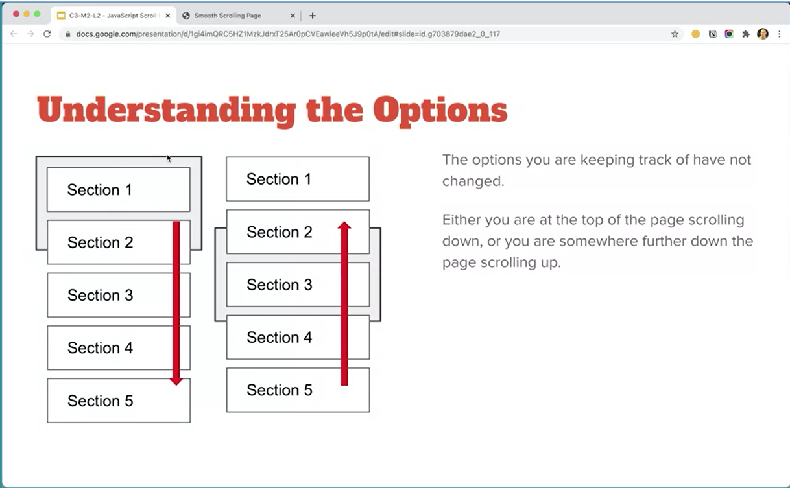

<!-- {width="4.0in" height="2.262820428696413in"} -->

Okay the game is working and that&apos;s great, and everything is working
the way it should. So that&apos;s excellent. But there&apos;s one thing that I
would like you to notice which is that when you roll the dice for the
player, when you roll again it&apos;s going to set up turn which says roll
the dice for player 1. But it&apos;ll be kind of nice if hopes I get snake
eyes there, it&apos;ll be kind of nice if when I roll the dice again if I
click roll again, it just rolls them again. I don&apos;t really need to go
back to the setup turn at this point, I could just roll the dice again.
So what can we do about that?

What if down here, in here when we go to roll again instead of doing
setup turn we just run this function. Throw the dice instead of setup
turn here. I think that will work, so let&apos;s go back and test that. So
now, when I start the game and I rolled the dice for a player 2, hopes I
got snake eyes again. There we go. Now when I click roll again it just
rolls again, and you can see that the score is getting added nicely.
It&apos;s a bit smoother so that works great, okay? So there&apos;s that,
that&apos;s that&apos;s working pretty well, and that&apos;s great. A couple other
things to clean up this thing here is really long, and you could turn it
into a separate little helper function. I don&apos;t know if it&apos;s really
necessary, but you could make a function called show current score and
make sure you put it in the winning condition, and you could move it
also into the IF statement for the throw dice. Yeah, we could put it in
a couple of different places here. So let&apos;s let&apos;s go ahead and do this
just to see just kind of like a little helper function here. So I&apos;m
going to say function, Show current score, and it&apos;s really just going
to be this stuff just because it&apos;s kind of long. And then, really all
we need to do is run this function here, show current score. So that
makes that function a little bit shorter, just split this thing out
also. Now, we don&apos;t need to run check winning condition up when you run
snake eyes because you&apos;re not going to win there, but we need to run
show current score. So up here instead of check winning condition, we
can change this to show current score. And that will actually that
actually makes a little bit more sense because that&apos;s what we&apos;re doing
it. We&apos;re showing the current score, nobody&apos;s going to win when they
rolled two ones that&apos;s going to zero out their score. And we want to
show the current score, but we don&apos;t really need to check the winning
condition. We don&apos;t need to do the top part of this IF statement here,
we just need to do this bottom part which is showing the current score.
So that&apos;s a little bit cleaner and a little bit nicer like that. I
think the next thing I wanted to talk about is this throw dice function
is really long. Now, you could potentially break out these IF statements
into separate little helper functions to get it to be a little bit
shorter. Since none of this stuff is going to be used more than once,
there&apos;s not really a huge reason to do so. So I&apos;m going to leave it
the way it is. But you could think about what you would do to create
little helper functions like this one down here and run them in these
if/else statements, basically pull the guts out and put them in their
own separate functions. And you might want to try it just to kind of get
used to working with that kind of idea, and it would help make that
throw dice function a little bit shorter, which would be kind of nice as
well. You could also make a separate function that just contains the
whole selection statement, if/else, if and the else statement and make
that into a separate function that runs here. So you could think about
it that way. So there are lots of ways of doing things and there are
lots of ways of thinking about it, and that&apos;s all really important. The
next thing to do is to apply some of our best practices to this, which
would be to create a separate script file because now we got a bunch of
JavaScript at the bottom of the page. It&apos;s probably a good idea to make
a new file here and call it script.js. And on that file we could take
all of our script from the top here, all the way down to the bottom of
the script tag here, cut it and stick it on that script tag over there.
And in fact, I&apos;m going to put in my immediately invoked function here.
So I&apos;m going to have parentheses and in there, I&apos;m going to run a
function which has its own parentheses, in its own curly braces and a
set of parentheses after that, in a semicolon. And then, I&apos;m going to
click between the curly braces and move that down and add my use strict
directive to make sure I didn&apos;t screw up in any of my variables and
then paste everything here. So that puts everything in there, and then
you could go through, and you could change all of these two const,
const, const. And in fact in this entire script, all of the var
declarations can be const. I think even the game data where the actual
data changes, but the actual function, the actual variable doesn&apos;t
change. So that can be constant as well, and then down here, do we have
any other ones? I think that might be all of them. That&apos;s all I think
that should work. So we saved that, and then we come over here, and we
move this up, and we&apos;re going to link to src=\"script.js, whoops,
script that js. There we go. And you could move this up to the top of
the page with the differ attribute on there as well. Let&apos;s just test
this to make sure I didn&apos;t screw anything up. It looks like
everything&apos;s going to work. It&apos;s all working just fine. Excellent. So
that&apos;s all working. That&apos;s good. So we&apos;ve done that and that&apos;s
important as well. Okay, great. So we&apos;ve done all of the cleanup stuff.
We have one last thing to talk about, but I&apos;m going to do that in the
next video, and you&apos;ve got a working game here.

<h2 id="ch4-14">4.14 Extending the Game (6:21)</h2>
<!--~~~~~~~~~~~~~~~~~~~~~~~~~~~~~~~~~~~~~~~~~~~~~~~~~~~~~~~~~~~~~~~~~~~~~~~~~~~~~~~~~~~~~~~~~~~~-->
<!--~~~~~~~~~~~~~~~~~~~~~~~ 315. extending the game (module 4.14) (xxx) ~~~~~~~~~~~~~~~~~~~~~~~~-->

  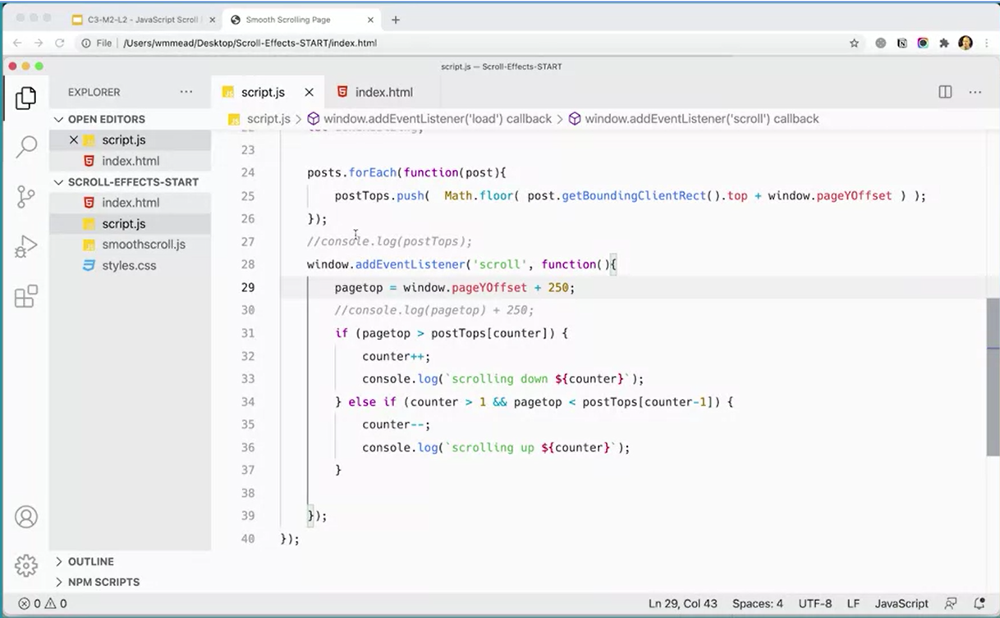

<!-- {width="4.0in" height="2.262820428696413in"} -->

Extending the game. Now you have a pig day scheme that works and
functions and it&apos;s pretty basic and that&apos;s great because we were able
to plan and strategize a way of making a few different functions work
together, to come together to make a game. That&apos;s definitely more
complex than any of the scripts that we&apos;ve done in the first course of
the the second course of the specialization. It&apos;s a good medium place
to be in terms of creating more complicated scripts. But the game itself
could be extended in lots of different ways, and my hope is that you
will take this and run with it and do some interesting things with it.
I&apos;ve given you some ideas for some things you could do that are not too
hard and some that are more challenging if you really want to try to do
them. The first is when you roll a one, it zeros out the cumulative
score for that turn. If you think about this game the way it is now over
here, when you play this game, there&apos;s no reason to ever click pass,
really. You&apos;re just going to roll again until you get a one. There&apos;s
no strategic reason to ever click pass. But what if you roll the one,
you lose all of the points that you gained during that turn. Remember,
rolling two ones loses all the points you&apos;ve got in the game so far,
but rolling one one could lose all the points you&apos;ve gained for the
turn. If you&apos;ve got a couple of big rolls in there, you&apos;ve rolled the
nine, you&apos;ve this 12 or whatever. Now pass could be strategically
something that you want to do. Again, it&apos;s still just dumb luck as to
whether you&apos;re going to win or lose, but pass could be more strategic.
If you were going to do that, if you were going to add that feature into
this game, what would you need to do? What would you need to add? I
don&apos;t think it would be all that difficult. I think you could go back
to your object up here, and you could create another variable that says,
turn some, or something like that, and each time a value gets added to
the turn some, you can increase that variable. If a one is rolled,
you&apos;re going to subtract that from that player&apos;s score. They lose
those points for that turn. Just by adding one more property into the
game data, you could add that feature in fairly easily. You just have to
remember to update the rules. But that&apos;s just one way of updating the
scheme. There are other easy ways you could make some better graphics or
better interface, make it look nicer, make it clear whose turn it is and
what the score is. None of this stuff is working terribly well over here
for what I have so far. It&apos;s okay but it&apos;s not. It&apos;s certainly not
great. You can make it much better. That&apos;s something you can do that
doesn&apos;t even involve a lot of programming that&apos;s really just design
work. You can create form fields for the players name so that instead of
player 1 and good player 2. When you start the game, when you click,
Start. Instead of randomly pick a player, you could actually enter and
you get to form fields here. Player 1 and player 2. Add those form
fields in there. Again, you could replace these things here with the
names that somebody types into the field so that it&apos;s not just player 1
player 2. You could do that thing, that would be more challenging, but
would be a fun thing to do. You could replace the dice with cards.
There&apos;s no reason why it has to be dice. You could make a cool card
game. There&apos;s no reason that it has to be 1-6. You could have 20
possible cards for each person and have more values. What would you need
to change in order to do that? You could allow the player to set a
threshold for what wins the game. Right now it&apos;s up to 30, which isn&apos;t
very much, and you could just manually up it to 100. But what if when
you start the game, you have a field that says or it could you even be a
drop down field for 30, 50 or 100, whatever you want, and the player
picks what the threshold for winning is going to be for that game. You
could do that. That would be an easy thing to add into the game. Again,
it&apos;s just updating the data in that game data object at the top of the
game. Then there&apos;s some more challenging ways to extend the game. You
get add more players. Where if you had three players or four players or
what if you could choose how many players you wanted to have playing the
game. What would you have to add in order to do that, that&apos;s a little
bit more complex because now that game index thing at the top of the
page needs to be different. This needs to work differently because it&apos;s
not going to just be a zero or one in or ternary operators are no longer
going to work because those will only handle two values, either one or
zero. But but you can certainly do it. That wouldn&apos;t be that hard. That
would be something more to do. You could add more dice. What if you add
more than two dice? What if you had three or four, you could add other
conditions that affect the game score. What if somebody rolls two sixs&apos;
is what happens then? Maybe their score doubles? I don&apos;t know. You
could do all fun things with these. There are lots of other ways that
you could think of to come up with extending this game. That&apos;s your
next job, is to really think about some things that you could do to
extend this game and make it a more interesting better game. I look
forward to seeing what people post on the discussion board. I&apos;ll check
in from time to time and see what excellent versions people have made of
the big game.

<a href="">4.14.Game-of-Pig.pdf</a>

<h2 id="ch4-15">Course Summary (0:57)</h2>
<!--~~~~~~~~~~~~~~~~~~~~~~~~~~~~~~~~~~~~~~~~~~~~~~~~~~~~~~~~~~~~~~~~~~~~~~~~~~~~~~~~~~~~~~~~~~~~-->
<!--~~~~~~~~~~~ 316. course summary: interactivity with javascript and jquery (xxx) ~~~~~~~~~~~~-->

  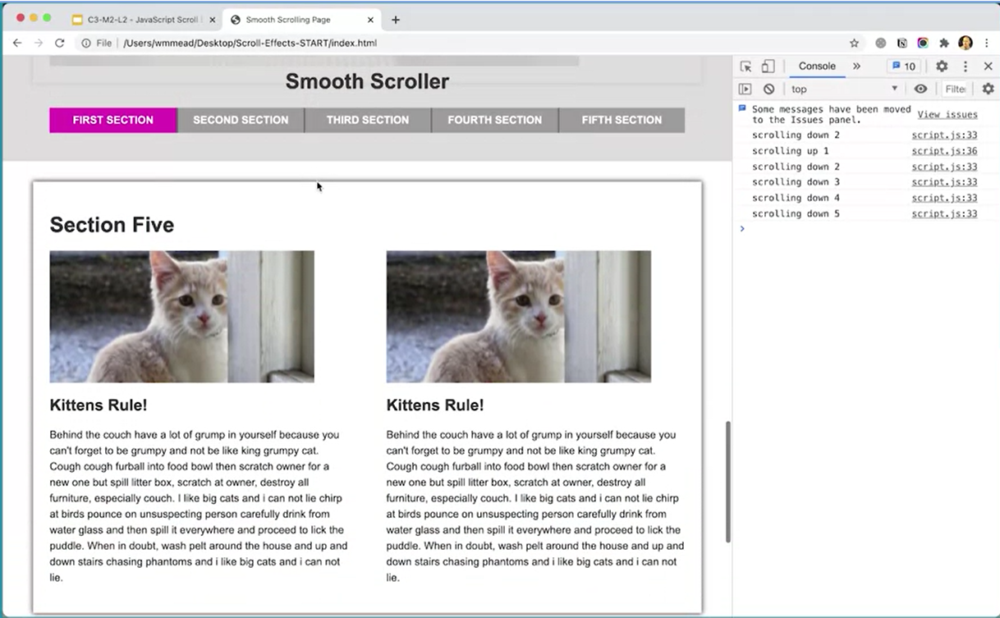

Congratulations for making it to the end of our third course on
JavaScript and therefore, of course, specialization. We&apos;ve done a lot.
You&apos;ve learned a lot of JavaScript so far. In the first course we
covered a lot of basics, a lot of basic syntax. We did a lot of
challenges to get good at that syntax, and the second course, we
introduced jQuery and we created some great interface elements that are
very simple and easy to integrate into web pages. In this course, we&apos;ve
gotten even deeper into it with jQuery plug-ins and we even created a
game. So with all of this, you&apos;ve really developed a lot of JavaScript
skills so far. We have a fourth course in the specialization, and in
that course, we&apos;ll get even more complex scripts, and I promise you&apos;re
going to learn even more JavaScript and you&apos;ll get even better at it
and you&apos;ll get more practice. So I look forward to seeing you there.

.the end...
<!--~~~~~~~~~~~~~~~~~~~~~~~~~~~~~~~~~~~~~~~~~~~~~~~~~~~~~~~~~~~~~~~~~~~~~~~~~~~~~~~~~~~~~~~~~~~~-->
<!--~~~~~~~~~~~~~~~~~~~~~~~~ ##.  (##) ~~~~~~~~~~~~~~~~~~~~~~~~~-->
<!-- template single

  

-->
<!--~~~~~~~~~~~~~~~~~~~~~~~~~~~~~~~~~~~~~~~~~~~~~~~~~~~~~~~~~~~~~~~~~~~~~~~~~~~~~~~~~~~~~~~~~~~~-->
<!--~~~~~~~~~~~~~~~~~~~~~~~ ##/##.  (##) ~~~~~~~~~~~~~~~~~~~~~~~~~-->
<!-- template >= 2

&nbsp;&nbsp;&nbsp;

-->
<h6>Last Updated: 12/28/23 6:19pm</h6>
